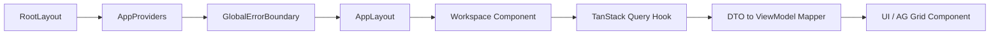

<div align="center">
  <picture>
    <source media="(prefers-color-scheme: dark)" srcset="./assets/logo/karsa-icon-dark.svg">
    
  </picture>
  
  # Karsa
  *Enterprise Autonomous AI Orchestration Framework & Virtual Investment Firm Console*
  
  [](#technology-stack)
  [](docs/architecture/)
  [](docs/roadmap/ROADMAP.md)
  [](docs/WORKFLOW_RULES.md)
  
</div>

## Karsa
Karsa is a massive-scale, event-sourced orchestration framework designed for autonomous AI organizations. It implements a complete enterprise operating model—encompassing execution sandboxing, capital allocation, performance attribution, and rigorous governance. It features a Virtual Investment Firm Web Console acting as a Chief Investment Officer (CIO) dashboard for humans to monitor, validate, and govern autonomous operations.

## Overview
Karsa is rigorously partitioned into distinct bounded contexts:
- **Control & Governance**: Enforces ex-ante parametric risk modeling, compliance policy lifecycles, and deterministic decision authorization.
- **Execution & Orchestration**: Autonomous agent coordination via the Python backend, capability execution workers, and state machine transitions.
- **Web Console (CIO Dashboard)**: A Next.js-powered static application surfacing high-conviction theses, capital allocations, and intelligence timelines.

## Why Karsa Exists
As autonomous multi-agent systems evolve, lightweight orchestration is insufficient for enterprise capital deployment. Karsa exists to solve the "black-box" agent problem by enforcing:
- **Write-once immutable decision ledgers** before action occurs.
- **Ex-post performance return decomposition** (Selection, Allocation, Beta, Residual).
- **Hindsight-prevention controls** via formalized Investment Memos and systematic invalidation criteria.

## Core Capabilities
| Capability | Description |
|---|---|
| **CIO Dashboard** | Top-down executive view of highest conviction theses, daily pipeline shifts, and capital allocations. |
| **Thesis Hub & Ranking** | AG Grid-powered workspaces sorting active/invalidated autonomous theses by conviction and risk. |
| **Performance & Attribution** | Ex-post performance return decomposition and volatility scaling algorithms. |
| **Governance & Oversight** | Post-mortem aggregation, qualitative session management, and failure regime tracking. |
| **Immutable Decision Ledgers** | Investment Memos logging autonomous intent, expected horizons, and confidence intervals prior to execution. |
| **Intelligence Timeline** | Unified chronological feed of research reports, thesis generations, and capital deployments. |

## Architecture
The application bridges a Python-driven orchestration backend and a Next.js (React 19) frontend.

### Frontend Component Architecture Flow
The React application employs a strict `DTO -> Mapper -> ViewModel` pipeline. API responses are safely coalesced via utility mappers before reaching UI components, guaranteeing runtime safety even with malformed backend payloads.



## Repository Structure
| Directory | Purpose | Ownership |
|---|---|---|
| `docs/` | Single Source of Truth for Architecture, ADRs, and Sprint executions. | Engineering Leadership |
| `src/` | Python orchestration framework, execution engine, and test suites. | Backend / AI Engineers |
| `karsa-web/` | Virtual Investment Firm Next.js Web Console and workspaces. | Frontend Engineers |

## Technology Stack
| Area | Technology |
|---|---|
| Framework | Next.js 16.2.9 (App Router, Static Export) |
| UI Library | React 19.2.4 |
| Styling | Tailwind CSS v4, shadcn/ui |
| State Management | Zustand (Client), TanStack Query v5 (Server) |
| Data Grids & Charts | AG Grid 35.3, Recharts 3.8 |
| Backend & Execution | Python 3.12+ |
| Testing (Web) | Vitest 4.1.9, React Testing Library, JSDOM |

## Getting Started

### Prerequisites
- Node.js 20+
- Python 3.12+
- Docker & Docker Compose

### Running the Web Console Locally
```bash
cd karsa-web
npm install
npm run dev
```

### Type Checking & Testing
```bash
cd karsa-web

# Verify static typing
npx tsc --noEmit

# Execute mutation-resistant test suite
npm run test
```

### Production Build
```bash
cd karsa-web

# Generate static Next.js output
npm run build
```

## Development Workflow
Karsa operates under a zero-tolerance engineering governance model via an Autonomous Delivery Engine. All changes **must** follow the Strict Sprint Lifecycle:

**`DESIGN` → `AUDIT` → `REMEDIATION` → `IMPLEMENT` → `AUDIT` → `REMEDIATION` → `VERIFY` → `DONE`**

Every sprint must execute through `docs/implementation/sprint-XX/` containing exactly these canonical files. Documentation drift and unverified claims block Sprint closure. The orchestrator never stops on first failure; it generates findings, classifies severity, executes remediation automatically, and re-verifies until closure. See `docs/WORKFLOW_RULES.md`.

## Testing Strategy
Tests in Karsa strictly evaluate behavioral verification and mutation resistance over raw coverage percentages.
- **Unit & Mapper Tests**: Validates defensive `DTO -> ViewModel` data coalescing, ensuring null/undefined arrays fail gracefully.
- **Component Tests**: Validates routing, query key consistency, and interactive states via React Testing Library injected mocks.
- **Behavioral Assertions**: Validates that critical search debounce behaviors and error boundaries trigger correctly.

## Documentation Map
| Document | Purpose |
|---|---|
| [`docs/DOCUMENTATION_STYLE_GUIDE.md`](docs/DOCUMENTATION_STYLE_GUIDE.md) | File naming, permitted structures, and archival policies. |
| [`docs/WORKFLOW_RULES.md`](docs/WORKFLOW_RULES.md) | Sprint lifecycle enforcement and documentation closure gates. |
| [`docs/ENGINEERING_STANDARDS.md`](docs/ENGINEERING_STANDARDS.md) | Quality thresholds, commit traceability, and PR linking requirements. |
| [`docs/roadmap/ROADMAP.md`](docs/roadmap/ROADMAP.md) | Current consolidation phases, sprint statuses, and future objectives. |
| [`docs/architecture/`](docs/architecture/) | The canonical set of 60+ architectural definitions for the Karsa ecosystem. |

## Contributing
Contributors must explicitly align with repository governance:
1. **Never commit secrets** or PII.
2. **Commit Traceability**: All commits must trace to a Sprint or ADR (e.g., `feat(ui): add dashboard - refs sprint-51`).
3. **No Blueprint Proliferation**: Keep documentation tightly coupled to the 4 canonical sprint files.
4. **Mandatory Testing**: A task is never "Done" if test coverage regressions occur or if mutations are untracked.

## Roadmap
Karsa's architecture is actively frozen at Sprint-50. The current phase (Sprint-51) strictly focuses on realizing the Virtual Investment Firm Web Console via static Next.js deployments, integrating AG Grid data ranking, and finalizing the CIO Dashboard execution. For detailed historical execution timelines, refer to `ROADMAP.md`.

## Frequently Asked Questions

**How do I start?**
Read the `docs/WORKFLOW_RULES.md` and `docs/ENGINEERING_STANDARDS.md` documents to understand the required execution discipline. Then navigate to `karsa-web` and run `npm run dev`.

**Where is the architecture documented?**
All active and frozen designs are maintained within `docs/architecture/`. Start with `docs/architecture/58-karsa-web-console.md` for the current Web Console topologies.

**How do I add a workspace?**
Workspaces are mapped as Next.js App Router paths inside `karsa-web/src/app/`. They must mount via the `<AppLayout>` and rely strictly on TanStack Query Hooks for data.

**How do I run tests?**
For the Web Console, navigate to `karsa-web/` and execute `npm run test` (Vitest). 

## License
Proprietary / Internal.
