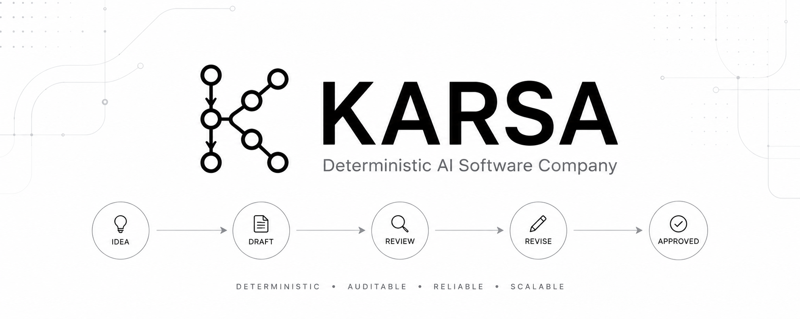
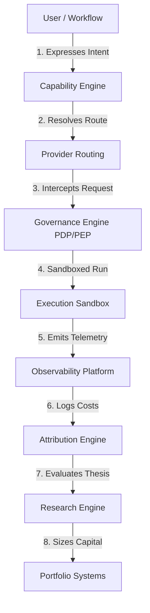

<p align="center">
  
</p>

<p align="center">
  <strong>A Governance-Driven, Provider-Agnostic Capability Execution Platform for Multi-Agent Software Engineering</strong>
</p>

<p align="center">
  Karsa is the core runtime infrastructure for the Virtual Investment Firm (VIF), orchestrating specialized AI personas executing complex software delivery pipelines under rigid architectural boundaries.
</p>

⸻

## Overview

Karsa is a next-generation capability execution platform designed to transition AI engineering from loose, non-deterministic prompt generation into a structured, governance-driven, and repeatable delivery lifecycle. Rather than treating large language models (LLMs) as interactive chat interfaces, Karsa abstracts LLMs as pluggable execution providers matching abstract capabilities (e.g., capability requirements for JSON parsing, tool calling, reasoning, or context limits) evaluated under strict regulatory boundaries.

### Core Architectural Features:
* **Execution-First Architecture**: Task graphs coordinate execution states, isolated from direct model interaction, driving FSM state transitions (`IDEA` -> `DRAFT` -> `REVIEW` -> `APPROVED` -> `EXECUTING` -> `COMPLETED`).
* **Capability Abstraction**: Software tasks are defined as abstract capabilities with strict input/output contract schemas and dependency DAG validation.
* **Provider Abstraction**: Decouples logical execution capability from vendor SDKs, utilizing a dual-identity strategy (`provider_id` UUID keys and namespaced URN lookups) with mock and concrete adapters.
* **Governance (PDP/PEP)**: Intercepts all administrative and runtime executions. Decouples Policy Decision Points (PDP) from Policy Enforcement Points (PEP) using standard policy FSM lifecycle rules.
* **Observability Platform**: Feeds on decoupled health state events, projecting rolling success rates, failure markers, and latency counts.
* **Replayability & Determinism**: Guarantees byte-for-byte identical replay behavior by storing selection history in execution traces and bypassing dynamic routing calculations during replays.

⸻

## Why Karsa Exists

Multi-agent software engineering systems present unique operational risks. Traditional agent frameworks built directly on top of raw LLM APIs fail in enterprise environments due to several structural flaws:

* **Provider Lock-In**: Code written for a specific LLM client SDK is brittle and difficult to migrate when newer, cheaper, or more powerful models emerge.
* **Uncontrolled AI Costs**: High-velocity agent loops can generate thousands of recursive API requests in minutes, leading to rapid budget exhaustion without real-time interception.
* **Lack of Governance**: Autonomously generated code can introduce malicious behaviors or security vulnerabilities if not verified against policies *prior* to sandboxed execution.
* **Poor Observability**: Aggregated token billing and latency tracking are typically siloed, obscuring the cost and execution performance of individual agent roles.
* **Non-Reproducible Executions**: Configuration drifts, dynamic pricing models, or remote API updates cause the same agent prompt to yield completely different outcomes on retry.
* **Scale Bottlenecks**: High-throughput database writes for rapid telemetry logs degrade transactional performance on configuration tables.

### How Karsa Solves Them:
1. **Abstraction Layer**: Maps capability requests to providers via standard compatible mappings, protecting codebases from direct vendor API dependencies.
2. **Real-time Interception (PEP)**: Enforces budget ceilings and policy rules dynamically, rejecting execution *before* remote API dispatch.
3. **Decoupled Aggregates**: Extracts configurations (`ProviderDefinition`, `PolicyDefinition`) from rapid write targets (`ProviderHealthState`, `GovernanceAuditChain`), resolving database write contention.
4. **Replay Determinism Bypass**: Persists execution history within evidence registries, returning cached outcomes directly during timeline replays.

⸻

## Core Design Principles

Karsa is guided by seven core principles governing both its codebase architecture and development workflows:

1. **Capability First**: Software agents query abstract capabilities rather than specific LLM providers.
2. **Provider Agnostic**: The system runs entirely behind uniform execution adapter contracts.
3. **Governance by Default**: Every state advancement and model execution must pass pre-execution policy checks.
4. **Replay Determinism**: Workflow timelines must be drop-to-zero rebuildable and yield identical execution traces.
5. **Single Writer Ownership**: Context boundaries are strictly protected; registries are the sole writers of their internal state aggregates.
6. **Architecture Before Implementation**: Design blueprints are frozen and challenged before a single line of python code is written.
7. **Evolution Through Foundations**: The platform develops incrementally, ensuring each foundation is fully audited and remediated before closure.

⸻

## Current Platform Status

Karsa is developed in structured sprint iterations. The following matrix shows the status of each major subsystem:

| Subsystem / Layer | Purpose | Current Sprint | Status |
| :--- | :--- | :---: | :---: |
| **Capability Engine** | Coordinates workflow FSM states & task graphs. | Sprint-16 | 🟢 Closed / Complete |
| **Provider Abstraction** | Decouples logical actions from AI vendor APIs. | Sprint-17 | 🟢 Closed / Complete (Design Only) |
| **Capability Registry** | Manages capability contracts and dependency trees. | Sprint-18 | 🟢 Closed / Complete |
| **Provider Foundation** | Implements registry, routing policies, and mocks. | Sprint-19 | 🟢 Closed / Complete |
| **Governance Engine** | PDP/PEP interception, budget checks, override logs. | Sprint-20 | 🟢 Closed / Complete |
| **Observability Platform** | Projects health telemetry and execution durations. | Sprint-21 | ⚪ Proposed / Planned |
| **Attribution Engine** | Decoupled token and financial cost accounting. | Future | ⚪ Proposed / Planned |
| **Performance Engine** | Derives hit rates, confidences, and Brier scores. | Future | ⚪ Proposed / Planned |
| **Research Engine** | Manage branch testing timelines for AI developers. | Future | ⚪ Proposed / Planned |
| **Thesis Engine** | Decision lifecycle origination point. | Future | ⚪ Proposed / Planned |

⸻

## Platform Architecture

Karsa is structured in a clear, unidirectional layering model that separates client-facing workflows from lower-level provider connections, telemetry logging, and financial attribution:



### Layer Details:
* **Capability Engine**: Tracks high-level execution progress, coordinating the transition of work artifacts.
* **Provider Routing**: Dynamically filters candidate adapters based on capability compatibility rules and selects paths using sorting policies (`LOWEST_COST`, `LOWEST_LATENCY`, `HIGHEST_HEALTH`).
* **Governance (PDP/PEP)**: Intercepts actions to enforce security and budgets (e.g., checking if the local budget cache snapshot is younger than `60` seconds).
* **Execution Sandbox**: Runs generated code inside isolated Docker containers (`DockerExecutor`) to protect host servers.
* **Observability**: Subscribes to execution result streams to calculate provider latencies and handle health quarantines (`DEGRADED` / `SUSPENDED`).
* **Attribution Engine**: Aggregates token usage and attributes financial costs polymorphically to specific agents or runs.
* **Research / Portfolio Engines**: Long-term applications that backtest hypotheses and allocate risk sizes.

⸻

## Completed Foundations

### Sprint-16: Capability Engine Foundation
* **Purpose**: Establish Karsa's control plane workflow coordinator.
* **Key Capabilities**: State transition FSM, TaskGraph schema definitions, and in-memory execution traces.
* **Why it Matters**: Guarantees that agent tasks follow a reliable, structured path rather than running as ad-hoc, untracked scripts.

### Sprint-17: Provider Abstraction Architecture
* **Purpose**: Design the provider abstraction specifications (Design-Only phase).
* **Key Capabilities**: Dual-key identities (`provider_id` UUID and URN strings), decoupled configuration/telemetry aggregates, and failover budget re-evaluation rules.
* **Why it Matters**: Established the blueprint that eliminated database write amplification and ensured trace durability during naming drifts.

### Sprint-18: Capability Registry Foundation
* **Purpose**: Implement the authoritative catalog of capability specifications.
* **Key Capabilities**: Three-tier identity mapping, contract fingerprinting (SHA256 schema hashing), and circular dependency cycle blocking (DFS coloring).
* **Why it Matters**: Blocks incompatible schema updates and circular reference loops before they hit the execution sandbox.

### Sprint-19: Provider Foundation
* **Purpose**: Implement the physical provider registry, routing policies, and mocks.
* **Key Capabilities**: `ProviderDefinition` & `ProviderHealthState` aggregates, InMemory and File persistence with OCC checks, dynamic policies, and mock adapters.
* **Why it Matters**: Bypasses dynamic route calculations in replay runs, ensuring deterministic test playback.

### Sprint-20: Governance Engine Foundation
* **Purpose**: Implement the central policy authority for Karsa.
* **Key Capabilities**: PDP/PEP isolation, two-layer decoupled audit log (asynchronous Layer B hash chain), local budget cache freshness validator, and emergency override logs.
* **Why it Matters**: Eliminates database locking contention on high-throughput audit trails while providing a secure emergency override hook.

⸻

## Repository Structure

```text
karsa/
├── src/                    # Production source code
│   └── karsa/              # Root package namespace
│       ├── capabilities/   # Bounded Context: Capability Registry (Sprint-18)
│       ├── providers/      # Bounded Context: Provider Registry & Routing (Sprint-19)
│       └── governance/     # Bounded Context: Policy Engine PDP/PEP (Sprint-20)
├── docs/                   # Authoritative repository documentation
│   ├── architecture/       # Canonical, frozen architecture blueprints
│   ├── adr/                # Architectural Decision Records
│   ├── roadmap/            # Project plans and dashboard tracking
│   ├── implementation/     # Sprint lifecycle packages
│   └── archive/            # Historical artifacts and deprecated baselines
├── tests/                  # Verification test suite
│   └── karsa/              # Component specific test blocks
├── assets/                 # Image assets and banners
└── pyproject.toml          # Project metadata and dependencies (uv compatible)
```

### Folder Ownership:
* `src/`: Owned by core developers. No PR may modify source files without an associated and verified test suite.
* `docs/`: Owned by the Architecture Board. Structure is strictly governed by [docs/DOCUMENTATION_STYLE_GUIDE.md](file:///Users/dwiki.nugraha/dwikicode/karsa/docs/DOCUMENTATION_STYLE_GUIDE.md).
* `tests/`: Owned by Quality Engineering. Coverage checks must run successfully prior to merge.

⸻

## Documentation

Karsa maintains documentation as the single source of truth. The `docs/` folder contains:

* [docs/architecture/](file:///Users/dwiki.nugraha/dwikicode/karsa/docs/architecture/): Deep architectural blueprints mapping domain models, repository interfaces, and sequence diagrams.
* [docs/adr/](file:///Users/dwiki.nugraha/dwikicode/karsa/docs/adr/): Log of Architectural Decision Records tracking frozen decisions and consequences.
* [docs/roadmap/](file:///Users/dwiki.nugraha/dwikicode/karsa/docs/roadmap/): Global project timeline and current baselines.
* [docs/implementation/](file:///Users/dwiki.nugraha/dwikicode/karsa/docs/implementation/): Historical record of sprint completions. Each sprint subdirectory contains exactly:
  - `plan.md`: Context, objectives, and work packages.
  - `implementation.md`: Code mappings, aggregate configurations, and evidence summaries.
  - `audit.md`: Auditing against frozen architectures.
  - `remediation.md`: Unresolved technical debt classification and closure.

⸻

## Getting Started

### 1. Prerequisites
- **Python**: `>=3.12` (verified on Python `3.13`)
- **uv**: Fast python package installer and resolver (`curl -LsSf https://astral.sh/uv/install.sh | sh`)
- **Docker**: Required for local sandboxed tool execution.

### 2. Virtual Environment Setup
Initialize the local environment and verify python:
```bash
# Create a local virtual environment (.venv)
uv venv

# Activate the virtual environment
source .venv/bin/activate
```

### 3. Dependency Installation
Install dependencies in editable development mode:
```bash
# Sync packages using the lockfile (includes pytest and testcontainers)
uv sync
```

### 4. Running Tests
Execute the test suites for capabilities, providers, and governance:
```bash
# Run all verified unit and integration tests
.venv/bin/python -m pytest tests/karsa/capabilities/ tests/karsa/providers/ tests/karsa/governance/
```

### 5. Running Linting
Verify formatting and style rules using Ruff:
```bash
# Check code style rules
uv run ruff check src/
```

### 6. Local Development Workflow
When introducing a new feature, follow this checklist to verify local environment status:
```bash
# Verify virtualenv is active
which python

# Run proof of reality simulation to generate a local execution trace
python run_proof_of_reality.py

# Verify proof was written to disk
cat proof_of_reality.md
```

⸻

## Development Workflow

Every code change in Karsa must follow the official architecture-first lifecycle:


1. **Design**: Write architecture blueprints in `docs/architecture/` and document decisions in `docs/adr/`.
2. **Challenge**: The Architecture Board reviews and challenges boundaries, aggregate sizes, and replay assumptions.
3. **Freeze**: Once design is approved, the architecture package is frozen. No implementation code is written before this step.
4. **Implement**: Code the solution exactly as specified under `src/karsa/` alongside test suites.
5. **Audit**: Validate the implementation against frozen design requirements, checking class structures and boundaries.
6. **Remediate**: Fix any code drift or technical debt identified in the audit.
7. **Close**: Close the sprint. Standalone draft blueprints, reviews, and logs are archived into `docs/archive/`.

⸻

## Architecture Governance

* **Architecture Freeze**: Blueprints are locked prior to coding. Developers do not have authorization to modify or expand boundaries during implementation.
* **ADR Process**: Decisions must be documented in formal ADR templates under `docs/adr/`. Any modification to a frozen ADR requires a new decision record.
* **Single Writer Rule**: Database write contention is blocked at the design phase. A registry or service is designated as the sole mutating writer for an aggregate; other contexts query it via read-only interfaces or handle event signals.
* **Replay Determinism**: Any feature that impacts execution outputs or routes must support replay-safe bypass logic.
* **Ownership Boundaries**: We enforce strict logical segregation between stable configurations (`ProviderDefinition`) and fast-updating telemetry (`ProviderHealthState`).

⸻

## Roadmap

### Near-Term
* **Sprint-21: Observability Platform Foundation**:
  - Implement the asynchronous event listeners that aggregate telemetry Completed events.
  - Project rolling failure counts and latencies into read-optimized views.
* **Attribution Engine**:
  - Deploy cost attribution mapping, recording financial expenses and token sizes across specific workers and thesis nodes.
* **Performance Engine**:
  - Implement mathematical Brier scoring evaluators to track prediction confidences.

### Long-Term: The Virtual Investment Firm
Karsa serves as the underlying capability execution and governance infrastructure for the Virtual Investment Firm (VIF). The target system orchestrates:
- **Research Agents**: Formulate and backtest financial investment hypotheses.
- **Risk Agents**: Enforce capital sizing rules and dynamic limits based on Brier scores.
- **Portfolio Agents**: Execute trades across various mock and real brokers.
- **Review Agents**: Conduct adversarial post-mortems of failed decisions.

All agent activities run as abstract capabilities managed by Karsa’s Control Plane, intercepted by the Governance PDP/PEP, and sandboxed inside Docker isolation layers.

⸻

## Contributing

We welcome contributions from engineers, architects, and technical contributors! To participate:
1. **Follow the Lifecycle**: Do not submit pull requests containing implementation code without an approved and frozen architecture design.
2. **Document Everything**: Ensure any decisions are registered in ADRs, and updates are tracked in the traceability matrix.
3. **Write Tests**: Maintain a 100% test pass rate. Integration test containers must run successfully before merging.

⸻

## Project Status

* **Status**: **Active Development**
- **State**: **Foundation Phase** (Architecture-driven core platform design).
- **Production Readiness**: **Not Production Ready**. The platform is currently optimized for local developer validation and sandbox simulation.

⸻

## License

This project is licensed under the MIT License - see the `LICENSE` file for details.
