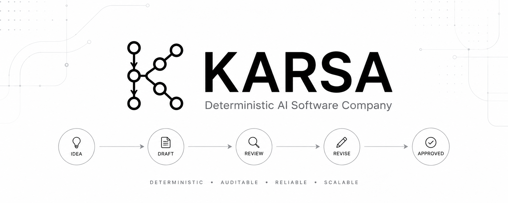

<p align="center">
  
</p>

<p align="center">
  <strong>Deterministic AI Software Company</strong>
</p>

<p align="center">
  Human Intent → Governed Multi-Agent Workflow → Verified Software
</p>

<p align="center">
  <a href="docs/vision/VISION.md">Vision</a> •
  <a href="docs/product/PRD.md">PRD</a> •
  <a href="docs/architecture/01-system-overview.md">Architecture</a> •
  <a href="docs/roadmap/ROADMAP.md">Roadmap</a>
</p>

---

## Overview

Karsa is a deterministic AI Software Delivery Platform that transforms human objectives into verified, production-ready software through a governed multi-agent workflow.

Unlike traditional coding assistants that operate as interactive chat sessions, Karsa treats software delivery as a state machine with explicit validation, recovery, traceability, and review cycles.

Humans define objectives.

Agents negotiate implementation.

The platform governs execution.

---

## Workflow

```text
IDEA → DRAFT → REVIEW → REVISE → APPROVED
```

Every workflow execution is governed by a strict finite state machine.

No state can be skipped.

No artifact can be approved without validation.

No workflow progress is lost due to provider failures, crashes, or interruptions.

---

## Core Principles

### Determinism Over Magic

Every action is traceable, reproducible, and backed by state.

### Quality By Default

Software is only considered complete when validation succeeds.

### Resilience First

Failures are expected and recovered automatically.

### Human-Governed Delivery

Humans remain responsible for objectives, constraints, and final governance decisions.

---

## Architecture

```text
Human Objective
       │
       ▼
Workflow Engine
       │
       ▼
Agent Orchestrator
       │
 ┌─────┴─────┐
 ▼           ▼
Engineer   Reviewer
 Agent      Agent
 └─────┬─────┘
       ▼
Governance
       ▼
Verified Artifact
```

### Major Components

| Component              | Responsibility                          |
| ---------------------- | --------------------------------------- |
| Workflow Engine        | Finite State Machine orchestration      |
| Agent Orchestrator     | Agent lifecycle management              |
| Governance Platform    | Quality gates and approval criteria     |
| Event Journal          | Immutable execution history             |
| Recovery Engine        | Crash recovery and workflow restoration |
| Artifact Registry      | Projection of workflow outputs          |
| Provider Layer         | LLM abstraction and routing             |
| Observability Platform | Metrics, telemetry, and attribution     |

---

## Capabilities

| Capability                  | Status |
| --------------------------- | ------ |
| Event-Sourced Workflows     | ✅      |
| FSM State Orchestration     | ✅      |
| Snapshot Recovery           | ✅      |
| Multi-Agent Review Cycles   | ✅      |
| Provider Key Rotation       | ✅      |
| Native Test Validation      | ✅      |
| Governance Platform         | ✅      |
| Observability Platform      | ✅      |
| Multi-Provider Support      | ⏳      |
| Dynamic Container Execution | ⏳      |

---

## Repository Structure

```text
karsa/
├── assets/
│   ├── logo/
│   ├── banner/
│   └── brand/
│
├── docs/
│   ├── architecture/
│   ├── implementation/
│   ├── product/
│   ├── roadmap/
│   └── vision/
│
├── src/
├── tests/
├── pyproject.toml
└── README.md
```

---

## Quick Start

### Installation

```bash
git clone https://github.com/<your-org>/karsa.git
cd karsa
uv sync
```

### Configure Providers

```bash
GEMINI_API_KEY=your_key_here
```

or

```bash
KARSA_GEMINI_KEYS=key1,key2,key3
```

### Run Tests

```bash
PYTHONPATH=src uv run pytest -v
```

---

## Documentation

| Document       | Description                          |
| -------------- | ------------------------------------ |
| Vision         | Long-term mission and philosophy     |
| PRD            | Product requirements                 |
| Architecture   | System design and execution model    |
| Roadmap        | Planned capabilities and milestones  |
| Implementation | Sprint history and execution records |

---

## Roadmap

Near-Term

* OpenAI Provider Support
* Anthropic Provider Support
* Expanded Provider Abstraction
* Dynamic Sandbox Execution
* Benchmark Framework Hardening

Long-Term

* Dynamic Agent Generation
* Cross-Repository Workflows
* Autonomous Maintenance Loops
* AI Software Company Operating Model

---

## Why Karsa Exists

Modern AI coding tools generate code.

Karsa governs software delivery.

The goal is not to build a better autocomplete.

The goal is to build a deterministic software company where human creativity defines the "what" and autonomous agents safely execute the "how".

---

<p align="center">
  Built for governed, deterministic software delivery.
</p>
