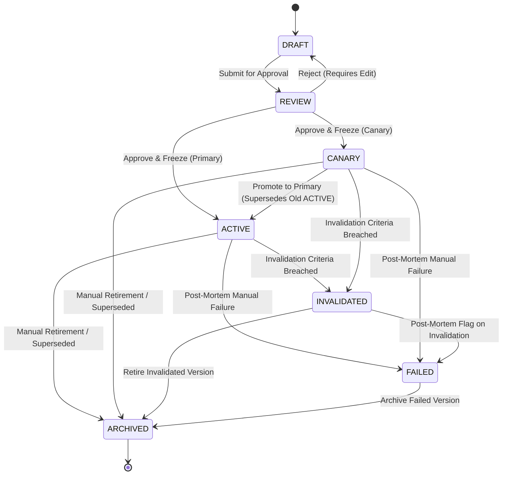

# ADR-030: Thesis Lifecycle State Machine and Version Evolution

## Status
Approved

## Date
2026-06-14

## Context
An investment thesis is not static; it evolves as market regimes shift, models are updated, or new research findings emerge. 

If thesis rules are updated in-place, historical executions and decisions will reference modified constraints. This makes backtesting, audit logs, and performance calibrations impossible to run deterministically.

Additionally, we need a clear lifecycle state machine to govern how a thesis is formulated, reviewed by risk officers, activated for execution, invalidating when boundaries are breached, and archived when decommissioned.

## Decision
We implement the following Lifecycle and Versioning Model:

1. **Identity Hierarchy**:
   - `thesis_family_id`: Groups related evolutions of a thesis family (e.g. "US_EQUITY_MOMENTUM").
   - `thesis_id`: Identifies a specific thesis thread.
   - `thesis_version_id`: A unique UUID identifying a specific, immutable revision of the thesis rules (e.g. version 1.0.0, 1.1.0).
2. **Explicit Version Lineage**:
   - A `ThesisVersion` defines a `parent_thesis_version_id` reference to form an explicit parent-child lineage tree.
   - We reject the `superseded_by_version_id` field inside the active version records to preserve immutability. Supersession is resolved dynamically by traversing the parent-child lineage links.
   - **workflows**:
     - *Comparison*: Traverses versions back to their common ancestor to diff parameters.
     - *Review*: Risk officers audit changes by comparing the draft to its `parent_thesis_version_id`.
     - *Evolution*: Creating a new draft version copies properties from its parent as a baseline.
3. **Thesis Execution Binding**:
   - We introduce the **`ThesisExecutionBinding`** entity to bridge the abstract `ThesisVersion` rules to concrete deployments.
   - A binding maps `thesis_version_id` to a target `portfolio_id` and `strategy_id` with an assigned `allocation_limit` and lifecycle `status` ("ACTIVE", "SUSPENDED").
   - This prevents duplicating thesis logic across multiple portfolios and separates execution limits from the frozen version rules.
4. **Immutable Active Versions**:
   - Once a `ThesisVersion` enters the `ACTIVE` state, it is **frozen**. Re-assignments or edits of any properties inside that version are strictly prohibited.
   - Modifying a thesis requires creating a new `ThesisVersion` under the same `thesis_family_id`, which goes through the planning and review cycle before activation.
5. **Multiple Active Version Policy**:
   - We select **Option B: ACTIVE + CANARY** as the final policy for concurrent active versions.
     - *Option A (ACTIVE + ACTIVE)* is rejected because it leads to signal dilution and split-brain execution logic.
     - *Option C (ACTIVE + EXPERIMENTAL)* is rejected due to risk boundaries in live execution environments.
     - *Option B (ACTIVE + CANARY)* allows exactly one primary `ACTIVE` production version and one `CANARY` version running concurrently with a restricted, isolated allocation limit to validate performance updates under live market conditions.
   - All telemetry traces and cost records map to both `thesis_version_id` and `binding_id` to prevent attribution drift.
6. **Invalidated vs Failed States**:
   - We separate automated invalidation from qualitative failure:
     - `INVALIDATED`: A state triggered automatically when live performance data breaches numerical limits defined in `InvalidationCriteria`.
     - `FAILED`: A state triggered manually when a post-mortem review determines that the underlying investment hypothesis is logically flawed or unusable under the current market regime. A version in the `FAILED` state blocks the creation of new draft versions from it.
7. **Transition Authority**:
   - We define the exact authority governing lifecycle transitions:
     - `FAILED`: Authorized strictly by the **Risk Officer / Review Board** (review-driven).
     - `INVALIDATED`: Authorized strictly by the **Automated Risk Engine** (metric-driven).
     - `ARCHIVED`: Authorized by the **Portfolio Manager / Operator** (operator-driven).
     - `SUPERSEDED`: Authorized by the **Risk Officer** upon promotion of a Canary version (workflow-driven).
8. **No Hard Deletes**:
   - No thesis version or historical record is ever deleted from Karsa's database. This preserves auditability and ensures historical decisions remain replayable.
9. **Finite State Machine (FSM)**:
   - A `ThesisVersion` transitions through the following states:
     - `DRAFT`: The thesis version is being formulated, and rules/criteria can be edited.
     - `REVIEW`: Locked for validation. Risk officers or validation algorithms assess hypotheses, horizons, and invalidation rules.
     - `ACTIVE` / `CANARY`: Active versions frozen and routing trades.
     - `INVALIDATED`: Automatically triggered when live outcome data breaches `InvalidationCriteria`.
     - `FAILED`: Manually triggered by risk officers after a negative post-mortem review session.
     - `ARCHIVED`: Decommissioned or superseded by a new version. Retained permanently.

### Lifecycle State Machine Transitions

## Consequences
- **Absolute Replay Consistency**: Past executions and decisions can load the exact `thesis_version_id` active at decision time, guaranteeing byte-for-byte replay consistency.
- **Audit Integrity**: FSM transitions are tracked in append-only tables, preventing history manipulation.
- **Traceable Invalidation & Failure**: Separation between parameter breaches (`INVALIDATED`) and hypothesis failures (`FAILED`) allows the performance engine to calibrate expert accuracy and thesis longevity distinct from simple threshold hits.
- **Safe Coexistence**: Multiple active versions under a family run safely concurrently by partitioning metrics using `thesis_version_id` keys.
