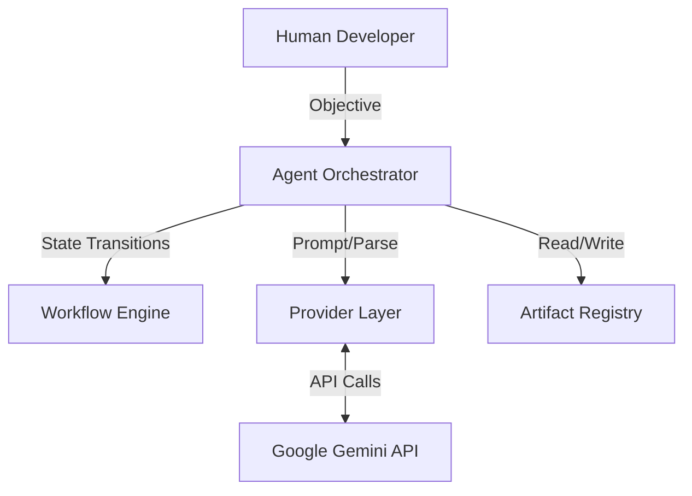
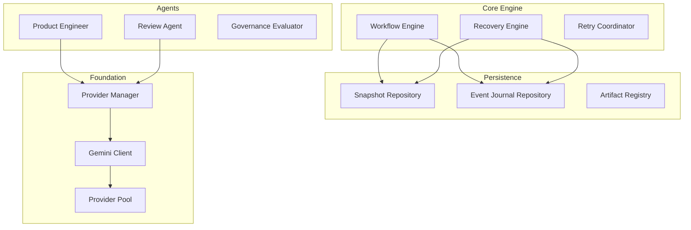

# Karsa System Architecture

## Context Diagram
Karsa operates as an autonomous layer between the Human Developer and the final Codebase. It intercepts human objectives, negotiates the implementation via LLM providers, and produces validated software artifacts.

## Component Diagram

## Workflow Engine
The Workflow Engine is a strict Finite State Machine (FSM) responsible for guiding the lifecycle of a software task. It manages the transitions between `IDEA`, `DRAFT`, `REVIEW`, `REVISE`, `APPROVED`, and `FAILED`. It guarantees that no step is bypassed and invalid state transitions throw fatal exceptions.

## Event Sourcing
Every action within Karsa is recorded as an immutable event in the Event Journal. 
Events include:
- `WorkflowCreatedEvent`
- `StateTransitionedEvent`
- `ArtifactPersistedEvent`
This guarantees complete traceability and provides the foundational data required for the Recovery Engine.

## Artifact Registry
The Artifact Registry manages the physical manifestation of the workflow. It handles writing the raw XML outputs from the LLM into parsed, physical files on disk. The `ProjectionManager` bridges the gap between the Event Journal and the Artifact Registry by projecting events into file system realities.

## Recovery Engine
The Recovery Engine protects workflows from transient API failures, network crashes, or rate limits. If a workflow fails midway, the Recovery Engine reads the Event Journal, reconstructs the precise state of the FSM, and resumes execution seamlessly from the last known good snapshot.

## Provider Layer
The Provider Layer abstracts Karsa from the underlying LLM APIs.
- **ProviderPool:** The single source of truth for credential discovery, scanning `os.environ` for single or arrayed keys, deduplicating them, and managing rotation and cooldowns (429 Quota Exhaustion).
- **GeminiClient:** Implements the connection to `google.genai.Client`.
- **ProviderManager:** Manages the routing of agent requests to the appropriate client implementation.

## Benchmark Framework
The Benchmark Framework is an isolated sub-system designed to measure the deterministic quality of the entire pipeline. It runs predefined scenarios against Karsa, measuring:
- Project Success Rate
- Approval Rate
- Failed Generation Rate
- Review Cycles Per Project
This ensures that any modifications to the prompt heuristics or FSM do not cause regressions.

## Future Architecture Evolution
- **Multi-Provider Support:** Expanding `ProviderManager` to support OpenAI, Anthropic, and local LLMs natively.
- **Dynamic Workspaces:** Implementing robust, isolated Docker environments for the execution of arbitrary test suites safely.
- **Tool Executor Abstraction:** Formalizing the integration between Karsa's Review Agent and the host system's shell (e.g., executing `pytest`).