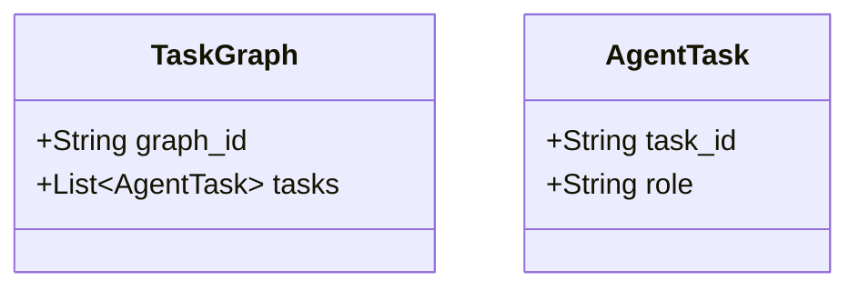

# 02 Multi-Agent Coordination

## Purpose
Decouple the rigid PE/Reviewer workflow into a dynamic DAG of specialized AI agents.

## Domain Models

## Interactions & Failure Scenarios
The `TaskGraph` acts as the dispatcher. If the SecurityAgent blocks an output, the TaskGraph halts dependent testing tasks and routes back to the ProductEngineer.
