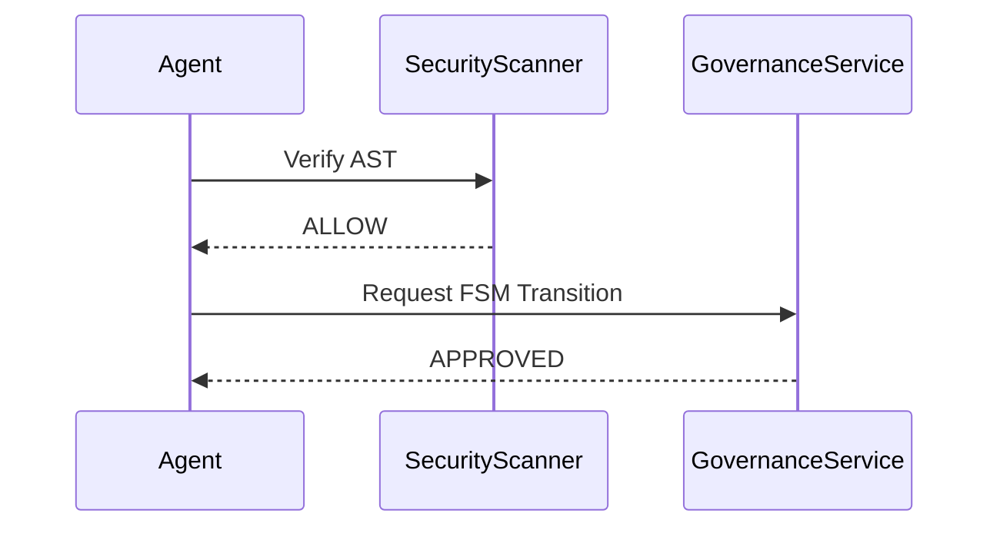

# 03 Governance and Security

## Purpose
Provide capability-based AST scanning and formal FSM transition rules.

## Components
- **CapabilityRegistry**: Maps Provider limits.
- **SecurityScanner**: Validates AST against capabilities.
- **GovernanceService**: Intercepts `APPROVED` transitions and enforces `ApprovalRules`.

## Sequence Diagram

