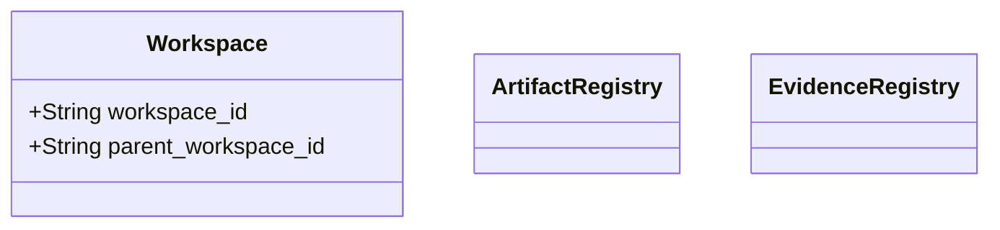

# 04 Workspace and Registries

## Purpose
Ensure lineage tracking and separation of Artifacts (Code) from Evidence (Telemetry).

## Domain Models

```mermaid
classDiagram
    class Workspace {
        +String workspace_id
        +String parent_workspace_id
    }
    class ArtifactRegistry { }
    class EvidenceRegistry { }
```
