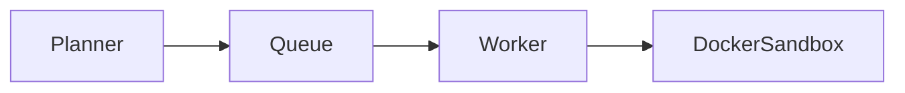

# 05 Distributed Execution

## Purpose
Execute LLM code safely via async Queues and Ephemeral Sandboxes.

## Architecture Flow

## Components
- **ExecutionPlanner**: Creates ExecutionJob graphs.
- **JobQueue**: RabbitMQ/Redis future-proof abstraction.
- **DockerExecutor**: Network=none, memory=512m, non-root.
