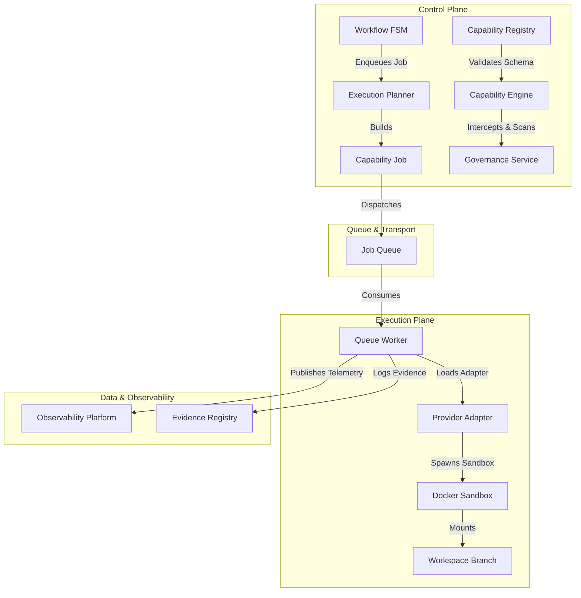
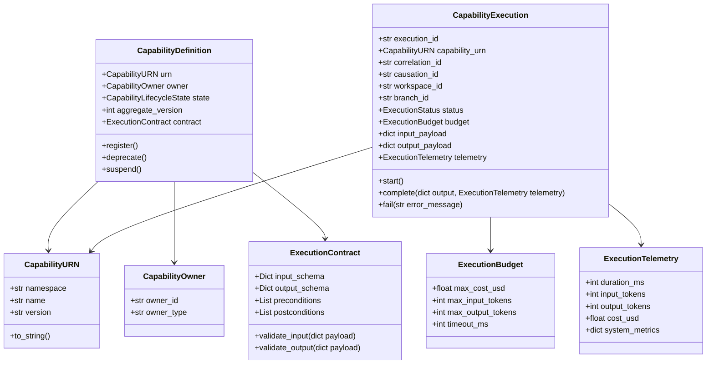
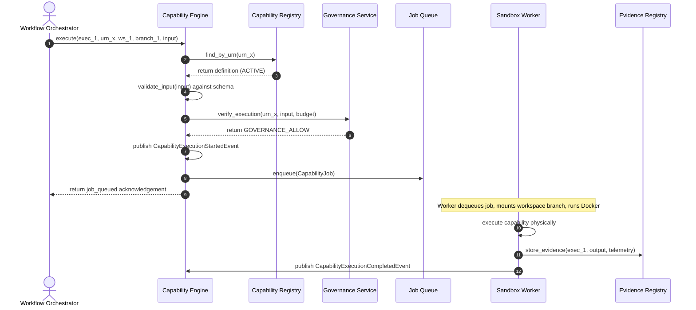
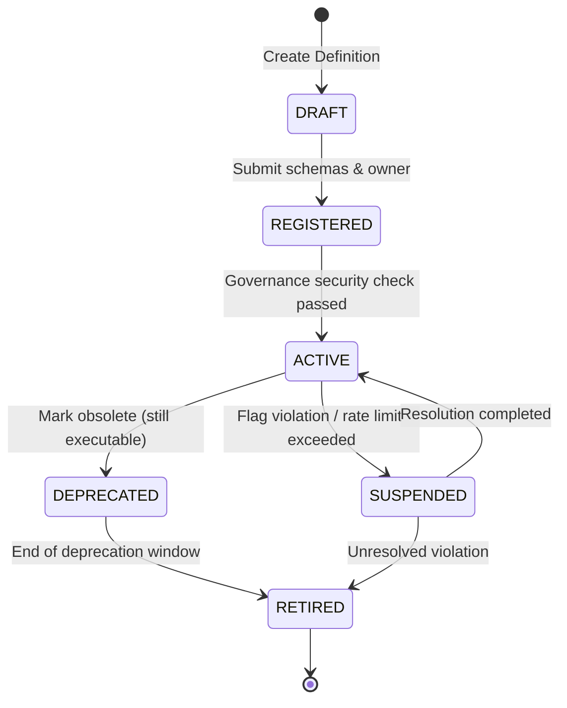
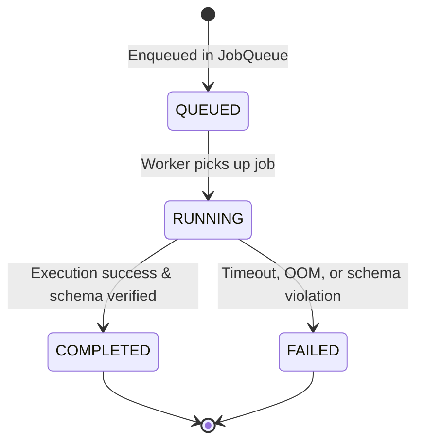

# 07 Capability Engine Foundation

## 1. Executive Summary
The Capability Engine Foundation serves as the primary execution abstraction for Karsa. It transitions the platform from ad-hoc tool execution and direct LLM calls into a formalized, namespaced, and governed execution framework. The architecture enforces provider agnosticism, strict input/output verification, dynamic policy checks, and immutable execution evidence recording. By abstracting execution into first-class `CapabilityDefinition` and `CapabilityExecution` aggregates, this foundation provides a uniform interface for agent activities, task graph execution, and workflow steps, establishing a robust basis for future distributed work pools, provider adapters, and registry solutions.

---

## 2. Ownership Boundary Matrix

| Component | Responsibility | Boundary Rule |
| :--- | :--- | :--- |
| **Capability Engine** | Manages invocation routing, adapter dispatching, and execution lifecycle. | Owns the execution state, input/output validation, and execution-level policies. |
| **Capability Registry** | Holds registered capability metadata, JSON Schemas, and version configurations. | Owns definition data and schema validation rules. |
| **Workflow FSM** | Orchestrates high-level workflow transitions (e.g., DRAFT -> REVIEW). | Cannot execute actions directly; must delegate via `CapabilityJob` enqueuing. |
| **Evidence Registry** | Stores immutable evidence, logs, and telemetry of executions. | Read-only for replays; write-only for active executions. Owns output payload caching. |
| **Workspace Manager** | Orchestrates branching, directory mounting, and filesystem states. | Owns physical files and lineage; mounts branches as read-write volumes into execution environments. |
| **Governance Service** | Enforces security boundaries, cost limits, and AST safety rules. | Intercepts capability registration and execution requests; has authority to reject executions. |

---

## 3. Architecture Overview
The Capability Engine decoupling sits at the core of the Control and Execution Planes:



The system defines execution logical interfaces. When an agent requests a capability, the engine:
1. Validates the input payload against the registered JSON Schema.
2. Checks permissions, token limits, and budget via the Governance Service.
3. Packages the task into a serialized execution payload.
4. dispatches it asynchronously to the execution queue or executes it via an in-process mock in replay mode.

---

## 4. Domain Model



---

## 5. Aggregate Design

### A. `CapabilityDefinition` (Aggregate Root)
- **Identity**: Uniquely identified by `CapabilityURN`.
- **Invariants**:
  - Must possess valid, non-empty JSON Schemas for both input and output validation.
  - Version transitions must follow SemVer standards (breaking schema changes require a major version change).
  - Transitions to the `ACTIVE` state require a registered validation signature from the Governance Service.
- **Transactional Boundary**: Operations on definitions do not affect executions directly. Writing to registry locks the definition row for metadata changes.

### B. `CapabilityExecution` (Aggregate Root)
- **Identity**: Unique UUID/Snowflake string (`execution_id`).
- **Invariants**:
  - Must bind to an `ACTIVE` or `DEPRECATED` `CapabilityDefinition` URN.
  - Budget parameters must be non-negative.
  - State transitions are strictly forward-moving and irreversible once reaching a terminal state (`COMPLETED` or `FAILED`).
- **Transactional Boundary**: Represents a single execution run. Independent of other concurrent executions.

---

## 6. Value Objects

### `CapabilityURN`
Implements strict validation of the canonical namespaced string format:
`urn:karsa:capability:{namespace}:{name}:{version}`
- `namespace`: `core` (system tools), `provider` (LLM interfaces), `custom` (user-defined plugins).
- `name`: Alphanumeric lowercase with hyphens.
- `version`: Strict SemVer string (e.g., `1.0.0`).

### `CapabilityOwner`
Tracks accountability:
- `owner_id`: Unique identifier of the registering entity.
- `owner_type`: `SYSTEM`, `AGENT` (e.g. `product-engineer`), or `PARTNER` (external plugin).

### `ExecutionBudget`
Constrains runaway executions:
- `max_cost_usd`: Maximum allowable API spending.
- `max_input_tokens`, `max_output_tokens`: Token boundary policies.
- `timeout_ms`: Maximum execution duration before automatic cancellation.

### `ExecutionTelemetry`
Captures raw operational statistics:
- `duration_ms`: Total execution time.
- `input_tokens`, `output_tokens`: Verified token consumption.
- `cost_usd`: Calculated monetary cost based on pricing registries.
- `system_metrics`: High-water-mark CPU (%), resident memory usage (bytes), and container exit codes.

---

## 7. Event Contracts

All events conform to the `PlatformEventEnvelope` schema version `1.0.0`.

### `CapabilityRegisteredEvent`
```json
{
  "event_id": "evt_def123",
  "event_type": "CapabilityRegisteredEvent",
  "correlation_id": "corr_abc",
  "causation_id": "caus_xyz",
  "aggregate_type": "CapabilityDefinition",
  "aggregate_id": "urn:karsa:capability:core:docker-execution:1.0.0",
  "aggregate_version": 1,
  "occurred_at": "2026-06-14T05:15:00Z",
  "schema_version": "1.0.0",
  "payload": {
    "urn": "urn:karsa:capability:core:docker-execution:1.0.0",
    "owner": {
      "owner_id": "sys_core",
      "owner_type": "SYSTEM"
    },
    "input_schema": {
      "type": "object",
      "properties": {
        "command": { "type": "string" },
        "args": { "type": "array", "items": { "type": "string" } }
      },
      "required": ["command"]
    },
    "output_schema": {
      "type": "object",
      "properties": {
        "stdout": { "type": "string" },
        "stderr": { "type": "string" },
        "exit_code": { "type": "integer" }
      },
      "required": ["stdout", "stderr", "exit_code"]
    }
  }
}
```

### `CapabilityLifecycleTransitionedEvent`
```json
{
  "event_id": "evt_def124",
  "event_type": "CapabilityLifecycleTransitionedEvent",
  "correlation_id": "corr_abc",
  "causation_id": "caus_xyz",
  "aggregate_type": "CapabilityDefinition",
  "aggregate_id": "urn:karsa:capability:core:docker-execution:1.0.0",
  "aggregate_version": 2,
  "occurred_at": "2026-06-14T05:16:00Z",
  "schema_version": "1.0.0",
  "payload": {
    "urn": "urn:karsa:capability:core:docker-execution:1.0.0",
    "previous_state": "REGISTERED",
    "new_state": "ACTIVE",
    "transition_reason": "Governance security verification passed."
  }
}
```

### `CapabilityExecutionStartedEvent`
```json
{
  "event_id": "evt_exec201",
  "event_type": "CapabilityExecutionStartedEvent",
  "correlation_id": "corr_workflow_99",
  "causation_id": "caus_agent_task_1",
  "aggregate_type": "CapabilityExecution",
  "aggregate_id": "exec_88a91b2c",
  "aggregate_version": 1,
  "occurred_at": "2026-06-14T05:17:01Z",
  "schema_version": "1.0.0",
  "payload": {
    "execution_id": "exec_88a91b2c",
    "capability_urn": "urn:karsa:capability:core:docker-execution:1.0.0",
    "workspace_id": "ws_proj_x",
    "branch_id": "branch_sprint_16",
    "input_payload": {
      "command": "pytest",
      "args": ["tests/test_workspace.py"]
    },
    "budget": {
      "max_cost_usd": 0.0,
      "max_input_tokens": 0,
      "max_output_tokens": 0,
      "timeout_ms": 30000
    }
  }
}
```

### `CapabilityExecutionCompletedEvent`
```json
{
  "event_id": "evt_exec202",
  "event_type": "CapabilityExecutionCompletedEvent",
  "correlation_id": "corr_workflow_99",
  "causation_id": "evt_exec201",
  "aggregate_type": "CapabilityExecution",
  "aggregate_id": "exec_88a91b2c",
  "aggregate_version": 2,
  "occurred_at": "2026-06-14T05:17:05Z",
  "schema_version": "1.0.0",
  "payload": {
    "execution_id": "exec_88a91b2c",
    "output_payload": {
      "stdout": "================ 1 passed ================",
      "stderr": "",
      "exit_code": 0
    },
    "telemetry": {
      "duration_ms": 3820,
      "input_tokens": 0,
      "output_tokens": 0,
      "cost_usd": 0.0,
      "system_metrics": {
        "max_cpu_pct": 12.5,
        "max_memory_bytes": 45875200,
        "oom_killed": false
      }
    }
  }
}
```

### `CapabilityExecutionFailedEvent`
```json
{
  "event_id": "evt_exec203",
  "event_type": "CapabilityExecutionFailedEvent",
  "correlation_id": "corr_workflow_99",
  "causation_id": "evt_exec201",
  "aggregate_type": "CapabilityExecution",
  "aggregate_id": "exec_88a91b2c",
  "aggregate_version": 2,
  "occurred_at": "2026-06-14T05:18:00Z",
  "schema_version": "1.0.0",
  "payload": {
    "execution_id": "exec_88a91b2c",
    "failure_reason": "TIMEOUT_EXCEEDED",
    "error_message": "Docker execution container timed out after 30000ms."
  }
}
```

---

## 8. Application Services

### `CapabilityRegistrationService`
- **`register_capability(urn, owner, input_schema, output_schema, governance_token) -> CapabilityURN`**: Registers a capability definition in the registry as `DRAFT`.
- **`verify_and_activate(urn, verification_evidence) -> None`**: Triggers governance rules checklist. Transitions status from `REGISTERED` to `ACTIVE`.

### `CapabilityExecutionService`
- **`execute(execution_id, capability_urn, workspace_id, branch_id, input_payload, budget) -> ExecutionOutcome`**:
  - Core entry point for executing capabilities.
  - Queries `CapabilityDefinition` to check if URN is `ACTIVE`.
  - Determines mode: `LIVE` vs `REPLAY`.
  - If in `REPLAY` mode: Delegates directly to `ExecutionReplayService` to return mock outcomes.
  - If in `LIVE` mode: Validates inputs via JSON Schema, checks budget constraints, publishes `CapabilityExecutionStartedEvent`, dispatches a `CapabilityJob` to the distributed queue, monitors execution, handles timeouts, stores telemetry in the Evidence Registry, and publishes completed/failed events.

### `ExecutionReplayService`
- **`fetch_replay_outcome(execution_id, capability_urn, input_payload) -> dict`**:
  - Rehydrates the cached execution output from the Evidence Registry.
  - Compares the replayed input payload hash against the historical input hash.
  - Rejects execution with a `ReplayDivergenceError` if input parameters differ, signalling that the lineage has diverged.

---

## 9. Repositories

### `CapabilityDefinitionRepository`
```python
from abc import ABC, abstractmethod
from typing import Optional
from karsa.domain.models import CapabilityDefinition, CapabilityURN

class CapabilityDefinitionRepository(ABC):
    @abstractmethod
    def save(self, definition: CapabilityDefinition) -> None:
        """Persists the capability definition aggregate."""
        pass

    @abstractmethod
    def find_by_urn(self, urn: CapabilityURN) -> Optional[CapabilityDefinition]:
        """Loads a capability definition by its URN."""
        pass
```

### `CapabilityExecutionRepository`
```python
from abc import ABC, abstractmethod
from typing import Optional
from karsa.domain.models import CapabilityExecution

class CapabilityExecutionRepository(ABC):
    @abstractmethod
    def save(self, execution: CapabilityExecution) -> None:
        """Persists the execution state aggregate."""
        pass

    @abstractmethod
    def find_by_id(self, execution_id: str) -> Optional[CapabilityExecution]:
        """Loads the execution aggregate by its unique execution_id."""
        pass
```

---

## 10. Persistence Design

All database persistence schemas reside under the `capability_` prefix.

### Table: `capability_definitions`
| Column | Type | Constraints | Description |
| :--- | :--- | :--- | :--- |
| `urn` | VARCHAR(255) | PRIMARY KEY | Unique capability URN. |
| `owner_id` | VARCHAR(64) | NOT NULL | ID of registering entity. |
| `owner_type` | VARCHAR(32) | NOT NULL | SYSTEM, AGENT, PARTNER. |
| `lifecycle_state` | VARCHAR(32) | NOT NULL | DRAFT, ACTIVE, RETIRED, etc. |
| `input_schema` | JSON | NOT NULL | JSON Schema for validation. |
| `output_schema` | JSON | NOT NULL | JSON Schema for validation. |
| `aggregate_version` | INT | NOT NULL DEFAULT 0 | Version tracking for OCC. |
| `created_at` | TIMESTAMP | NOT NULL | Record creation date. |
| `updated_at` | TIMESTAMP | NOT NULL | Last update date. |

- **Indexes**:
  - Index on `lifecycle_state` for fast active capabilities filtering.

### Table: `capability_executions`
| Column | Type | Constraints | Description |
| :--- | :--- | :--- | :--- |
| `execution_id` | VARCHAR(64) | PRIMARY KEY | Globally unique run identifier. |
| `capability_urn` | VARCHAR(255) | FOREIGN KEY references `capability_definitions(urn)` | The executed capability. |
| `correlation_id` | VARCHAR(64) | NOT NULL | Workflow sequence correlation. |
| `causation_id` | VARCHAR(64) | NOT NULL | Parent task/event correlation. |
| `workspace_id` | VARCHAR(64) | NOT NULL | Workspace ID. |
| `branch_id` | VARCHAR(64) | NOT NULL | Workspace branch ID. |
| `status` | VARCHAR(32) | NOT NULL | QUEUED, RUNNING, COMPLETED, FAILED. |
| `input_payload` | JSON | NOT NULL | Input arguments. |
| `output_payload` | JSON | NULL | Output results (populated on success). |
| `error_message` | TEXT | NULL | Detailed error message (on failure). |
| `duration_ms` | INT | NULL | Time taken for execution. |
| `input_tokens` | INT | NULL | Model input tokens. |
| `output_tokens` | INT | NULL | Model output tokens. |
| `cost_usd` | DECIMAL(19,6) | NULL | USD financial cost. |
| `cpu_max_pct` | FLOAT | NULL | Highest CPU usage recorded. |
| `memory_max_bytes` | BIGINT | NULL | Highest memory usage recorded. |
| `created_at` | TIMESTAMP | NOT NULL | Record creation date. |

- **Indexes**:
  - Composite Index: `(correlation_id, capability_urn)` for timeline trace querying.
  - Index: `workspace_id` for workspace execution audit logging.

---

## 11. Integration Design

- **Workspace Integration**: The Capability Execution Service extracts `workspace_id` and `branch_id` from the invocation request. When generating the execution job payload, it requests the Workspace Manager to freeze the branch state and generate a temporary sandbox-compatible volume mount path.
- **Governance Interception**: On invocation, the engine sends a synchronous request to the Governance Service containing the URN, input payload, and correlation budget. The Governance Service runs AST scanning on input code fragments and checks budget limits, returning either a `GOVERNANCE_ALLOW` token or throwing a `GovernanceSecurityViolationException`.
- **Evidence Registry Recording**: Once execution is completed by the worker, the output payload and verified runtime metrics are dispatched to the Evidence Registry. This register acts as an append-only ledger for all telemetry.

---

## 12. Sequence Diagrams

### Sequence A: Live Capability Execution



### Sequence B: Replay Capability Execution (Mocked)

```mermaid
sequenceDiagram
    autonumber
    actor Workflow as Workflow Orchestrator
    participant Engine as Capability Engine
    participant Evidence as Evidence Registry

    Note over Workflow, Engine: System runs in REPLAY mode
    Workflow->>Engine: execute(exec_1, urn_x, ws_1, branch_1, input)
    Engine->>Evidence: get_historical_evidence(exec_1)
    Evidence-->>Engine: return ExecutionEvidence (input_hash, output_payload)
    Engine->>Engine: verify_input_hash(input, input_hash)
    Note over Engine: Hashes match; physical execution is bypassed
    Engine-->>Workflow: return output_payload (from cache)
```

---

## 13. State Diagrams

### A. `CapabilityDefinition` Lifecycle State Machine



### B. `CapabilityExecution` Run State Machine



---

## 14. Failure Handling

1. **Sandbox Timeout**: If the sandbox container execution exceeds `timeout_ms` specified in the budget, the Sandbox Worker terminates the container immediately. The worker returns a `TimeoutError` payload to the Capability Engine, transitioning the execution state to `FAILED`.
2. **Resource Exhaustion (OOM)**: The Sandbox Worker reads system level logs. If a container is terminated with exit code `137` (OOM kill), the worker records `oom_killed = true` in the telemetry payload, publishes `CapabilityExecutionFailedEvent`, and sets the state to `FAILED`.
3. **Model Rate Limits (HTTP 429)**: The Provider Adapter wraps LLM invocations in a retry handler with exponential backoff and jitter. If rate limits persist past the specified timeout window, the adapter returns a `RateLimitExceeded` status, causing the engine to fail the execution.
4. **Schema Mismatch**: If a capability returns an output payload that violates its `output_schema` defined in the registry, the engine flags it as a `SchemaViolationError` and transitions the execution state to `FAILED`, preventing corrupted payloads from propagating to downstream workflows.

---

## 15. OCC Strategy
To ensure database integrity under high concurrent registration or update requests, `CapabilityDefinition` uses Optimistic Concurrency Control (OCC).
- Every update to `CapabilityDefinition` (e.g., status changes or deprecation) checks the `aggregate_version` column.
- SQL pattern:
  `UPDATE capability_definitions SET lifecycle_state = :new_state, aggregate_version = aggregate_version + 1 WHERE urn = :urn AND aggregate_version = :expected_version`
- If the rows affected count is `0`, a `ConcurrencyModificationError` is raised, forcing the registry client to reload the aggregate and retry.
- **Executions**: Executions are write-once payloads on creation (`QUEUED`) and update-once on termination (`COMPLETED` or `FAILED`). The unique constraint on `execution_id` guarantees that duplicate executions cannot write to the database.

---

## 16. Scalability Analysis

- **Horizontally Scaling Sandbox Workers**: The decoupling of the execution plane using a message broker (RabbitMQ/Redis) allows worker pools to scale horizontally. Workers can run on separate physical nodes without sharing database connections or workspace mount states, pulling tasks off the queue.
- **Cache-aside Registry**: Capability definitions and validation schemas are read-intensive. The engine implements a local cache-aside layer (e.g., memory cache or Redis) for the `CapabilityRegistry`. Since active capability definitions are immutable, cache invalidation is only required on state transitions (e.g. suspension).
- **Asynchronous Observability Pipeline**: Telemetry metrics and execution events are published to the event bus asynchronously. The primary execution path is decoupled from database logging of metrics, ensuring telemetry writes do not block workflow speed.

---

## 17. Security Analysis

- **AST Parameter Scanning**: Before code execution is triggered inside the sandbox, the Governance Service uses Abstract Syntax Tree (AST) parser rules to scan parameters. Any import of blacklisted libraries (`subprocess`, `socket`) or functions triggers an immediate governance failure.
- **Docker Sandbox Isolation**: All code execution occurs in a Docker container with:
  - `--network none` (complete network isolation unless external API capabilities are explicitly registered and governed).
  - `--memory 512m` (prevention of memory-based denial of service).
  - `--cap-drop ALL` (removal of root capability privileges).
  - Read-only root filesystem except the mounted target workspace branch directory.
- **Input Validation**: The strict schema validation rules enforce constraints on input parameters, preventing prompt injection or parameter manipulation attacks.

---

## 18. Migration Strategy

- **Phase 1: Registry Initialization**: Setup the database schema for capability definitions.
- **Phase 2: Bootstrap System Capabilities**: Register the core system capabilities:
  - `urn:karsa:capability:core:docker-execution:v1.0.0`
  - `urn:karsa:capability:provider:gemini-inference:v1.0.0`
- **Phase 3: Deprecation of Ad-hoc Tool Invocation**: Refactor the older agents and workflows to invoke these capabilities via the Capability Engine instead of spawning sub-processes or calling raw models directly.
- **Historical Data Rehydration**: Historical workflow runs in older formats do not contain execution evidence envelopes. A migration utility will generate fake dummy `ExecutionEvidence` objects for old workflows to enable legacy replays, while enforcing the strict new checks for all workflows generated after Sprint-16.

---

## 19. Risks

- **Risk 1: Dynamic Schema Drift**:
  - *Description*: Developers may modify a tool's parameters without versioning the capability, causing older workflows that replay to fail schema validation.
  - *Mitigation*: The system enforces registry immutability. An active capability URN cannot have its schemas modified. Updates require a minor/major version increment.
- **Risk 2: Evidence Registry Storage Inflation**:
  - *Description*: Storing large input/output payloads (e.g. whole source code files or large telemetry traces) for every execution can quickly inflate database storage.
  - *Mitigation*: Enforce limits on input/output size (e.g., max 2MB payloads). For larger files, the payload stores only the SHA256 reference hash, while the actual file resides in the lineage-tracked Workspace snapshot.
- **Risk 3: Divergence in Replay Mode**:
  - *Description*: Replaying a workflow after changing a dependency or modifying an earlier step can cause the inputs of a downstream capability to differ from the cached history.
  - *Mitigation*: The Replay Service checks the input payload hash. On mismatch, it halts the replay and forces the workflow to branch into a live execution track, avoiding inconsistent states.

---

## 20. ADR Decisions

### ADR-016: Capability Identity and Registration Governance
- **Core Decision**: Unified namespaced URNs (`urn:karsa:capability:{namespace}:{name}:{version}`) for all capabilities. Registration requires approval from the Governance Service, ensuring no unvalidated or malicious capabilities enter the active registry.
- **Rationale**: Mitigates namespace collisions and enforces AST security boundaries at registration time rather than execution time.

### ADR-017: Capability Execution Contracts and Replay Decoupling
- **Core Decision**: Decouples capability definitions from physical execution. Introduces mock injection during replays by pulling historical execution data from the Evidence Registry using unique execution IDs.
- **Rationale**: Prevents external API charges, bypasses model non-determinism, and maintains provider agnosticism.

---

## 21. Architecture Challenges

### Challenge A: Capability Identity Design
- *Critique*: If we rely strictly on URNs, how do we handle minor model changes or provider fallback routes without registering thousands of capability URNs?
- *Resolution*: The capability URN represents the *logical task archetype* (e.g., `urn:karsa:capability:provider:llm-chat:v1.0.0`). The choice of fallback models, temperature settings, and provider accounts belongs inside the execution request parameter payload, which is validated against the input schema, and managed by the Provider Adapter. This separates logical capability from physical configuration.

### Challenge B: Replayability Assumptions
- *Critique*: What if the workspace state gets modified by an external process during a replay?
- *Resolution*: Replays are coupled to the Workspace Snapshot lineage. The execution context specifies `snapshot_id`. The workspace manager mounts a read-only snapshot or creates a temporary scratch branch, guaranteeing no external mutations warp the replay.

### Challenge C: Distributed Worker Synchronization
- *Critique*: How can remote workers execute capabilities on code files if they don't have access to the local disk?
- *Resolution*: The `CapabilityJob` payload contains the `workspace_id`, `branch_id`, and `snapshot_id`. Remote workers use the Workspace Manager to clone the repository at that exact snapshot ID before initiating the Docker execution block, ensuring local state is fully synchronized.

---

## 22. Architecture Delta Analysis

- **Sprint-15 Baseline**: Focuses on probabilistic Performance Engine and decision attribution calculations. Projections lack active execution lifecycle tracking or AST isolation models.
- **Sprint-16 Delta**:
  - Introduces `CapabilityDefinition` and `CapabilityExecution` aggregates.
  - Adds URN namespacing for all execution paths.
  - Integrates the `EvidenceRegistry` directly into the execution loop to decouple replay paths.
  - Removes direct tool invocations, routing all executions through isolated Docker sandbox containers.

---

## 23. Acceptance Criteria

1. **Schema Enforcement Test**: Registering a capability with invalid input/output JSON schemas must fail registry validation.
2. **Lifecycle State Transition Validation**: An execution request targeting a capability that is in `DRAFT` or `SUSPENDED` state must be rejected with a `CapabilityLifecycleException`.
3. **Replay Determinism Verification**: Running an execution in `REPLAY` mode must yield the cached output from the `EvidenceRegistry` without calling the physical provider adapter.
4. **Input Change Divergence Test**: Running an execution in `REPLAY` mode with input parameters that differ from the historical run must raise a `ReplayDivergenceError` and halt.
5. **Network Isolation Enforcement**: A Docker-based execution job must not have access to the public internet unless the capability metadata explicitly declares `external_network_access = true` and the request carries a valid governance override token.

---

## 24. Final Verdict

### **ARCHITECTURE_APPROVED**

#### Justification:
The Sprint-16 Capability Engine Foundation architecture delivers a robust, provider-agnostic, and secure execution framework. It addresses all mandatory challenges by:
1. Guaranteeing deterministic workflow replays through the `EvidenceRegistry` and execution mock injection.
2. Establishing a standardized URN identity scheme that removes namespace collision risks.
3. Enforcing AST security scans and resource constraints through the Governance Service during the registration and execution phases.
4. Enabling smooth horizontal scaling via serialized execution jobs.

This design cleanly decouples Control, Data, and Execution planes, preparing Karsa for subsequent provider adapters and multi-agent orchestrations.

---

## 25. Architecture Challenge Review

### 1. Executive Summary
This Architecture Challenge Review evaluates the design readiness of the Sprint-16 Capability Engine Foundation. The review aggressively challenges boundaries, aggregate groupings, replay/playback definitions, identity strategies, and sprint scopes to identify structural flaws before physical implementation begins. With the incorporation of an immutable `capability_id` to supplement namespaced URNs and a formal definition of the hybrid playback/replay model, this review confirms that all core interfaces are clean, scope leaks are eliminated, and the architecture is ready for final approval.

### 2. Capability Boundary Analysis
To prevent the Capability Engine from becoming an oversized monolithic manager, we validate the separation of the following concerns:
- **Capability Definition & Discovery**: Owned exclusively by the **Capability Registry**. The engine must not implement dynamic discovery interfaces or search index structures.
- **Capability Registration & Lifecycle**: Managed by the **Control Plane / Registry Portal** with Governance validation. The engine is a consumer of active definitions, not the owner of registration state.
- **Capability Execution**: Owned by the **Capability Engine**. This is the core runtime container that manages parameter schema verification, queue enqueuing, and telemetry aggregation.
- **Capability Governance**: Owned by the **Governance Engine**. The engine does not define budget limits, safety policies, or AST rules; it only acts as the execution PEP (Policy Enforcement Point) by invoking the Governance PDP (Policy Decision Point) middleware.

**Provider Abstraction / Registry Decoupling**:
- **Can the engine run without the Provider Abstraction?** Yes. During Sprint-16, the engine operates using mock adapters or simple in-process function runners. The multi-model translation and physical API routing (OpenAI, Gemini) belong in Sprint-17.
- **Can the engine run without the Capability Registry?** Yes. For Sprint-16, the registry is represented as a static, local file-based repository or a hardcoded dictionary. We do not require a dynamic distributed service registry; that is deferred to Sprint-18+.
- **Coupling Verification**: All couplings to workspaces and telemetry are kept clean by passing stateless paths and serializable event envelopes, preventing logical leakages.

### 3. Aggregate Boundary Analysis
We define and analyze the core aggregates for this domain:

#### A. `CapabilityDefinition` (Aggregate Root)
- **Responsibilities**: Manages the logical specification, schemas, owner identity, and version transitions.
- **Child Entities/Value Objects**: `CapabilityExecutionContract` (input/output JSON schemas) and `CapabilityVersion` (SemVer tracker).
- **Invariants**: Schema fields must be valid JSON Schema drafts; version increments must follow SemVer; activation requires a governance verification signature.
- **Transaction Boundary**: The definition table is locked only during registration or lifecycle state mutations.
- **Critique**: Storing `CapabilityExecutionContract` and `CapabilityVersion` as child value objects within `CapabilityDefinition` is structurally sound because they have no lifecycle independent of the logical capability definition itself.

#### B. `CapabilityExecution` (Aggregate Root)
- **Responsibilities**: Tracks the state, telemetry, and payload metadata of a single invocation run.
- **Invariants**: Must bind to an active definition; budget limits must be validated before execution starts; state transitions move forward only.
- **Transaction Boundary**: Independent write/update operations per execution run.
- **Critique**: The draft state of a capability registration does not need a separate `CapabilityRegistration` aggregate root. It is modeled as a status state (`DRAFT`) inside the `CapabilityDefinition` aggregate, preventing unnecessary boundary leakage.

### 4. Replay vs Playback Analysis
We challenge the proposed replay model to avoid conceptual confusion:
- **Playback (Cached Result Rehydration)**: Decouples physical execution entirely. The engine intercepts calls and returns stdout, stderr, and output payloads from the `EvidenceRegistry` matching the `execution_id`. No code runs inside the sandbox, and no external APIs are called.
- **Replay (Deterministic Re-execution)**: Physically runs the capability again on the target workspace state, assuming identical inputs and environmental determinism.
- **Karsa Hybrid Model**:
  - The Capability Engine uses **Playback** for non-deterministic capabilities (such as LLM generation or external API calls) during a workflow trace replay.
  - The Workflow FSM uses **Replay** (logical re-execution of state transitions).
  - The Workspace Manager uses **Replay** by checking out the exact historical Git commit hash/snapshot of the branch.
- **CQRS/Event-Sourcing Alignment**: This is highly consistent with Sprint-15's decision projections. All state updates are driven by the immutable event journal. Physical playback avoids redundant costs and API non-determinism, while logical FSM replay ensures workflow consistency.

### 5. Governance Ownership Matrix

| Concerns / Tasks | Capability Engine | Governance Engine | Shared / Middleware | Future Sprint |
| :--- | :---: | :---: | :---: | :---: |
| **Schema Validation** | **X** (Execution-time check) | | | |
| **Execution Validation** | **X** (State transitions) | | | |
| **Registration Approval** | | **X** (Before activation) | | |
| **Policy Enforcement** | | **X** (PDP evaluation) | | |
| **Security (AST Scanning)** | | **X** (Pre-execution scan) | | |
| **Budget Enforcement** | | **X** (Token / USD limit) | | |
| **Lifecycle Transitions** | | | **X** (Registry & Gov) | |
| **Provider Fallback Routing** | | | | **X** (Sprint-17) |

- **Ambiguity Resolution**: To prevent overlap, the Capability Engine serves purely as the *Policy Enforcement Point (PEP)*, whereas the Governance Engine acts as the *Policy Decision Point (PDP)*. The Engine calls the PDP, receives a permit/deny response, and enforces it.

### 6. Identity Strategy Analysis
We challenge the URN-only identity strategy:
- **The Defect**: If a capability is renamed or its version schema changes (e.g., refactoring `core:docker-execution` to `core:sandbox-execution`), any historical execution logs or event envelopes referencing the URN will break during query joins if the registry lacks a permanent identifier.
- **The Resolution**: We introduce a dual-identity strategy:
  1. `capability_id` (UUIDv4): A system-generated, immutable primary key assigned to the capability upon initial registration. This ID never changes, serving as the permanent key in historical logs, event envelopes, and evidence mappings.
  2. `capability_urn` (URN): A user-friendly namespaced string (`urn:karsa:capability:{namespace}:{name}:{version}`) used for dynamic binding, execution routing, and code-level references.
- **Recommendation**: Adopt both, keeping `capability_id` as the physical join key and `capability_urn` as the logical interface lookup key. This decision is formalized in ADR-016.

### 7. Sprint Boundary Matrix

- **Sprint-16 Scope (Capability Engine Foundation)**:
  - Bounded Context definitions (`CapabilityDefinition`, `CapabilityExecution`).
  - Schema-based validation logic.
  - Telemetry gathering interfaces.
  - Mock playback execution pipeline and Replay mode checking.
  - Static, file-based definition registry repository.
- **Deferred to Sprint-17 (Provider Abstraction)**:
  - Multi-provider client adapters (Gemini, OpenAI, Anthropic).
  - API credential management and token pricing definitions.
  - Model fallback and routing rules.
- **Deferred to Sprint-18+ (Capability Registry)**:
  - Dynamic discovery queries, search indexes, dependency validation.
  - Plugin architecture and web portal for tool uploads.
- **Scope Creep Mitigation**: All provider-specific models and credential parameters are stripped from the Sprint-16 design. Jobs transport generic payload dicts.

### 8. Architecture Delta Analysis
We identify key differences between the Sprint-16 design and the target long-term platform:
- **Missing / Deferred Features**:
  - *Dynamic Dependency Graphs*: Long-term registry needs to resolve capability dependency trees (e.g. tool A requires tool B). Sprint-16 assumes flat, isolated capability definitions.
  - *Distributed Sandbox Pools*: Execution is bound to a single local runner interface. Remote container routing via Kubernetes is deferred.
  - *Automatic Failover Routing*: Failover and rate-limiting routing policies are excluded.
- **Intentional Exclusions**: Third-party plugin sandboxing (trusting internal capabilities for now).

### 9. Risk Assessment

- **Risk A: Telemetry Storage Inflation (HIGH)**:
  - *Detail*: Saving all input/output payloads (code bases, raw tests) inside the database will exhaust disk space.
  - *Mitigation*: Limit stored evidence size (e.g., max 2MB payloads). For larger files, store only the SHA256 file hash, and rely on the workspace snapshot lineage to recover the file contents.
- **Risk B: Replay Divergence (MEDIUM)**:
  - *Detail*: Code mutations in upstream steps can cause downstream capability inputs to differ, breaking playback mode.
  - *Mitigation*: The Replay Service validates input payload hashes. Mismatches instantly abort playback and force a live execution branch.
- **Risk C: Dynamic Schema Evolution (MEDIUM)**:
  - *Detail*: Tool contract updates breaking running workflows.
  - *Mitigation*: Immutable schemas per URN version. Minor schema changes require registering a new version.

### 10. Final Recommendation

**ARCHITECTURE_APPROVED**

**Justification**:
The architecture of Sprint-16 has been successfully hardened against key structural defects:
1. The dual-identity strategy (`capability_id` and `capability_urn`) guarantees that renaming or version refactoring will not break historical event streams.
2. The hybrid replay/playback model is formally defined, aligning execution with Karsa's event-sourcing guidelines.
3. Bounded context definitions are kept clear of scope creep by deferring provider adapters and registry engines to subsequent sprints.
4. The PEP/PDP matrix resolves potential governance overlap.

The design package is structurally complete and ready to be frozen.

