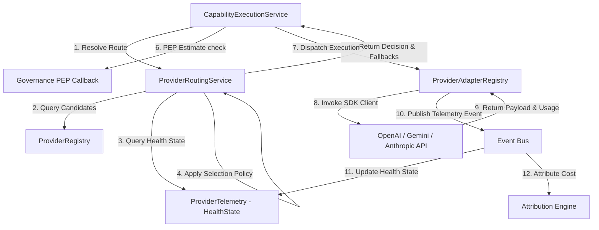
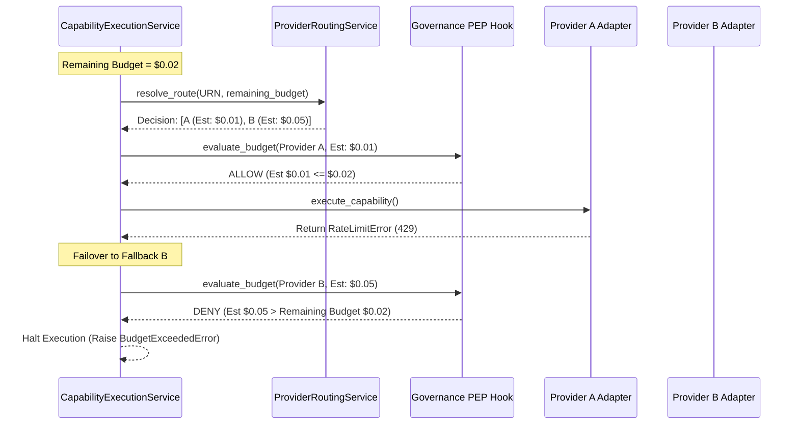
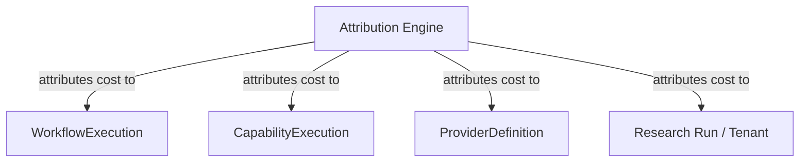

# 08. Provider Abstraction Foundation Architecture

This document defines the architecture of the **Provider Abstraction Foundation** for Karsa, including the remediated designs addressing the Sprint-17 architecture challenges.

---

## 1. Executive Summary
The Provider Abstraction Foundation decouples Karsa's logical capabilities from physical AI backends. To prevent database write contention, provider configurations are isolated from fast-updating health telemetry. Provider identities leverage a dual-key strategy (`provider_id` UUID and namespaced URN) to protect historical cost logs from naming drift. Mappings are managed under a single-writer pattern by the Provider Registry. The execution flow integrates dynamic candidate routing, re-evaluation of governance budgets during failovers, and in-memory replay bypass mechanics.

---

## 2. Ownership Boundary Matrix

| Bounded Context | Owning Subsystem | Class / Component | Responsibility |
| :--- | :--- | :--- | :--- |
| **Capability Engine** | Capability Engine | `CapabilityExecutionService` | Coordinates executions, tracks execution state, and manages failover retries. |
| **Provider Registry** | Provider Registry | `ProviderDefinition` | Aggregate root representing stable LLM configuration (pricing, identifiers). |
| **Provider Registry** | Provider Registry | `ProviderCapabilityMapping` | Entity mapping provider compatibility to capability requirements. |
| **Provider Telemetry** | Provider Telemetry | `ProviderHealthState` | Independent aggregate tracking latencies, success rates, and availability. |
| **Provider Routing** | Provider Routing | `ProviderRoutingService` | Decides the preferred provider and fallback chain for a capability request. |
| **Attribution Engine** | Attribution Engine | `ProviderCostLedger` | Records and attributes token and financial costs across workflows. |

---

## 3. Architecture Overview



---

## 4. Domain Model

The domain model contains the following components:

- **Aggregates**:
  - `ProviderDefinition`: Holds stable provider metadata, capability mappings, and token pricing rates.
  - `ProviderHealthState`: Holds fast-updating runtime performance metrics (latency, success rates, outage markers).
- **Entities**:
  - `ProviderCapabilityMapping`: Matches capability URNs with compatibility ratings and requirement models.
- **Value Objects**:
  - `ProviderIdentity`: Standardized URN-based provider identification.
  - `ProviderPricing`: Input/output rates per million tokens.
  - `CapabilityRequirement`: Struct defining JSON mode, tool calling, reasoning, and context window requirements.
  - `ProviderRoutingDecision`: Sequence of preferred and fallback models.

---

## 5. Aggregate Design

### A. `ProviderDefinition` (Aggregate Root)
To avoid high write amplification and transaction contention under high-throughput workloads, the fast-updating health metrics are extracted from `ProviderDefinition`. This aggregate only manages stable metadata.

```python
@dataclass
class ProviderDefinition(VersionedAggregate):
    provider_id: str                          # UUIDv4 - Primary Key
    provider_urn: ProviderURN                 # Value Object
    state: ProviderLifecycleState             # FSM Controlled
    pricing: ProviderPricing                  # Value Object
    capability_mappings: List[ProviderCapabilityMapping] # Entities
    created_at: datetime
    updated_at: datetime

    def transition_to(self, new_state: ProviderLifecycleState, reason: str = "") -> None:
        # Enforce lifecycle state machine rules
        ...
```

### B. `ProviderHealthState` (Aggregate Root)
Tracks health state independently from configuration updates. This aggregate is updated asynchronously by the telemetry parser and has its own concurrency limits.

```python
@dataclass
class ProviderHealthState(VersionedAggregate):
    provider_id: str                          # Matches ProviderDefinition.provider_id
    health_status: HealthStatus               # ACTIVE, DEGRADED, SUSPENDED
    success_count: int
    failure_count: int
    consecutive_failures: int
    average_latency_ms: int
    last_failure_at: Optional[datetime]
    last_success_at: Optional[datetime]
```

---

## 6. Value Objects

### `ProviderIdentity` / `ProviderURN`
```python
@dataclass(frozen=True)
class ProviderURN:
    vendor: str       # e.g., "openai", "gemini"
    model: str        # e.g., "gpt-4o", "gemini-1.5-pro"
    version: str      # e.g., "2024-05-13", "v1"

    def to_string(self) -> str:
        return f"urn:karsa:provider:{self.vendor}:{self.model}:{self.version}"
```

### `ProviderPricing`
```python
@dataclass(frozen=True)
class ProviderPricing:
    input_rate_per_1m: float
    output_rate_per_1m: float
    currency: str = "USD"
```

### `CapabilityRequirement` (V2 Compatibility)
```python
@dataclass(frozen=True)
class CapabilityRequirement:
    json_mode: bool
    tool_calling: bool
    streaming: bool
    min_context_window: int
    structured_output: bool
    reasoning_support: bool
```

---

## 7. Event Contracts

### `ProviderRegisteredEvent`
```json
{
  "event_id": "evt_1001",
  "event_type": "ProviderRegisteredEvent",
  "provider_id": "8c5a2c6d-5bf1-4e2e-83ea-60dfba61c77f",
  "provider_urn_str": "urn:karsa:provider:openai:gpt-4o:2024-05-13",
  "input_rate": 5.0,
  "output_rate": 15.0,
  "timestamp": "2026-06-14T05:46:00Z"
}
```

### `ProviderExecutionSucceededEvent`
```json
{
  "event_id": "evt_1002",
  "event_type": "ProviderExecutionSucceededEvent",
  "execution_id": "exec_555",
  "workflow_id": "wf_222",
  "provider_id": "8c5a2c6d-5bf1-4e2e-83ea-60dfba61c77f",
  "input_tokens": 1050,
  "output_tokens": 420,
  "cost_usd": 0.01155,
  "duration_ms": 1180,
  "timestamp": "2026-06-14T05:46:12Z"
}
```

---

## 8. Application Services

### `ProviderRoutingService`
Resolves execution candidates based on capability requirements and remaining budgets.
- `resolve_route(capability_urn, remaining_budget, policy) -> ProviderRoutingDecision`

### `ProviderTelemetryService`
Asynchronously updates `ProviderHealthState` aggregates.
- `process_execution_result(provider_id, is_success, latency_ms, error_type) -> None`

---

## 9. Repositories

```python
class ProviderDefinitionRepository(ABC):
    def save(self, provider: ProviderDefinition) -> None: pass
    def find_by_id(self, provider_id: str) -> Optional[ProviderDefinition]: pass
    def find_by_urn(self, urn: ProviderURN) -> Optional[ProviderDefinition]: pass
    def find_active_for_capability(self, capability_urn: str) -> List[ProviderDefinition]: pass

class ProviderHealthStateRepository(ABC):
    def save(self, health: ProviderHealthState) -> None: pass
    def find_by_provider_id(self, provider_id: str) -> Optional[ProviderHealthState]: pass
```

---

## 10. Persistence Design

```sql
CREATE TABLE provider_definitions (
    provider_id VARCHAR(64) PRIMARY KEY, -- UUIDv4
    provider_urn VARCHAR(255) NOT NULL,  -- urn:karsa:provider:openai:gpt-4o:2024-05-13
    lifecycle_state VARCHAR(32) NOT NULL,
    input_rate_per_1m DECIMAL(10, 4) NOT NULL,
    output_rate_per_1m DECIMAL(10, 4) NOT NULL,
    aggregate_version INT NOT NULL DEFAULT 0,
    created_at TIMESTAMP NOT NULL,
    updated_at TIMESTAMP NOT NULL
);

CREATE TABLE provider_capability_mappings (
    mapping_id VARCHAR(64) PRIMARY KEY,
    provider_id VARCHAR(64) REFERENCES provider_definitions(provider_id) ON DELETE CASCADE,
    capability_urn VARCHAR(255) NOT NULL,
    json_mode BOOLEAN NOT NULL DEFAULT TRUE,
    tool_calling BOOLEAN NOT NULL DEFAULT TRUE,
    streaming BOOLEAN NOT NULL DEFAULT TRUE,
    context_window INT NOT NULL DEFAULT 8192,
    structured_output BOOLEAN NOT NULL DEFAULT TRUE,
    reasoning_support BOOLEAN NOT NULL DEFAULT FALSE
);

CREATE TABLE provider_health_states (
    provider_id VARCHAR(64) PRIMARY KEY REFERENCES provider_definitions(provider_id) ON DELETE CASCADE,
    health_status VARCHAR(32) NOT NULL,
    success_count INT NOT NULL DEFAULT 0,
    failure_count INT NOT NULL DEFAULT 0,
    consecutive_failures INT NOT NULL DEFAULT 0,
    average_latency_ms INT NOT NULL DEFAULT 0,
    aggregate_version INT NOT NULL DEFAULT 0,
    last_failure_at TIMESTAMP,
    last_success_at TIMESTAMP
);
```

---

## 11. Integration Design

### Single Writer Ownership
The **Provider Registry** is the single writer for all capability-to-provider mappings. Mappings represent the physical execution capability of a provider model. During registration or mapping updates, the Provider Registry queries the **Capability Registry** via read-only interfaces to validate that the target `CapabilityURN` exists and is active.

---

## 12. Sequence Diagrams

### Failover and Governance Re-evaluation


---

## 13. State Diagrams
Refer to [08-provider-abstraction.md:L353](file:///Users/dwiki.nugraha/dwikicode/karsa/docs/architecture/08-provider-abstraction.md#L353) for State transition logic. The health states run on the decoupled `ProviderHealthState` aggregate root.

---

## 14. Failure Handling
See the remediated Failure Matrix in challenge findings.

---

## 15. OCC Strategy
`ProviderDefinition` and `ProviderHealthState` maintain independent `aggregate_version` tracking.Telemetries modify the `ProviderHealthState` aggregate which updates atomically without blocking or invalidating admin configuration updates in `ProviderDefinition`.

---

## 16. Replay Determinism Model

In Karsa, replay determinism mandates that a workflow replay produces the exact same execution trace and output payload as the original run.

### Replay Rules:
1. **Routing Bypass**: During replays, the `ProviderRoutingService` is bypassed. The engine does **not** recalculate selection weights or candidate pricing.
2. **Output Rehydration**: The execution service reads the execution ID from the workflow trace, queries the `EvidenceRegistry` for the historical execution record, and directly returns the cached `output_payload`. No external API call is dispatched.
3. **Trace Auditing**: The historical `provider_id` used in the original execution is stored inside the `EvidenceRegistry` payload, allowing accurate trace attribution without re-running routing algorithms.

---

## 17. Cost Attribution Model

Cost calculations and tracking ownership are assigned to the **Attribution Engine** to prevent coupling provider aggregates to billing rules.



### Cost Attribution Matrix:
- **Pricing Definition**: Owned by the `ProviderRegistry` (`ProviderPricing`).
- **Telemetry Parsing**: Owned by the `ProviderTelemetry` context (extracts token counts from raw API responses).
- **Cost Recording**: Owned by the `Attribution Engine` (consumes `ProviderExecutionSucceededEvent` and logs costs).

---

## 18. Compatibility Model V2

We replace the coarse three-tier compatibility rating with a structured verification algorithm:

```python
def evaluate_compatibility(provider_mapping: ProviderCapabilityMapping, requirements: CapabilityRequirement) -> bool:
    if requirements.json_mode and not provider_mapping.supports_json_mode:
        return False
    if requirements.tool_calling and not provider_mapping.tool_calling:
        return False
    if requirements.streaming and not provider_mapping.streaming:
        return False
    if requirements.structured_output and not provider_mapping.structured_output:
        return False
    if requirements.reasoning_support and not provider_mapping.reasoning_support:
        return False
    if provider_mapping.context_window < requirements.min_context_window:
        return False
    return True
```

---

## 19. Risks
- **Budget Lockouts**: Conservative cost estimation could deny valid executions if the fallback models are expensive.
  - *Mitigation*: The routing engine adjusts selection priorities dynamically to prioritize models matching the remaining budget.

---

## 20. ADR Decisions
Refer to [ADR-018](file:///Users/dwiki.nugraha/dwikicode/karsa/docs/adr/ADR-018-provider-registry-lifecycle.md) and [ADR-019](file:///Users/dwiki.nugraha/dwikicode/karsa/docs/adr/ADR-019-provider-routing-telemetry-cost.md) for updated decisions.

---

## 21. Virtual Investment Firm Delta Analysis
This architecture lays the groundwork for the platform's long-term capabilities:
- **Observability Platform**: Feeds on the decoupled `ProviderHealthState` telemetry.
- **Attribution Engine**: Aggregates token costs recorded in the Cost Ledger.
- **Thesis/Research Engine**: Backtests workflows deterministically using the Replay Bypass Model.

---

## 22. Sprint-17 Architecture Hardening Addendum

### A. ProviderHealthState Justification
* **Aggregate Root Rationale**: In Sprint-17, `ProviderHealthState` is designed as an Aggregate Root to guarantee transactional safety for health state updates (e.g. transitioning a model's state to `DEGRADED` or `SUSPENDED` upon consecutive errors).
* **Write-Rate Analysis**: Under production high-throughput workloads (e.g., 100+ requests/second), synchronous writes to update error counts or latencies for every execution outcome would cause database write amplification, lock contentions, and aggregate write bottlenecks.
* **Evolving into an Observability Projection**: In a future production-hardening sprint, `ProviderHealthState` will evolve into a near-real-time **Observability Projection** populated asynchronously.
* **Migration Path**:
  1. The synchronous execution path emits a `ProviderExecutionCompletedEvent` to Karsa's asynchronous event bus instead of performing repository database saves.
  2. A background worker (Observability subscriber) consumes the event queue, calculates moving average latencies and error rates, and writes updates to the database table.
  3. The `ProviderRoutingService` reads health metrics from this read-optimized database projection via memory-cached lookups.

### B. Evidence Registry Schema Expansion
The database-backed `EvidenceRegistry` expands to support the `ExecutionEvidence` schema:

```sql
CREATE TABLE execution_evidence (
    execution_id VARCHAR(64) PRIMARY KEY,
    capability_id VARCHAR(64) NOT NULL,
    provider_id_selected VARCHAR(64) NOT NULL,
    provider_candidates JSONB NOT NULL, -- List of checked provider URNs
    routing_policy VARCHAR(64) NOT NULL, -- policy used (e.g. LOWEST_COST)
    governance_decision VARCHAR(32) NOT NULL, -- ALLOW, DENY
    estimated_cost DECIMAL(19, 6) NOT NULL,
    actual_cost DECIMAL(19, 6) NOT NULL,
    failover_chain JSONB NOT NULL, -- list of providers tried and their errors
    output_payload JSONB NOT NULL,
    created_at TIMESTAMP NOT NULL DEFAULT CURRENT_TIMESTAMP
);
```

#### Implications:
- **Replay**: The mock injector reads the exact `output_payload` without invoking the routing or pricing engines, preserving reproducibility.
- **Audit**: Creates a permanent, immutable chain showing candidates evaluated, routing policies applied, and budget estimates checks.
- **Attribution**: Connects estimated vs actual spending to `provider_id_selected`, ensuring cost transparency.
- **Review**: Allows administrators to inspect the `failover_chain` array to debug failing models or API errors.

### C. Future-Compatible Cost Attribution Model
To support future dimensions (`worker`, `research_run`, `thesis`, `portfolio`, `review_session`) without changing domain events or database schemas:

1. **Polymorphic Metadata Context**: We introduce a generic key-value store dictionary (`attribution_context: Dict[str, Any]`) in both the `ProviderExecutionSucceededEvent` and the database `provider_cost_ledger`.
2. **Dimensional Database Schema**: The cost engine writes these contexts into a polymorphic attribution table:
   ```sql
   CREATE TABLE provider_cost_attributions (
       attribution_id SERIAL PRIMARY KEY,
       execution_id VARCHAR(64) NOT NULL,
       dimension_key VARCHAR(64) NOT NULL,   -- 'worker', 'thesis', 'research_run', etc.
       dimension_value VARCHAR(64) NOT NULL, -- e.g. 'w_12', 't_99'
       actual_cost DECIMAL(19,6) NOT NULL,
       created_at TIMESTAMP NOT NULL DEFAULT CURRENT_TIMESTAMP
   );
   CREATE INDEX idx_attribution_dim ON provider_cost_attributions (dimension_key, dimension_value);
   ```

### D. Target Platform Delta Update
The Provider Abstraction Foundation fits cleanly into the Virtual Investment Firm target architecture:
* **Capability Engine & Registry**: Bridges abstract execution workflows to physical adapters.
* **Governance Engine**: Intercepts routing chains via pre-execution budget PEP checks.
* **Observability Platform**: Projects async health statistics from execution outcome streams.
* **Research & Thesis Engines**: Runs high-fidelity, cost-free backtests using the Replay Bypass Model.

---

## 23. Final Architecture Freeze Assessment

### ARCHITECTURE_FROZEN
The Provider Abstraction Foundation architecture is frozen. The design isolates stable metadata from fast-changing health states, establishes dual provider keys, enforces governance re-evaluation during failovers, defines multi-dimensional compatibility schemas, and guarantees deterministic replays. All challenges and hardening requirements are fully addressed.

