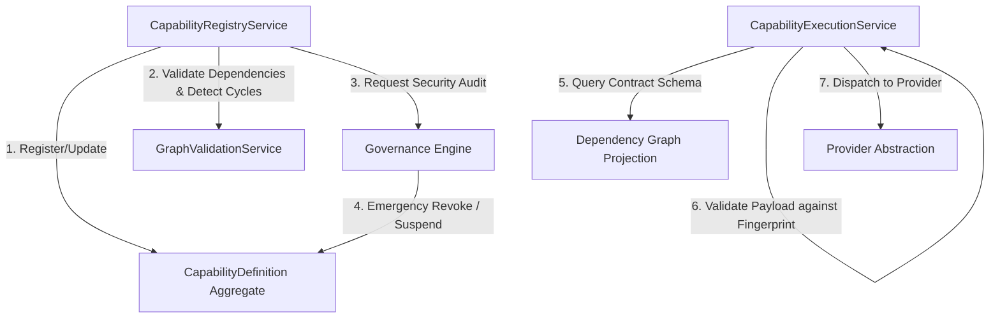
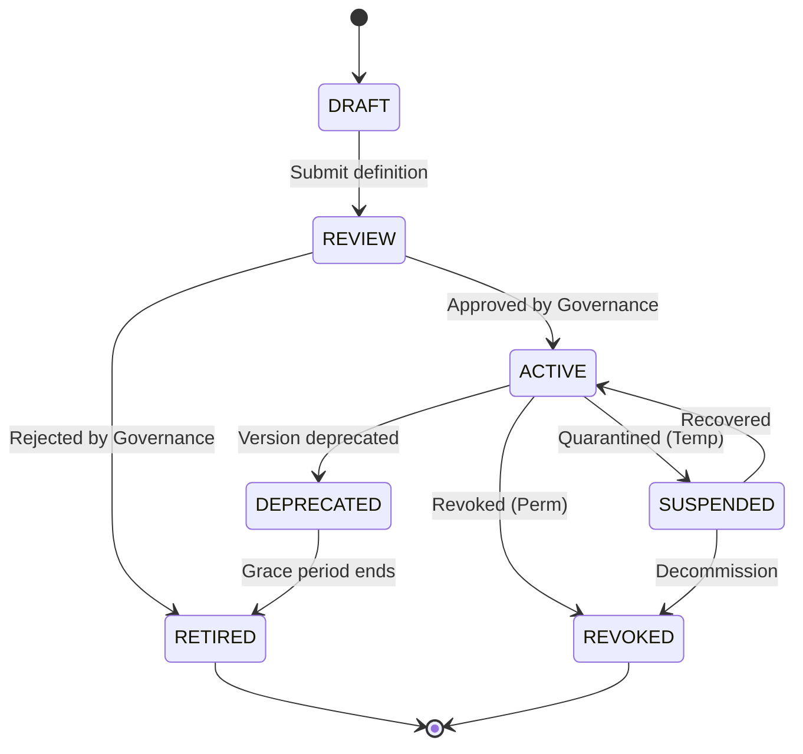

# 09. Capability Registry Foundation Architecture

This document defines the architecture of the **Capability Registry Foundation** for Karsa, incorporating the remediated designs addressing the Sprint-18 architecture challenges.

---

## 1. Executive Summary
The Capability Registry is the single source of truth for all capability metadata and execution contracts in Karsa. To support absolute determinism, it uses a dual-identity strategy: `capability_family_id` represents the capability namespace, while `capability_id` uniquely identifies an immutable, content-fingerprinted version of a capability definition. Dependencies are modeled as pinned value objects inside the definition aggregate root, validated at activation using a DFS node coloring cycle detection algorithm, and compiled into read-optimized dependency graph projections. An emergency revocation path allows immediate quarantine (`SUSPENDED`) or permanent decommissioning (`REVOKED`) of capabilities during security incidents.

---

## 2. Ownership Boundary Matrix

| Bounded Context | Owning Subsystem | Primary Database Tables | Write Responsibility (Single Writer) |
| :--- | :--- | :--- | :--- |
| **Capability Registry** | Capability Registry | `capability_definitions`, `capability_dependencies` | Owner of capability metadata, contract schemas, dependency pinning, and contract fingerprints. |
| **Provider Registry** | Provider Registry | `provider_definitions`, `provider_capability_mappings` | Owner of provider identity, pricing models, and provider-to-capability mappings. |
| **Provider Routing** | Provider Routing | `provider_routing_metrics` | Owner of route resolution policies, execution chains, and fallback selection. |
| **Governance Engine** | Governance Engine | `governance_decisions` | Owner of security reviews, compliance scans, and status mutations to `SUSPENDED`/`REVOKED`. |

---

## 3. Architecture Overview



---

## 4. Domain Model

- **Aggregates**:
  - `CapabilityDefinition`: Aggregate root representing the immutable contract and metadata of a specific capability version.
- **Value Objects**:
  - `CapabilityURN`: Standardized namespaced versioned identifier.
  - `CapabilityOwner`: Identifies developer ownership and trust level.
  - `CapabilityDependency`: Represents a pinned, exact-version dependency.
  - `ContractFingerprint`: SHA256 hash representing a normalized schema signature.
  - `ExecutionSchema`: Wrap schemas and required capability requirements.

---

## 5. Aggregate Design

### `CapabilityDefinition` (Aggregate Root)
To ensure replay safety, once a capability version enters `ACTIVE`, `DEPRECATED`, or `RETIRED` states, the configuration, dependency array, and contract schemas are frozen and immutable.

```python
@dataclass
class CapabilityDefinition(VersionedAggregate):
    capability_id: str                      # UUIDv4 - Unique version identifier
    capability_family_id: str               # UUIDv4 - Identifies the capability family
    capability_urn: CapabilityURN           # Value Object
    owner: CapabilityOwner                  # Value Object (Trust Level: SYSTEM, PARTNER, etc.)
    state: CapabilityLifecycleState         # FSM controlled
    schema_contract: ExecutionSchema        # Value Object
    contract_fingerprint: ContractFingerprint # Value Object (SHA256 of normalized schemas)
    dependencies: List[CapabilityDependency] # Value Objects (Pinned exact versions)
    created_at: datetime
    updated_at: datetime

    def transition_to(self, new_state: CapabilityLifecycleState, reason: str = "") -> None:
        # Enforce lifecycle state machine rules including emergency revocation
        ...
```

#### Invariants:
1. **Pinned Dependencies**: An active capability definition must only contain dependencies pinned to exact versions; ranges must be resolved and pinned during transition to `REVIEW`.
2. **Fingerprint Lock**: The `contract_fingerprint` must match the normalized representation of the input/output schemas.
3. **Immutability**: Active, Deprecated, and Retired definition details cannot be edited or modified.

---

## 6. Value Objects

### `ContractFingerprint`
Ensures that human-assigned SemVer tags match the structural reality of the schemas.
```python
@dataclass(frozen=True)
class ContractFingerprint:
    sha256_hash: str

    @classmethod
    def generate(cls, input_schema: Dict[str, Any], output_schema: Dict[str, Any]) -> "ContractFingerprint":
        # Normalize: sort keys, strip whitespaces, convert to string
        normalized_input = json.dumps(input_schema, sort_keys=True)
        normalized_output = json.dumps(output_schema, sort_keys=True)
        combined = f"input:{normalized_input}|output:{normalized_output}"
        hasher = hashlib.sha256(combined.encode("utf-8"))
        return cls(sha256_hash=hasher.hexdigest())
```

### `CapabilityDependency`
```python
@dataclass(frozen=True)
class CapabilityDependency:
    dependency_id: str  # Immutable capability_id (UUIDv4) of the target version
    dependency_urn: str # e.g. "urn:karsa:capability:core:code-diff:1.0.0"
```

---

## 7. Event Contracts

### `CapabilityDefinitionRegisteredEvent`
```json
{
  "event_id": "evt_3001",
  "event_type": "CapabilityDefinitionRegisteredEvent",
  "capability_id": "a1f9a2c3-44b2-4d1e-92ea-20bcba11c822",
  "capability_family_id": "f5e9d8c7-33a1-4e8b-91bb-10acba55c711",
  "capability_urn": "urn:karsa:capability:core:code-generation:1.0.0",
  "contract_fingerprint": "8f2a1b9c3d4e5f6a7b8c9d0e1f2a3b4c5d6e7f8a9b0c1d2e3f4a5b6c7d8e9f0a",
  "dependencies": [
    {
      "dependency_id": "b2e8a1c4-55c1-4d8e-99ee-30fcba22d933",
      "dependency_urn": "urn:karsa:capability:core:code-diff:1.0.0"
    }
  ],
  "timestamp": "2026-06-14T05:53:00Z"
}
```

### `CapabilityQuarantinedEvent`
```json
{
  "event_id": "evt_3002",
  "event_type": "CapabilityQuarantinedEvent",
  "capability_id": "a1f9a2c3-44b2-4d1e-92ea-20bcba11c822",
  "capability_urn": "urn:karsa:capability:core:code-generation:1.0.0",
  "transition_type": "SUSPENDED",
  "reason": "Vulnerability CVE-2026-X detected in dependency code diff execution path",
  "timestamp": "2026-06-14T05:54:10Z"
}
```

---

## 8. Application Services
Refer to [09-capability-registry.md:L101](file:///Users/dwiki.nugraha/dwikicode/karsa/docs/architecture/09-capability-registry.md#L101) for registry service contracts. The cycle detection algorithm utilizes a DFS coloring checker on the dependencies to block cycles.

---

## 9. Repositories
Refer to [09-capability-registry.md:L116](file:///Users/dwiki.nugraha/dwikicode/karsa/docs/architecture/09-capability-registry.md#L116) for definition repos.

---

## 10. Persistence Design
Persistence is managed authoritatively by the Capability Registry under the `capability_` prefix.

```sql
CREATE TABLE capability_definitions (
    capability_id VARCHAR(64) PRIMARY KEY, -- UUIDv4 of version
    capability_family_id VARCHAR(64) NOT NULL, -- UUIDv4 of family
    namespace VARCHAR(64) NOT NULL,
    name VARCHAR(64) NOT NULL,
    version VARCHAR(32) NOT NULL,
    owner_id VARCHAR(64) NOT NULL,
    owner_trust_level VARCHAR(32) NOT NULL, -- TRUSTED_SYSTEM, CERTIFIED_PARTNER, etc.
    lifecycle_state VARCHAR(32) NOT NULL,
    input_schema JSONB NOT NULL,
    output_schema JSONB NOT NULL,
    contract_fingerprint VARCHAR(64) NOT NULL, -- SHA256 Signature
    required_json_mode BOOLEAN NOT NULL DEFAULT FALSE,
    required_tool_calling BOOLEAN NOT NULL DEFAULT FALSE,
    required_streaming BOOLEAN NOT NULL DEFAULT FALSE,
    required_context_window INT NOT NULL DEFAULT 8192,
    aggregate_version INT NOT NULL DEFAULT 0,
    created_at TIMESTAMP NOT NULL,
    updated_at TIMESTAMP NOT NULL
);

CREATE TABLE capability_dependencies (
    capability_id VARCHAR(64) REFERENCES capability_definitions(capability_id) ON DELETE CASCADE,
    dependency_id VARCHAR(64) REFERENCES capability_definitions(capability_id),
    dependency_urn VARCHAR(255) NOT NULL,
    PRIMARY KEY (capability_id, dependency_id)
);
```

---

## 11. Integration Design

### Capability Attribution Metadata Integration
To support long-term target engines (Observability, Attribution, Research, Thesis):
- The `CapabilityExecutionService` accepts a polymorphic `attribution_context: Dict[str, Any]` metadata container payload (holding parameters like `research_id`, `thesis_id`, `worker_id`).
- This context is passed via headers of all execution events, stored in the `EvidenceRegistry` for trace reporting, and ingested by the **Attribution Engine** to log spending models.

---

## 12. State Diagrams

### Capability Lifecycle State Machine (Emergency Revocation Path)


- **SUSPENDED**: Temporary quarantine (e.g. downstream model rate-limited or suspected exploit). Route resolution fails.
- **REVOKED**: Permanent security quarantine. Attempts to execute raise `RevokedCapabilityException`. Replays for this capability version fail immediately to prevent executing compromised code.

---

## 13. Failure Handling
See challenge findings.

---

## 14. OCC Strategy
Updates to state transitions, revocations, and mapping locks enforce `aggregate_version` locks.

---

## 15. Replay Determinism Model
- **Contract Fingerprint Lock**: During replay, the execution engine validates that the trace's recorded `contract_fingerprint` matches the loaded definition's fingerprint, preventing silent database drift.
- **Exact Version Pins**: The execution graph resolves only to pinned exact version nodes, removing any non-deterministic dynamic ranges during replay playback.

---

## 16. Registry Scalability Model
To support 10,000+ capabilities without query performance degradation:
1. **Cache Architecture**: Active URN-to-UUID mappings are cached in a distributed memory database. Cached keys are invalidated using event listeners on lifecycle mutation events.
2. **Graph Projections**: Dependency trees are resolved out-of-band during registry activation and stored in a read-optimized **Dependency Graph Projection** (adjacency list map).
3. **Materialized Views**: Discovery and search indexes are managed via concurrently refreshed materialized views (`mv_active_capability_discovery`), decoupling reads from write tables.

---

## 17. Marketplace Trust Model
For integrating third-party capabilities:
1. **Publisher Signatures**: Every publisher signs their capability package (code, schemas, manifest) using asymmetric cryptography.
2. **Trust Levels**:
   - `TRUSTED_SYSTEM`: Core engine capability, full host execution privileges.
   - `CERTIFIED_PARTNER`: Signed partner capability, runs in sandboxed environment with read/write target workspace access and restricted egress.
   - `UNTRUSTED_COMMUNITY`: Community capability, executed in a zero-network egress sandbox.
3. **Threat Mitigations**: Enforce read-only volumes for untrusted code, digital envelope checks, and static code sweeps in the `REVIEW` phase.

---

## 18. ADR Decisions
Refer to [ADR-020](file:///Users/dwiki.nugraha/dwikicode/karsa/docs/adr/ADR-020-capability-registry-governance.md) and [ADR-021](file:///Users/dwiki.nugraha/dwikicode/karsa/docs/adr/ADR-021-capability-dependency-resolution.md).

---

## 19. Architecture Challenges
Refer to the challenge findings matrix.

---

## 20. Architecture Delta Analysis
Compare Capability Engine baseline to Capability Registry additions.

---

## 21. Acceptance Criteria
1. **Cycle Blocking**: Graph traversals must throw `DependencyCycleException` during checks.
2. **Fingerprint Match**: Activating a minor version update with breaking fingerprint changes must fail.
3. **Quarantine Halt**: Revoked capability executions must raise `RevokedCapabilityException` and block replays.

---

## 22. Final Verdict

### ARCHITECTURE_FROZEN
The Capability Registry Foundation architecture design remediates all aggregate boundary, version identity, contract fingerprinting, emergency revocation, and scalability challenges.
