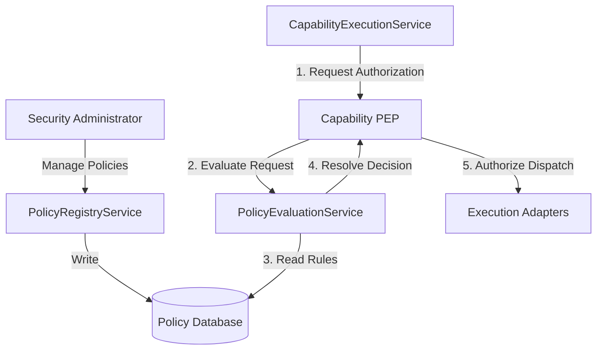
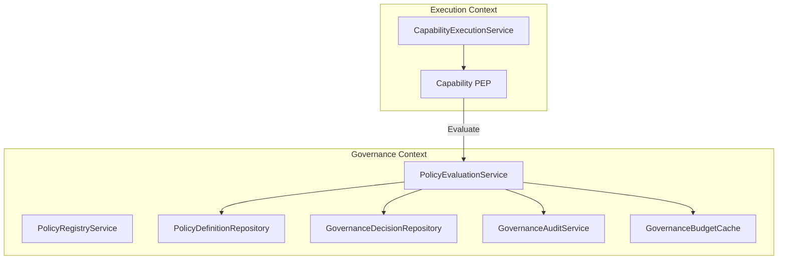
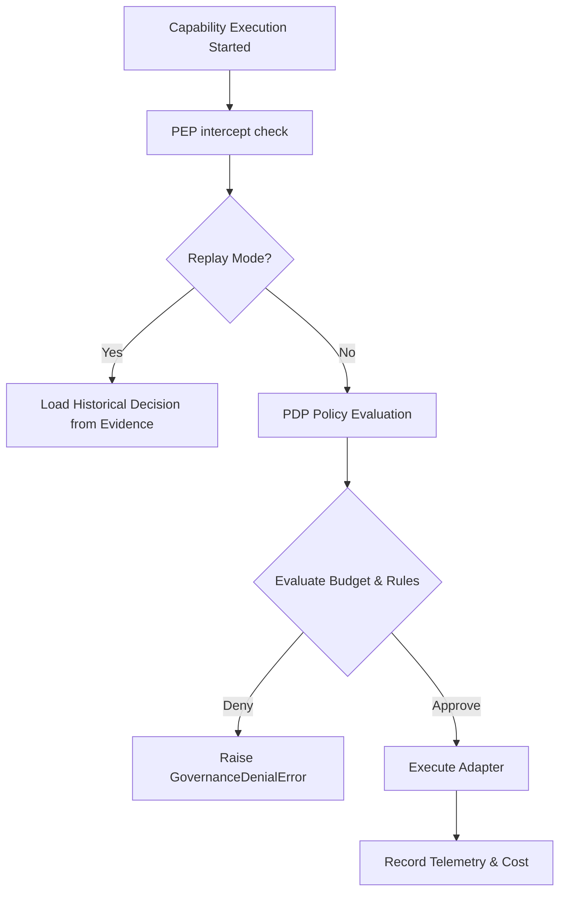
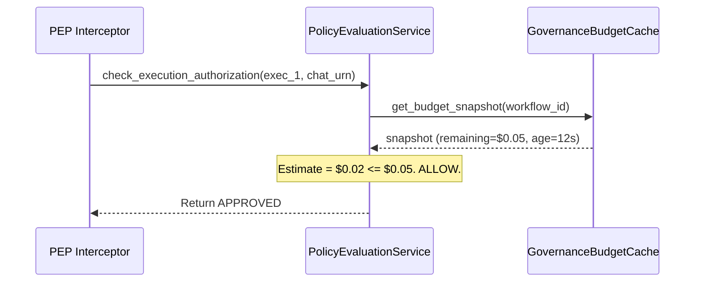
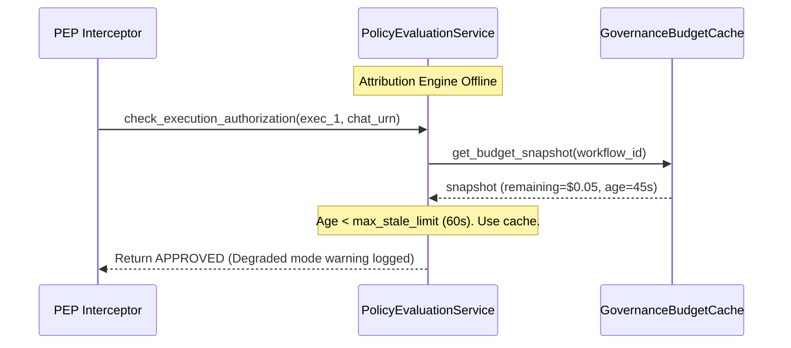
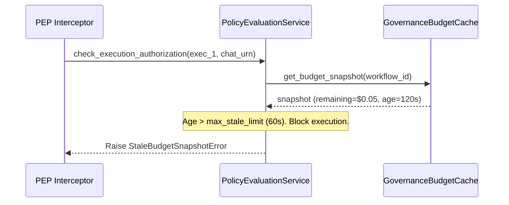

# 10. Governance Engine Foundation Architecture

This document defines the architecture of the **Governance Engine Foundation** for Karsa, serving as the central policy authority (PDP/PEP) for Karsa and the future Virtual Investment Firm architecture.

---

## 1. Executive Summary
The Governance Engine is the single source of truth for policy definitions, evaluations, and compliance audits in Karsa. By separating the Policy Decision Point (PDP) from Policy Enforcement Points (PEP), we establish a non-bypassable governance checkpoint for capability registrations, provider alignments, budget limits, and runtime execution authorization. In-memory replay determinism is guaranteed by bypassing policy evaluation during replays, and audit trails are modeled as a two-layer model (transactional aggregate commits and asynchronous chained logs) to ensure absolute performance and immutability.

---

## 2. Ownership Boundary Matrix

To prevent transaction locks, verify the Single Writer rule, and resolve suspension ownership conflicts, we establish the following boundaries:

| Resource / Aggregate | Who Can Request State Change | Who Can Approve Transition | Who Performs Transition & Writes State | Single-Writer Bounded Context |
| :--- | :--- | :--- | :--- | :--- |
| **CapabilityDefinition** | Governance Engine, Telemetry | Capability Registry Context | `CapabilityRegistryService` | Capability Registry |
| **ProviderDefinition** | Governance Engine, Telemetry | Provider Registry Context | `ProviderRegistryService` | Provider Registry |
| **PolicyDefinition** | Security Administrator | Governance Context | `PolicyRegistryService` | Governance Engine |
| **GovernanceDecision** | Capability PEP | PDP Evaluation | `PolicyEvaluationService` | Governance Engine |
| **GovernanceAuditChain**| Audit Event Consumer | Audit Worker | `GovernanceAuditService` | Governance Engine |

* **Suspension & Revocation Ownership**: Telemetry or Governance Engine may only publish a `SuspensionRequestedEvent` or `RevocationRequestedEvent`. The target registry (Provider Registry or Capability Registry) remains the sole writer of its aggregate state, consuming these events and executing FSM transitions.

---

## 3. Architecture Overview

### Context Diagram


### Component Diagram


### Governance Flow Diagram


---

## 4. Domain Model

The Governance Engine is designed around the following domain components:

* **Aggregate Roots**:
  * `PolicyDefinition`: Represents a structured governance rule (e.g., budget caps, security constraints).
  * `GovernanceDecision`: The concrete transaction-committed record containing the PDP's evaluation results.
  * `GovernanceAuditChain`: Append-only, cryptographically chained log aggregate populated asynchronously.
* **Read Models**:
  * `GovernanceBudgetCache`: Read-optimized local database cache tracking workflow spending snapshots.
* **Entities**:
  * `PolicyRule`: Sub-component of `PolicyDefinition` detailing expressions and conditions.
* **Value Objects**:
  * `PolicyURN`: Namespaced URN identifying the policy (`urn:karsa:policy:{namespace}:{name}:{version}`).
  * `PolicyCondition`: Logic parameters (e.g., `operator`, `field`, `threshold`).
  * `PolicyScope`: Target entities affected (e.g., `capability_urn`, `provider_urn`, `workflow_id`).
  * `BudgetConstraint`: Dynamic spending configurations.

---

## 5. Aggregate Design

### A. `PolicyDefinition` (Aggregate Root)
Owns stable policy configurations, rule mappings, lifecycle state, and scope.
* **Transaction Boundary**: Enforces that active rules cannot be modified. Any changes require a transition back to DRAFT or creating a new version.

### B. `GovernanceDecision` (Aggregate Root)
* **Layer A - Transactional Commit**: Created and committed atomically upon PDP evaluation to block invalid executions immediately. It is immutable once written. Emits `GovernanceDecisionCreatedEvent` on successful commit.

### C. `GovernanceAuditChain` (Aggregate Root)
* **Layer B - Asynchronous Chained Log**: Populated asynchronously by a background audit worker subscribing to `GovernanceDecisionCreatedEvent`.
* **Lock Elimination**: By extracting cryptographic SHA-256 chaining to a background worker, sequential hashing does not block runtime capability execution commits.
* **Audit Delay Handling**:
  * *If projection is delayed / falls behind*: Execution is unaffected since Layer A handles blocking. The log catches up sequentially.
  * *Chain Integrity Verification*: Verified by recalculating hashes sequentially. Any gap in primary key sequence numbers or hash mismatch indicates an invalid chain.

---

## 6. Value Objects

### `PolicyURN`
Standardized identifier value object:
`urn:karsa:policy:{namespace}:{name}:{version}`

### `PolicyCondition`
```python
@dataclass(frozen=True)
class PolicyCondition:
    attribute: str
    operator: str
    value: str
```

### `PolicyScope`
```python
@dataclass(frozen=True)
class PolicyScope:
    target_type: str
    target_urn: str
```

### `BudgetConstraint`
```python
@dataclass(frozen=True)
class BudgetConstraint:
    limit_usd: float
    time_window_seconds: int
```

---

## 7. Event Contracts

### `PolicyCreatedEvent`
```json
{
  "event_id": "evt_p001",
  "event_type": "PolicyCreatedEvent",
  "policy_urn": "urn:karsa:policy:budget:max_cost:1.0.0",
  "scope": { "target_type": "WORKFLOW", "target_urn": "*" },
  "timestamp": "2026-06-14T06:19:00Z"
}
```

### `GovernanceDecisionCreatedEvent`
```json
{
  "event_id": "evt_g002",
  "event_type": "GovernanceDecisionCreatedEvent",
  "decision_id": "dec_999",
  "policy_urns": ["urn:karsa:policy:budget:max_cost:1.0.0"],
  "decision_outcome": "DENIED",
  "reason": "Estimated cost ($0.05) exceeds remaining workflow budget ($0.02)",
  "timestamp": "2026-06-14T06:19:05Z"
}
```

---

## 8. Application Services

### `PolicyRegistryService`
Handles registration and lifecycle state changes of policies.

### `PolicyEvaluationService` (PDP)
Evaluates requests against active policies and the local `GovernanceBudgetCache`.

### `GovernanceAuditService`
Asynchronously chains evaluation decisions to the `GovernanceAuditChain`.

---

## 9. Repositories

```python
class PolicyDefinitionRepository(ABC):
    def save(self, policy: PolicyDefinition) -> None: pass
    def find_by_urn(self, urn: PolicyURN) -> Optional[PolicyDefinition]: pass

class GovernanceDecisionRepository(ABC):
    def save(self, decision: GovernanceDecision) -> None: pass

class GovernanceAuditRepository(ABC):
    def append_chain(self, entry: GovernanceAuditChain) -> None: pass
    def get_latest_hash(self) -> str: pass
```

---

## 10. Persistence Design

See [10-governance-engine.md:L201](file:///Users/dwiki.nugraha/dwikicode/karsa/docs/architecture/10-governance-engine.md#L201) for base tables.
`governance_budget_cache`:
```sql
CREATE TABLE governance_budget_cache (
    workflow_id VARCHAR(64) PRIMARY KEY,
    remaining_budget DECIMAL(19, 6) NOT NULL,
    last_updated_at TIMESTAMP NOT NULL
);
```

---

## 11. Integration Design

### Governance Budget Cache
The **Attribution Engine** is the single source of truth for budget consumption ledger entries. It pushes updates asynchronously to `GovernanceBudgetCache` via `BudgetConsumptionUpdatedEvent`. The PDP queries `GovernanceBudgetCache` locally for fast $O(1)$ evaluations.

---

## 12. Sequence Diagrams

### Normal Budget Evaluation Path


### Attribution Outage Path (Graceful Degrade)


### Stale Cache Path (Block Execution)


---

## 13. State Diagrams
Refer to policy lifecycle FSM.

---

## 14. Failure Handling & Emergency Override

### Emergency Governance Override Mode
* **If Governance Engine is Down**: By default, PEP fails closed, blocking capability execution.
* **Administrator Override**: Authorized security administrators can enable `EMERGENCY_OVERRIDE` mode by attaching a cryptographically signed override token to the execution context.
* **Override Recording & Audit**: The PEP intercepts the signed token, validates the admin signature, and writes the override event directly to a local append-only security file bypass log. The Attribution Engine processes this log to attribute costs later.

---

## 15. OCC Strategy
Aggregates extend `VersionedAggregate`. Version increments are checked on save.

---

## 16. Scalability Analysis
Two-layer audit eliminates write locking. The budget cache removes external call latency.

---

## 17. Security Analysis
Audit chain verification ensures tamper-evidence. Admin overrides require asymmetric key signatures.

---

## 18. Migration Strategy
Hooks in `CapabilityExecutionService` are refactored to delegate checks to the `CapabilityPEP`.

---

## 19. Risks
Policy caching must handle cache stampedes.

---

## 20. ADR Decisions
Refer to [ADR-022](file:///Users/dwiki.nugraha/dwikicode/karsa/docs/adr/ADR-022-governance-engine-ownership.md) and [ADR-023](file:///Users/dwiki.nugraha/dwikicode/karsa/docs/adr/ADR-023-pdp-pep-architecture.md).

---

## 21. Architecture Challenges & Replay Determinism

### Replay Determinism Guarantee
* **Can policy changes alter historical replay outcomes?**
  * **No**. The PEP intercepts replay invocations, bypasses the PDP entirely, and loads the historical execution traces from the `EvidenceRegistry` payload, ensuring perfect trace reproducibility.

---

## 22. Architecture Delta Analysis
* **Gaps Closed**: Decoupled audit concurrency blocks, resolved suspension ownership conflicts, and mitigated budget query couplings.

---

## 23. Acceptance Criteria
* **AC-1**: Audit worker executes SHA-256 chaining asynchronously.
* **AC-2**: PEP allows Emergency Override only with a valid administrator key.
* **AC-3**: Failovers block if candidate costs exceed cached budgets.

---

## 24. Final Verdict

**ARCHITECTURE_APPROVED**  
**ARCHITECTURE_FROZEN**
The architecture is fully compliant, remediated, and frozen for implementation.
