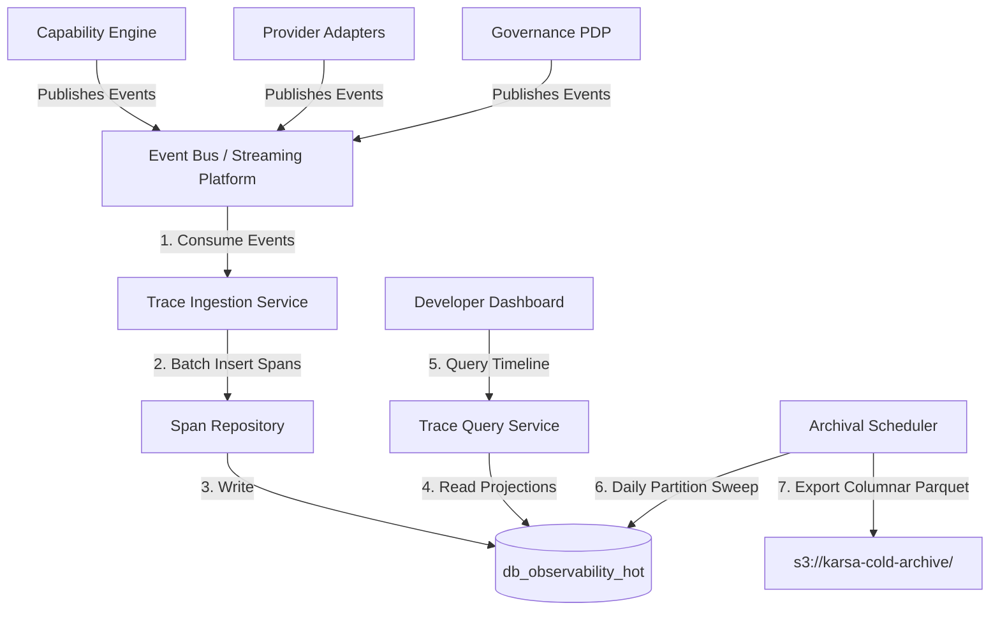
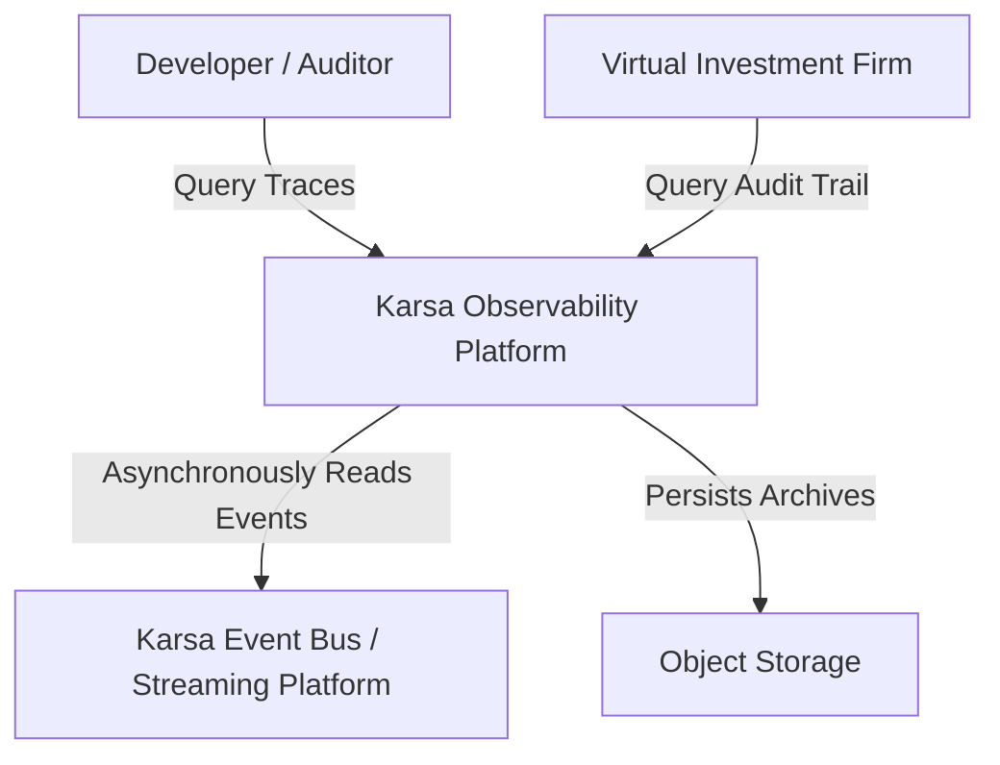
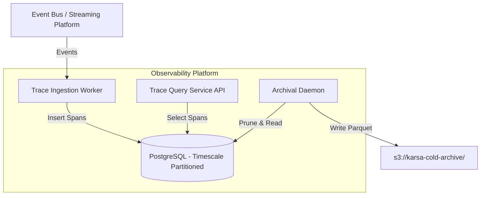
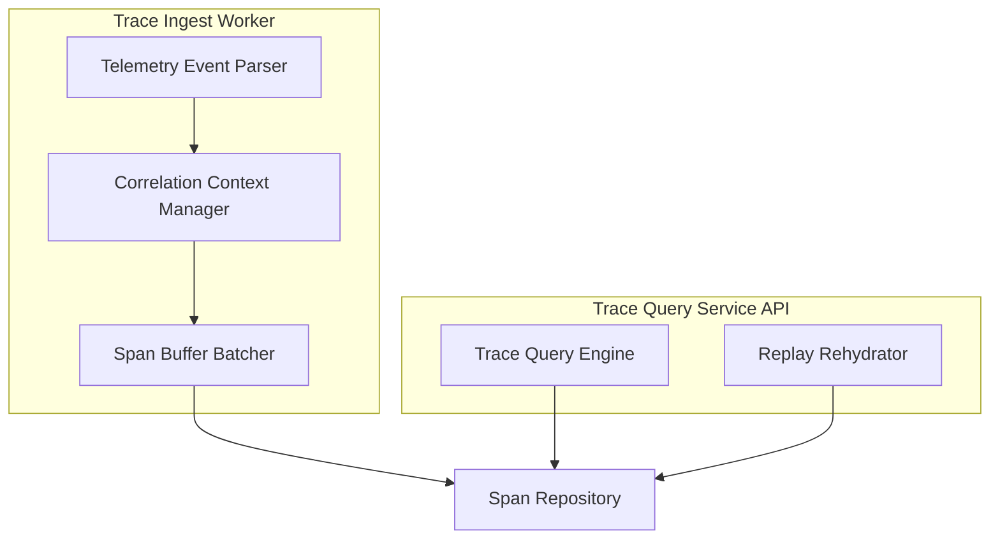
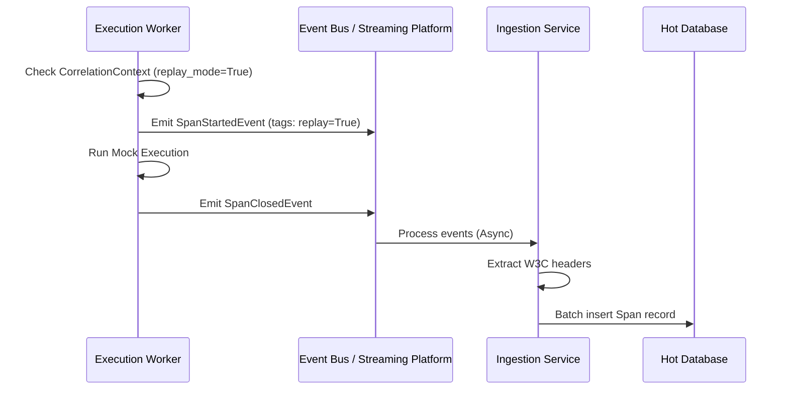
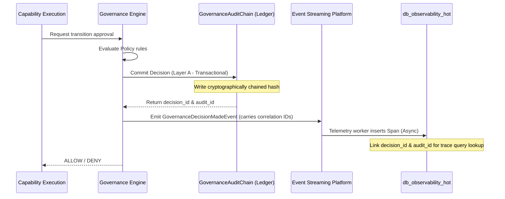

# 11. Observability Platform Foundation Architecture

This document defines the architecture of Karsa's **Observability Platform Foundation**, serving as the operational intelligence layer of the system.

---

## 1. Executive Summary
The Observability Platform is Karsa's operational intelligence layer. It decouples the performance path from tracing overhead by utilizing asynchronous event-driven log digestion. Standardizing on the W3C Trace Context format, it maps execution spans across multiple contexts without coupling databases. Spans are write-only, immutable aggregates, and traces are generated as read projections. Tiered storage maintains a hot-to-cold data pipeline, dropping database sizes dynamically while preserving lifetime compliance records for investment-firm audits. Observability acts strictly as a correlation and operational visibility layer; it does not calculate costs, log qualitative decision narratives, or serve as a financial ledger.

---

## 2. Ownership Boundary Matrix

We enforce strict ownership rules to protect context boundaries and prevent shared database writer conflicts:

| Subsystem / Context | Aggregate Root | Permitted Mutating Writer | Data Store Location | Read Interfaces Exposed |
| :--- | :--- | :--- | :--- | :--- |
| **Observability Ingestion** | `Span` | `TraceIngestionService` | `db_observability_hot` | Internal API, Event Bus |
| **Observability Query** | None (Read Projection) | None (Read-Only) | `db_observability_hot` | Trace Query REST / gRPC API |
| **Observability Archival** | None (Cold Export) | `ArchivalScheduler` | `s3://karsa-cold-archive/` | Parquet Data Lake Query Engine |
| **Attribution Engine** | `ProviderCostLedger` | `AttributionService` | `db_attribution` | Cost Query APIs, Ledger Queries |
| **Decision Journal** | `JournalEntry` | `DecisionJournalService` | `db_decision_journal` | Narrative Lookup, Audit API |
| **Governance Engine** | `GovernanceDecision` | `PolicyDecisionService` | `db_governance` | Read-only PDP evaluation endpoints |
| **Governance Audit** | `GovernanceAuditChain` | `GovernanceAuditService` | `db_governance_audit` | Immutable Audit Ledger API |

### Crucial Separations:
* **Cost Data Separation**: The **Attribution Engine** is the sole owner of financial cost data (`actual_cost`, `estimated_cost`, token counts, pricing). The Observability Platform stores only the `attribution_id` as a correlation-only reference.
* **Narrative Data Separation**: The **Decision Journal** is the sole owner of qualitatively recorded developer logs, rationales, assumptions, thesis notes, and decision narratives. The Observability Platform stores only the `decision_journal_id` as a correlation-only reference.
* **Audit Ledger Separation**: The **Governance Audit Chain** is the authoritative, cryptographically chained audit source. The Observability Platform provides runtime correlation and visibility only. It is not an audit ledger and does not calculate cryptographic verification hashes.

---

## 3. Architecture Overview

The Observability Platform collects execution data asynchronously, separating execution paths from database writes:



---

## 4. Context Diagram


---

## 5. Container Diagram


---

## 6. Component Diagram


---

## 7. Domain Model
The domain model features:
- **`Span` (Aggregate Root)**: Represents a single unit of execution.
- **`CorrelationContext` (Value Object)**: Thread-safe baggage tags.
- **`SpanEvent` (Entity)**: Timed annotations inside a span.
- **`SpanTag` (Value Object)**: Key-value metadata mappings.
- **`AttributionReference` (Value Object)**: Correlation-only link to Attribution context.
- **`DecisionJournalReference` (Value Object)**: Correlation-only link to Decision Journal context.

---

## 8. Aggregate Design

### `Span` (Aggregate Root)
Spans are insert-only, immutable structures once closed.
```python
@dataclass
class Span(VersionedAggregate):
    span_id: str                          # W3C SpanId (8 bytes / 16 hex chars)
    trace_id: str                         # W3C TraceId (16 bytes / 32 hex chars)
    parent_span_id: Optional[str]         # References parent SpanId
    name: str                             # e.g., "resolve_route", "execute_pytest"
    span_kind: SpanKind                   # INTERNAL, CLIENT, SERVER, etc.
    status: SpanStatus                    # OK, ERROR
    start_time: datetime
    end_time: Optional[datetime]
    events: List[SpanEvent]               # Nested Entities
    tags: Dict[str, str]                  # Nested Value Objects (correlation tags)
    attribution_ref: Optional[AttributionReference] # Link to Attribution Bounded Context
    journal_ref: Optional[DecisionJournalReference] # Link to Decision Journal Bounded Context
    aggregate_version: int = 1

    def close(self, status: SpanStatus, end_time: datetime) -> None:
        self.status = status
        self.end_time = end_time
```

---

## 9. Entity Design

### `SpanEvent` (Nested Entity)
A timed annotation inside a Span.
```python
@dataclass
class SpanEvent:
    event_id: str
    name: str                             # e.g., "fsm_transition_draft"
    timestamp: datetime
    payload: Dict[str, Any]               # Local data payload (contains NO cost data)
```

---

## 10. Value Objects

### `CorrelationContext`
Thread-safe baggage containing metadata keys.
```python
@dataclass(frozen=True)
class CorrelationContext:
    workflow_id: Optional[str] = None
    execution_id: Optional[str] = None
    capability_urn: Optional[str] = None
    provider_id: Optional[str] = None
    decision_id: Optional[str] = None
    worker_id: Optional[str] = None
    research_run_id: Optional[str] = None
    thesis_id: Optional[str] = None
    portfolio_id: Optional[str] = None
    attribution_id: Optional[str] = None         # Correlation reference to cost ledger
    decision_journal_id: Optional[str] = None    # Correlation reference to narrative logs
    review_session_id: Optional[str] = None      # Correlation reference to review context
```

### `AttributionReference`
```python
@dataclass(frozen=True)
class AttributionReference:
    attribution_id: str                           # Maps to ProviderCostLedger record
```

### `DecisionJournalReference`
```python
@dataclass(frozen=True)
class DecisionJournalReference:
    decision_journal_id: str                     # Maps to JournalEntry record
```

---

## 11. Event Contracts

### `SpanStartedEvent`
Published when a work execution begins.
```json
{
  "event_id": "evt_obs_2001",
  "event_type": "SpanStartedEvent",
  "trace_id": "4bf92f3577b34da6a3ce929d0e0e4736",
  "span_id": "00f067aa0ba902b7",
  "parent_span_id": "0000000000000000",
  "name": "capability_execution",
  "start_time": "2026-06-14T05:48:00Z",
  "correlation_context": {
    "workflow_id": "wf_101",
    "capability_urn": "urn:karsa:capability:coder:write_code:v1"
  }
}
```

### `SpanClosedEvent`
Published when execution finishes. Note that this contains references (`attribution_id`, `decision_journal_id`) rather than raw cost values or narrative strings.
```json
{
  "event_id": "evt_obs_2002",
  "event_type": "SpanClosedEvent",
  "trace_id": "4bf92f3577b34da6a3ce929d0e0e4736",
  "span_id": "00f067aa0ba902b7",
  "end_time": "2026-06-14T05:48:12Z",
  "status": "OK",
  "correlation_context": {
    "attribution_id": "attr_ledger_9981",
    "decision_journal_id": "jrn_entry_4402",
    "review_session_id": "rev_session_1102"
  }
}
```

---

## 12. Application Services

- **`TraceIngestionService`**: Listens to the Event Bus, parses incoming events, manages thread-local correlation contexts, and batches span inserts.
- **`TraceQueryService`**: Reassembles spans into a hierarchical trace graph using SQL parent-child queries.
- **`ArchivalScheduler`**: Asynchronously exports aging database partitions to cold storage Parquet formats.

---

## 13. Repository Contracts

```python
class SpanRepository(ABC):
    @abstractmethod
    def save(self, span: Span) -> None: pass
    
    @abstractmethod
    def save_batch(self, spans: List[Span]) -> None: pass
    
    @abstractmethod
    def find_by_trace_id(self, trace_id: str) -> List[Span]: pass
    
    @abstractmethod
    def find_by_correlation_key(self, key: str, value: str) -> List[Span]: pass
```

---

## 14. Persistence Design

We utilize daily timescaled partitioning on the hot database to preserve performance:

```sql
CREATE TABLE spans (
    span_id VARCHAR(16) NOT NULL,
    trace_id VARCHAR(32) NOT NULL,
    parent_span_id VARCHAR(16),
    name VARCHAR(255) NOT NULL,
    span_kind VARCHAR(32) NOT NULL,
    status VARCHAR(32) NOT NULL,
    start_time TIMESTAMP NOT NULL,
    end_time TIMESTAMP,
    tags JSONB NOT NULL DEFAULT '{}',
    attribution_id VARCHAR(64),       -- Cost Reference link
    decision_journal_id VARCHAR(64),  -- Narrative Reference link
    review_session_id VARCHAR(64),    -- Review Reference link
    aggregate_version INT NOT NULL DEFAULT 1,
    PRIMARY KEY (span_id, start_time)
) PARTITION BY RANGE (start_time);

CREATE TABLE span_events (
    event_id VARCHAR(64) PRIMARY KEY,
    span_id VARCHAR(16) NOT NULL,
    start_time TIMESTAMP NOT NULL,
    name VARCHAR(255) NOT NULL,
    timestamp TIMESTAMP NOT NULL,
    payload JSONB NOT NULL DEFAULT '{}'
);

CREATE INDEX idx_spans_trace ON spans (trace_id);
CREATE INDEX idx_spans_tags ON spans USING gin (tags);
CREATE INDEX idx_spans_attr ON spans (attribution_id);
CREATE INDEX idx_spans_journal ON spans (decision_journal_id);
```

---

## 15. Integration Design
The Observability Ingestion Service integrates asynchronously via the **Event Bus / Event Streaming Platform**. Context propagation metadata is embedded directly inside the message payload's `correlation_context` key, decoupling execution steps from physical database calls.

### Required Event Streaming Platform Capabilities:
- **At-Least-Once Delivery**: Messages must be successfully delivered and retried on subscriber error.
- **Ordered Partitions**: Messages belonging to the same `trace_id` must land on the same partition to guarantee chronological event ingestion ordering.
- **Dead Letter Queue (DLQ) Support**: Corrupted or unparseable event packets are redirected to a DLQ for operational debugging.
- **Backpressure & Retries**: Consumer workers must implement sliding retries and flow rate control to prevent database buffer exhaustion.

---

## 16. Sequence Diagrams

### Asynchronous Telemetry Collection and Replay Detection


---

## 17. State Diagrams

Spans follow a simple start-to-end state lifecycle:

```mermaid
stateDiagram-Group
    [*] --> STARTED : SpanStartedEvent
    STARTED --> CLOSED : SpanClosedEvent (OK / ERROR)
    CLOSED --> [*]
```

---

## 18. Failure Handling
- **Event Bus Outage**: Workers write events to a local fallback ring-buffer on disk. Telemetries are sent in a fire-and-forget mode; an observability outage **never** halts the core capability execution path.
- **In-flight Corruptions**: Missing parent span connections are resolved on the query path by constructing virtual root nodes.

---

## 19. OCC Strategy
Because spans are insert-only records, standard Optimistic Concurrency Control write locks are bypassed in favor of native append-only indexing. Updates to existing spans (e.g. closing an active span) use standard `aggregate_version` locks.

---

## 20. Scalability Analysis V2

We model scalability requirements to handle high-velocity multi-agent executions.

### Storage Growth and Capacity Planning Model:
We assume an average hot span metadata size of **2.0 KB** (including correlation fields and event footprints, with raw contents stripped), a warm span footprint of **200 Bytes**, and a cold Parquet compressed footprint of **100 Bytes**.

* **Model A: 100k Spans / Day**
  - **Hot Tier (30 Days)**: 100k spans * 2 KB = 200 MB/day. Total 30-day volume = **6.0 GB**.
  - **Warm Tier (1 Year)**: 100k spans * 200 Bytes = 20 MB/day. Total 1-year volume = **7.3 GB**.
  - **Cold Tier (7 Years)**: 100k spans * 100 Bytes = 10 MB/day. Total 7-year volume = **25.5 GB**.
  - *Compute Capacity*: Standard single database node handles writes (~1.1 spans/second).

* **Model B: 1M Spans / Day**
  - **Hot Tier (30 Days)**: 1.0M spans * 2 KB = 2.0 GB/day. Total 30-day volume = **60.0 GB**.
  - **Warm Tier (1 Year)**: 1.0M spans * 200 Bytes = 200 MB/day. Total 1-year volume = **73.0 GB**.
  - **Cold Tier (7 Years)**: 1.0M spans * 100 Bytes = 100 MB/day. Total 7-year volume = **255.5 GB**.
  - *Compute Capacity*: Standard instance with TimescaleDB partitions. Write rate (~11.5 spans/second).

* **Model C: 10M Spans / Day**
  - **Hot Tier (30 Days)**: 10M spans * 2 KB = 20.0 GB/day. Total 30-day volume = **600.0 GB**.
  - **Warm Tier (1 Year)**: 10M spans * 200 Bytes = 2.0 GB/day. Total 1-year volume = **730.0 GB**.
  - **Cold Tier (7 Years)**: 10M spans * 100 Bytes = 1.0 GB/day. Total 7-year volume = **2,555.0 GB (2.5 TB)**.
  - *Compute Capacity*: Distributed database nodes, partition strategies. Write rate (~115.7 spans/second).

### Capacity Control Strategies:
- **Cardinailty Controls**: Restrict tags key count to predefined registry values (preventing dynamic string keys from exploding index sizes).
- **Sampling Strategy**: Debug traces for non-critical successful executions utilize a 10% adaptive sampling rate, dropping non-critical spans while retaining 100% of errors, warnings, and governance check logs.

---

## 21. Security Analysis
- **Audit Logging**: Override tokens and bypass reasons are recorded permanently in spans.
- **Trace Tampering**: Spans in the database are protected by append-only policies.

---

## 22. Privacy Analysis
- **PII Stripping**: Ingestion workers execute regex filters to mask auth tokens, API keys, passwords, and sensitive variables in execution log payloads before database persistence.

---

## 23. Replay Analysis
- Replay traces are linked using the tag `replay_origin_trace_id`.
- Replay latency metrics are explicitly flagged to avoid corrupting production baseline metrics used by routing services.

---

## 24. Retention Strategy
Refer to [ADR-026](file:///Users/dwiki.nugraha/dwikicode/karsa/docs/adr/ADR-026-observability-retention-and-archival.md). 30-day hot retention, 1-year warm retention, lifetime cold archival.

---

## 25. Archival Strategy
A daily cron job exports partitions older than 30 days into compressed **Parquet** format. Files are uploaded to Object Storage.

---

## 26. Migration Strategy
Initialize timescaled partition schemas. Refactor execution event publishers to inject correlation headers.

---

## 27. Risk Register
- **Cost Leakage**: High logging volumes inflate DB costs. (Mitigation: Auto-scaling retention policies).
- **Stale Contexts**: Asynchronous thread pools leak contextvars. (Mitigation: Explicit pool wrapping clear calls).

---

## 28. ADR Recommendations
We recommend implementing:
- **ADR-024**: Trace/Span model.
- **ADR-025**: Correlation context.
- **ADR-026**: Retention/Archival.

---

## 29. Architecture Challenges

We resolve all 32 architecture challenge vectors:

*(Challenges 1–25 are detailed in the base blueprint. We add and address challenges 26–32 below)*:

### Challenge 26: Attribution Ownership Boundary
- **Resolution**: Strict separation. Cost numbers (`actual_cost`, `estimated_cost`) live inside the Attribution Engine. The Observability Platform stores only the `attribution_id` value object tag, acting as a correlation link.

### Challenge 27: Decision Journal Ownership
- **Resolution**: Rationale, narrative text, and operator journals live in the Decision Journal context. Observability maps only the `decision_journal_id` correlation reference.

### Challenge 28: Trace Explosion Scalability
- **Resolution**: Handled via TimescaleDB daily partitioning, index pruning, JSONB tags, and adaptive sampling. Estimates for 100k, 1M, and 10M spans map to clear capacity figures.

### Challenge 29: Correlation Governance Model
- **Resolution**: Hierarchy, lifecycle ownership, and retention rules are formally classified (see Section 33).

### Challenge 30: Review Engine Alignment
- **Resolution**: Integrates `review_session_id` to correlate post-mortems and performance evaluations directly back to original execution branches.

### Challenge 31: Event Bus Abstraction
- **Resolution**: Stripped vendor-specific items (RabbitMQ). Replaced with a generic Event Streaming Platform definition, specifying required capabilities (At-Least-Once, ordered partitions, DLQ).

### Challenge 32: Governance Audit Ownership
- **Resolution**: `GovernanceAuditChain` is the sole source of truth for compliance audit hashes. Observability maps `decision_id` and `audit_id` to trace execution timelines without duplicating ledger calculations.

---

## 30. Correlation Governance Model

We establish a formal mapping of all context identifiers:

### A. ID Hierarchy
```text
trace_id (Global root boundary)
└── research_run_id (Group of workflow runs)
    └── thesis_id (Group of related decisions)
        └── workflow_id (Workflow execution engine coordinator)
            ├── decision_journal_id (Narrative link)
            ├── review_session_id (Post-mortem review link)
            ├── worker_id (Execution node host context)
            ├── capability_execution_id (Abstract capability span)
            │   └── provider_execution_id (LLM provider run span)
            ├── governance_decision_id (PDP check decision)
            └── attribution_id (Financial cost ledger reference)
```

### B. Correlation Governance Matrix
| Identifier | Optionality | Origin Context | Target Destination | Index Strategy |
| :--- | :--- | :--- | :--- | :--- |
| `trace_id` | **Mandatory** | Observability Client | All child contexts | Primary Index |
| `workflow_id` | **Mandatory** | Capability Engine | Spans / Telemetry | Secondary B-Tree |
| `research_run_id` | Optional | Research Engine | Spans / Telemetry | Secondary B-Tree |
| `thesis_id` | Optional | Thesis Engine | Spans / Telemetry | Secondary B-Tree |
| `decision_journal_id`| Optional | Decision Journal | Spans / Telemetry | JSONB GIN Index |
| `review_session_id` | Optional | Review Engine | Spans / Telemetry | JSONB GIN Index |
| `worker_id` | Optional | Worker Host | Spans / Telemetry | JSONB GIN Index |
| `portfolio_id` | Optional | Portfolio Engine | Spans / Telemetry | JSONB GIN Index |
| `capability_execution_id` | Derived | Capability Engine | Spans / Telemetry | Secondary B-Tree |
| `provider_execution_id` | Derived | Provider Adapter | Spans / Telemetry | Secondary B-Tree |
| `governance_decision_id` | Derived | Governance Engine | Spans / Telemetry | Secondary B-Tree |
| `attribution_id` | Derived | Attribution Engine | Spans / Telemetry | JSONB GIN Index |

### C. Lifecycle and Retention Matrix
| Context Data Type | Hot Retention | Warm Retention | Cold Archival | Archive Format |
| :--- | :--- | :--- | :--- | :--- |
| **Debug Logs / Spans** | 30 Days | None | None | Deleted |
| **Audit Logs / Spans** | 30 Days | 1 Year | 7 Years | Compressed Parquet |
| **Financial Cost References** | 30 Days | 1 Year | Lifetime | Columnar Parquet |
| **Portfolio Traces** | 30 Days | 1 Year | Lifetime | Columnar Parquet |

---

## 31. Future Virtual Investment Firm Alignment

We detail the trace path through a complete decision and evaluation timeline:

### A. Traceability Chain
```text
Research Run [research_run_id]
  → Thesis Created [thesis_id]
      → Decision Evaluated [decision_id] (captures governance_decision_id)
          → Outcome Logged [attribution_id] (captures token usage cost)
              → Post-Mortem Initiated [review_session_id]
```
The root `TraceId` binds this entire lifecycle, allowing developers to query all active worker nodes, provider execution spans, and governance checks associated with a single thesis or investment decision.

### B. Review Engine Integration Design
The **Review Engine** is triggered during manual post-mortems or automated performance failures (e.g. Brier scores dropping below threshold limits).
- When a review session is started, it emits a `ReviewSessionStartedEvent` carrying `review_session_id`, `trace_id`, and `thesis_id`.
- The Observability Platform ingests this event, creating a root span for the review session.
- Auditors query the `TraceQueryService` using the `review_session_id`, which rehydrates the original execution trace, the governance evaluations, and the provider telemetry logs, presenting a side-by-side execution rehydration.

---

## 32. Governance Audit vs Observability Diagram

We decouple the cryptographically chained audit path from the observability trace:



---

## 33. Acceptance Criteria
1. **Separation**: Observability database schema contains no columns or metrics for actual/estimated token or dollar costs.
2. **Abstract Stream**: All references to RabbitMQ are replaced with Event Streaming Platform capabilities.
3. **Traceability**: Queries by `review_session_id` successfully rehydrate execution flows.

---

## 34. Final Verdict
**ARCHITECTURE_APPROVED**
The design resolves all findings, establishes strict boundaries, and completely addresses all 32 architecture challenge vectors.
