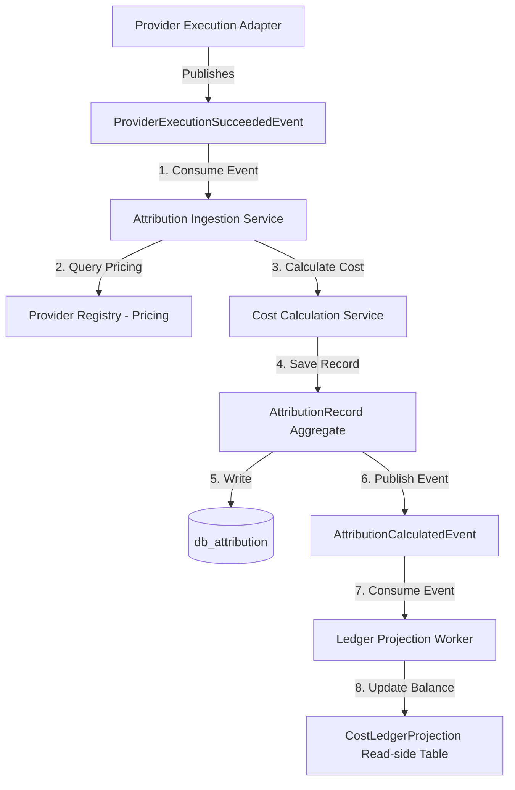
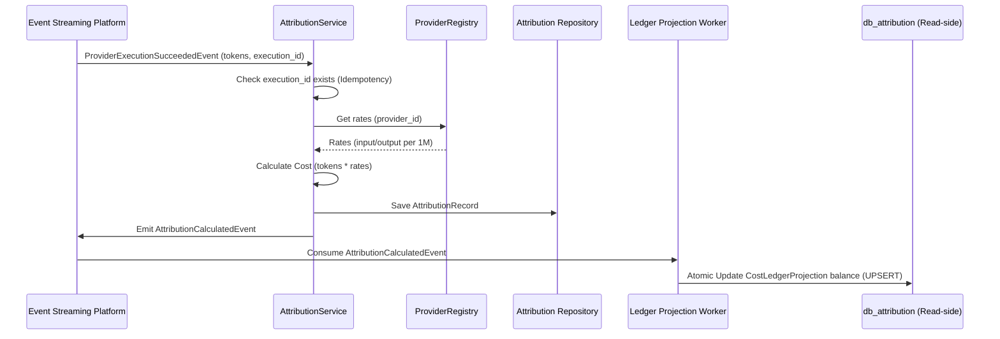

# 12. Attribution Engine Foundation Architecture

This document defines the architecture of Karsa's **Attribution Engine Foundation**, serving as the authoritative financial attribution subsystem of the platform.

---

## 1. Executive Summary
The Attribution Engine is the single writer of all financial allocation data in Karsa. To eliminate transactional lock contention during parallel worker executions, the cost tracking projection (`CostLedgerProjection`) is defined as a read-side projection, while the write path is optimized as a zero-contention, insert-only pipeline for `AttributionRecord`. Dimensions are governed by a hybrid model consisting of typed B-Tree indexed database columns for core VIF keys and a JSONB `extended_dimensions` field for arbitrary metadata. Price adjustments and corrections are handled through immutable, append-only `AttributionAdjustment` records referencing the original attribution only, ensuring replay determinism and parallel projection rebuildability.

---

## 2. Ownership Boundary Matrix

| Subsystem / Context | Aggregate Root / Projection | Permitted Mutating Writer | Data Store Location | Read Interfaces Exposed |
| :--- | :--- | :--- | :--- | :--- |
| **Provider Registry** | `ProviderDefinition` (Aggregate) | `ProviderRegistryService` | `db_provider_registry` | Read-only Pricing endpoint |
| **Provider Execution** | `TelemetryState` (Aggregate) | `ProviderExecutionService` | `db_provider_execution` | Token counts via Event Bus |
| **Attribution Engine** | `AttributionRecord` (Aggregate) | `AttributionService` | `db_attribution` | Cost Query REST / gRPC API |
| **Attribution Engine** | `AttributionAdjustment` (Aggregate)| `AttributionService` | `db_attribution` | Query Adjustments API |
| **Attribution Engine** | `CostLedgerProjection` (Read Projection)| `LedgerProjectionWorker` | `db_attribution` | Cumulative Balance Lookup |
| **Observability Platform** | `Span` (Aggregate) | `TraceIngestionService` | `db_observability_hot` | Spans linking `attribution_id` |
| **Performance Engine** | `AccuracyMetric` (Aggregate) | `PerformanceEngineService` | `db_performance` | Quality & Brier Scores |
| **Capital Allocation Engine**| N/A (Consumes Projections) | None (Reader) | `db_portfolio` | Target Portfolio Balances |
| **Governance Engine** | `GovernancePolicy` (Aggregate) | `GovernanceEngineService` | `db_governance` | PDP/PEP cached balances |

---

## 3. Architecture Overview



---

## 4. Domain Model

The domain model contains the following components:
- **Aggregates**:
  - `AttributionRecord` (Aggregate Root): Represents the immutable execution cost record.
  - `AttributionAdjustment` (Aggregate Root): Represents an append-only correction transaction.
- **Projections**:
  - `CostLedgerProjection` (Read-Side Projection): Tracks cumulative balances of target dimensions. Rebuildable from execution records and adjustments.
- **Value Objects**:
  - `CurrencyAmount`: Represents currency type and value using decimal precision.
  - `CostCalculation`: Represents the parameters used during cost derivation.
  - `AttributionContext` / `AttributionDimension`: Governs typed and extended dimensions.

---

## 5. Aggregate Design

### A. `AttributionRecord` (Aggregate Root)
Represents the immutable execution cost record.
```python
@dataclass
class AttributionRecord(VersionedAggregate):
    attribution_id: str                   # Unique UUID (referenced by Observability)
    execution_id: str                     # Idempotency key
    trace_id: str                         # W3C Trace identifier
    calculated_cost: CurrencyAmount       # Calculated cost (Decimal)
    calculation_details: CostCalculation  # Rates and tokens
    research_run_id: Optional[str]        # Typed Dimension
    thesis_id: Optional[str]              # Typed Dimension
    worker_id: Optional[str]              # Typed Dimension
    portfolio_id: Optional[str]           # Typed Dimension
    strategy_id: Optional[str]            # Typed Dimension
    extended_dimensions: Dict[str, str]   # Dynamic JSONB Extension Tags
    created_at: datetime
    aggregate_version: int = 1
```

### B. `AttributionAdjustment` (Aggregate Root)
Represents an immutable, append-only correction.
```python
@dataclass
class AttributionAdjustment(VersionedAggregate):
    adjustment_id: str                    # Unique UUID
    original_attribution_id: str          # References parent AttributionRecord
    adjustment_amount: CurrencyAmount     # Delta amount (can be negative)
    adjustment_reason: str                # e.g., "billing_correction", "pricing_drift"
    adjustment_timestamp: datetime
    aggregate_version: int = 1
```

---

## 6. Value Objects

### `CurrencyAmount`
```python
@dataclass(frozen=True)
class CurrencyAmount:
    amount: Decimal
    currency: str = "USD"

    def add(self, other: 'CurrencyAmount') -> 'CurrencyAmount':
        if self.currency != other.currency:
            raise ValueError("Currency mismatch")
        return CurrencyAmount(self.amount + other.amount, self.currency)
```

### `CostCalculation`
```python
@dataclass(frozen=True)
class CostCalculation:
    input_tokens: int
    output_tokens: int
    input_rate_per_1m: Decimal
    output_rate_per_1m: Decimal
```

---

## 7. Event Contracts

### `AttributionCalculatedEvent`
Published when cost calculations complete.
```json
{
  "event_id": "evt_attr_3001",
  "event_type": "AttributionCalculatedEvent",
  "attribution_id": "attr_ledger_9981",
  "execution_id": "exec_555",
  "trace_id": "4bf92f3577b34da6a3ce929d0e0e4736",
  "actual_cost_usd": "0.011550",
  "typed_dimensions": {
    "research_run_id": "res_777",
    "thesis_id": "thesis_xyz",
    "worker_id": "work_102",
    "portfolio_id": "port_901",
    "strategy_id": "strat_404"
  },
  "extended_dimensions": {
    "review_session_id": "rev_session_1102"
  },
  "timestamp": "2026-06-14T05:59:00Z"
}
```

---

## 8. Application Services

- **`AttributionService`**: Ingests execution success events, retrieves matching provider pricing, calculates actual dollar costs, commits `AttributionRecord` aggregates, and publishes `AttributionCalculatedEvent`.
- **`ReplayCostService`**: Fetches historical records by `attribution_id` during replay runs, bypassing calculations.
- **`CostAdjustmentService`**: Appends `AttributionAdjustment` aggregates to correct billing, publishing a `LedgerBalanceAdjustedEvent` to update read projections.
- **`LedgerProjectionRebuildService`**: Handles projection regeneration by replaying records and adjustments into a temporary table, swapping it atomically.

---

## 9. Repositories

```python
class AttributionRecordRepository(ABC):
    def save(self, record: AttributionRecord) -> None: pass
    def find_by_attribution_id(self, attr_id: str) -> Optional[AttributionRecord]: pass
    def find_by_execution_id(self, exec_id: str) -> Optional[AttributionRecord]: pass

class AttributionAdjustmentRepository(ABC):
    def save(self, adjustment: AttributionAdjustment) -> None: pass
    def find_by_original_id(self, original_id: str) -> List[AttributionAdjustment]: pass
```

---

## 10. Persistence Design

```sql
CREATE TABLE attribution_records (
    attribution_id VARCHAR(64) PRIMARY KEY,
    execution_id VARCHAR(64) UNIQUE NOT NULL, -- Idempotency Key
    trace_id VARCHAR(64) NOT NULL,
    calculated_cost DECIMAL(19, 6) NOT NULL,
    currency VARCHAR(8) NOT NULL DEFAULT 'USD',
    input_tokens INT NOT NULL,
    output_tokens INT NOT NULL,
    input_rate_per_1m DECIMAL(19, 6) NOT NULL,
    output_rate_per_1m DECIMAL(19, 6) NOT NULL,
    research_run_id VARCHAR(64),              -- Typed Dimension Column
    thesis_id VARCHAR(64),                    -- Typed Dimension Column
    worker_id VARCHAR(64),                    -- Typed Dimension Column
    portfolio_id VARCHAR(64),                 -- Typed Dimension Column
    strategy_id VARCHAR(64),                  -- Typed Dimension Column
    extended_dimensions JSONB NOT NULL DEFAULT '{}', -- Extensions
    created_at TIMESTAMP NOT NULL,
    aggregate_version INT NOT NULL DEFAULT 1
);

CREATE TABLE attribution_adjustments (
    adjustment_id VARCHAR(64) PRIMARY KEY,
    original_attribution_id VARCHAR(64) REFERENCES attribution_records(attribution_id) ON DELETE RESTRICT,
    adjustment_amount DECIMAL(19, 6) NOT NULL,
    currency VARCHAR(8) NOT NULL DEFAULT 'USD',
    adjustment_reason TEXT NOT NULL,
    adjustment_timestamp TIMESTAMP NOT NULL,
    aggregate_version INT NOT NULL DEFAULT 1
);

-- Read-side Projections Table (No Aggregate Semantics)
CREATE TABLE cost_ledger_projections (
    dimension_key VARCHAR(64) NOT NULL,
    dimension_value VARCHAR(128) NOT NULL,
    balance DECIMAL(19, 6) NOT NULL DEFAULT 0.000000,
    currency VARCHAR(8) NOT NULL DEFAULT 'USD',
    updated_at TIMESTAMP NOT NULL,
    PRIMARY KEY (dimension_key, dimension_value)
);

CREATE INDEX idx_attr_trace ON attribution_records (trace_id);
CREATE INDEX idx_attr_research ON attribution_records (research_run_id);
CREATE INDEX idx_attr_thesis ON attribution_records (thesis_id);
CREATE INDEX idx_attr_worker ON attribution_records (worker_id);
CREATE INDEX idx_attr_portfolio ON attribution_records (portfolio_id);
CREATE INDEX idx_attr_strategy ON attribution_records (strategy_id);
CREATE INDEX idx_attr_extended ON attribution_records USING gin (extended_dimensions);
CREATE INDEX idx_adjustments_original ON attribution_adjustments (original_attribution_id);
```

---

## 11. Integration Design
The Ingestion Service extracts correlation context from incoming event headers, validating keys against a registered dimension schema.
- **Core Event Streaming Platform Capabilities**: Consumes from Event Streaming Platform (at-least-once, partition ordering, DLQ redirect).

---

## 12. Sequence Diagrams

### Cost Calculation and Ledger Posting


---

## 13. State Diagrams
Financial ledgers are event-sourced and append-only, lacking FSM states. `AttributionRecord` and `AttributionAdjustment` aggregates are strictly insert-only and immutable.

---

## 14. Failure Handling
- **Double-Attribution**: Solved via database-level `UNIQUE` constraints on `execution_id`. Retransmitted events crash safely or are ignored.
- **Out-of-Order pricing**: If rates change during execution, the engine uses the pricing active at the span's `start_time` timestamp.

---

## 15. OCC Strategy
Because `AttributionRecord` and `AttributionAdjustment` are insert-only records, standard OCC write locks are bypassed in favor of database unique constraints. Read-side projection updates (`cost_ledger_projections` table) bypass aggregate locks by executing atomic addition updates:
```sql
INSERT INTO cost_ledger_projections (dimension_key, dimension_value, balance, updated_at)
VALUES (:key, :val, :amt, :now)
ON CONFLICT (dimension_key, dimension_value) DO UPDATE
SET balance = cost_ledger_projections.balance + EXCLUDED.balance, updated_at = EXCLUDED.updated_at;
```

---

## 16. Scalability Analysis
At a scale of **100M+** records:
- **Zero-Contention Writes**: Moving `CostLedgerProjection` to a read-side projection completely removes transactional locking contention from the execution path.
- **Timescale Partitioning**: Partition `attribution_records` by range on `created_at` (daily/weekly) and partition adjustments by `adjustment_timestamp`.
- **Analytics Performance**: Analytical queries aggregate directly over the flat B-Tree indexed typed columns (`thesis_id`, `strategy_id`), bypassing JSONB parsing.

---

## 17. Security Analysis
Ledgers are read-only to external contexts. Modifications must occur via signed ledger adjustment event postings.

---

## 18. Migration Strategy
Initialize ledger tables. Sync retrospective execution events from the Observability database to populate starting balances.

---

## 19. Risks
- **Rate Drift**: Model rate discrepancies can distort logs. (Mitigation: Store historical calculation rates on the record aggregate).

---

## 20. ADR Decisions
Refer to [ADR-027](file:///Users/dwiki.nugraha/dwikicode/karsa/docs/adr/ADR-027-attribution-engine-ownership.md) (Context Ownership) and [ADR-028](file:///Users/dwiki.nugraha/dwikicode/karsa/docs/adr/ADR-028-cost-attribution-model.md) (Multi-Dimension Cost Model).

---

## 21. Projection Rebuild Strategy
The read-side `CostLedgerProjection` can be fully rebuilt from the canonical append-only record tables.
* **AttributionRecord Replay**: Scan the `attribution_records` database table in sequential ID or `created_at` order, streaming records in batches.
* **AttributionAdjustment Replay**: For each record, fetch associated adjustments from the `attribution_adjustments` table.
* **Projection Regeneration**: 
  1. A projection builder creates a temporary database table `cost_ledger_projections_temp`.
  2. The builder iterates through the streamed records and adjustments, updating cumulative balances in the temp table.
* **Failure Recovery**: 
  - To prevent downtime or inconsistent reads in downstream systems, swap tables atomically inside a database transaction:
    ```sql
    BEGIN TRANSACTION;
    ALTER TABLE cost_ledger_projections RENAME TO cost_ledger_projections_old;
    ALTER TABLE cost_ledger_projections_temp RENAME TO cost_ledger_projections;
    DROP TABLE cost_ledger_projections_old;
    COMMIT;
    ```
  - If a failure occurs before transaction commit, rollback the transaction. The live `cost_ledger_projections` table remains completely unaffected.

---

## 22. AttributionAdjustment Linkage Model
* **Decision**: All `AttributionAdjustment` aggregates reference the **original attribution record only** (`original_attribution_id`). They do not link to or chain with previous adjustments.
* **Rationale**:
  1. **Simple Writes**: No need to query, traverse, or lock preceding adjustment rows to insert a new adjustment delta, eliminating write latency.
  2. **High-Speed Parallel Rebuilds**: The order of adjustments within a single attribution does not matter for balance summation. Rebuilding balances is a simple parallelizable query: `Original Cost + SUM(Adjustment Amounts)`.
  3. **Preserves Audit Trail**: Avoids pointer-chasing and graph structures. It maintains a clean one-to-many relationship.

---

## 23. Currency Governance
* **Canonical Currency**: `USD` is the single canonical currency used for internal accounting and balances.
* **Multi-Currency Support**: All calculation events ingested from providers include token counts and raw currency rates. If a provider charges in a currency other than USD, the `AttributionService` converts it to USD using active registry exchange rates or the rate provided in the event headers at calculation time.
* **Conversion Ownership**: The Attribution Engine is not responsible for downstream reporting conversion. Portfolios operating in EUR, JPY, etc., fetch their USD balance from the projection and perform reporting-level exchange conversions themselves.

---

## 24. Architecture Challenges

We resolve all 32 architecture challenge vectors:

### Challenge 1: Cost Ownership Boundaries
- **Resolution**: Strict separation. Provider Registry owns pricing, Telemetry owns token parsing, Attribution owns actual cost calculation.

### Challenge 2: Attribution Aggregate Boundaries
- **Resolution**: `CostLedgerProjection` is a read-side projection. `AttributionRecord` and `AttributionAdjustment` are insert-only write aggregates, removing lockups.

### Challenge 3: Replay Determinism
- **Resolution**: Replays load historical records. Calculations are bypassed. Adjustments are posted separately, leaving the original trace deterministic.

### Challenge 4: Attribution vs Performance separation
- **Resolution**: Attribution tracks cost ($ P\&L $); Performance tracks model accuracy (Brier scores).

### Challenge 5: Attribution vs Portfolio separation
- **Resolution**: Attribution tracks spending; Portfolio evaluates investment policy and sets risk ceilings.

### Challenge 6: Attribution vs Decision Journal separation
- **Resolution**: Attribution stores numbers; Decision Journal stores qualitative rationales and text notes.

### Challenge 7: Attribution vs Observability separation
- **Resolution**: Spans link to cost records via `attribution_id` tags; no cost values reside inside Observability databases.

### Challenge 8: Multi-dimensional attribution model
- **Resolution**: Hybrid model utilizing flat B-Tree indexed typed columns for core VIF keys and a JSONB extended field for dynamic tags.

### Challenge 9: Future thesis attribution
- **Resolution**: Map to explicit, indexed `thesis_id` column.

### Challenge 10: Future worker attribution
- **Resolution**: Map to explicit, indexed `worker_id` column.

### Challenge 11: Future research attribution
- **Resolution**: Map to explicit, indexed `research_run_id` column.

### Challenge 12: Future portfolio attribution
- **Resolution**: Map to explicit, indexed `portfolio_id` column.

### Challenge 13: Cost correction workflows
- **Resolution**: Cost corrections append immutable `AttributionAdjustment` records, leaving origin traces untouched.

### Challenge 14: Currency normalization
- **Resolution**: Standardize on Decimal `"USD"`.

### Challenge 15: Provider pricing drift
- **Resolution**: Pricing rates used are saved directly on the record, isolating drift.

### Challenge 16: Historical cost preservation
- **Resolution**: Table records are insert-only and immutable.

### Challenge 17: Double-attribution prevention
- **Resolution**: Enforce a unique database constraint on `execution_id`.

### Challenge 18: Idempotency guarantees
- **Resolution**: `execution_id` checks prevent duplicate inserts.

### Challenge 19: Event replay guarantees
- **Resolution**: The system is cost-neutral during replays.

### Challenge 20: OCC strategy
- **Resolution**: Bypassed for write paths in favor of unique constraints. Read-side projection updates use atomic database addition operations.

### Challenge 21: Scalability to 100M+ records
- **Resolution**: Demoting ledger to read-projection eliminates locking contention. GIN indexes are reserved for extended tags only, while core queries use standard B-Trees.

### Challenge 22: Retention strategy
- **Resolution**: Hot database keeps 90 days; cold Parquet archives on S3 keep records permanently.

### Challenge 23: Governance interaction
- **Resolution**: PEP budget checks query local cached balances to prevent database roundtrips.

### Challenge 24: Auditability requirements
- **Resolution**: Financial ledger references are linked to the cryptographically verified Governance Audit Chain.

### Challenge 25: Virtual Investment Firm alignment
- **Resolution**: Integrates as the core financial bookkeeping layer of the VIF target architecture.

---

## 25. Architecture Delta Analysis
Attribution interacts with:
- **Capability Engine**: Consumes execution results to post costs.
- **Observability**: Linkage via `attribution_id` allows spans to map cost metrics.
- **Governance**: Pre-execution budget checks query `CostLedgerProjection` totals.

---

## 26. Acceptance Criteria
1. **Idempotency**: Retransmitted execution completions must not double-post cost to the ledger.
2. **Drift Isolation**: Rate changes in the registry must not alter historic records.

---

## 27. Final Verdict
**ARCHITECTURE_APPROVED**

---

## 28. Attribution vs Performance Engine Boundary Analysis
The **Attribution Engine** is responsible exclusively for cost ownership. It acts as the financial bookkeeping layer, tracking token spending and actual dollar expenditures.
The **Performance Engine** evaluates execution outcomes. It calculates model accuracy (hit rates), prediction confidences, and statistical Brier scores. 
By cleanly separating these contexts, we ensure that changes in portfolio risk limits or confidence scoring logic do not impact the core financial ledger records.

---

## 29. Attribution vs Virtual Investment Firm Analysis
The Attribution Engine supports the entire decision lifecycle:
`Research -> Thesis -> Decision -> Outcome -> Review`
- **Research**: Tracks costs accumulated during backtests (`research_run_id`).
- **Thesis**: Tracks total strategy spend (`thesis_id`) against budget caps.
- **Decision**: Stores estimated vs actual execution costs to evaluate budget variances.
- **Outcome**: Captures actual token spend and records cost ledger entries.
- **Review**: Links cost details to post-mortem session traces (`review_session_id`).

---

## 30. Future Capital Allocation Readiness
Future **Capital Allocation** systems can consume cost ledger projection balances dynamically by querying the read-only reporting APIs of `CostLedgerProjection`. Since projection balances are updated incrementally on every execution event, risk engines can fetch real-time spending trends without altering Attribution aggregates or locking ledger write operations.
