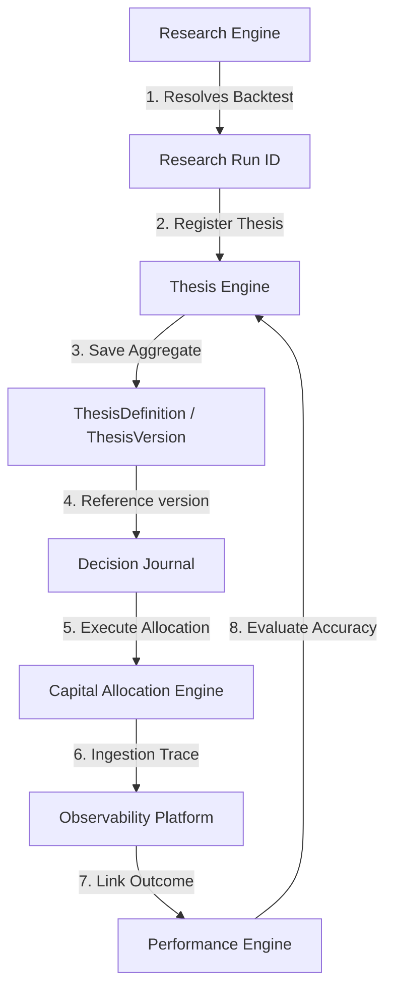
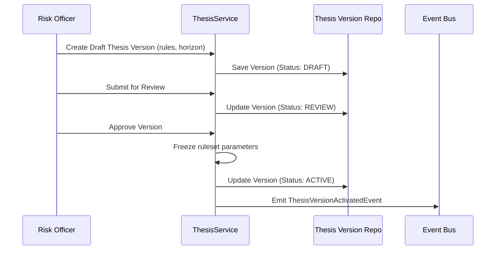

# 13. Thesis Engine Foundation Architecture

This document defines the architecture of Karsa's **Thesis Engine Foundation**, serving as the authoritative investment hypothesis registry and lifecycle subsystem of the platform.

---

## 1. Executive Summary
The Thesis Engine is the single writer and canonical source of truth for all investment hypotheses, horizons, risks, and invalidation rules in Karsa. It acts as the conceptual bridge across the decision lifecycle: `Research -> Thesis -> Decision -> Outcome -> Review`. To ensure complete audit integrity and replay determinism, thesis versions are strictly immutable after activation. Changes result in new version aggregates under a shared family identity. Invalidation and archival transitions are managed via an append-only Finite State Machine (FSM) to prevent historical data mutation.

---

## 2. Ownership Boundary Matrix

| Subsystem / Context | Aggregate Root / Projection | Permitted Mutating Writer | Data Store Location | Read Interfaces Exposed |
| :--- | :--- | :--- | :--- | :--- |
| **Thesis Engine** | `ThesisDefinition` (Aggregate) | `ThesisService` | `db_thesis` | Active Thesis Lookup API |
| **Thesis Engine** | `ThesisVersion` (Aggregate) | `ThesisService` | `db_thesis` | Versioned Rule Check API |
| **Research Engine** | `ResearchRun` (Aggregate) | `ResearchService` | `db_research` | Backtest Parameters Lookup |
| **Observability Platform** | `TelemetryState` (Aggregate) | `ProviderExecutionService` | `db_provider_execution` | Token Counts (Links via ID) |
| **Attribution Engine** | `AttributionRecord` (Aggregate)| `AttributionService` | `db_attribution` | Cost Ledger Balances |
| **Decision Journal** | `DecisionRecord` (Aggregate) | `DecisionJournalService` | `db_decision` | Narrative Decision Log |
| **Performance Engine** | `ThesisPerformance` (Projection)| `PerformanceService` | `db_performance` | Calibrated Brier Scores |
| **Review Engine** | `ReviewSession` (Aggregate) | `ReviewService` | `db_review` | Post-Mortem Audit Trail |
| **Capital Allocation** | `CapitalAllocation` (Aggregate) | `CapitalAllocationService` | `db_portfolio` | Target Risk / Capital Limits |

---

## 3. Architecture Overview



---

## 4. Domain Model
The Thesis Engine domain consists of the following components:
- **Aggregate Roots**:
  - `ThesisDefinition`: Tracks the overall identity metadata and ownership of a thesis thread.
  - `ThesisVersion`: Captures the frozen mathematical and logic rules representing the hypothesis.
- **Entities**:
  - `ThesisExecutionBinding`: Represents the concrete deployment of a `ThesisVersion` to a target portfolio and strategy.
  - `ThesisHypothesis`: An individual logical hypothesis statement.
  - `ThesisEvidence`: Anchored empirical evidence backing the version.
  - `ThesisAssumption`: Fundamental market assumptions under which the thesis operates.
  - `ThesisRisk`: Recognized risks associated with this thesis.
  - `ThesisOutcomeReference`: Reference link to an execution outcome.
- **Value Objects**:
  - `ThesisIdentifier`: Holds composite IDs (`thesis_family_id`, `thesis_id`, `thesis_version_id`).
  - `InvalidationCriteria`: The rules defining when the thesis is deemed breached (e.g. Drawdown > 15%, Hit Rate < 45%).
  - `TimeHorizon`: Start and end parameters defining active validity boundaries.
  - `ConfidenceScore`: Standardized probability and calibration scores (Decimal 0.0 to 1.0).
  - `ThesisStatus`: Lifecycle state value.

---

## 5. Aggregate Design

### A. `ThesisDefinition` (Aggregate Root)
Manages overall administrative properties and ownership of a thesis lineage.
```python
@dataclass
class ThesisDefinition(VersionedAggregate):
    thesis_id: str                      # Unique UUID
    thesis_family_id: str               # Links evolutions together
    name: str                           # Short display name
    description: str                    # Narrative summary
    owner_id: str                       # User or team identifier
    created_at: datetime
    aggregate_version: int = 1
```

### B. `ThesisVersion` (Aggregate Root)
Contains the mathematical rules and constraints. Strictly immutable once status is `ACTIVE` or `CANARY`.
Lineage is explicitly tracked via `parent_thesis_version_id`.
```python
@dataclass
class ThesisVersion(VersionedAggregate):
    thesis_version_id: str              # Unique UUID
    thesis_id: str                      # Links to parent ThesisDefinition
    parent_thesis_version_id: Optional[str] # Explicit version lineage tree
    research_run_id: str                # Backtest validation reference
    time_horizon: TimeHorizon           # Active horizon boundaries
    confidence: ConfidenceScore         # Initial confidence score
    invalidation_rules: List[InvalidationCriteria] # Invalidation limits
    hypotheses: List[ThesisHypothesis]  # Core logical items
    assumptions: List[ThesisAssumption] # Market assumptions
    risks: List[ThesisRisk]             # Defined risk items
    status: ThesisStatus                # FSM state: DRAFT, REVIEW, ACTIVE, etc.
    created_at: datetime
    activated_at: Optional[datetime] = None
    triggering_outcome_id: Optional[str] = None # Traces invalidating execution
    aggregate_version: int = 1
```

### C. `ThesisExecutionBinding` (Entity)
Bridges a `ThesisVersion` to concrete execution bindings in a specific portfolio/strategy.
```python
@dataclass
class ThesisExecutionBinding:
    binding_id: str                     # Unique UUID
    thesis_version_id: str              # Links to target ThesisVersion
    portfolio_id: str                   # Target allocation portfolio
    strategy_id: str                    # Target trading strategy
    allocation_limit: Decimal           # Assigned capital ceiling
    status: str                         # e.g., "ACTIVE", "SUSPENDED"
    updated_at: datetime
```

---

## 6. Value Objects

### `ThesisIdentifier`
```python
@dataclass(frozen=True)
class ThesisIdentifier:
    thesis_family_id: str
    thesis_id: str
    thesis_version_id: str
```

### `InvalidationCriteria`
```python
@dataclass(frozen=True)
class InvalidationCriteria:
    metric_name: str                    # e.g., "max_drawdown", "consecutive_losses"
    operator: str                       # e.g., ">", "<", "=="
    threshold_value: Decimal
    evaluation_window_days: int
```

### `TimeHorizon`
```python
@dataclass(frozen=True)
class TimeHorizon:
    start_date: datetime
    end_date: datetime
```

### `ConfidenceScore`
```python
@dataclass(frozen=True)
class ConfidenceScore:
    probability: Decimal                # Value between 0.00 and 1.00
    calibration_method: str             # e.g., "brier_aligned", "expert_estimate"
```

### `ThesisStatus`
```python
class ThesisStatus(Enum):
    DRAFT = "DRAFT"
    REVIEW = "REVIEW"
    ACTIVE = "ACTIVE"
    CANARY = "CANARY"
    INVALIDATED = "INVALIDATED"
    FAILED = "FAILED"
    ARCHIVED = "ARCHIVED"
```

---

## 7. Event Contracts

### `ThesisVersionActivatedEvent`
Emitted when a draft version passes audit checks and is frozen for execution.
```json
{
  "event_id": "evt_thesis_1001",
  "event_type": "ThesisVersionActivatedEvent",
  "thesis_id": "th_trend_8800",
  "thesis_version_id": "th_ver_8801_v1",
  "thesis_family_id": "fam_trend_momentum",
  "research_run_id": "res_backtest_44",
  "time_horizon": {
    "start_date": "2026-06-14T07:36:29Z",
    "end_date": "2026-12-31T23:59:59Z"
  },
  "timestamp": "2026-06-14T07:36:30Z"
}
```

### `ThesisVersionInvalidatedEvent`
Emitted when a metric breaches the invalidation threshold.
```json
{
  "event_id": "evt_thesis_1002",
  "event_type": "ThesisVersionInvalidatedEvent",
  "thesis_id": "th_trend_8800",
  "thesis_version_id": "th_ver_8801_v1",
  "breaching_metric": "max_drawdown",
  "breaching_value": "16.4500",
  "triggering_outcome_id": "out_trade_999",
  "timestamp": "2026-06-14T07:40:00Z"
}
```

### `ThesisVersionFailedEvent`
Emitted when a post-mortem review session determines a version contains a structurally flawed hypothesis.
```json
{
  "event_id": "evt_thesis_1003",
  "event_type": "ThesisVersionFailedEvent",
  "thesis_id": "th_trend_8800",
  "thesis_version_id": "th_ver_8801_v1",
  "review_session_id": "rev_session_4004",
  "failure_reason": "regime_drift_structural_decline",
  "timestamp": "2026-06-14T07:45:00Z"
}
```

---

## 8. Application Services
- **`ThesisService`**: Orchestrates aggregate creation, transition submittals, and approvals.
- **`ThesisReplayService`**: Resolves historical lookup requests to retrieve the exact ruleset linked to a `thesis_version_id`.
- **`ThesisInvalidationService`**: Processes incoming performance stream messages, matches metrics against `InvalidationCriteria`, and triggers state transitions.

---

## 9. Repositories

```python
class ThesisDefinitionRepository(ABC):
    @abstractmethod
    def save(self, definition: ThesisDefinition) -> None: pass
    @abstractmethod
    def find_by_id(self, thesis_id: str) -> Optional[ThesisDefinition]: pass

class ThesisVersionRepository(ABC):
    @abstractmethod
    def save(self, version: ThesisVersion) -> None: pass
    @abstractmethod
    def find_by_version_id(self, version_id: str) -> Optional[ThesisVersion]: pass
    @abstractmethod
    def list_by_thesis_id(self, thesis_id: str) -> List[ThesisVersion]: pass
```

---

## 10. Persistence Design

```sql
CREATE TABLE thesis_definitions (
    thesis_id VARCHAR(64) PRIMARY KEY,
    thesis_family_id VARCHAR(64) NOT NULL,
    name VARCHAR(128) NOT NULL,
    description TEXT NOT NULL,
    owner_id VARCHAR(64) NOT NULL,
    created_at TIMESTAMP NOT NULL,
    aggregate_version INT NOT NULL DEFAULT 1
);

CREATE TABLE thesis_versions (
    thesis_version_id VARCHAR(64) PRIMARY KEY,
    thesis_id VARCHAR(64) NOT NULL REFERENCES thesis_definitions(thesis_id),
    parent_thesis_version_id VARCHAR(64) REFERENCES thesis_versions(thesis_version_id),
    research_run_id VARCHAR(64) NOT NULL,
    start_date TIMESTAMP NOT NULL,
    end_date TIMESTAMP NOT NULL,
    confidence_probability DECIMAL(5, 4) NOT NULL,
    calibration_method VARCHAR(64) NOT NULL,
    status VARCHAR(32) NOT NULL,
    created_at TIMESTAMP NOT NULL,
    activated_at TIMESTAMP,
    triggering_outcome_id VARCHAR(64),
    aggregate_version INT NOT NULL DEFAULT 1
);

CREATE TABLE thesis_execution_bindings (
    binding_id VARCHAR(64) PRIMARY KEY,
    thesis_version_id VARCHAR(64) NOT NULL REFERENCES thesis_versions(thesis_version_id),
    portfolio_id VARCHAR(64) NOT NULL,
    strategy_id VARCHAR(64) NOT NULL,
    allocation_limit DECIMAL(19, 6) NOT NULL,
    status VARCHAR(32) NOT NULL,
    updated_at TIMESTAMP NOT NULL
);

CREATE TABLE thesis_invalidation_rules (
    rule_id SERIAL PRIMARY KEY,
    thesis_version_id VARCHAR(64) NOT NULL REFERENCES thesis_versions(thesis_version_id),
    metric_name VARCHAR(64) NOT NULL,
    operator VARCHAR(8) NOT NULL,
    threshold_value DECIMAL(19, 6) NOT NULL,
    evaluation_window_days INT NOT NULL
);

CREATE INDEX idx_thesis_family ON thesis_definitions (thesis_family_id);
CREATE INDEX idx_version_thesis ON thesis_versions (thesis_id);
CREATE INDEX idx_version_status ON thesis_versions (status);
CREATE INDEX idx_binding_version ON thesis_execution_bindings (thesis_version_id);
```

---

## 11. Integration Design

- **Research Engine Integration**:
  - *Ownership*: Research owns parameter simulations.
  - *Writer*: Research writes `ResearchRun`.
  - *Reader*: Thesis reads `research_run_id` for configuration parameters.
  - *Replay*: Linkage remains frozen; backtest data cannot change.
- **Performance Engine Integration**:
  - *Ownership*: Performance Engine owns statistics scoring.
  - *Writer*: Performance Engine writes Brier and accuracy scores.
  - *Reader*: Thesis Engine reads active scores asynchronously via the `ThesisPerformanceProjection`.
  - *Replay*: Performance scores map to the decision snapshot timestamp.
- **Decision Journal Integration**:
  - *Ownership*: Decision Journal owns narrative logs.
  - *Writer*: Journal writes text.
  - *Reader*: Journal reads active version constraints.
  - *Replay*: Retains immutable mapping to `thesis_version_id`.
- **Capital Allocation Integration**:
  - *Ownership*: Allocation Engine owns risk limits.
  - *Writer*: Allocation Engine sets ceilings.
  - *Reader*: Allocation Engine reads active thesis state.
  - *Replay*: Retransmitted logs map back to historical version rules.

---

## 12. Sequence Diagrams

### Thesis Registration and Approval Workflow


---

## 13. State Diagrams
Refer to FSM definitions in [ADR-030](file:///Users/dwiki.nugraha/dwikicode/karsa/docs/adr/ADR-030-thesis-lifecycle-and-versioning.md). State transitions are governed strictly via VersionedAggregate increments.

---

## 14. Failure Handling
- **Double Invalidation Event Ingestion**: Solved via idempotency locks on the event processing layer. Once a version transitions to `INVALIDATED` or `ARCHIVED`, incoming invalidation events for that specific version are safely ignored.
- **Out of Order Approvals**: Prevented using Optimistic Concurrency Control (OCC) version tokens at database layer level.

---

## 15. OCC Strategy
Optimistic Concurrency Control (OCC) is enforced using version check increments on the `aggregate_version` column of `thesis_versions` and `thesis_definitions` tables:
```sql
UPDATE thesis_versions 
SET status = :new_status, aggregate_version = aggregate_version + 1
WHERE thesis_version_id = :ver_id AND aggregate_version = :expected_ver;
```
If rowcount matches 0, a concurrency violation is raised, triggering transaction rollback.

---

## 16. Scalability Analysis
At a scale of 10M+ versions:
- **Read Cache**: ACTIVE thesis definitions are cached in Redis to prevent repeated DB scans during high-frequency routing checks.
- **Flat Index Filters**: Analytical queries scan using flat B-Tree indexes on `thesis_id` and `status` columns, avoiding nested subqueries.

---

## 17. Security Analysis
Only authorized Risk Officer accounts are permitted to write to transitions changing status to `ACTIVE` or `ARCHIVED`. Automated model checkers can transition versions to `INVALIDATED`.

---

## 18. Migration Strategy
Initialize the Postgres tables. Map existing legacy string-based thesis tags in the database to new `thesis_definitions` records using a baseline migration script.

---

## 19. Risks
- **Over-Invalidation**: Volatile markets might trigger false invalidations.
  - *Mitigation*: Support flexible `evaluation_window_days` parameter configurations to smooth out transient price spikes.

---

## 20. ADR Decisions
Refer to [ADR-029: Bounded Context Boundaries](file:///Users/dwiki.nugraha/dwikicode/karsa/docs/adr/ADR-029-thesis-engine-ownership.md) and [ADR-030: State Machine FSM](file:///Users/dwiki.nugraha/dwikicode/karsa/docs/adr/ADR-030-thesis-lifecycle-and-versioning.md).

---

## 21. Architecture Challenges

We address the 12 required challenges from the review process:

### Challenge 1: Thesis vs Research Ownership
- **Resolution**: Research owns the raw parameter optimizations and backtest artifacts. Thesis Engine owns the structured investment hypothesis and active constraints. Linkage is read-only via `research_run_id`.

### Challenge 2: Thesis vs Decision Journal Ownership
- **Resolution**: Decision Journal owns narrative logs; Thesis Engine owns mathematical boundary definitions. No markdown description fields exist inside the version; the journal maps to the version key.

### Challenge 3: Versioning Model
- **Resolution**: Standardized on immutable versions. Revising a thesis generates a new `thesis_version_id`, preventing historical drift.

### Challenge 4: Replay Determinism
- **Resolution**: Replays lookup criteria by matching the execution trace's recorded `thesis_version_id`, guaranteeing consistency even if the version was subsequently invalidated or archived.

### Challenge 5: Invalidation Semantics
- **Resolution**: Invalidation is a permanent state transition of a specific version, recorded alongside the breaching outcome reference, ensuring trace readability.

### Challenge 6: Multi-Version Coexistence
- **Resolution**: Different versions under the same family can run concurrently in the system. The platform routes traffic by specifying unique `thesis_version_id` parameters.

### Challenge 7: Performance Attribution Ownership
- **Resolution**: Performance Engine computes scoring logs; Thesis Engine defines raw rules. This decouples statistical calculations from model states.

### Challenge 8: Review Ownership
- **Resolution**: Review Engine conducts post-mortems; it references thesis rules but cannot modify them.

### Challenge 9: Capital Allocation Ownership
- **Resolution**: Capital Allocation sets policy limits. It consumes active thesis status to restrict limits, separating risk execution from hypothesis definition.

### Challenge 10: Scalability Assumptions
- **Resolution**: Database queries rely on indexed flat columns. Caching limits DB overhead.

### Challenge 11: OCC Assumptions
- **Resolution**: State updates utilize standard version increment constraints.

### Challenge 12: Historical Preservation
- **Resolution**: Soft deletes are banned. All draft, active, invalidated, and archived versions are retained permanently.

---

## 22. Architecture Delta Analysis
The Thesis Engine introduces the foundational link completing Karsa's VIF target cycle:
- **Attribution** links costs to `thesis_id`.
- **Governance** queries `thesis_version_id` rules to confirm execution compliance.
- **Observability** trace spans carry version correlation tags.

---

## 23. Acceptance Criteria
1. **Immutability**: Edits to ACTIVE versions must raise exceptions.
2. **Replayability**: Replaying cost or performance data for an invalidated thesis version must yield identical constraints to those present at execution time.

---

## 24. Final Verdict
**ARCHITECTURE_APPROVED**
