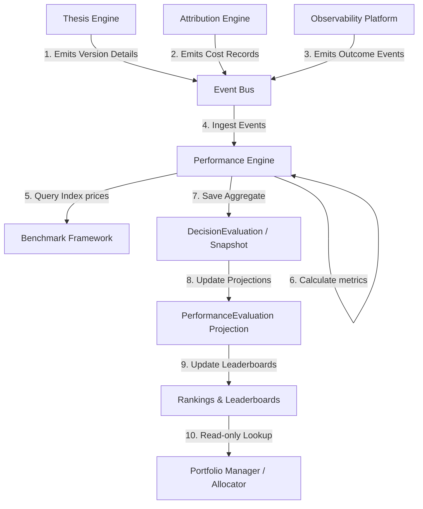
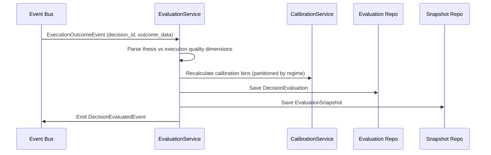

# 14. Performance Engine Foundation Architecture

This document defines the architecture of Karsa's **Performance Engine Foundation**, serving as the authoritative performance measurement and confidence calibration subsystem of the platform.

---

## 1. Executive Summary
The Performance Engine is the single writer and canonical source of truth for all quantitative performance metrics, rankings, and confidence calibration tables in Karsa. It evaluates the outcomes of Decisions, Thesis Versions, Workers, Strategies, Providers, and Portfolios, without executing trades or managing capital. 

The core aggregate root is the **`DecisionEvaluation`**, representing the primary unit of learning in Karsa. `DecisionEvaluation` is strictly immutable once finalized. Subject-level metrics (`PerformanceEvaluation`) are read-side projections dynamically compiled from underlying `DecisionEvaluation` records.

---

## 2. Ownership Boundary Matrix

| Subsystem / Context | Aggregate Root / Projection | Permitted Mutating Writer | Data Store Location | Read Interfaces Exposed |
| :--- | :--- | :--- | :--- | :--- |
| **Performance Engine** | `DecisionEvaluation` (Aggregate) | `EvaluationService` | `db_performance` | Decision Performance Scores |
| **Performance Engine** | `EvaluationSnapshot` (Aggregate) | `EvaluationService` | `db_performance` | Immutable Historical Scores |
| **Performance Engine** | `PerformanceEvaluation` (Projection) | `RankingProjectionWorker` | `db_performance` | Cumulative Subject Scores |
| **Performance Engine** | `ThesisPerformanceProjection` (Read Side) | `RankingProjectionWorker` | `db_performance` | Thesis Leaderboard |
| **Performance Engine** | `WorkerPerformanceProjection` (Read Side) | `RankingProjectionWorker` | `db_performance` | Worker Leaderboard |
| **Performance Engine** | `StrategyPerformanceProjection` (Read Side) | `RankingProjectionWorker` | `db_performance` | Strategy Leaderboard |
| **Thesis Engine** | `ThesisVersion` (Aggregate) | `ThesisService` | `db_thesis` | Invalidation Criteria Limits |
| **Attribution Engine** | `AttributionRecord` (Aggregate)| `AttributionService` | `db_attribution` | Cost Ledger Balances |
| **Decision Journal** | `DecisionRecord` (Aggregate) | `DecisionJournalService` | `db_decision` | Narrative Decision logs |
| **Capital Allocation** | `CapitalAllocation` (Aggregate) | `CapitalAllocationService` | `db_portfolio` | Target Capital Limits |

---

## 3. Architecture Overview



---

## 4. Domain Model
The Performance Engine domain consists of the following components:
- **Aggregate Roots**:
  - `DecisionEvaluation`: Core aggregate root mapping a single decision to its realized outcome metrics.
  - `EvaluationSnapshot`: Frozen, immutable historic snapshot of an evaluation at a specific timestamp.
- **Entities**:
  - `BenchmarkComparison`: Represents comparative performance against an index.
  - `CalibrationMeasurement`: Represents confidence calibration bin values.
  - `EvaluationDimension`: Categorization tags mapping evaluations to operational domains.
- **Value Objects**:
  - `EvaluationScore`: Holds decimal values mapping individual scores.
  - `EvaluationPeriod`: Start and end timestamps of the evaluated window.
  - `EvaluationTarget`: Identifies target types ("DECISION", "THESIS_VERSION", "WORKER", "STRATEGY", "PROVIDER", "PORTFOLIO").
  - `ConfidenceCalibration`: Bins mapping raw predictions to actual outcome probabilities.
  - `BenchmarkResult`: Excess return and comparative drawdowns values.
  - `ThesisQualityMetric`: Brier score and threshold validation status.
  - `ExecutionQualityMetric`: Slippage, fill rates, and provider token usage.
  - `AllocationQualityMetric`: Sharpe ratio, drawdowns, and excess returns.
- **Read Models / Projections**:
  - `PerformanceEvaluation`: Subject-level cumulative metric scorecard.
  - `ThesisPerformanceProjection`: Read-side leaderboard for active theses.
  - `WorkerPerformanceProjection`: Read-side leaderboard for active workers.
  - `StrategyPerformanceProjection`: Read-side leaderboard for active strategies.
  - `ThesisExecutionBindingPerformanceProjection`: Read-side leaderboard for active allocations.

---

## 5. Aggregate Design

### A. `DecisionEvaluation` (Aggregate Root)
Core unit of learning in Karsa. Created upon outcome resolution and frozen.
```python
@dataclass
class DecisionEvaluation(VersionedAggregate):
    evaluation_id: str                  # Unique UUID
    decision_id: str                    # Links to Decision Journal record
    target: EvaluationTarget            # Worker, Thesis Version, or Strategy
    period: EvaluationPeriod            # Execution window
    thesis_metrics: ThesisQualityMetric # Isolated thesis performance
    execution_metrics: ExecutionQualityMetric # Isolated execution performance
    allocation_metrics: AllocationQualityMetric # Isolated capital sizing performance
    benchmarks: List[BenchmarkComparison] # Benchmark comparison data
    regime_id: Optional[str]            # Market regime dimension
    created_at: datetime
    aggregate_version: int = 1
```

### B. `EvaluationSnapshot` (Aggregate Root)
Immutable snapshot preserved permanently for audit trail and replay validation.
```python
@dataclass
class EvaluationSnapshot(VersionedAggregate):
    snapshot_id: str                    # Unique UUID
    evaluation_id: str                  # Parent decision evaluation ID
    target: EvaluationTarget            # Target context details
    period: EvaluationPeriod            # Snapshotted window
    serialized_metrics: str             # JSON representation of frozen metrics
    created_at: datetime                # Snapshot timestamp
    aggregate_version: int = 1
```

---

## 6. Value Objects

### `EvaluationTarget`
```python
@dataclass(frozen=True)
class EvaluationTarget:
    target_type: str                    # e.g., "WORKER", "THESIS_VERSION", "BINDING"
    target_id: str                      # Unique context reference
```

### `EvaluationPeriod`
```python
@dataclass(frozen=True)
class EvaluationPeriod:
    start_time: datetime
    end_time: datetime
```

### `ThesisQualityMetric`
```python
@dataclass(frozen=True)
class ThesisQualityMetric:
    brier_score: Decimal
    is_invalidated: bool
    parameter_deviation: Decimal
```

### `ExecutionQualityMetric`
```python
@dataclass(frozen=True)
class ExecutionQualityMetric:
    slippage_bps: Decimal
    fill_latency_ms: int
    token_count: int
```

### `AllocationQualityMetric`
```python
@dataclass(frozen=True)
class AllocationQualityMetric:
    sharpe_ratio: Decimal
    drawdown_pct: Decimal
    excess_return_bps: Decimal
```

---

## 7. Event Contracts

### `DecisionEvaluatedEvent`
Emitted when a decision outcome is evaluated.
```json
{
  "event_id": "evt_perf_2001",
  "event_type": "DecisionEvaluatedEvent",
  "evaluation_id": "eval_dec_9901",
  "decision_id": "dec_trade_4400",
  "target": {
    "target_type": "THESIS_VERSION",
    "target_id": "th_ver_8801_v1"
  },
  "thesis_metrics": {
    "brier_score": "0.0450",
    "is_invalidated": false
  },
  "timestamp": "2026-06-14T07:42:23Z"
}
```

---

## 8. Application Services
- **`EvaluationService`**: Ingests `ExecutionOutcome` events and creates `DecisionEvaluation` records.
- **`CalibrationService`**: Computes confidence calibration bins partitioned by `regime_id` and `thesis_version_id`.
- **`RebuildEvaluationService`**: Recomputes projections by scanning `DecisionEvaluation` aggregates.

---

## 9. Repositories

```python
class DecisionEvaluationRepository(ABC):
    @abstractmethod
    def save(self, evaluation: DecisionEvaluation) -> None: pass
    @abstractmethod
    def find_by_decision(self, decision_id: str) -> Optional[DecisionEvaluation]: pass

class EvaluationSnapshotRepository(ABC):
    @abstractmethod
    def save(self, snapshot: EvaluationSnapshot) -> None: pass
    @abstractmethod
    def find_by_id(self, snapshot_id: str) -> Optional[EvaluationSnapshot]: pass
```

---

## 10. Persistence Design

```sql
CREATE TABLE decision_evaluations (
    evaluation_id VARCHAR(64) PRIMARY KEY,
    decision_id VARCHAR(64) UNIQUE NOT NULL,
    target_type VARCHAR(32) NOT NULL,
    target_id VARCHAR(64) NOT NULL,
    regime_id VARCHAR(64),
    start_time TIMESTAMP NOT NULL,
    created_at TIMESTAMP NOT NULL,
    thesis_brier_score DECIMAL(5, 4) NOT NULL,
    thesis_is_invalidated BOOLEAN NOT NULL,
    execution_slippage_bps DECIMAL(10, 2) NOT NULL,
    execution_latency_ms INT NOT NULL,
    allocation_sharpe DECIMAL(6, 3) NOT NULL,
    allocation_drawdown_pct DECIMAL(5, 2) NOT NULL,
    aggregate_version INT NOT NULL DEFAULT 1
);

CREATE TABLE evaluation_snapshots (
    snapshot_id VARCHAR(64) PRIMARY KEY,
    evaluation_id VARCHAR(64) NOT NULL,
    target_type VARCHAR(32) NOT NULL,
    target_id VARCHAR(64) NOT NULL,
    serialized_metrics JSONB NOT NULL,
    created_at TIMESTAMP NOT NULL,
    aggregate_version INT NOT NULL DEFAULT 1
);

CREATE INDEX idx_eval_decision ON decision_evaluations (decision_id);
CREATE INDEX idx_eval_target ON decision_evaluations (target_type, target_id);
```

---

## 11. Integration Design

- **Attribution Engine Integration**:
  - *Writer*: Attribution Engine.
  - *Reader*: Performance reads cost records.
- **Thesis Engine Integration**:
  - *Writer*: Performance updates leaderboards.
  - *Reader*: Thesis checks `ThesisExecutionBindingPerformanceProjection` for status limits.
- **Review Engine Integration**:
  - *Writer*: Review Engine writes `ReviewSession` logs in `db_review`, referencing the target `evaluation_id`.
  - *Reader*: Performance has no write hooks; Review is a pure reader of evaluations.

---

## 12. Sequence Diagrams

### Performance Ingestion and Calibration Workflow


---

## 13. State Diagrams
`DecisionEvaluation` aggregates are insert-only and immutable once outcomes resolve.

---

## 14. Failure Handling
Managed via range filters on the event handler. Missing outcomes trigger out-of-band reconciliation tasks.

---

## 15. OCC Strategy
Enforced on the `aggregate_version` column of the `decision_evaluations` table.

---

## 16. Scalability Analysis
At a scale of 100M+ evaluations:
- **Leaderboard Read Path**: Leaders and rankings query flat B-Tree indexed projections (`ThesisPerformanceProjection`, etc.).
- **Range Partitioning**: Snapshot tables are partitioned monthly by range on `created_at`.

---

## 17. Security Analysis
Only authorized Performance application services write to the DB.

---

## 18. Migration Strategy
Initialize tables. Run `RebuildEvaluationService` to seed historical decision metrics.

---

## 19. Risks
- **Cold-Start**: Handled via standard default calibration prior curves.

---

## 20. ADR Decisions
Refer to [ADR-031](file:///Users/dwiki.nugraha/dwikicode/karsa/docs/adr/ADR-031-performance-engine-ownership.md) and [ADR-032](file:///Users/dwiki.nugraha/dwikicode/karsa/docs/adr/ADR-032-performance-evaluation-model.md).

---

## 21. Architecture Challenges

We address the 8 required challenges from the review process:

### Challenge 1: Calibration Ownership
- **Resolution**: Performance Engine owns the calibration data structures. Downstream risk checks query its projections.

### Challenge 2: Evaluation Ownership
- **Resolution**: Single Writer rule is preserved. Performance owns all accuracy scoring.

### Challenge 3: Benchmark Ownership
- **Resolution**: Performance Engine captures index return snapshots during evaluation, preventing price drift.

### Challenge 4: Projection Ownership
- **Resolution**: Projections reside inside read-side tables owned and updated by the Performance Engine.

### Challenge 5: Replay Determinism
- **Resolution**: Replays match decision timestamp against the immutable `EvaluationSnapshot` records.

### Challenge 6: Ranking Scalability
- **Resolution**: Leaderboard rankings utilize pre-aggregated projections, eliminating write locks.

### Challenge 7: Historical Reproducibility
- **Resolution**: Snapshots remain frozen while active projections are recomputable.

### Challenge 8: Future Portfolio Compatibility
- **Resolution**: The generic target schema can evaluate any portfolio identifiers.

---

## 22. Architecture Delta Analysis
The Performance Engine delta integrates:
- **Thesis**: Evaluates thesis invalidation metrics.
- **Observability**: Reads traces to map outcomes.

---

## 23. Acceptance Criteria
1. **Decision Traceability**: Every evaluation maps back to a unique `decision_id`.
2. **Replay Integrity**: Snapshots remain unmodified before and after recomputation runs.

---

## 24. Final Verdict
**ARCHITECTURE_FROZEN**
