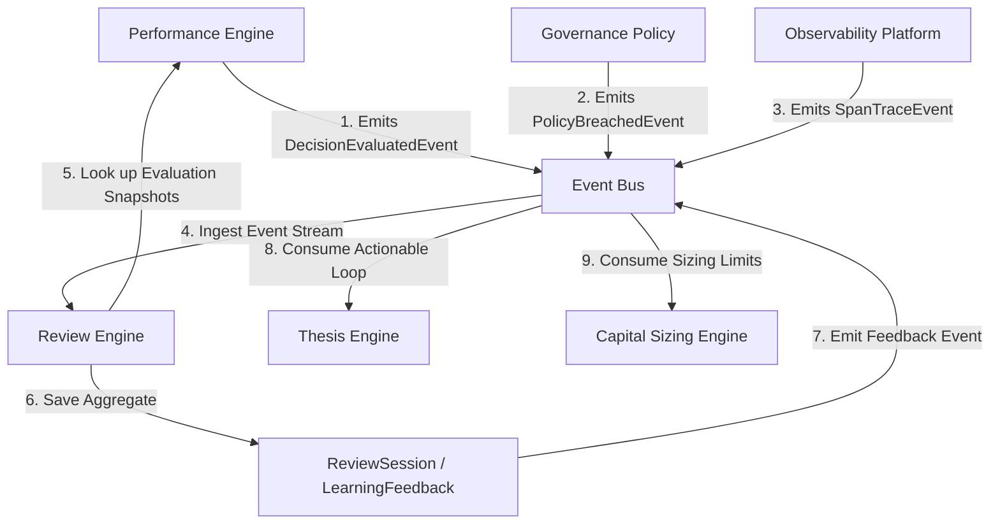
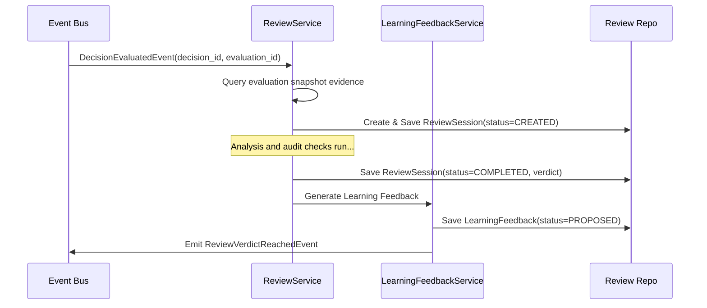
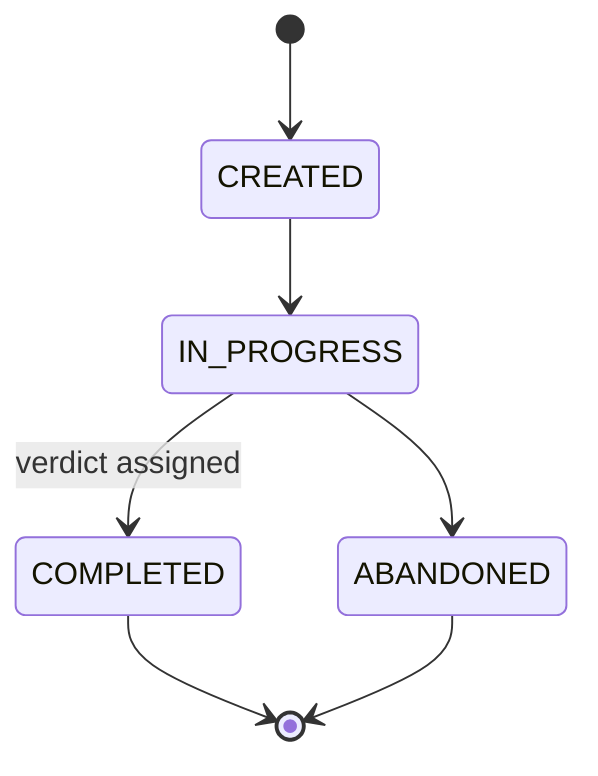

# 15. Review Engine Foundation Architecture

This document defines the architecture of Karsa's **Review Engine Foundation**, serving as the authoritative qualitative learning and post-mortem auditing subsystem of the platform.

---

## 1. Executive Summary
The Review Engine is the single writer and canonical source of truth for qualitative post-mortem review sessions, findings, verdicts, and learning feedback in Karsa. It consumes quantitative evaluations (`DecisionEvaluation`), outcomes (`ExecutionOutcome`), observability traces (`TraceSpan`), cost records, and governance decisions, and outputs structured, actionable feedback loop items without executing trades or mutating execution databases.

The core aggregate roots are the **`ReviewSession`** and **`LearningFeedback`**. `ReviewSession` represents the active audit process, containing snapshots of evidence and findings. `LearningFeedback` is a decoupled aggregate tracking proposed adjustments to thesis parameters, worker status, or risk limits.

---

## 2. Ownership Boundary Matrix

| Subsystem / Context | Aggregate Root / Projection | Permitted Mutating Writer | Data Store Location | Read Interfaces Exposed |
| :--- | :--- | :--- | :--- | :--- |
| **Review Engine** | `ReviewSession` (Aggregate) | `ReviewService` | `db_review` | Session findings and verdicts |
| **Review Engine** | `LearningFeedback` (Aggregate) | `ReviewService` | `db_review` | Actionable recommendations |
| **Performance Engine** | `DecisionEvaluation` (Aggregate) | `EvaluationService` | `db_performance` | Quantitative performance scores |
| **Thesis Engine** | `ThesisVersion` (Aggregate) | `ThesisService` | `db_thesis` | Active investment parameters |
| **Attribution Engine** | `AttributionRecord` (Aggregate) | `AttributionService` | `db_attribution` | Cost ledger balances |
| **Governance Engine** | `GovernancePolicy` (Aggregate) | `GovernanceService` | `db_governance` | Real-time policy settings |

---

## 3. Architecture Overview



---

## 4. Domain Model
The Review Engine domain consists of the following components:
- **Aggregate Roots**:
  - `ReviewSession`: Manages the lifecycle of a post-mortem review process for a target.
  - `LearningFeedback`: Tracks the lifecycle of actionable system suggestions.
- **Value Objects**:
  - `ReviewTarget`: Details the context being audited (Worker, Thesis, Portfolio).
  - `ReviewFinding`: Captures a specific qualitative issue identified.
  - `ReviewEvidence`: Preserves evidence snapshots (telemetry segments, evaluations).
  - `ReviewVerdict`: Holds the formal final outcome rating.

---

## 5. Aggregate Design

### A. `ReviewSession` (Aggregate Root)
```python
@dataclass
class ReviewSession(VersionedAggregate):
    session_id: str                      # Unique UUID
    target: ReviewTarget                 # Worker, Thesis Version, or Strategy
    findings: List[ReviewFinding]        # Qualitative issues discovered
    evidence: List[ReviewEvidence]       # Snapshotted source data
    verdict: Optional[ReviewVerdict]     # Final verdict details
    status: str                          # CREATED, IN_PROGRESS, COMPLETED, ABANDONED
    regime_id: Optional[str]             # Regime during audit
    created_at: datetime
    updated_at: datetime
    aggregate_version: int = 1
```

### B. `LearningFeedback` (Aggregate Root)
```python
@dataclass
class LearningFeedback(VersionedAggregate):
    feedback_id: str                     # Unique UUID
    session_id: str                      # Parent review session UUID
    target: ReviewTarget                 # Targeted component
    suggested_action: str                # e.g., DEPRECATE_THESIS, REDUCE_LIMIT
    parameters: Dict[str, Any]           # Suggested settings updates
    status: str                          # PROPOSED, ACCEPTED, REJECTED, APPLIED
    created_at: datetime
    applied_at: Optional[datetime]
    aggregate_version: int = 1
```

---

## 6. Value Objects

### `ReviewTarget`
```python
@dataclass(frozen=True)
class ReviewTarget:
    target_type: str                     # e.g., "THESIS_VERSION", "WORKER"
    target_id: str                       # Unique reference key
```

### `ReviewFinding`
```python
@dataclass(frozen=True)
class ReviewFinding:
    finding_id: str
    finding_type: str                    # e.g., "LOGICAL_BIAS", "API_TIMEOUT"
    severity: str                        # INFO, WARNING, CRITICAL
    description: str
    created_at: datetime
```

### `ReviewEvidence`
```python
@dataclass(frozen=True)
class ReviewEvidence:
    evidence_id: str
    source_type: str                     # e.g., "EVALUATION", "TRACE"
    source_reference_id: str             # UUID of target evaluation or trace
    evidence_payload: str                # Serialized JSON metrics/log snapshots
```

### `ReviewVerdict`
```python
@dataclass(frozen=True)
class ReviewVerdict:
    verdict_id: str
    outcome_rating: str                  # e.g., "PASS", "FAIL_RETRY", "FAIL_DEPRECATE"
    justification: str
    created_at: datetime
```

---

## 7. Event Contracts

### `ReviewVerdictReachedEvent`
```json
{
  "event_id": "evt_rev_5001",
  "event_type": "ReviewVerdictReachedEvent",
  "session_id": "sess_rev_9901",
  "target": {
    "target_type": "WORKER",
    "target_id": "worker_llm_04"
  },
  "verdict": {
    "verdict_id": "vrd_7701",
    "outcome_rating": "FAIL_RETRY",
    "justification": "Worker reached token ceiling limit repeatedly."
  },
  "timestamp": "2026-06-14T08:12:00Z",
  "event_version": 1
}
```

### `LearningFeedbackAppliedEvent`
```json
{
  "event_id": "evt_rev_6001",
  "event_type": "LearningFeedbackAppliedEvent",
  "feedback_id": "feed_8801",
  "target": {
    "target_type": "THESIS_VERSION",
    "target_id": "th_ver_v1_02"
  },
  "suggested_action": "DEPRECATE_THESIS",
  "parameters": {
    "invalidation_reason": "Style drift detected in LLM responses."
  },
  "applied_at": "2026-06-14T08:15:30Z",
  "event_version": 1
}
```

---

## 8. Application Services
- **`ReviewService`**: Initiates review sessions, registers findings/evidence, and records verdicts.
- **`LearningFeedbackService`**: Generates and manages learning recommendations, publishing event envelopes to the event bus.

---

## 9. Repositories
```python
class ReviewSessionRepository(ABC):
    @abstractmethod
    def save(self, session: ReviewSession) -> None: pass
    @abstractmethod
    def find_by_id(self, session_id: str) -> Optional[ReviewSession]: pass

class LearningFeedbackRepository(ABC):
    @abstractmethod
    def save(self, feedback: LearningFeedback) -> None: pass
    @abstractmethod
    def find_by_id(self, feedback_id: str) -> Optional[LearningFeedback]: pass
```

---

## 10. Persistence Design
```sql
CREATE TABLE review_sessions (
    session_id VARCHAR(64) PRIMARY KEY,
    target_type VARCHAR(32) NOT NULL,
    target_id VARCHAR(64) NOT NULL,
    status VARCHAR(32) NOT NULL,
    regime_id VARCHAR(64),
    findings JSONB NOT NULL,
    evidence JSONB NOT NULL,
    verdict_rating VARCHAR(32),
    verdict_justification TEXT,
    created_at TIMESTAMP NOT NULL,
    updated_at TIMESTAMP NOT NULL,
    aggregate_version INT NOT NULL DEFAULT 1
);

CREATE TABLE learning_feedback (
    feedback_id VARCHAR(64) PRIMARY KEY,
    session_id VARCHAR(64) REFERENCES review_sessions(session_id),
    target_type VARCHAR(32) NOT NULL,
    target_id VARCHAR(64) NOT NULL,
    suggested_action VARCHAR(64) NOT NULL,
    parameters JSONB NOT NULL,
    status VARCHAR(32) NOT NULL,
    created_at TIMESTAMP NOT NULL,
    applied_at TIMESTAMP,
    aggregate_version INT NOT NULL DEFAULT 1
);
```

---

## 11. Integration Design
- **Thesis Integration**: Thesis Engine consumes `LearningFeedbackAppliedEvent` to execute thesis depreciation or param updates.
- **Performance Integration**: Review Engine reads evaluations to populate `ReviewEvidence`. No write calls are made into the performance context.
- **Governance Integration**: Governance Engine reads Review Session states and verdicts to identify compliance drift.

---

## 12. Sequence Diagrams


---

## 13. State Diagrams


---

## 14. Failure Handling
Review tasks run out-of-band. On timeout or trace lookup failure, the session is marked `IN_PROGRESS` with finding status `EVIDENCE_PENDING`.

---

## 15. OCC Strategy
Standard optimistic concurrency controls are executed on the `aggregate_version` column of both relational tables.

---

## 16. Scalability Analysis
- **Lightweight Evidence**: Telemetry and logs are saved as lightweight serialized JSON blobs, capping database row sizes.
- **Index Partitioning**: Queries index by `(target_type, target_id)`.

---

## 17. Security Analysis
Write access to `review_sessions` is restricted to the execution context representing `ReviewService`.

---

## 18. Migration Strategy
Initialize the tables. Review historical evaluations to trigger retrospective review sessions for all prior invalidation anomalies.

---

## 19. Risks
- **Telemetry Cleanup**: Handled by snapshotting exact trace payloads into `ReviewEvidence` during session execution, preventing data loss.

---

## 20. ADR Decisions
Refer to [ADR-033](file:///Users/dwiki.nugraha/dwikicode/karsa/docs/adr/ADR-033-review-engine-ownership.md) and [ADR-034](file:///Users/dwiki.nugraha/dwikicode/karsa/docs/adr/ADR-034-qualitative-review-and-learning-feedback-model.md).

---

## 21. Architecture Challenges

### Challenge 1: Ownership Boundaries
- **Resolution**: Review Engine writes ONLY post-mortem and feedback registry aggregates. No direct mutations on trading data.

### Challenge 2: Review Authority
- **Resolution**: Verdicts are authoritative judgments that risk blocks and allocations read. Thesis or worker states can not override verdicts.

### Challenge 3: Learning Feedback Ownership
- **Resolution**: Decoupled aggregate root lifecycle guarantees other engines can consume feedback at different rates.

### Challenge 4: Review Replayability
- **Resolution**: Snapshotting evidence preserves the trace state permanently for retrospective review runs.

### Challenge 5: Review Scalability
- **Resolution**: Relational tables partition the evidence payloads to support 100M+ runs without lock cascades.

### Challenge 6: Review Lifecycle
- **Resolution**: Immutable transitions from `CREATED` to `COMPLETED` or `ABANDONED`.

### Challenge 7: Review Evidence Storage
- **Resolution**: Lightweight references are supplemented by localized snapshots during analysis.

### Challenge 8: Review vs Governance Boundaries
- **Resolution**: Governance is active and synchronous. Review is qualitative, retrospective, and asynchronous.

### Challenge 9: Review vs Thesis Boundaries
- **Resolution**: Thesis owns structural versions. Review proposes changes to be applied.

### Challenge 10: Review vs Performance Boundaries
- **Resolution**: Performance calculates scorecards. Review interprets failures.

---

## 22. Architecture Delta Analysis
The Review Engine delta integrates:
- **Performance**: Consumes scorecard outcomes to trigger reviews.
- **Thesis**: Outputs deprecation directives.

---

## 23. Acceptance Criteria
1. **Audit Traceability**: Every feedback record must map back to a parent `session_id`.
2. **Replay Integrity**: Evidence snapshots remain unchanged post-session completion.

---

## 24. Final Verdict
**ARCHITECTURE_APPROVED**
