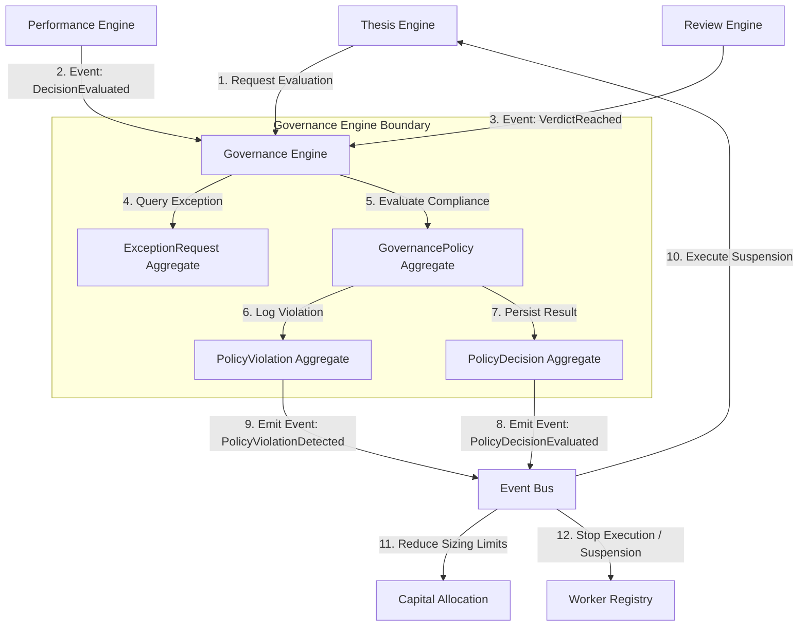
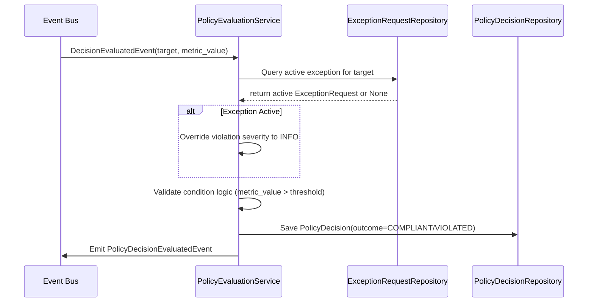
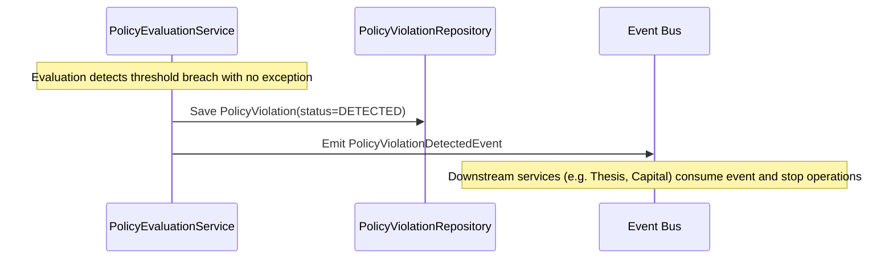
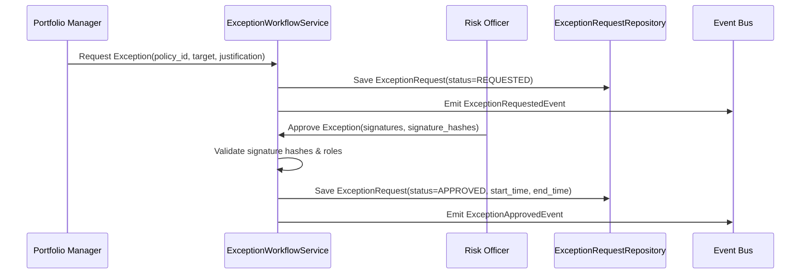
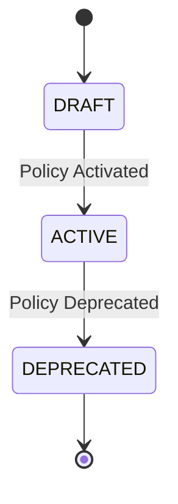
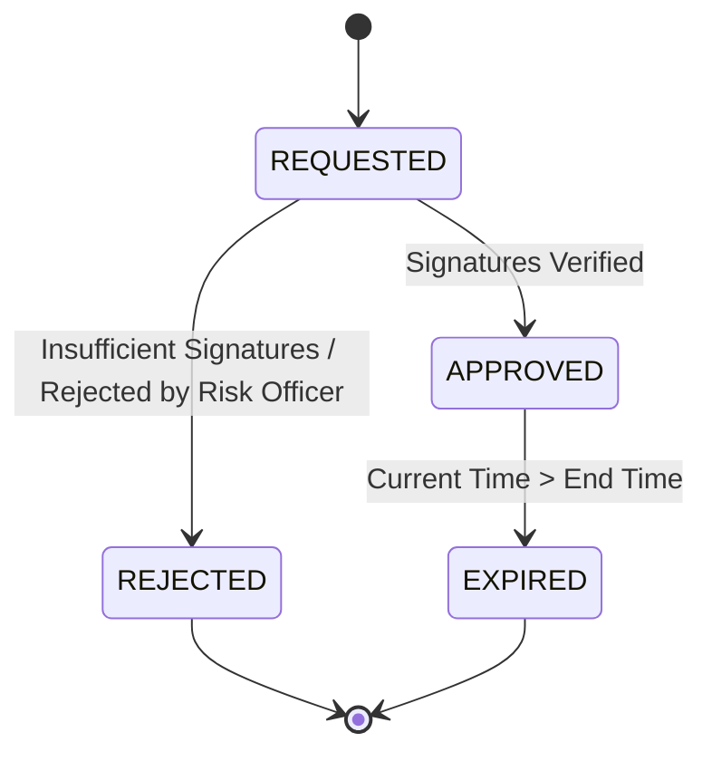
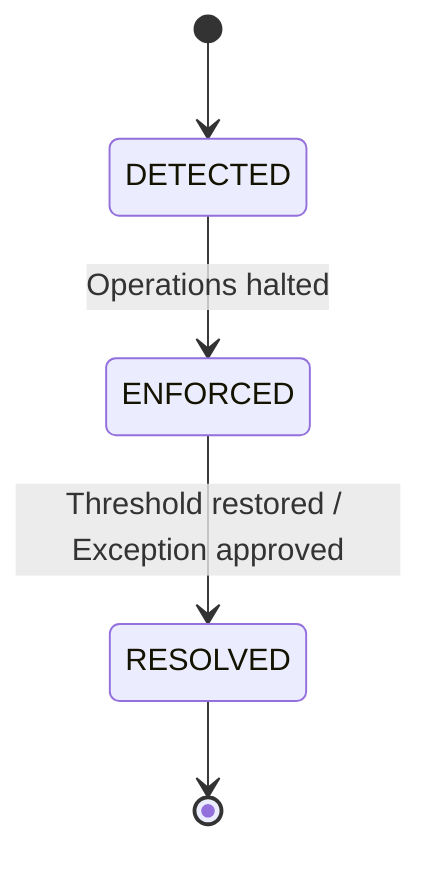

# 16. Governance Engine Foundation Architecture

This document defines the architecture of Karsa's **Governance Engine Foundation**, serving as the authoritative runtime compliance, policy enforcement, risk control, and override auditing subsystem of the platform.

---

## 1. Executive Summary
The Governance Engine is the sole writer and canonical source of truth for compliance policies (`GovernancePolicy`), active enforcement decisions (`PolicyDecision`), policy violations (`PolicyViolation`), and human-in-the-loop exception request workflows (`ExceptionRequest`).

It acts as the protective runtime guard rail of Karsa, evaluating executions, performances, and thesis limits against defined thresholds. While other subsystems calculate quality metrics or recommend changes, the Governance Engine evaluates policy compliance, registers exceptions, and publishes authoritative events that halt operations, freeze capital, or request dual-signature human overrides.

---

## 2. Ownership Boundary Matrix

| Subsystem / Context | Aggregate Root / Projection | Permitted Mutating Writer | Data Store Location | Read Interfaces Exposed | Role in VIF Loop |
| :--- | :--- | :--- | :--- | :--- | :--- |
| **Governance Engine** | `GovernancePolicy`<br>`PolicyDecision`<br>`PolicyViolation`<br>`ExceptionRequest` | `GovernanceService` | `db_governance` | Active policies, violations, active exceptions, and approvals. | Enforces compliance limits and audits overrides. |
| **Review Engine** | `ReviewSession`<br>`LearningFeedback` | `ReviewService` | `db_review` | Qualitative post-mortems and learning feedback. | Qualitative, offline post-mortems and recommendations. |
| **Performance Engine** | `DecisionEvaluation`<br>`EvaluationSnapshot` | `EvaluationService` | `db_performance` | Quantitative performance evaluations. | Evaluates mathematical scorecards (Brier, Sharpe). |
| **Thesis Engine** | `ThesisVersion` | `ThesisService` | `db_thesis` | Active investment parameters and status. | Authoritative thesis versions and parameters. |
| **Research Engine** | `ResearchRun` | `ResearchService` | `db_research` | Historical model training traces. | Initial model research and training datasets. |
| **Capital Allocation** | `CapitalLimit` (Future) | `CapitalAllocationService` | `db_capital` | Sizing limits and portfolio caps. | Manages active sizing and fund distribution. |
| **Regime Engine** | `RegimeState` (Future) | `RegimeService` | `db_regime` | Active market regime classifications. | Classifies market states (e.g. BULL, BEAR). |

---

## 3. Architecture Overview



---

## 4. Domain Model
The Governance Engine is designed around a decoupled, write-once model separating policies, ledger decisions, log violations, and human exception requests.

### Challenge: Should all candidates be aggregates?
- **`GovernancePolicy`**: **Yes**. It has its own independent lifecycle (drafting, activation, revision, deprecation) and requires strict transactional consistency.
- **`PolicyDecision`**: **No (Downgraded to Ledger Entry)**. Treating this as a write-once, append-only ledger entry instead of a mutable aggregate root prevents write contention and OCC lock bottlenecks. This enables lock-free daily evaluations scaling to 100M+ runs. Active status is served via read-side projections.
- **`PolicyViolation`**: **No (Downgraded to Log Entry)**. Violations are immutable logs representing point-in-time compliance breaches. They do not have update-in-place state machines and require no transaction write locks.
- **`ExceptionRequest`**: **Yes**. Exceptions represent human override workflows with complex state transitions (`REQUESTED` $\rightarrow$ `APPROVED`/`REJECTED` $\rightarrow$ `EXPIRED`) and cryptographic signature verifications, requiring strict aggregate concurrency controls.

---

## 5. Aggregate & Ledger Design

### A. `GovernancePolicy` (Aggregate Root)
- **Responsibilities**: Defines active compliance thresholds, target filters, actions (e.g., HALT, WARNING, HUMAN_APPROVAL), and approval levels.
- **Invariants**: 
  - A policy must contain at least one condition and one action.
  - Active policies cannot be mutated (they must be version-incremented or replaced).
- **Lifecycle**: `DRAFT` $\rightarrow$ `ACTIVE` $\rightarrow$ `DEPRECATED`.
- **Mutation Rules**: Only modifiable in `DRAFT` status. Activating increments the `aggregate_version`.

### B. `ExceptionRequest` (Aggregate Root)
- **Responsibilities**: Manages human-in-the-loop overrides and signatures.
- **Invariants**: 
  - Start time must be before end time.
  - Duration cannot exceed maximum organizational exception limits (e.g., 48 hours).
  - Requires valid cryptographic signatures for the required approval tier.
- **Lifecycle**: `REQUESTED` $\rightarrow$ `APPROVED` (if signatures match approval requirements) or `REJECTED` or `EXPIRED`.
- **Mutation Rules**: Only transitions to `APPROVED` or `REJECTED` from `REQUESTED`. Once final, attributes are strictly read-only.

### C. `PolicyDecision` (Immutable Ledger Entry)
- **Responsibilities**: Captures a single policy evaluation outcome at a point in time for a specific target.
- **Invariants**: 
  - Immutable once appended (write-once).
- **Structure**: Tracks `decision_id`, `policy_id`, `policy_version`, `target`, `outcome` (COMPLIANT/VIOLATED), `timestamp`, and any active `exception_id`.

### D. `PolicyViolation` (Immutable Log Entry)
- **Responsibilities**: Logs a breach occurrence, metric values, and trigger source.
- **Invariants**: 
  - Immutable once appended (write-once).
- **Structure**: Tracks `violation_id`, `policy_id`, `target`, `metric_value`, and `created_at`.

---

## 6. Value Objects

### Challenge & Validation:
- **`PolicyTarget`**: Identifies what the policy checks (`target_type`: WORKER/THESIS/PORTFOLIO, `target_id`, `target_version`). *Validated*: Essential to bind rules.
- **`PolicyCondition`**: Defines rule logic (`parameter_name`, `operator`: GT/LT/EQ, `threshold_value`). *Validated*: Keeps rules clean and machine-readable.
- **`PolicyAction`**: Represents what happens on failure (`severity`: INFO/WARN/CRITICAL, `enforcement_type`: SUSPEND/HALT/REDUCE_LIMIT/HUMAN_APPROVAL). *Validated*: Downstream consumers read this field to act.
- **`ApprovalRequirement`**: Declares required signatures (`approver_role`: RISK_OFFICER/PORTFOLIO_MANAGER, `minimum_signatures`: int). *Validated*: Mandatory for audit trail validation.
- **`ViolationReason`**: Summarizes the failure trigger (`breached_metric`, `trigger_value`, `timestamp`). *Validated*: Immutable segment of the violation record.
- **`RiskLevel`**: Enum representing risk impact (`LOW`, `MEDIUM`, `HIGH`, `SYSTEMIC`). *Validated*: Simplifies routing and exception escalation levels.

---

## 7. Event Contracts

### `GovernancePolicyCreatedEvent`
- **Event Version**: 1
- **Payload**:
```json
{
  "event_id": "evt_gov_policy_101",
  "event_type": "GovernancePolicyCreatedEvent",
  "policy_id": "pol_max_drawdown",
  "version": 1,
  "conditions": [
    {"parameter_name": "drawdown_pct", "operator": "GT", "threshold_value": "15.0"}
  ],
  "actions": [
    {"enforcement_type": "SUSPEND_THESIS", "severity": "CRITICAL"}
  ],
  "timestamp": "2026-06-14T08:20:00Z",
  "event_version": 1
}
```

### `PolicyDecisionEvaluatedEvent`
- **Event Version**: 1
- **Payload**:
```json
{
  "event_id": "evt_gov_dec_202",
  "event_type": "PolicyDecisionEvaluatedEvent",
  "correlation_id": "corr_perf_eval_998",
  "causation_id": "evt_perf_eval_101",
  "decision_id": "dec_PM_01_drawdown",
  "policy_id": "pol_max_drawdown",
  "target": {
    "target_type": "THESIS_VERSION",
    "target_id": "th_ver_v2_05"
  },
  "outcome": "VIOLATED",
  "has_active_exception": false,
  "timestamp": "2026-06-14T08:20:05Z",
  "event_version": 1
}
```

### `PolicyViolationDetectedEvent`
- **Event Version**: 1
- **Payload**:
```json
{
  "event_id": "evt_gov_viol_303",
  "event_type": "PolicyViolationDetectedEvent",
  "correlation_id": "corr_perf_eval_998",
  "causation_id": "evt_gov_dec_202",
  "violation_id": "viol_9901",
  "policy_id": "pol_max_drawdown",
  "target": {
    "target_type": "THESIS_VERSION",
    "target_id": "th_ver_v2_05"
  },
  "metric_value": "16.42",
  "action_triggered": "SUSPEND_THESIS",
  "timestamp": "2026-06-14T08:20:05Z",
  "event_version": 1
}
```

### `ExceptionRequestedEvent`
- **Event Version**: 1
- **Payload**:
```json
{
  "event_id": "evt_gov_exc_404",
  "event_type": "ExceptionRequestedEvent",
  "correlation_id": "corr_user_req_772",
  "causation_id": "cmd_request_exception_01",
  "exception_id": "exc_drawdown_override_01",
  "policy_id": "pol_max_drawdown",
  "target": {
    "target_type": "THESIS_VERSION",
    "target_id": "th_ver_v2_05"
  },
  "duration_seconds": 86400,
  "justification": "Market regime recalibration currently in progress.",
  "timestamp": "2026-06-14T08:20:10Z",
  "event_version": 1
}
```

### `ExceptionApprovedEvent`
- **Event Version**: 1
- **Payload**:
```json
{
  "event_id": "evt_gov_exc_505",
  "event_type": "ExceptionApprovedEvent",
  "correlation_id": "corr_user_req_772",
  "causation_id": "evt_gov_exc_404",
  "exception_id": "exc_drawdown_override_01",
  "approved_by": ["user_pm_lead_01", "user_risk_officer_02"],
  "signature_hashes": ["sha256_sig_1", "sha256_sig_2"],
  "start_time": "2026-06-14T08:21:00Z",
  "end_time": "2026-06-15T08:21:00Z",
  "timestamp": "2026-06-14T08:21:00Z",
  "event_version": 1
}
```

### `ExceptionRejectedEvent`
- **Event Version**: 1
- **Payload**:
```json
{
  "event_id": "evt_gov_exc_606",
  "event_type": "ExceptionRejectedEvent",
  "correlation_id": "corr_user_req_772",
  "causation_id": "evt_gov_exc_404",
  "exception_id": "exc_drawdown_override_01",
  "rejected_by": "user_risk_officer_02",
  "reason": "Drawdown exceeds firm systemic limits.",
  "timestamp": "2026-06-14T08:21:05Z",
  "event_version": 1
}
```

---

## 8. Application Services

- **`PolicyEvaluationService`**: Orchestrates compliance validation. Consumes quantitative evaluations, outcomes, and qualitative verdicts; matches targets against active policy definitions; checks for active exceptions; and saves decisions.
- **`ViolationManagementService`**: Logs violations, issues alerts, and tracks recovery status.
- **`ExceptionWorkflowService`**: Manages exception requests, signature collection, and validation.
- **`GovernanceDecisionService`**: Provides query APIs for active locks and permissions.

### Challenge to Service Boundaries:
*Should `PolicyEvaluationService` query external engines directly?* No. To maintain context boundaries, it reads incoming transaction contexts/events or cached projections, ensuring evaluations are self-contained and performant.

---

## 9. Repositories

```python
class GovernancePolicyRepository(ABC):
    @abstractmethod
    def save(self, policy: GovernancePolicy) -> None: pass
    @abstractmethod
    def find_by_id(self, policy_id: str) -> Optional[GovernancePolicy]: pass
    @abstractmethod
    def find_active(self) -> List[GovernancePolicy]: pass

class PolicyDecisionRepository(ABC):
    @abstractmethod
    def save(self, decision: PolicyDecision) -> None: pass
    @abstractmethod
    def find_by_target(self, target: PolicyTarget) -> List[PolicyDecision]: pass

class PolicyViolationRepository(ABC):
    @abstractmethod
    def save(self, violation: PolicyViolation) -> None: pass
    @abstractmethod
    def list_unresolved(self) -> List[PolicyViolation]: pass

class ExceptionRequestRepository(ABC):
    @abstractmethod
    def save(self, request: ExceptionRequest) -> None: pass
    @abstractmethod
    def find_active_for_target(self, target: PolicyTarget, current_time: datetime) -> Optional[ExceptionRequest]: pass
```

---

## 10. Persistence Design
The Governance Engine persists data in four relational tables. To maximize throughput, only the two active workflow aggregates (`governance_policies` and `exception_requests`) include OCC `aggregate_version` columns, while the ledger and log tables (`policy_decisions` and `policy_violations`) are optimized as write-once schemas:

```sql
CREATE TABLE governance_policies (
    policy_id VARCHAR(64) NOT NULL,
    version INT NOT NULL,
    status VARCHAR(32) NOT NULL,
    conditions JSONB NOT NULL,
    actions JSONB NOT NULL,
    aggregate_version INT NOT NULL DEFAULT 1,
    PRIMARY KEY (policy_id, version)
);

CREATE TABLE policy_decisions (
    decision_id VARCHAR(64) PRIMARY KEY,
    policy_id VARCHAR(64) NOT NULL,
    policy_version INT NOT NULL,
    target_type VARCHAR(32) NOT NULL,
    target_id VARCHAR(64) NOT NULL,
    target_version VARCHAR(32),
    outcome VARCHAR(32) NOT NULL,
    metric_values JSONB NOT NULL,
    regime_id VARCHAR(64),
    exception_id VARCHAR(64),
    evaluation_timestamp TIMESTAMP NOT NULL
);

CREATE TABLE policy_violations (
    violation_id VARCHAR(64) PRIMARY KEY,
    policy_id VARCHAR(64) NOT NULL,
    target_type VARCHAR(32) NOT NULL,
    target_id VARCHAR(64) NOT NULL,
    metric_value VARCHAR(64) NOT NULL,
    created_at TIMESTAMP NOT NULL
);

CREATE TABLE exception_requests (
    exception_id VARCHAR(64) PRIMARY KEY,
    policy_id VARCHAR(64) NOT NULL,
    target_type VARCHAR(32) NOT NULL,
    target_id VARCHAR(64) NOT NULL,
    target_version VARCHAR(32),
    justification TEXT NOT NULL,
    status VARCHAR(32) NOT NULL,
    signatures JSONB NOT NULL,
    start_time TIMESTAMP,
    end_time TIMESTAMP,
    created_at TIMESTAMP NOT NULL,
    aggregate_version INT NOT NULL DEFAULT 1
);
```

---

## 11. Integration Design

- **Thesis Engine**: Listens to `PolicyViolationDetectedEvent` and `PolicyDecisionEvaluatedEvent` to suspend thesis capital usage.
- **Performance Engine**: Provides execution metric scorecards (`DecisionEvaluation`) that the `PolicyEvaluationService` validates against compliance thresholds.
- **Review Engine**: Qualitative verdicts of `CRITICAL_DEPRECATE` trigger immediate policy evaluations to enforce operation stops.
- **Capital Allocation (Future)**: Consumes policy decisions to scale down limits or freeze allocations on violations.
- **Regime Engine (Future)**: Feeds active regime IDs to customize threshold values (e.g. higher drawdown limits in high-volatility regimes).
- **Research Engine (Future)**: Blocks research model promotions if the model fails pre-deployment compliance checks.

---

## 12. Sequence Diagrams

### A. Policy Evaluation Flow


### B. Violation Detection Flow


### C. Exception Approval Flow


---

## 13. State Diagrams

### A. GovernancePolicy Lifecycle


### B. ExceptionRequest Lifecycle


### C. PolicyViolation Lifecycle


---

## 14. Failure Handling
- **Event Bus Outages**: The Governance Engine runs policy evaluations inside a reliable transactional context. If event publication fails, transaction rollbacks occur to prevent silent violations.
- **Missing Telemetry**: Policies require a data schema. If a metric cannot be queried (e.g., token count missing from execution outcome), the system **fails closed**, registering an automatic compliance violation (`MISSING_TELEMETRY`) and halting execution.
- **Exception Expiration**: Checked automatically during every evaluation run via time comparison (`current_time > exception.end_time`).

---

## 15. OCC Strategy
Standard optimistic concurrency controls are executed on the `aggregate_version` column of active workflow aggregates (`GovernancePolicy` and `ExceptionRequest` tables):
```python
if existing.aggregate_version != incoming.aggregate_version - 1:
    raise ConcurrencyConflictError()
```
Since policy configuration definitions and human overrides have low write frequency, OCC collisions on these tables are rare. 

For the high-frequency evaluation path, **OCC is entirely bypassed** on writes. Both `PolicyDecision` ledger entries and `PolicyViolation` log entries use a write-once, append-only persistence model. This eliminates transaction locking contention and prevents write bottlenecks on the execution path. Consistent target states are served via read-side projections querying the latest appended ledger entry.

---

## 16. Scalability Analysis
Target: **100M+ policy evaluations per day**.

- **Active Policy Lookups**: Active policies are small in size and cached in memory. Lookups run in $O(1)$ time.
- **Throughput**: Policy evaluation does not write to the execution path. Policy evaluations run asynchronously using worker pools.
- **Determinism and Replay**: Evaluations use policy snapshots linked by version identifier (`policy_version`). Historical execution replays load the historical policy version, producing identical compliance outputs.
- **Projection Rebuilds**: Read-side violation tables are reconstructed by scanning the append-only `policy_violations` table.

---

## 17. Security Analysis

- **Policy Tampering**: Enforced via cryptographic verification. Policy definition modifications require dual-signature authorization from system administrators.
- **Approval Bypass**: Signature validation enforces that override exception requests require cryptographic verification matching public keys of the authorized `RISK_OFFICER` roles.
- **Unauthorized Overrides**: Exceptions must define explicit `start_time` and `end_time` limits. Expired overrides are ignored by the evaluation service.
- **Privilege Escalation**: Role validation maps directly to the user identity verified in Karsa's capability security layer (ADR-003).

---

## 18. Migration Strategy
1. Deploy Governance Engine schemas.
2. Initialize default bootstrap policies (e.g., maximum daily worker spend, maximum drawdown threshold).
3. Conduct dry-run evaluations on historical execution logs to trace compliance statistics.
4. Activate real-time enforcement and bind downstream engines to block operations on violation events.

---

## 19. Risks
- **False Positive Halts**: Strict enforcement rules may halt trading during outlier market regimes. *Remediation*: Exception workflows support fast-override execution (under 1 minute) by risk managers.
- **Event Latency**: Real-time compliance checks may incur millisecond latencies. *Remediation*: High-risk policies (e.g. maximum loss caps) run inline, while qualitative audits run out-of-band.

---

## 20. ADR Decisions
Refer to [ADR-035](file:///Users/dwiki.nugraha/dwikicode/karsa/docs/adr/ADR-035-governance-engine-ownership.md) (Context boundaries and ownership) and [ADR-036](file:///Users/dwiki.nugraha/dwikicode/karsa/docs/adr/ADR-036-policy-evaluation-and-enforcement-model.md) (Policy evaluation and enforcement model).

---

## 21. Architecture Challenges

### A. Ownership Boundaries
- **Challenge**: Should Governance decide when a thesis is invalid, or should Thesis Version handle its own state?
- **Resolution**: Governance is the evaluator. It outputs the policy decision. Thesis Version listens to the decision event and suspends itself, maintaining clean aggregate separation.

### B. Enforcement Authority
- **Challenge**: Does Governance call Thesis Engine, or does Thesis Engine call Governance?
- **Resolution**: Inter-context coupling is avoided. Governance publishes events (`PolicyViolationDetectedEvent`). Thesis Engine subscribes to the event bus and suspends itself, ensuring zero cross-context database locking.

### C. Replay Assumptions
- **Challenge**: If historical data is replayed, do new exceptions apply retrospectively?
- **Resolution**: No. Exceptions are stamped with absolute timestamps. Replays evaluate metrics relative to the historical time window, using the policy version and exception state active during that exact timestamp.

---

## 22. Architecture Delta Analysis

| Virtual Investment Firm Stage | Pre-Sprint-26 Capabilities | Post-Sprint-26 Governance Foundation | Gaps Closed |
| :--- | :--- | :--- | :--- |
| **Governance** | None (Ad-hoc limits hardcoded in separate scripts). | Authoritative `GovernancePolicy` registry, real-time validations, and audited exception requests. | Standardized firm compliance rules, eliminated ad-hoc hardcoded limits, and instituted human-in-the-loop override auditing. |

---

## 23. Acceptance Criteria
1. **Auditability**: Every exception approval must include valid cryptographic signatures and a documented justification.
2. **Deterministic Replays**: Replaying an evaluation using a specific policy version must yield identical compliant/violated decisions.
3. **Failsafe Closure**: Missing telemetry data must result in a policy violation (fail-closed rule).

---

## 24. Final Verdict
**ARCHITECTURE_DESIGN_COMPLETE**
