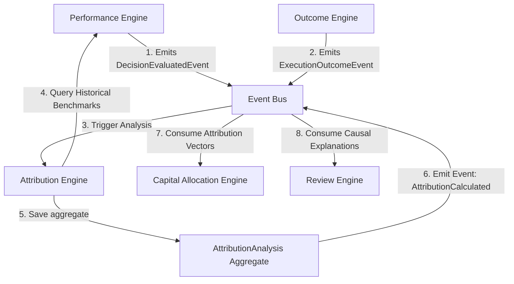
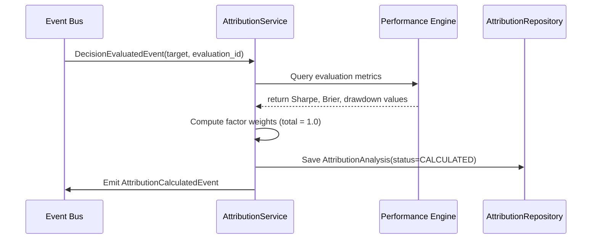
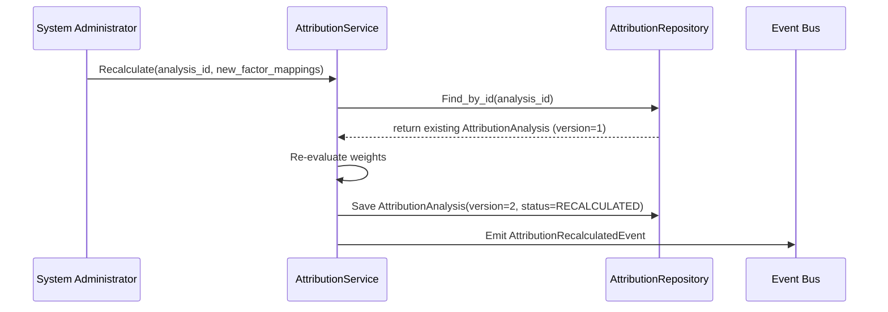
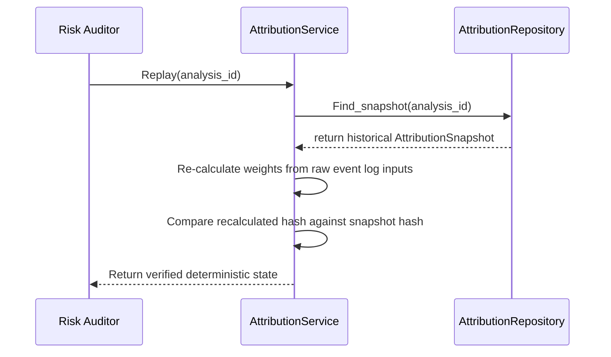
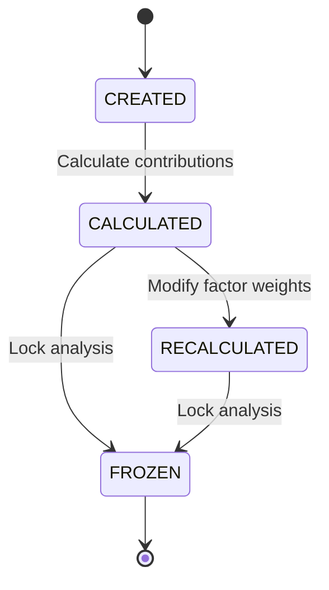

# 17. Attribution Engine Foundation Architecture

This document defines the architecture of Karsa's **Attribution Engine Foundation**, serving as the authoritative causal analysis, factor attribution, and outcome explanation subsystem of the platform.

---

## 1. Executive Summary
The Attribution Engine is the sole writer and canonical source of truth for causal performance analysis (`AttributionAnalysis`) and point-in-time snapshots (`AttributionSnapshot`). It answers *why* decisions succeeded or failed by calculating contribution scores across multiple dimensions (worker, thesis, research, regime, execution, strategy). 

The Attribution Engine does not execute trades, build investment models, or calculate baseline performance scorecards. Instead, it ingests quantitative results and telemetry to output causal factor scores, allowing the future Capital Allocation Engine to adjust sizing limits based on proven alpha generation rather than raw performance metrics alone.

---

## 2. Ownership Boundary Matrix

| Subsystem / Context | Aggregate Root / Projection | Permitted Mutating Writer | Data Store Location | Read Dependencies | Write Responsibilities | Single Writer Rule |
| :--- | :--- | :--- | :--- | :--- | :--- | :--- |
| **Attribution Engine** | `AttributionAnalysis`<br>`AttributionSnapshot` | `AttributionService` | `db_attribution` | Performance scorecard logs, Execution outcome details, Observability trace graphs. | Causal contribution metrics and analysis snapshots. | Sole writer of attribution scorecards. Bypasses execution DB writes. |
| **Performance Engine** | `DecisionEvaluation`<br>`EvaluationSnapshot` | `EvaluationService` | `db_performance` | None. | Base mathematical metrics (Brier, Sharpe). | Performance owns scorecards; Attribution reads them. |
| **Thesis Engine** | `ThesisVersion` | `ThesisService` | `db_thesis` | None. | Structural thesis metadata and validation states. | Thesis owns parameters; Attribution explains thesis outcomes. |
| **Capital Allocation** | `CapitalLimit` (Future) | `CapitalAllocationService` | `db_capital` | Attribution contribution vectors. | Portfolio limits and allocation caps. | Capital Allocation reads Attribution scores to modify sizing limits. |
| **Review Engine** | `ReviewSession` | `ReviewService` | `db_review` | Causal factors. | Qualitative audit logs. | Review reads Attribution analysis to determine root failure causes. |
| **Governance Engine** | `GovernancePolicy` | `GovernanceService` | `db_governance` | None. | Policy definitions and violations. | Governance uses compliance records; decoupled from Attribution. |

---

## 3. Architecture Overview



---

## 4. Domain Model
The Attribution domain is designed around a simplified, write-once ledger structure to prevent aggregate inflation:
- **Aggregate Roots**:
  - The context has **zero mutable aggregate roots**. Instead, all analyses are persisted as write-once versioned records.
- **Ledger Entries**:
  - `AttributionAnalysis`: A versioned, write-once ledger entry capturing causal performance weights.
- **Value Objects**:
  - `ContributionWeight`: Normalized weight of a single causal factor ($0.0 \le weight \le 1.0$).
  - `AttributionDimension`: Extensible classification categories (Worker, Thesis, Regime, Execution, Strategy).
  - `AttributionWindow`: Chronological boundary for evaluation (`start_time`, `end_time`).
  - `AttributionScore`: Final contribution metric (alpha and risk metrics).
  - `AttributionExplanation`: Plain-text justification and mathematical breakdown.

### Aggregate Necessity Challenge:
To prevent aggregate inflation and OCC bottlenecks on high-frequency evaluations, all updates are append-only.
- **Why `AttributionAnalysis` is a Versioned Ledger Entry**: Causal analysis runs are write-once. If a recalculation is triggered, a new record with an incremented version (e.g. `version = 2`) is appended to the ledger. This eliminates update-in-place locks, bypassing OCC entirely on the evaluation path.
- **Why `AttributionSnapshot` is retired**: Since every ledger version is already immutable, a separate snapshot aggregate is redundant. Merging snapshotting into the main versioned ledger table simplifies the model and reduces storage duplication.

---

## 5. Ledger & Domain Design

### A. `AttributionAnalysis` (Versioned Ledger Entry)
- **Responsibilities**: Captures calculated causal contribution weights, metric scores, and explanations for a target over a window.
- **Invariants**:
  - Total contribution weights across all factors within a version must sum exactly to 1.0 (100%).
- **Structure**: Tracks `analysis_id`, `version`, `target`, `status` (`CALCULATED` or `RECALCULATED`), `window`, `contributions`, `explanations`, and `created_at`.
- **Mutation Rules**: Strictly write-once and immutable after insertion. Recalculation appends a new record with `version = version + 1`.

---

## 6. Aggregate Necessity Challenge

| Proposed Object | Lifecycle | Invariant Ownership | OCC Necessity | Transactional Boundary | Replay Requirement | Final Classification |
| :--- | :--- | :--- | :--- | :--- | :--- | :--- |
| `AttributionAnalysis` | None (Write-Once version append). | Sum of weights = 1.0. | **No**. Write-once append bypasses OCC. | Scoped to analysis ID. | Yes. | **Versioned Ledger Entry** |
| `AttributionFactor` | None. | None. | No. | Nested in Ledger Entry. | Yes. | **Value Object** |
| `AttributionContribution`| None. | None. | No. | Nested in Ledger Entry. | Yes. | **Value Object** |
| `AttributionExplanation` | None. | None. | No. | Nested in Ledger Entry. | Yes. | **Value Object** |

---

## 7. Value Objects

- **`ContributionWeight`**: Represents a normalized float value ($0.0 \le weight \le 1.0$) mapped to a dimension. Enforces weight boundary validations on initialization.
- **`AttributionDimension`**: Identifies a specific classification dimension.
- **`AttributionWindow`**: Defines the historical time boundaries (`start_time`, `end_time`).
- **`AttributionScore`**: Holds calculated outputs (`alpha_contribution_bps`, `risk_contribution_bps`, `information_ratio_delta`).

---

## 8. Attribution Dimensions
Dimensions isolate causal vectors across Karsa. Dimensions are defined as **extensible enums** with a metadata mapping payload, enabling the addition of new dimensions (e.g. Portfolio, Regime) without breaking core schemas.

- **Worker Dimension**: Tracks performance of LLM/heuristics models (`worker_id`, `model_name`, `provider`).
- **Thesis Dimension**: Tracks structural logic outcomes (`thesis_id`, `thesis_version`).
- **Research Artifact Dimension**: Maps back to training datasets or prompt configurations (`dataset_id`, `prompt_hash`).
- **Regime Dimension**: Integrates market state tags (`regime_id`, `regime_class`).
- **Execution Dimension**: Tracks slippage, fill latency, and route costs (`execution_id`, `broker_id`).
- **Portfolio Dimension**: Evaluates overall asset group caps (`portfolio_id`).
- **Strategy Dimension**: Focuses on trading methodology (`strategy_id`).
- **Provider Dimension**: Captures API endpoint latency and availability factors (`provider_name`).

---

## 9. Event Contracts

### `AttributionCalculatedEvent`
- **Event Version**: 1
- **Payload**:
```json
{
  "event_id": "evt_att_calc_801",
  "event_type": "AttributionCalculatedEvent",
  "correlation_id": "corr_perf_eval_998",
  "causation_id": "evt_perf_eval_101",
  "analysis_id": "an_dec_1002_causal",
  "target": {
    "target_type": "THESIS_VERSION",
    "target_id": "th_ver_v2_05"
  },
  "window": {
    "start_time": "2026-06-01T00:00:00Z",
    "end_time": "2026-06-14T00:00:00Z"
  },
  "contributions": [
    {"dimension": "WORKER", "dimension_id": "worker_llm_04", "weight": "0.65", "alpha_score_bps": "24.5"},
    {"dimension": "REGIME", "dimension_id": "regime_bull", "weight": "0.35", "alpha_score_bps": "13.2"}
  ],
  "timestamp": "2026-06-14T08:35:00Z",
  "event_version": 1
}
```

### `AttributionRecalculatedEvent`
- **Event Version**: 1
- **Payload**:
```json
{
  "event_id": "evt_att_recalc_802",
  "event_type": "AttributionRecalculatedEvent",
  "correlation_id": "corr_perf_eval_998",
  "causation_id": "cmd_recalculate_att_02",
  "analysis_id": "an_dec_1002_causal",
  "previous_version": 1,
  "new_version": 2,
  "contributions": [
    {"dimension": "WORKER", "dimension_id": "worker_llm_04", "weight": "0.60", "alpha_score_bps": "22.1"},
    {"dimension": "REGIME", "dimension_id": "regime_bull", "weight": "0.40", "alpha_score_bps": "15.6"}
  ],
  "timestamp": "2026-06-14T08:40:00Z",
  "event_version": 1
}
```

### `AttributionSnapshotCreatedEvent`
- **Event Version**: 1
- **Payload**:
```json
{
  "event_id": "evt_att_snap_803",
  "event_type": "AttributionSnapshotCreatedEvent",
  "correlation_id": "corr_perf_eval_998",
  "causation_id": "evt_att_calc_801",
  "snapshot_id": "snap_att_1002_v1",
  "analysis_id": "an_dec_1002_causal",
  "timestamp": "2026-06-14T08:35:05Z",
  "event_version": 1
}
```

---

## 10. Persistence Design

To scale evaluations up to **100M+ evaluations/day** without write hotspots:
- **Storage Layout**: Uses relational tables with JSONB schemas.
- **Partitioning**: Range partitioning on `created_at` (monthly chunks) and hash partitioning on `target_id`.
- **Retention**: Hot partitions are kept online for 90 days. Cold segments are archived to object storage with gzip compression. Permanent indexes are maintained for historical regulatory audit logs.

```sql
CREATE TABLE attribution_analyses (
    analysis_id VARCHAR(64) NOT NULL,
    version INT NOT NULL,
    target_type VARCHAR(32) NOT NULL,
    target_id VARCHAR(64) NOT NULL,
    target_version VARCHAR(32),
    status VARCHAR(32) NOT NULL,
    start_time TIMESTAMP NOT NULL,
    end_time TIMESTAMP NOT NULL,
    contributions JSONB NOT NULL,
    explanations JSONB NOT NULL,
    created_at TIMESTAMP NOT NULL,
    PRIMARY KEY (analysis_id, version)
);
```

---

## 11. Replay Design
- **Source of Truth**: Incoming event store containing the historical execution outcomes, evaluations, and target versions.
- **Snapshot Requirements**: Calculated contribution scorecards are stored permanently in the versioned `attribution_analyses` table (each record has a unique `(analysis_id, version)` key).
- **Deterministic Replays**: Replaying reads the target's historical version, evaluation metrics, and active regime ID at that timestamp, producing identical weights.
- **Replay Artifacts**: Verification hashes are printed to logs to confirm byte-for-byte correctness against stored snapshot hashes during audits.

---

## 12. Integration Design

- **Performance Engine**: Ingests scorecard values (`DecisionEvaluation`) via the event stream. Bounded context boundaries prevent Attribution from mutating Performance databases.
- **Review Engine**: Qualitative post-mortems read attribution scores to determine the structural failure causes of underperforming models.
- **Governance Engine**: Listens to attribution updates. Outlier risk contributions (e.g. execution slippage exceeding thresholds) trigger policy validations.
- **Capital Allocation Engine**: Subscribes to `AttributionCalculatedEvent` to adjust capital distribution limits.

---

## 13. Capital Allocation Dependency Analysis

### Can Capital Allocation exist without Attribution?
- **No**. If Capital Allocation reads raw Performance scorecards, it risks scaling capital based on short-term market noise or positive execution latency skew.
- **Why Attribution is required**: It separates alpha contributions from luck or regime skew. For instance, a model may show high returns, but if the Attribution Engine reveals that 90% of the alpha was generated by market regime volatility rather than the model's core logic, Capital Allocation limits should not be increased.
- **Decoupled Boundaries**: Capital Allocation reads the calculated contribution vectors, while Attribution remains completely isolated from limit mutations, protecting the firm from God Context risks.

---

## 14. Sequence Diagrams

### A. Attribution Calculation Flow


### B. Attribution Recalculation Flow


### C. Replay Flow


---

## 15. State Diagrams

### `AttributionAnalysis` Aggregate


---

## 16. Failure Handling
- **Missing Telemetry**: If a dimension lacks data (e.g. slippage data missing from execution logs), the calculator **fails closed**, assigning $0.0$ weight to the execution dimension and logging a `DATA_STALE` warning.
- **Recalculation Failure**: System crashes during recalculation trigger transaction rollbacks, preserving the previous version of the analysis.
- **Replay Mismatches**: If re-calculation results mismatch snapshot hashes, the system raises a `ReplayIntegrityException` and flags the target for audit.

---

## 17. OCC Strategy
To maximize throughput on high-frequency evaluation workloads, **OCC is bypassed entirely**. The database uses a write-once, append-only ledger pattern. When recalculation is required, a new record is appended to the `attribution_analyses` table with `version = version + 1`. This lock-free write pattern eliminates row locking contention and prevents write bottlenecks.

---

## 18. Scalability Analysis
Target: **100M+ evaluations per day**.

- **Write Hotspots**: Partitioning target IDs across database nodes spreads write distribution, avoiding lock hotspots.
- **Replay Cost**: Historical checks are resolved by looking up the specific target version directly in the `attribution_analyses` ledger table. Full calculation replays are only executed during deep audits.
- **Projection Rebuild Cost**: Rebuilds scan the append-only `attribution_analyses` table sequentially, running in linear $O(N)$ time.

---

## 19. Security Analysis
- **Attribution Tampering**: Modifying an inserted ledger version is prevented by database configurations that enforce write-once permissions.
- **Score Manipulation**: Factor scoring algorithms run inside sandboxed execution blocks to prevent code injection.
- **Replay Forgery**: Ledger records are stamped with SHA-256 integrity hashes computed over the serialized contribution vector.

---

## 20. Architecture Delta Analysis

| Virtual Investment Firm Stage | Pre-Sprint-27 Capabilities | Post-Sprint-27 Attribution Foundation | Gaps Closed |
| :--- | :--- | :--- | :--- |
| **Attribution** | None (Ad-hoc pricing logs in the Attribution context were limited to cost balances). | Structured, multidimensional causal explanation engine (`AttributionAnalysis` versioned ledger). | Ability to explain *why* decisions succeed/fail and isolate alpha contributions across VIF targets. |

---

## 21. ADR Decisions
Refer to [ADR-037](file:///Users/dwiki.nugraha/dwikicode/karsa/docs/adr/ADR-037-attribution-engine-ownership.md) (Context boundaries and ownership) and [ADR-038](file:///Users/dwiki.nugraha/dwikicode/karsa/docs/adr/ADR-038-causal-attribution-and-contribution-model.md) (Causal attribution and contribution model).

---

## 22. Architecture Challenges

### A. Aggregate Inflation
- **Challenge**: Does every dimension need to be an aggregate root?
- **Resolution**: No. All dimensions and weights are stored as nested value objects inside `AttributionAnalysis`, keeping the domain model clean.

### B. Hidden Coupling
- **Challenge**: Does Attribution query the live Portfolio or Thesis database directly?
- **Resolution**: No. Integrations are event-driven. Ingestion reads primitive values from event payloads to prevent cross-context locking.

### C. Attribution Bias
- **Challenge**: How do we prevent attribution skew (e.g. attributing all success to workers and failure to regimes)?
- **Resolution**: Normalization rules enforce that the sum of all factor weights equals exactly 1.0.

---

## 23. Acceptance Criteria
1. **Weight Integrity**: The sum of all dimensions' contribution weights in `AttributionAnalysis` must equal exactly 1.0.
2. **Replay Validation**: Replaying historical input events must reconstruct the identical snapshot contribution weights.
3. **Immutability**: Frozen analysis records (`status = FROZEN`) must raise a `TypeError` on any update or delete attempts.

---

## 24. Final Verdict
**ARCHITECTURE_APPROVED**
