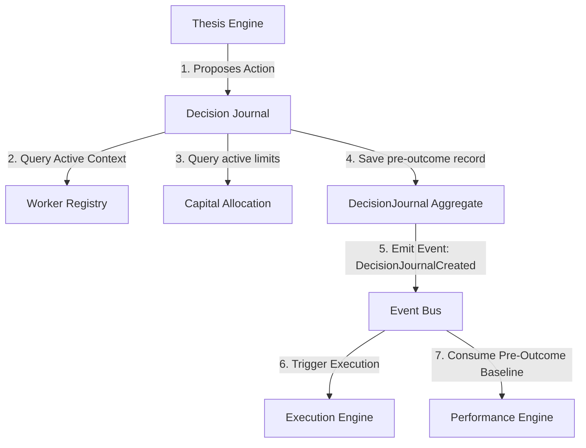
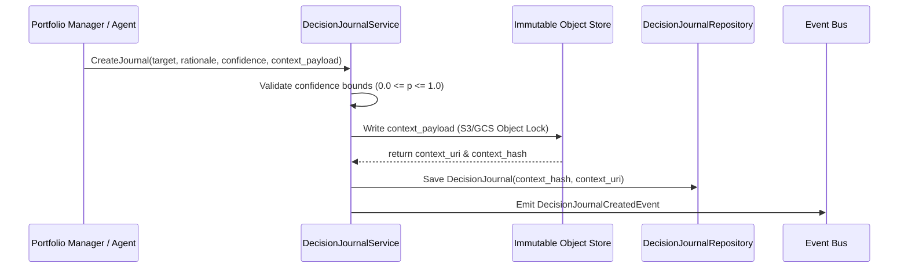
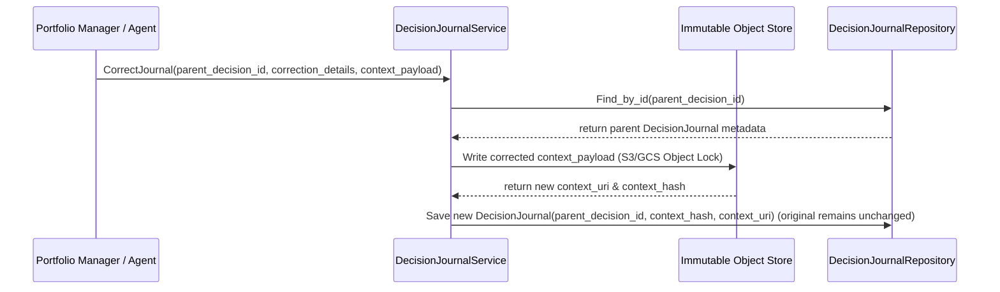
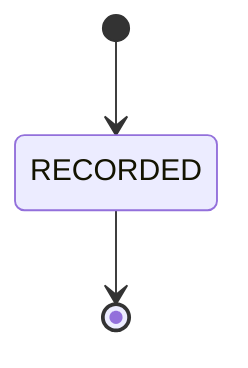

# 18. Decision Journal Foundation Architecture

This document defines the architecture of Karsa's **Decision Journal Foundation**, serving as the authoritative pre-outcome reasoning, decision audit, and hindsight-prevention subsystem of the platform.

---

## 1. Executive Summary
The Decision Journal is the sole writer and canonical source of truth for pre-outcome investment decisions. It records the logical rationale (`DecisionRationale`), active parameters (`DecisionContext`), specific hypotheses (`DecisionHypothesis`), and model confidences (`DecisionConfidence`) *before* an execution outcome is realized.

The system is strictly write-once and immutable. It exists to prevent **hindsight contamination** (where agents or humans alter pre-decision justifications after the outcome is known to make predictions look better). Any adjustments or corrections to a decision prior to trading are appended as distinct linked correction records, leaving the original entry intact.

---

## 2. Ownership Boundary Matrix

| Subsystem / Context | Aggregate Root / Projection | Permitted Mutating Writer | Data Store Location | Read Dependencies | Write Responsibilities | Single Writer Rule |
| :--- | :--- | :--- | :--- | :--- | :--- | :--- |
| **Decision Journal** | `DecisionJournal` | `DecisionJournalService` | `db_journal` | Thesis parameters, active worker status, prompt hashes. | Pre-outcome decision records (metadata and hashes) and offloaded context snapshots. | Sole writer of journal entries. Decoupled from execution DBs. |
| **Research Engine** | `ResearchRun` | `ResearchService` | `db_research` | None. | Model training datasets and prompt templates. | Research owns prompts; Journal links to prompt hashes. |
| **Thesis Engine** | `ThesisVersion` | `ThesisService` | `db_thesis` | None. | Active thesis logic. | Thesis Engine defines parameters; Journal links to thesis versions. |
| **Performance Engine** | `DecisionEvaluation` | `EvaluationService` | `db_performance` | Pre-outcome rationales. | Performance scorecards. | Performance reads journal inputs to compute Brier score prediction error. |
| **Attribution Engine** | `AttributionAnalysis` | `AttributionService` | `db_attribution` | Pre-outcome context snapshots. | Causal factor scorecards. | Attribution reads journal context to explain causal contributions. |
| **Governance Engine** | `GovernancePolicy` | `GovernanceService` | `db_governance` | Journal states. | Violations and exceptions. | Governance reads journal to evaluate pre-trade limit compliance. |
| **Post-Mortem (Future)** | `PostMortemRecord` | `PostMortemService` | `db_postmortem` | Journal context and outcome events. | Root cause analysis summaries. | Post-Mortem reads journal inputs to detect hindsight bias. |

---

## 3. Architecture Overview



---

## 4. Domain Model
The Decision Journal domain is designed around a simplified, write-once ledger model to prevent aggregate inflation and hindsight bias:
- **Aggregate Roots**:
  - The context contains **zero mutable aggregate roots**. Pre-outcome decisions are stored as write-once records.
- **Ledger Entries**:
  - `DecisionJournal`: An immutable write-once ledger entry representing the pre-outcome reasoning record.
- **Value Objects**:
  - `DecisionRationale`: Plain-text arguments, logics, and reasoning steps.
  - `DecisionEvidence`: References to quantitative logs, traces, or scorecards.
  - `DecisionHypothesis`: Testable prediction statements (e.g. expected returns).
  - `DecisionConfidence`: Numerical probability bounds ($0.0 \le p \le 1.0$).
  - `DecisionContext`: Telemetry parameter sets, model configurations, weights, and prompt templates, offloaded to immutable object storage and identified via hash.

### Aggregate Necessity Challenge:
To prevent aggregate inflation and hindsight contamination, all database writes are append-only.
- **Why `DecisionJournal` is an Immutable Write-Once Ledger Entry**: A decision journal entry is written once before trading begins. It has no status transitions, state updates, or row modifications. If parameters are updated before execution, a new entry is appended with a `parent_decision_id` link. Bypassing SQL updates and OCC eliminates write bottlenecks, prevents hindsight modifications, and supports highly concurrent workloads.
- **Why `DecisionSnapshot` is retired**: To avoid aggregate inflation and SQL write bottlenecks from large JSON payloads, `DecisionSnapshot` is retired. The complete snapshot is stored as a nested `DecisionContext` value object in a write-once object store (e.g. S3/GCS with Object Lock), while the database record contains only the `context_hash` (SHA-256) and `context_uri`.

---

## 5. Ledger & Lineage Design

### A. `DecisionJournal` (Immutable Write-Once Ledger Entry)
- **Responsibilities**: Captures pre-outcome justifications, confidence metrics, and context parameters.
- **Invariants**:
  - Must contain valid confidence bounds ($0.0 \le p \le 1.0$) and a non-empty rationale.
  - Strictly immutable once appended to disk (no updates or deletes permitted).
- **Structure**: Tracks `decision_id`, `parent_decision_id` (reference, optional), target references, `rationale`, `evidence`, `hypothesis`, `confidence`, `context_hash` (SHA-256), `context_uri` (object store URL), and `created_at`.
- **Lineage Rules**: Corrections or parameter updates before trade execution append a new ledger record referencing the parent ID, creating a trace lineage graph. The leaf node represents the final valid rationale. Downstream engines resolve the lineage tree dynamically by traversing parent links to find the leaf node.
- **Hindsight Prevention Enforcement**: Any correction or new entry must have a `created_at` timestamp strictly prior to the corresponding trade execution start time (`execution_started_at`). Downstream scoring engines reject any records or corrections created after execution starts.

---

## 6. Value Objects

- **`DecisionRationale`**: Encapsulates qualitative justifications (`reasoning_steps`, `market_assumptions`, `model_weights`).
- **`DecisionEvidence`**: Maps to input facts (`telemetry_span_ids`, `evaluation_ids`, `historical_prices`).
- **`DecisionHypothesis`**: Declares testable targets (`expected_return_bps`, `expected_slippage_bps`, `horizon_seconds`).
- **`DecisionConfidence`**: Captures numerical confidence scores (`probability`, `standard_deviation`).
- **`DecisionContext`**: Encapsulates environmental parameters (`regime_id`, `worker_status`, `cost_balance`) and model parameters offloaded to the write-once object store, referenced via `context_hash` and `context_uri` in the relational ledger entry.

---

## 7. Event Contracts

### `DecisionJournalCreatedEvent`
- **Event Version**: 1
- **Payload**:
```json
{
  "event_id": "evt_att_calc_901",
  "event_type": "DecisionJournalCreatedEvent",
  "correlation_id": "corr_thesis_eval_998",
  "causation_id": "evt_thesis_eval_101",
  "decision_id": "dec_PM_1001",
  "target": {
    "target_type": "THESIS_VERSION",
    "target_id": "th_ver_v2_05"
  },
  "rationale": {
    "reasoning_steps": "Arbitrage spread detected between exchanges.",
    "market_assumptions": "Liquidity remains stable for 60 seconds."
  },
  "confidence": {
    "probability": "0.85",
    "standard_deviation": "0.05"
  },
  "context_hash": "sha256_5f4dcc3b5aa765d61d8327deb882cf99",
  "context_uri": "s3://karsa-decision-journal/contexts/2026-06/dec_PM_1001.json",
  "timestamp": "2026-06-14T08:40:00Z",
  "event_version": 1
}
```

### `DecisionJournalCorrectedEvent`
- **Event Version**: 1
- **Payload**:
```json
{
  "event_id": "evt_att_calc_902",
  "event_type": "DecisionJournalCorrectedEvent",
  "correlation_id": "corr_thesis_eval_998",
  "causation_id": "cmd_correct_decision_02",
  "decision_id": "dec_PM_1001_corr",
  "parent_decision_id": "dec_PM_1001",
  "correction_reason": "Slippage parameter recalibration.",
  "context_hash": "sha256_7a8b9c0d1e2f3a4b5c6d7e8f9a0b1c2d",
  "context_uri": "s3://karsa-decision-journal/contexts/2026-06/dec_PM_1001_corr.json",
  "timestamp": "2026-06-14T08:42:00Z",
  "event_version": 1
}
```

---

## 8. Application Services
- **`DecisionJournalService`**: Orchestrates journal assembly, registers evidence, checks confidence bounds, handles corrections, and publishes creation events.
- **`JournalSearchService`**: Indexes rationale text to support fast semantic search.

---

## 9. Repositories

```python
class DecisionJournalRepository(ABC):
    @abstractmethod
    def save(self, journal: DecisionJournal) -> None: pass
    @abstractmethod
    def find_by_id(self, decision_id: str) -> Optional[DecisionJournal]: pass
    @abstractmethod
    def find_corrections(self, decision_id: str) -> List[DecisionJournal]: pass
```

---

## 10. Persistence Design
The Decision Journal persists data in a single, write-once relational table. SQL updates, OCC, and mutable status fields are entirely bypassed to eliminate lock contention on the high-frequency execution path. Large telemetry and parameter snapshot payloads are offloaded to an external immutable object store.

```sql
CREATE TABLE decision_journals (
    decision_id VARCHAR(64) PRIMARY KEY,
    parent_decision_id VARCHAR(64) REFERENCES decision_journals(decision_id),
    root_decision_id VARCHAR(64) NOT NULL REFERENCES decision_journals(decision_id),
    proposing_agent_id VARCHAR(64) NOT NULL,
    signature VARCHAR(256) NOT NULL,
    target_type VARCHAR(32) NOT NULL,
    target_id VARCHAR(64) NOT NULL,
    target_version VARCHAR(32),
    rationale JSONB NOT NULL,
    evidence JSONB NOT NULL,
    hypothesis JSONB NOT NULL,
    confidence JSONB NOT NULL,
    context_hash VARCHAR(64) NOT NULL, -- SHA-256 hash of context snapshot
    context_uri VARCHAR(512) NOT NULL,  -- Immutable object store URI
    created_at TIMESTAMP NOT NULL DEFAULT CURRENT_TIMESTAMP
);
```

### Canonical Active Leaf Selection Query
To select the authoritative decision leaf in a family before execution, downstream systems query:
```sql
SELECT * FROM decision_journals 
WHERE root_decision_id = :root_id 
  AND created_at < :execution_started_at
  AND decision_id NOT IN (
      SELECT parent_decision_id FROM decision_journals 
      WHERE parent_decision_id IS NOT NULL
  );
```

### Partitioning & Retention Strategy
- **Partitioning**: Range partitioning on `created_at` (monthly chunks) and hash partitioning on `target_id`.
- **Retention**: Hot partitions are kept online for 90 days. Cold segments are archived to object storage with gzip compression. Permanent indexes are maintained for historical regulatory audit logs.

---

## 11. Integration Design
- **Research Engine**: Links to active prompt hashes and model weights during journal assembly.
- **Thesis Engine**: Links to active thesis versions.
- **Performance Engine**: Reads pre-outcome confidence boundaries from the journal to compute scorecard prediction error rates.
- **Review Engine**: Qualitative post-mortems read journal justifications to analyze reasons for model failures.
- **Governance Engine**: Evaluates journal targets against compliance thresholds before execution.
- **Attribution Engine**: Ingests journal context to analyze causal factor contributions.
- **Post-Mortem Engine (Future)**: Compares pre-outcome journal logic against post-trade post-mortems to detect hindsight bias.

---

## 12. Sequence Diagrams

### A. Journal Entry Creation


### B. Correction Flow


---

## 13. State Diagrams

### `DecisionJournal` Aggregate

*Note: Because DecisionJournal entries are strictly immutable write-once ledger entries, they undergo no state transitions.*

---

## 14. Failure Handling
- **Missing Telemetry**: If a context value cannot be resolved (e.g. latency parameters missing from execution registry), the journal **fails closed**, registering a `MISSING_CONTEXT` warning and halting execution.
- **Validation Failures**: Invalid confidence bounds or empty rationales abort the transaction.

---

## 15. OCC Strategy
Optimistic Concurrency Control (OCC) is **not applied** to `DecisionJournal` or context snapshots. Because all entries are strictly write-once and append-only, row updates and deletes are blocked at the database level. There is no concurrency contention on updates, completely eliminating version column tracking and lock overhead.

---

## 16. Scalability Analysis
Target: **100M+ journal entries per day**.

- **Write Hotspots**: Offloading large JSON payload writes to an S3/GCS object store with Object Lock enables high-performance parallel streaming, leaving the relational DB to append lightweight index-only rows. This completely removes SQL write hotspots and locking.
- **Replay Cost**: Deterministic replay is achieved instantly by reading the immutable, static context snapshot from the object store using the URI and verifying it against the SHA-256 hash. There is no need to execute database transaction replays.
- **Projection Rebuild Cost**: Rebuilds scan the append-only `decision_journals` table sequentially, running in linear $O(N)$ time.

---

## 17. Security Analysis
- **Hindsight Contamination**: Immutability rules block modification or deletion of journal entries. Downstream validation of `created_at < execution_started_at` rejects any retroactive rationale injections.
- **Journal Tampering**: Cryptographic verification ensures that downloaded object store snapshots match the database's SHA-256 `context_hash`.
- **Bypass**: Exception requests are evaluated by the Governance Engine before execution.

---

## 18. Migration Strategy
1. Deploy Decision Journal schemas.
2. Initialize default bootstrap parameters.
3. Conduct dry-run evaluations on historical execution logs to trace compliance statistics.
4. Activate real-time enforcement and bind downstream engines to block operations on validation failures.

---

## 19. Risks
- **False Positive Halts**: Strict validation rules may halt trading during outlier market regimes. *Remediation*: Exception workflows support fast-override execution (under 1 minute) by risk managers.
- **Event Latency**: Real-time compliance checks may incur millisecond latencies. *Remediation*: High-risk policies run inline, while qualitative audits run out-of-band.

---

## 20. ADR Decisions
Refer to [ADR-039](file:///Users/dwiki.nugraha/dwikicode/karsa/docs/adr/ADR-039-decision-journal-ownership.md) (Context boundaries and ownership) and [ADR-040](file:///Users/dwiki.nugraha/dwikicode/karsa/docs/adr/ADR-040-decision-journal-immutable-record-model.md) (Immutable pre-outcome reasoning record model).

---

## 21. Architecture Challenges

### A. Aggregate Inflation
- **Challenge**: Does every rationale detail or context snapshot need to be an aggregate root?
- **Resolution**: No. All rationales and weights are stored as nested value objects inside the `DecisionJournal` record. The secondary `DecisionSnapshot` aggregate root is retired, and its bulk snapshot payload is offloaded to a write-once object store, preventing relational database layout bloat.

### B. Hindsight Contamination
- **Challenge**: How do we prevent agents from updating their reasoning after the outcome is known?
- **Resolution**: Database-level triggers and IAM policies block all row updates and deletions. Furthermore, downstream engines (Performance, Attribution) reject any journal entries or corrections whose `created_at` timestamp is not strictly prior to the trade execution's `started_at` timestamp, neutralizing late-injected justifications.

### C. Write Scalability & Storage Growth (100M+/day)
- **Challenge**: How do we handle high-frequency parallel write requests and TB-scale daily growth?
- **Resolution**: We store only metadata, hashes, and URIs in the database. The heavy context payload is offloaded directly to object storage (using Object Lock). This reduces DB write size to bytes and bypasses database lock contention by removing SQL updates and OCC.

### D. Replay Determinism
- **Challenge**: How do we ensure replays are 100% deterministic after 5 years?
- **Resolution**: The prompt template, prompt inputs, model weight hashes, and environment variables are permanently snapshotted in the object store at execution time, decoupling replay from thesis or research database mutations.

---

## 22. Architecture Delta Analysis

| Virtual Investment Firm Stage | Pre-Sprint-28 Capabilities | Post-Sprint-28 Decision Journal Foundation | Gaps Closed |
| :--- | :--- | :--- | :--- |
| **Decision** | None (Executions occurred without formal pre-outcome reasoning records). | Immutable pre-outcome reasoning engine (`DecisionJournal` with offloaded context snapshots). | Ability to explain *why* trades succeed/fail, verify alpha contributions, and prevent hindsight bias across all VIF targets. |

---

## 23. Acceptance Criteria
1. **Confidence Bound Integrity**: Numerical confidence scores must fall within $0.0 \le p \le 1.0$.
2. **Replay Validation**: Replaying historical decisions retrieves the context payload from the object store using `context_uri` and verifies it against the `context_hash`, reconstructing the exact model parameters active at the timestamp.
3. **Immutability**: All journal records must be strictly read-only and raise a `TypeError` or database-level exception on any update or delete attempts.

---

## 24. Final Verdict
**ARCHITECTURE_APPROVED**
