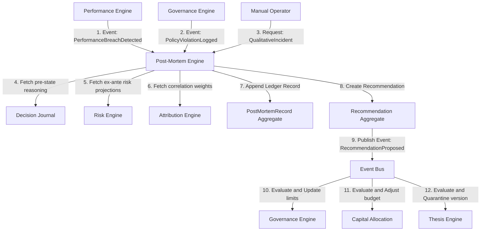
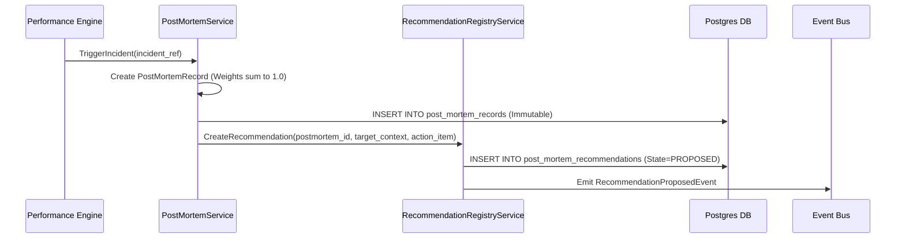
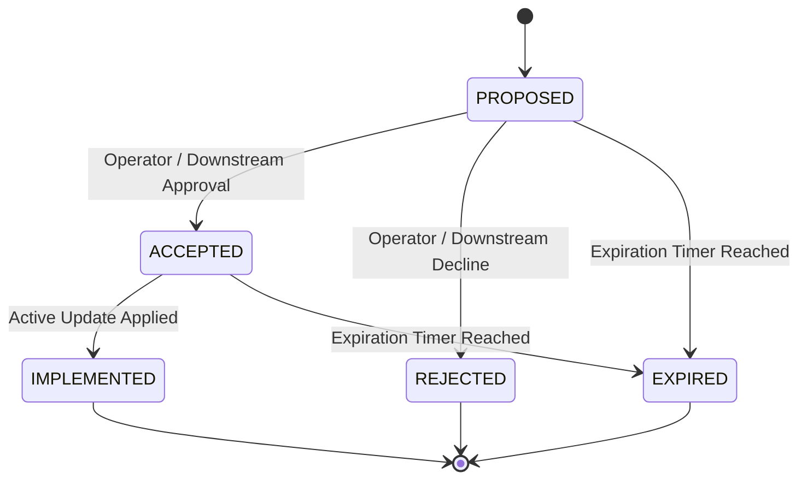

# 19. Post-Mortem Engine Foundation Architecture

This document defines the canonical architecture of Karsa's **Post-Mortem Engine Foundation**, serving as the authoritative failure analysis, root-cause classification, and organizational learning subsystem of the platform.

---

## 1. Executive Summary
The Post-Mortem Engine serves as the authoritative learning plane of the Virtual Investment Firm (VIF). It conducts structured retrospective evaluations when operational, performance, or governance failures occur.

The engine utilizes:
1. **`PostMortemRecord`** (Immutable Write-Once Ledger Aggregate Root) capturing the retrospective analysis, taxonomy categories, and attribution weights.
2. **`Recommendation`** (Mutable Lifecycle Aggregate Root) tracking the state transitions of recommended actions.

Downstream engines (Governance, Capital Allocation, Thesis) consume recommendations via the Event Bus and are the sole authorities accepting, rejecting, or implementing limit and budget adjustments.

---

## 2. Ownership Boundary Matrix

The table below defines the bounded-context responsibility matrix across the VIF learning and analysis engines:

| Capability / Action | Performance Engine | Attribution Engine | Review Engine | Post-Mortem Engine | Governance Engine | Capital Allocation |
| :--- | :--- | :--- | :--- | :--- | :--- | :--- |
| **Detect Deviations** | **Authoritative (Detects)** | Prohibited | Read-Only | Read-Only | Prohibited | Prohibited |
| **Calculate Correlation** | Read-Only | **Authoritative (Correlates)** | Prohibited | Read-Only | Prohibited | Prohibited |
| **Periodic Qualitative Appraisals** | Prohibited | Prohibited | **Authoritative (Appraises)** | Read-Only | Prohibited | Prohibited |
| **Assign Root-Cause** | Prohibited | Prohibited | Prohibited | **Authoritative (Assigns)** | Prohibited | Prohibited |
| **Generate Recommendations** | Prohibited | Prohibited | Prohibited | **Authoritative (Generates)** | Prohibited | Prohibited |
| **Accept/Reject Policy Update** | Prohibited | Prohibited | Prohibited | Prohibited | **Authoritative (Accepts)** | Prohibited |
| **Accept/Reject Budget Update** | Prohibited | Prohibited | Prohibited | Prohibited | Prohibited | **Authoritative (Accepts)** |

---

## 3. Architecture Overview



---

## 4. Domain Model

The domain contains two primary aggregate roots:
* **`PostMortemRecord`** (Aggregate Root):
  - Represents the retrospective analysis of a failure event. Strictly immutable and write-once.
* **`Recommendation`** (Aggregate Root):
  - Represents a proposed system adjustment, managing versioning and state changes.

* **Value Objects**:
  - `FailureClassification`: Categorizes failure types against the taxonomy.
  - `RootCauseContribution`: Weighted causes summing to 1.0.
  - `PostMortemFinding`: Qualitative timeline details and evidence references.
  - `IncidentReference`: Unique correlation identifier mapping to the source anomaly context.

---

## 5. Aggregate Design

### Option C: `PostMortemRecord` + `Recommendation` (Selected)
* **`PostMortemRecord` (Aggregate Root)**:
  - *Transaction Boundary*: Atomic save to the `post_mortem_records` table.
  - *Invariants*: Contribution weights must sum to exactly 1.0. Must reference a valid `incident_ref`. Strictly immutable.
* **`Recommendation` (Aggregate Root)**:
  - *Transaction Boundary*: Atomic write to the `post_mortem_recommendations` table.
  - *Lifecycle States*: `PROPOSED`, `ACCEPTED`, `REJECTED`, `IMPLEMENTED`, `EXPIRED`.
  - *OCC Strategy*: Version-based Optimistic Concurrency Control (OCC) is required on `post_mortem_recommendations` table to prevent race conditions during concurrent state updates.
  - *Ownership*: Post-Mortem owns recommendation creation and state tracking; target engines own execution status updates.

---

## 6. Value Objects

* **`FailureClassification`**:
  - `failure_type`: Enumerated string (`THESIS_FAILURE`, `EXECUTION_FAILURE`, `ALLOCATION_FAILURE`, `GOVERNANCE_FAILURE`, `REGIME_MISMATCH`, `RESEARCH_FAILURE`, `PORTFOLIO_FAILURE`, `PERFORMANCE_FAILURE`, `RISK_FAILURE`).
  - `severity`: String (`LOW`, `MEDIUM`, `HIGH`, `CRITICAL`).
  - `taxonomy_version`: Integer.
* **`RootCauseContribution`**:
  - `cause_category`: String (e.g. `LLM_HALLUCINATION`, `PARAMETER_OVERFITTING`).
  - `weight`: Float ($0.0 \le w \le 1.0$).
  - `description`: String.
* **`IncidentReference`**:
  - `incident_ref`: Unique identifier mapping to the source anomaly. Format `urn:karsa:incident:<context>:<uuid>`.
* **`PostMortemFinding`**:
  - `timeline_events`: List of key events with timestamps.
  - `evidence_uris`: List of telemetry/log links.

---

## 7. Event Contracts

### `PostMortemRecordCreatedEvent`
* **Event Version**: 1
* **Payload**:
```json
{
  "event_id": "evt_pm_rec_001",
  "event_type": "PostMortemRecordCreatedEvent",
  "correlation_id": "corr_thesis_eval_998",
  "causation_id": "evt_performance_breach_202",
  "postmortem_id": "pm_PM_2001",
  "incident_ref": "urn:karsa:incident:performance:drawdown_v1_001",
  "failure_classification": {
    "failure_type": "THESIS_FAILURE",
    "severity": "HIGH",
    "taxonomy_version": 1
  },
  "root_causes": [
    {
      "cause_category": "PARAMETER_OVERFITTING",
      "weight": 1.0,
      "description": "Thesis model assumed low volatility."
    }
  ],
  "timestamp": "2026-06-14T08:50:00Z",
  "event_version": 1
}
```

### `RecommendationProposedEvent`
* **Event Version**: 1
* **Payload**:
```json
{
  "event_id": "evt_rec_prop_001",
  "event_type": "RecommendationProposedEvent",
  "recommendation_id": "rec_001",
  "postmortem_id": "pm_PM_2001",
  "target_context": "GOVERNANCE",
  "action_item": "Reduce maximum leverage cap.",
  "parameters": {
    "max_leverage": 1.5
  },
  "timestamp": "2026-06-14T08:50:05Z",
  "event_version": 1
}
```

---

## 8. Application Services

* **`PostMortemService`**: Instantiates analysis files, validates root causes, and saves records.
* **`RecommendationRegistryService`**: Manages recommendation state updates, verifying OCC version checks.

---

## 9. Repositories

```python
class PostMortemRecordRepository(ABC):
    @abstractmethod
    def save_record(self, record: PostMortemRecord) -> None: pass
    @abstractmethod
    def get_record_by_id(self, postmortem_id: str) -> Optional[PostMortemRecord]: pass

class RecommendationRepository(ABC):
    @abstractmethod
    def save_recommendation(self, rec: Recommendation) -> None: pass
    @abstractmethod
    def get_recommendation_by_id(self, rec_id: str) -> Optional[Recommendation]: pass
```

---

## 10. Persistence Design

```sql
CREATE TABLE post_mortem_records (
    postmortem_id VARCHAR(128) NOT NULL,
    incident_ref VARCHAR(128) NOT NULL UNIQUE,
    failure_classification JSONB NOT NULL,
    root_causes JSONB NOT NULL,
    findings JSONB NOT NULL,
    created_at TIMESTAMP NOT NULL,
    PRIMARY KEY (postmortem_id, created_at)
) PARTITION BY RANGE (created_at);

CREATE TABLE post_mortem_records_default PARTITION OF post_mortem_records DEFAULT;

CREATE TABLE post_mortem_recommendations (
    recommendation_id VARCHAR(128) PRIMARY KEY,
    postmortem_id VARCHAR(128) NOT NULL,
    target_context VARCHAR(64) NOT NULL,
    action_item TEXT NOT NULL,
    parameters JSONB NOT NULL,
    state VARCHAR(32) NOT NULL, -- PROPOSED, ACCEPTED, REJECTED, IMPLEMENTED, EXPIRED
    version INTEGER NOT NULL DEFAULT 1,
    updated_at TIMESTAMP NOT NULL
);
```

---

## 11. Integration Design

* **Performance Port**: Listens for threshold breaches to flag anomalies.
* **Risk Port**: Fetches ex-ante VaR and Beta forecasts.
* **Decision Journal Port**: Ingests pre-outcome context references.

---

## 12. Sequence Diagrams



---

## 13. State Diagrams

### Recommendation Lifecycle


---

## 14. Failure Handling

* **Attribution Invariant Violation**: Rejects inserts if contributions sum $\ne 1.0$.
* **OCC Version Conflict**: Rejects update on recommendation if db version mismatch.

---

## 15. OCC Strategy

| Component | OCC Required | Reason |
| :--- | :--- | :--- |
| **`post_mortem_records`** | **No** | Strictly append-only write-once ledger. |
| **`post_mortem_recommendations`**| **Yes** | State transitions are mutable and subject to race conditions. |

---

## 16. Scalability Analysis

* **O(1) Append-Only**: Relational triggers block mutations, allowing lock-free insertion.
* **B-Tree Lookups**: B-tree index on `incident_ref` keeps verification fast.

---

## 17. Security Analysis

* **Hindsight Blockade**: Prevents modification of historical post-mortems post-sealing.
* **Asynchronous Execution isolation**: Downstream engines isolate action item ingestion, protecting operational loops.

---

## 18. Migration Strategy

1. Deploy schema, partitions, triggers, and indices under Alembic.
2. Setup event routing rules for learning events.

---

## 19. Risks

* **Feedback Deadlocks**: Downstream failures could stall recommendation acceptance. *Mitigation*: Isolated consumers running under DLQ.

---

## 20. ADR Decisions

* **[ADR-041](file:///Users/dwiki.nugraha/dwikicode/karsa/docs/adr/ADR-041-post-mortem-engine-ownership.md)**: Bounded context isolation.
* **[ADR-042](file:///Users/dwiki.nugraha/dwikicode/karsa/docs/adr/ADR-042-root-cause-and-organizational-learning-model.md)**: Defines root-cause normalized weighting rules.

---

## 21. Architecture Challenges

### Challenge 1 — Governance and Allocation Ownership
* **Resolution**: Post-Mortem Engine does **not** write policies or allocate budgets. It only proposes recommendations via events. The target contexts (Governance / Capital Allocation) own the acceptance/rejection and implementation of these suggestions.

### Challenge 2 — Aggregate Boundary Re-Evaluation
* **Resolution**: **Option C** (`PostMortemRecord` + `Recommendation`). Declares both `PostMortemRecord` (ledger) and `Recommendation` (lifecycle) as first-class Aggregate Roots.

### Challenge 3 — Incident Ownership Model
* **Resolution**: **Context-Owned Incident Model**. Each context owns its incident databases. A centralized incident registry is rejected to avoid cross-context write coupling. Correlation is handled via a standardized URN.

### Challenge 4 — Review vs Post-Mortem Ownership Matrix
* **Resolution**: Standardized. Review owns periodic appraisals; Post-Mortem owns retrospective root-cause failure analysis.

### Challenge 5 — OCC Ownership Matrix
* **Resolution**: OCC is used for recommendations (`post_mortem_recommendations`) to guard concurrent state transitions, but bypassed on ledger tables.

### Challenge 6 — Failure Attribution Expansion
* **Resolution**: Standardized across VIF stages: Research, Thesis, Decision Journal, CIO, Execution, Portfolio, Performance, Risk, Review, Governance.

### Challenge 7 — Replayability Specification
* **Resolution**: Auditable chain verified via key chain: `Thesis ID -> Decision Journal ID -> CIO Decision ID -> Execution ID -> Portfolio Snapshot ID -> Performance Evaluation ID -> Review ID -> Post-Mortem ID -> Recommendation ID`.

### Challenge 8 — Learning Loop Closure
* **Resolution**: Completed via a dedicated **Recommendation Registry** (`Recommendation` aggregate) tracking recommendation states under OCC.

### Challenge 9 — Capacity Model Validation
* **Resolution**: **Yearly Partitioning** is selected due to low operational volume (~1000 records/year), reducing overhead compared to monthly partitions.

### Challenge 10 — Recommendation Lifecycle Ownership
* **Resolution**: Proposing is owned by Post-Mortem; acceptance/rejection/implementation is owned by the target contexts.

---

## 22. Architecture Delta Analysis

| Virtual Investment Firm Stage | Pre-Sprint-39 Baseline | Post-Sprint-39 Post-Mortem Design | Gaps Closed |
| :--- | :--- | :--- | :--- |
| **Learning Feedback** | Qualitative periodic reviews only. | Event-driven recommendations and recommendation registry. | Closes loop safely by separating analysis from action. |

---

## 23. Acceptance Criteria

1. Causal weights sum to exactly 1.0.
2. Recommendations update states using OCC versioning.
3. Database triggers block UPDATE/DELETE on ledger tables.

---

## 24. Final Verdict

### **ARCHITECTURE_APPROVED**

---

## 25. Learning Loop Analysis
The loop closes safely. The Post-Mortem Engine generates a recommendation, but the target engine decides whether to apply it. This prevents the learning engine from overriding compliance logic.

---

## 26. Failure Attribution Model
Realized outcomes are attributed using normalized weights:
$$W_{\text{Thesis}} + W_{\text{Execution}} + W_{\text{Allocation}} + W_{\text{Governance}} + W_{\text{Regime}} + W_{\text{Research}} + W_{\text{DecisionJournal}} + W_{\text{CIO}} + W_{\text{Review}} + W_{\text{Portfolio}} + W_{\text{Performance}} + W_{\text{Risk}} = 1.0$$

---

## 27. Root Cause Taxonomy
* `RESEARCH_FAILURE`: Drift in Research data signals.
* `THESIS_FAILURE`: Flawed mathematical modeling.
* `DECISION_JOURNAL_FAILURE`: Invalid ex-ante expectations.
* `CIO_FAILURE`: Poor consensus quorum validation.
* `EXECUTION_FAILURE`: Routing latencies and slippage.
* `PORTFOLIO_FAILURE`: Position valuation tracking error.
* `PERFORMANCE_FAILURE`: Out-of-bounds metrics.
* `REVIEW_FAILURE`: Stale qualitative appraisals.
* `GOVERNANCE_FAILURE`: Ineffective limit parameters.
* `RISK_FAILURE`: Ex-ante covariance forecasting errors.

---

## 28. Governance Feedback Model
Emits recommendation events to Governance. Governance decides whether to accept and execute policies updates.

---

## 29. Allocation Feedback Model
Emits recommendation events to Capital Allocation to quarantine flawed thesis versions.

---

## 30. Replayability Proof
Reconstructed via SQL trace of correlation IDs:
```
Recommendation (recommendation_id)
  -> Post-Mortem (postmortem_id / incident_ref)
    -> Review Session (review_id)
      -> Performance Evaluation (performance_evaluation_id)
        -> Portfolio Snapshot (portfolio_snapshot_id)
          -> Execution Request/Fill (execution_id)
            -> CIO Decision (cio_decision_id)
              -> Decision Journal (decision_journal_id)
                -> Thesis (thesis_id)
```
This proves the complete causal chain.
