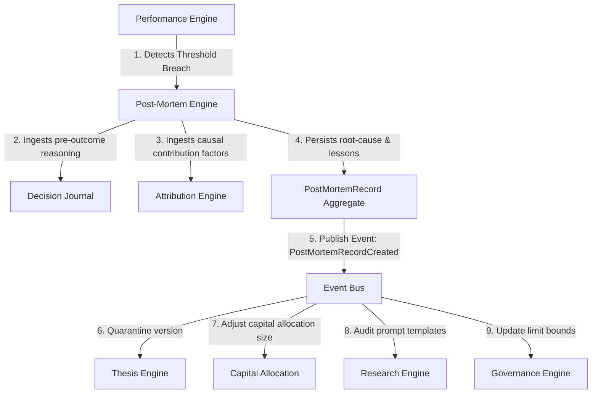
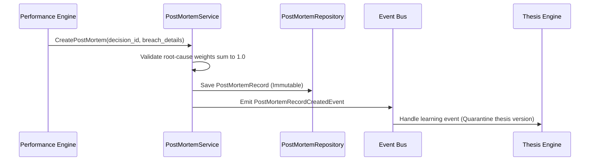
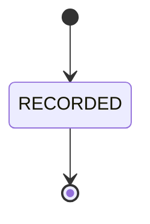

# 19. Post-Mortem Engine Foundation Architecture

This document defines the architecture of Karsa's **Post-Mortem Engine Foundation**, serving as the authoritative failure analysis, root-cause classification, and organizational learning subsystem of the platform.

---

## 1. Executive Summary
The Post-Mortem Engine is responsible for structured failure analysis and root-cause mapping when trading outcomes deviate significantly from expected parameters (threshold breaches) or when operational failures occur. 

The engine uses a single, write-once immutable model (`PostMortemRecord`) that categorizes failure events against a formal failure taxonomy, assigns weighted root-cause contributions, captures lessons learned, and asynchronously propagates these lessons to downstream engines (Thesis, Research, Governance, and Capital Allocation) via events, completing the feedback loop of the Virtual Investment Firm (VIF).

---

## 2. Ownership Boundary Matrix

| Subsystem / Context | Aggregate Root / Projection | Permitted Mutating Writer | Data Store Location | Read Dependencies | Write Responsibilities | Single Writer Rule |
| :--- | :--- | :--- | :--- | :--- | :--- | :--- |
| **Post-Mortem Engine** | `PostMortemRecord` | `PostMortemService` | `db_postmortem` | Decision Journal, Performance scorecards, Attribution factors. | Immutable post-mortem records and root-cause analysis details. | Sole writer of post-mortem records. Reads other databases asynchronously. |
| **Review Engine** | `ReviewRecord` | `ReviewService` | `db_review` | None. | Qualitative periodic reviews. | Review Engine reviews operational routines; Post-Mortem analyzes specific failures. |
| **Attribution Engine** | `AttributionAnalysis` | `AttributionService` | `db_attribution` | None. | Statistical causal factor scorecards. | Attribution calculates statistical correlation; Post-Mortem assigns root-cause accountability. |
| **Performance Engine** | `DecisionEvaluation` | `EvaluationService` | `db_performance` | None. | Quantitative prediction errors and scorecard metrics. | Performance defines *if* a deviation occurred; Post-Mortem explains *why* it occurred. |
| **Governance Engine** | `GovernancePolicy` | `GovernanceService` | `db_governance` | None. | Policy limits and violation logs. | Governance enforces policy bounds; Post-Mortem analyzes why limit violations or overrides happened. |
| **Decision Journal** | `DecisionJournal` | `DecisionJournalService` | `db_journal` | None. | Immutable pre-outcome reasoning records. | Journal owns pre-outcome truth; Post-Mortem consumes it to detect reasoning drift. |

---

## 3. Architecture Overview



---

## 4. Domain Model

The domain is designed around a single, write-once ledger record to prevent aggregate inflation, lifecycle state complexity, and duplicate state machines:

* **Aggregate Roots**:
  * The context contains **zero mutable aggregate roots**. All analyses are stored as write-once records.
* **Ledger Entries**:
  * `PostMortemRecord`: An immutable, write-once ledger entry representing the root-cause analysis and lessons captured for a failure event.
* **Value Objects**:
  * `FailureClassification`: Categorization of the failure based on the formal failure taxonomy, including the taxonomy schema version.
  * `RootCauseContribution`: Weighted list of contributing causes ($0.0 \le \text{weight} \le 1.0$) summing to $1.0$.
  * `PostMortemFinding`: Qualitative findings, timeline events, and evidence references.
  * `LessonLearned`: Structured recommendations and actions for downstream contexts.

---

## 5. Ledger & Lineage Design

### `PostMortemRecord` (Immutable Write-Once Ledger Entry)
- **Responsibilities**: Validates failure classification, asserts root-cause weights sum to $1.0$, encapsulates captured lessons, and emits record creation events.
- **Invariants**:
  - Root-cause weights must sum to exactly $1.0$ (normalized).
  - Must reference a valid `decision_id` or operational execution identifier.
  - Strictly immutable once appended to disk (no updates or deletes permitted).
- **Structure**: Tracks `postmortem_id`, `decision_id` (foreign key), `failure_classification` (including `taxonomy_version`), `root_causes` (JSONB), `findings` (JSONB), `lessons_learned` (JSONB), `created_at`.

---

## 6. Value Objects

* **`FailureClassification`**: Matches the failure category against the formal taxonomy:
  * `failure_type`: Enumerated type (e.g. `THESIS_FAILURE`, `EXECUTION_FAILURE`).
  * `severity`: Scale of impact (`LOW`, `MEDIUM`, `HIGH`, `CRITICAL`).
  * `taxonomy_version`: Integer indicating the failure taxonomy version used during classification.
* **`RootCauseContribution`**: Represents a specific cause and its weight:
  * `cause_category`: Specific category within the taxonomy (e.g. `LLM_HALLUCINATION`).
  * `weight`: Numerical impact score ($0.0 \le w \le 1.0$).
  * `description`: Justification of why this cause contributed.
* **`PostMortemFinding`**: Detail of evidence collected:
  * `timeline_events`: List of timestamps and events leading to failure.
  * `evidence_uris`: Links to telemetry spans or exchange logs.
* **`LessonLearned`**: Actionable learning points:
  * `action_item`: Clear statement of what must be adjusted.
  * `target_context`: Target context to adjust (e.g. `GOVERNANCE`).
  * `parameters`: Recommended adjustments (e.g. new limit sizes).

---

## 7. Event Contracts

### `PostMortemRecordCreatedEvent`
- **Event Version**: 1
- **Payload**:
```json
{
  "event_id": "evt_pm_rec_001",
  "event_type": "PostMortemRecordCreatedEvent",
  "correlation_id": "corr_thesis_eval_998",
  "causation_id": "evt_performance_breach_202",
  "postmortem_id": "pm_PM_2001",
  "decision_id": "dec_PM_1001",
  "failure_classification": {
    "failure_type": "THESIS_FAILURE",
    "severity": "HIGH",
    "taxonomy_version": 1
  },
  "root_causes": [
    {
      "cause_category": "PARAMETER_OVERFITTING",
      "weight": 0.70,
      "description": "Thesis assumed low volatility; regime model shifted."
    },
    {
      "cause_category": "EXECUTION_SLIPPAGE",
      "weight": 0.30,
      "description": "High market impact occurred during trade routing."
    }
  ],
  "lessons_learned": [
    {
      "action_item": "Reduce capital size limit when volatility exceeds 30%.",
      "target_context": "CAPITAL_ALLOCATION",
      "parameters": {
        "max_capital_ratio": 0.02
      }
    },
    {
      "action_item": "Quarantine thesis version.",
      "target_context": "THESIS_ENGINE",
      "parameters": {
        "thesis_version_id": "th_ver_v2_05",
        "action": "QUARANTINE"
      }
    }
  ],
  "timestamp": "2026-06-14T08:50:00Z",
  "event_version": 1
}
```

---

## 8. Application Services
- **`PostMortemService`**: Coordinates analysis assembly, validates root-cause weights, persists records, and publishes the `PostMortemRecordCreatedEvent`.
- **`LearningLoopOrchestrator`**: Ingests event notifications and routes them to mock downstream engines during dry-runs.

---

## 9. Repositories

```python
class PostMortemRecordRepository(ABC):
    @abstractmethod
    def save(self, record: PostMortemRecord) -> None: pass
    @abstractmethod
    def find_by_id(self, postmortem_id: str) -> Optional[PostMortemRecord]: pass
    @abstractmethod
    def find_by_decision(self, decision_id: str) -> Optional[PostMortemRecord]: pass
```

---

## 10. Persistence Design

The Post-Mortem Engine persists data in a single, write-once relational table. All SQL updates and OCC logic are bypassed to maintain a strict, immutable historical audit trail.

```sql
CREATE TABLE post_mortem_records (
    postmortem_id VARCHAR(64) PRIMARY KEY,
    decision_id VARCHAR(64) NOT NULL UNIQUE, -- Links 1-to-1 to Decision Journal
    failure_classification JSONB NOT NULL,
    root_causes JSONB NOT NULL,
    findings JSONB NOT NULL,
    lessons_learned JSONB NOT NULL,
    created_at TIMESTAMP NOT NULL DEFAULT CURRENT_TIMESTAMP
);
```

### Partitioning & Archival
- **Partitioning**: Range partitioning on `created_at` (quarterly).
- **Archival**: Cold partitions are archived to object storage after 1 year. Permanent indexes are maintained for historical audits.

---

## 11. Integration Design

- **Performance Engine**: Triggers post-mortem creation when scorecards indicate prediction error or slippage bounds exceed threshold limits.
- **Attribution Engine**: Post-Mortem reads attribution metrics during analysis to extract correlation weights.
- **Decision Journal**: Ingests the pre-outcome reasoning parameters using the `decision_id` to evaluate assumptions.
- **Thesis Engine**: Consumes learning events to flag and quarantine flawed versions.
- **Governance Engine**: Consumes learning events to reduce limit sizes.
- **Capital Allocation**: Consumes learning events to dynamically adjust budget availability for specific agent paths.

---

## 12. Sequence Diagrams

### A. Failure Detection and Lesson Propagation


---

## 13. State Diagrams

### `PostMortemRecord` State Model

*Note: Because PostMortemRecords are strictly immutable write-once ledger entries, they undergo no state transitions.*

---

## 14. Failure Handling
- **Invalid Weights**: If root-cause contribution weights do not sum to exactly 1.0, the record is rejected with a validation error.
- **Missing Event Correlation**: If a post-mortem is requested for a `decision_id` that has no matching journal entry, the service halts and alerts risk managers.

---

## 15. OCC Strategy
Because the persistence model is write-once and append-only, Optimistic Concurrency Control (OCC) is **completely eliminated**. This prevents lock contention on write operations.

---

## 16. Scalability Analysis
- **Write Performance**: Linear O(1) writes with zero locking because rows are never updated.
- **Index Load**: An index on `decision_id` ensures O(1) correlation checks.

---

## 17. Security Analysis
- **Hindsight Leakage Prevention**: Immutability rules prevent modification of root-cause records once written.
- **Access Controls**: Restricted write access to authorized post-mortem services. Downstream engines read via read-only replication channels.

---

## 18. Migration Strategy
1. Deploy `post_mortem_records` SQL schemas.
2. Configure event bus routing rules for `PostMortemRecordCreatedEvent`.
3. Register mock consumers in the Thesis and Governance engines to validation learning loop actions.

---

## 19. Risks
- **Learning Event Loop Deadlocks**: Downstream engines failing during event ingestion could block learning progression. *Remediation*: Downstream event handlers run in isolated transaction blocks with dead-letter queue (DLQ) retry mechanisms.

---

## 20. ADR Decisions
Refer to [ADR-041](file:///Users/dwiki.nugraha/dwikicode/karsa/docs/adr/ADR-041-post-mortem-engine-ownership.md) (Context boundaries and ownership) and [ADR-042](file:///Users/dwiki.nugraha/dwikicode/karsa/docs/adr/ADR-042-root-cause-and-organizational-learning-model.md) (Root cause and organizational learning model).

---

## 21. Architecture Challenges

### A. Context Boundary
- **Challenge**: Does Post-Mortem duplicate the Performance or Attribution Engines?
- **Resolution**: No. Performance detects *quantitative deviations*, and Attribution identifies *statistical correlations*. Post-Mortem assigns *root-cause accountability* and translates it into *actionable downstream lessons*.

### B. Aggregate Inflation
- **Challenge**: Does every lesson or finding require a separate aggregate root?
- **Resolution**: No. All findings and lessons are nested value objects inside `PostMortemRecord`.

---

## 22. Architecture Delta Analysis

| Virtual Investment Firm Stage | Pre-Sprint-29 Baseline | Post-Sprint-29 Post-Mortem Design | Gaps Closed |
| :--- | :--- | :--- | :--- |
| **Learning** | Manual review logs. | Automated root-cause classification and event-driven learning loops. | Closes the VIF learning loop by translating failure analysis into automated context corrections. |

---

## 23. Acceptance Criteria
1. **Root-Cause Validation**: Contribution weights must sum to exactly 1.0.
2. **Immutability**: Once saved, any SQL `UPDATE` or `DELETE` attempt must fail.
3. **Event Propagation**: Appending a record must publish a valid `PostMortemRecordCreatedEvent` containing action items.

---

## 24. Final Verdict
**ARCHITECTURE_APPROVED**
