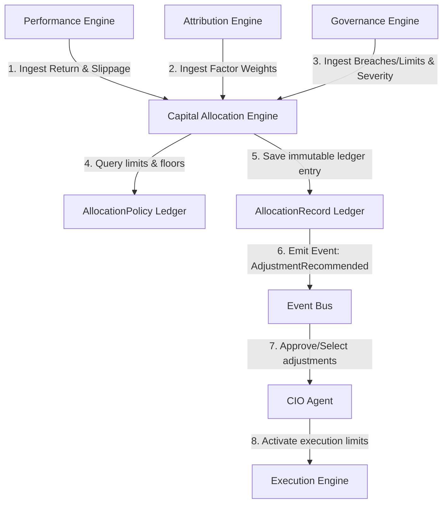
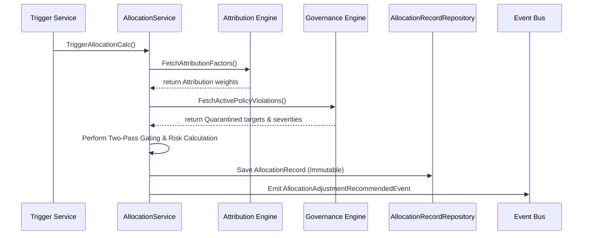
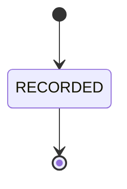

# 20. Capital Allocation Engine Foundation Architecture

This document defines the architecture of Karsa's **Capital Allocation Engine Foundation**, serving as the authoritative optimization, budget distribution, and resource scaling subsystem of the platform.

---

## 1. Executive Summary
The Capital Allocation Engine optimizes and allocates virtual capital and risk budgets across workers, strategies, theses, and portfolios based on historical evidence. It separates allocation optimization from execution, governance, and research.

The engine uses a write-once ledger record model (`AllocationRecord`) for auditing calculations, while maintaining `AllocationPolicy` as an immutable write-once ledger entry. Optimizations are executed via a two-pass eligibility and scoring layer (Hard Gates vs. Soft Multipliers), distributing capital and risk budgets in accordance with parent-child covariance constraints. Governance overrides support Warning, Soft Limit, and Hard Stop severity classes, and the CIO offline fallback policy ensures continuous availability under the last approved weights.

---

## 2. Ownership Boundary Matrix

| Subsystem / Bounded Context | Authoritative Ledgers | Permitted Mutating Writer | Data Store Location | Read/Write Pattern | Downstream Enforcements |
| :--- | :--- | :--- | :--- | :--- | :--- |
| **Capital Allocation** | `allocation_policies`<br>`allocation_records` | `AllocationService` | `db_allocation` | Write-Once / Append-Only | Emits `AllocationAdjustmentRecommendedEvent` with recommended capital and risk bounds. |
| **Governance Engine** | `governance_decisions`<br>`exception_overrides` | `GovernanceService` | `db_governance` | Read-Only to Allocation | Active limits and severity breaches override allocation size recommendations. |
| **Attribution Engine** | `attribution_analyses` | `AttributionService` | `db_attribution` | Read-Only to Allocation | Ingests attribution weights to scale returns against actual alpha contribution. |
| **Performance Engine** | `decision_evaluations` | `EvaluationService` | `db_performance` | Read-Only to Allocation | Ingests returns, slippage, and Brier scores. |
| **Decision Journal** | `decision_journal_records` | `DecisionJournalService` | `db_journal` | Read-Only to Allocation | Calibrates agent confidence bounds against realized predictive error. |
| **Post-Mortem Engine** | `post_mortem_records` | `PostMortemService` | `db_postmortem` | Read-Only to Allocation | Ingests root-cause failure probation flags. |
| **Future CIO Agent** | `cio_approvals` | `CIOService` | `db_cio` | Read-Only to Allocation | Approves, selects, or rejects recommended allocation adjustments. |

---

## 3. Architecture Overview



---

## 4. Domain Model

The domain design utilizes strictly write-once ledger records to prevent aggregate inflation, update locks, and historical audit gaps:

* **Aggregate Roots**:
  * The context contains **zero mutable aggregate roots**, ensuring 100% lock-free concurrency.
* **Ledger Entries**:
  * `AllocationPolicy`: An immutable write-once ledger entry representing a specific version of active limits, risk budgets, exploration floors, and target diversification rules. Updates are appended as new policy records.
  * `AllocationRecord`: An immutable write-once ledger entry capturing the calculation runs, inputs, verified hashes, and final output recommendations.
* **Value Objects**:
  * `ExplorationFloor`: Rules and budget limits reserved for new/unproven workers.
  * `DiversificationCap`: Maximum allocation constraints per worker, strategy, or thesis.
  * `CalibratedConfidence`: Confidence bounds adjusted by Brier score prediction error.
  * `AllocationRecommendation`: Output capital and risk allocation adjustment details.
  * `RiskBudget`: Covariance-constrained risk limit (volatility, drawdown, exposure).

---

## 5. Ledger & Lineage Design

### A. `AllocationPolicy` (Immutable Write-Once Ledger Entry)
- **Responsibilities**: Validates diversification caps, manages exploration floor parameters, and registers new policy configurations.
- **Invariants**:
  - Maximum allocation cap cannot exceed $100\%$ of total capital.
  - Exploration floor must be between $0.05$ ($5\%$) and $0.20$ ($20\%$).
- **Structure**: Tracks `policy_id`, `exploration_floor`, `diversification_caps` (JSONB), `risk_budgets` (JSONB), `created_at`.

### B. `AllocationRecord` (Immutable Write-Once Ledger Entry)
- **Responsibilities**: Captures point-in-time calculation inputs, verified hashes, and outputs.
- **Structure**: Tracks `calculation_id`, `policy_id` (foreign key to active policy), `context_hash` (SHA-256 of inputs), `context_uri` (reference), `recommendations` (JSONB), `recommended_risk_budgets` (JSONB), `created_at`.

---

## 6. Value Objects

* **`ExplorationFloor`**: Defines probation and starter parameters:
  * `floor_ratio`: Minimum allocation percentage reserved for exploration (e.g. $0.05$).
  * `probation_duration_seconds`: Active time window before scaling up.
* **`DiversificationCap`**: Prevents capital concentration:
  * `target_type`: `WORKER`, `STRATEGY`, `THESIS`, or `PORTFOLIO`.
  * `max_allocation_ratio`: Maximum cap ratio (e.g., $0.25$).
* **`CalibratedConfidence`**: Formulates confidence calibrator:
  * `agent_id`: Proposing agent identifier.
  * `prediction_error`: Brier score.
  * `calibration_multiplier`: Calibrated adjustment factor ($1.0 - \text{prediction\_error}$).
* **`RiskBudget`**: Captures risk metrics for propagation:
  * `max_volatility`: Maximum standard deviation of returns.
  * `drawdown_budget`: Maximum peak-to-trough drop before quarantine.
  * `exposure_limit`: Maximum leverage factor (e.g., 1.50).

---

## 7. Event Contracts

### `CapitalAllocationCalculatedEvent`
- **Event Version**: 1
- **Payload**:
```json
{
  "event_id": "evt_ca_calc_001",
  "event_type": "CapitalAllocationCalculatedEvent",
  "correlation_id": "corr_alloc_run_701",
  "causation_id": "cron_alloc_trigger_01",
  "calculation_id": "calc_CA_4001",
  "policy_id": "pol_CA_01",
  "context_hash": "sha256_b3a5c6d7e8f9a0b1c2d3e4f5a6b7c8d9",
  "context_uri": "s3://karsa-allocations/contexts/calc_CA_4001.json",
  "timestamp": "2026-06-14T09:05:00Z",
  "event_version": 1
}
```

### `AllocationAdjustmentRecommendedEvent`
- **Event Version**: 2
- **Payload**:
```json
{
  "event_id": "evt_ca_rec_002",
  "event_type": "AllocationAdjustmentRecommendedEvent",
  "correlation_id": "corr_alloc_run_701",
  "causation_id": "evt_ca_calc_001",
  "calculation_id": "calc_CA_4001",
  "adjustments": [
    {
      "target_type": "THESIS_VERSION",
      "target_id": "th_ver_v2_05",
      "recommended_capital_ratio": "0.00",
      "recommended_risk_budget": {
        "max_volatility": "0.00",
        "drawdown_budget": "0.00",
        "exposure_limit": "0.00"
      },
      "reason": "Thesis quarantined due to volatility breach."
    },
    {
      "target_type": "WORKER",
      "target_id": "worker_risk_02",
      "recommended_capital_ratio": "0.12",
      "recommended_risk_budget": {
        "max_volatility": "0.15",
        "drawdown_budget": "0.05",
        "exposure_limit": "1.50"
      },
      "reason": "Calibrated confidence and Brier score within bounds."
    }
  ],
  "timestamp": "2026-06-14T09:05:02Z",
  "event_version": 2
}
```

---

## 8. Application Services
- **`AllocationService`**: Evaluates inputs (Performance, Attribution, Governance), applies policy limits and risk budgets, computes adjustments via the two-pass eligibility/scoring layer, records calculations, and emits events.
- **`PolicyManagementService`**: Manages CRUD/updates on `AllocationPolicy` ledger tables.

---

## 9. Persistence Design

```sql
CREATE TABLE allocation_policies (
    policy_id VARCHAR(64) PRIMARY KEY,
    governance_policy_decision_id VARCHAR(64), -- Validated by Gov Engine
    cio_signature VARCHAR(256),                 -- Signed by CIO Agent
    exploration_floor NUMERIC(4,2) NOT NULL,
    diversification_caps JSONB NOT NULL,
    risk_budgets JSONB NOT NULL DEFAULT '{}',
    created_at TIMESTAMP NOT NULL DEFAULT CURRENT_TIMESTAMP,
    CONSTRAINT chk_floor CHECK (exploration_floor >= 0.05 AND exploration_floor <= 0.20)
);

CREATE TABLE allocation_records (
    calculation_id VARCHAR(64) PRIMARY KEY,
    policy_id VARCHAR(64) REFERENCES allocation_policies(policy_id),
    context_hash VARCHAR(64) NOT NULL,
    context_uri VARCHAR(512) NOT NULL,
    recommendations JSONB NOT NULL,
    recommended_risk_budgets JSONB NOT NULL DEFAULT '{}',
    created_at TIMESTAMP NOT NULL DEFAULT CURRENT_TIMESTAMP
);
```

---

## 10. Integration Design

- **Attribution Engine**: Allocation pulls causal scores to weight relative alpha contributions. Flagging variance > 10% triggers reallocation candidacy.
- **Performance Engine**: Allocation pulls scorecards to identify returns, prediction errors, and slippage.
- **Governance Engine**: If Governance logs a breach or override, Allocation propagates WARNING, SOFT_LIMIT, or HARD_STOP rules.
- **CIO Agent**: Allocation publishes adjustments. The CIO Agent reviews them and publishes `AllocationApprovedEvent`. If the CIO is offline, standard operations fallback to Continue Last Approved Policy.

---

## 11. Sequence Diagrams

### A. Capital Allocation Optimization Flow


---

## 12. State Diagrams

### `AllocationPolicy` State Model

*Note: Because Allocation Policies are strictly write-once ledger entries, they undergo no state transitions.*

### `AllocationRecord` State Model


---

## 13. Failure Handling
- **Data Inconsistencies**: If returns or attribution scores are missing, Allocation defaults to a **fail-safe** probation allocation (exploration floor) to avoid starvation.
- **Policy Violation Override**: Any active breach automatically results in a $0\%$ allocation, overriding all other calculations.

---

## 14. OCC Strategy
Optimistic Concurrency Control (OCC) is **completely eliminated** from the Capital Allocation Engine context. Because all records (both `AllocationPolicy` and `AllocationRecord`) are strictly write-once and append-only, row updates never occur. This removes locking and version tracking overhead entirely.

---

## 15. Scalability Analysis
Target: **100M+ evaluations per day**.
- **Object Store Offloading**: All heavy evaluation contexts (input variables, attribution grids) are stored in object storage, keeping relational DB inserts lightweight.
- **Hotspots Avoidance**: Range partitioning on `created_at` prevents write hotspots.

---

## 16. Security Analysis
- **Hindsight Bias Prevention**: Ledger entries are write-once. Triggers block all `UPDATE` and `DELETE` queries.
- **Signing**: Recommendations require CIO Agent signature validation before downstream execution.

---

## 17. Migration Strategy
1. Deploy allocation relational tables.
2. Bootstrap the default `AllocationPolicy` (5% exploration floor, 25% max diversification cap).
3. Conduct shadow runs using historical scorecards to validate allocation outputs.

---

## 18. Risks
- **Feedback Loop Delays**: High latency in Attribution factor calculations could delay adjustments. *Remediation*: Allocation uses the latest cached version of attribution scores.

---

## 19. ADR Decisions
Refer to ADR-043 and ADR-044.

---

## 20. Architecture Challenges

### A. FIND-30.7 — Hard Gates vs Soft Multipliers
To prevent capital leakages into non-compliant, failing, or uncalibrated targets, the allocation model enforces a strict separation between binary eligibility gates (Hard Gates) and mathematical scaling metrics (Soft Multipliers):
- **Eligibility Evaluation Layer**: Checks all Hard Gates (Governance Breach, Severe Review Failure [Score < 0.30], Extreme Calibration Failure [Brier > 0.80]). Triggering any gate sets eligibility to `0.0` immediately.
- **Allocation Scoring Layer**: Applies soft multipliers to eligible targets:
  $$\text{Adjusted Return} = \text{Realized Return} \times \text{Attribution Factor} \times (1.0 - \text{Brier Score})$$
  $$\text{Final Weight} = \text{Adjusted Return} \times \text{Review Multiplier} \times \text{Governance Multiplier} \times \text{Post-Mortem Multiplier}$$
  Multipliers:
  - Review Multiplier: $0.5 + 0.5 \times \text{Review Score}$ (where $\text{Review Score} \in [0.0, 1.0]$).
  - Governance Multiplier: $1.0$ (compliant), $0.5$ (exception override), or $0.0$ (active breach).
  - Post-Mortem Multiplier: $1.0$ (clean) or $0.5$ (root-cause failure probation).

### B. FIND-30.8 — Portfolio Risk Budget Model
The target VIF architecture requires allocating both Capital limits and Risk Budgets (Volatility, Drawdown Budgets, and Exposure Limits). The sum of child risk budgets is constrained recursively by covariance-adjusted ceilings:
$$\sigma_p = \sqrt{w^T \Sigma w} \le \text{Portfolio Risk Budget}$$
Risk budgets propagate top-down from Portfolio $\to$ Strategy $\to$ Thesis $\to$ Worker. If a target's risk profile increases, the Capital Allocation Engine dynamically scales down its capital budget to maintain the parent node's risk budget ceiling.

### C. FIND-30.9 — Governance Severity Model
Compliance overrides support three levels of severity:
- **WARNING**: Logged only; zero capital/execution impact.
- **SOFT_LIMIT**: Scales maximum policy allocations and active limits down to 50%.
- **HARD_STOP**: Defunds the target immediately (Eligibility = 0.0) and triggers execution liquidation.

### D. FIND-30.10 — CIO Offline Policy
If the CIO Agent is offline/unavailable, the system executes **Option B (Continue Last Approved Policy)**. Active weights and policies remain unchanged, but Governance `HARD_STOP` and `SOFT_LIMIT` overrides bypass the CIO to defund or throttle targets immediately.

### E. FIND-30.11 — Attribution Recalculation Policy
Recalculating historic attribution factors NEVER mutates historical `AllocationRecord` entries (preserving replay determinism). If the recalculated variance of active attribution factors exceeds 10%, the target is flagged as a **Reallocation Candidate**, triggering a new run to adjust future allocations.

### F. FIND-30.12 — Exploration Floor Ownership Model
Ownership boundaries are defined as follows:
- **Governance Engine**: Defines the absolute floor bounds (5%-20%).
- **Capital Allocation Engine**: Calculates the exact ratio distribution (default 8%).
- **CIO Agent**: Approves modifications to the active floor percentage.
- **Review Engine**: Audits floor compliance.

---

## 21. Architecture Delta Analysis

| Virtual Investment Firm Stage | Pre-Sprint-30 Baseline | Post-Sprint-30 Allocation Design | Gaps Closed |
| :--- | :--- | :--- | :--- |
| **Capital & Risk Optimization** | Capital allocation via linear multipliers; raw return focus. | Two-pass eligibility gating, multi-factor risk budgeting, and severity overrides. | Decoupled limit propagation, covariance constraints, and audit determinism. |

---

## 22. Acceptance Criteria
1. **Calibration Constraint**: Raw confidence must be adjusted by Brier prediction error: `Raw Confidence * (1.0 - Brier Score)`.
2. **Immutability**: Appended `AllocationRecord` and `AllocationPolicy` rows must raise a database exception on `UPDATE`/`DELETE` attempts.
3. **Exploration Floor**: Capital Allocation must allocate at least $5\%$ of total capital to unproven/probation targets.
4. **Target Hierarchy**: Recommendations must target the polymorphous `AllocationTarget` node structure, enabling portfolio, strategy, and thesis level adjustments.
5. **Multi-Factor Gating**: Allocator calculations must separate Hard eligibility gates from Soft scaling multipliers.

---

## 23. Final Verdict

**ARCHITECTURE_FROZEN**
