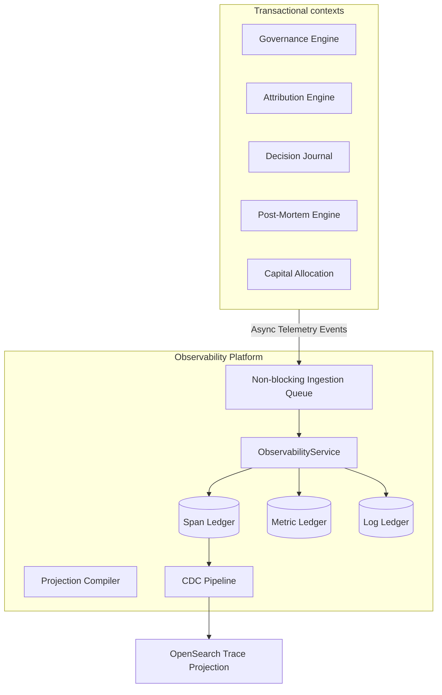

# 21. Observability Platform Foundation Architecture

This document defines the architecture of Karsa's **Observability Platform Foundation**, serving as the authoritative distributed tracing, logging, and metric aggregation subsystem of the Virtual Investment Firm (VIF).

---

## 1. Executive Summary
The Observability Platform is a centralized platform utility designed to collect, index, and correlate all traces, metrics, and logs across Karsa's bounded contexts. 

To ensure lock-free ingestion and high scalability (100M+ events/day), the platform contains **zero mutable aggregate roots** and enforces a strictly **immutable, write-once Span Ledger and read-side Trace Projection** design. Other bounded contexts do not query the Observability databases directly for domain calculations; instead, Observability acts as a supplementary metadata store, while authoritative replays are executed against static snapshots in object storage.

---

## 2. Ownership Boundary Matrix

| Subsystem / Context | Authoritative Telemetry Ledger | Permitted Mutating Writer | Ingestion Source | Ingestion Pattern | Downstream Enforcements |
| :--- | :--- | :--- | :--- | :--- | :--- |
| **Observability** | `telemetry_spans`<br>`telemetry_logs`<br>`telemetry_metrics` | `ObservabilityService` | Async Event Bus / Queue | Non-blocking Append-Only | Emits `TraceRecordedEvent`, provides projections to CIO. |
| **Governance Engine** | `governance_decisions` | `GovernanceService` | Read-only from TraceContext | Pulls TraceContext | Overrides trade executions on breach. |
| **Attribution Engine** | `attribution_analyses` | `AttributionService` | Read-only from Lineage | Pulls structural DAG | Maps returns to alpha weights. |
| **Decision Journal** | `decision_journal_records` | `DecisionJournalService` | Read-only from TraceId | Pulls active TraceId | Logs prediction calibrations. |
| **Post-Mortem Engine** | `post_mortem_records` | `PostMortemService` | Read-only from TraceId | Pulls active TraceId | Emits root-cause probation limits. |
| **Capital Allocation** | `allocation_records` | `AllocationService` | Read-only from Lineage | Pulls active Lineage | Recommends capital & risk limits. |

---

## 3. Architecture Overview



---

## 4. Domain Model

The domain architecture utilizes strictly write-once records and value objects to eliminate locking overhead and maintain replay reliability:

- **Aggregate Roots**:
  - Bounded context contains **zero mutable aggregate roots**, avoiding concurrency conflicts entirely.
- **Append-Only Telemetry Streams**:
  - `TraceSpan`: An immutable representation of an execution interval containing context metadata.
  - `MetricEntry`: An immutable, point-in-time quantitative measurement.
  - `LogEntry`: An immutable, structured logging entry bound to an active trace.

---

## 5. Aggregate Design: Span Ledger + Trace Projection
We reject mutable aggregates for telemetry as they introduce database locks, write contention, and OCC write failures under high throughput (100M+ events/day). Spans and telemetry items are written as **append-only telemetry streams**. 
- **Span Ledger**: An append-only, strictly immutable ledger table where every child span is written as an independent row.
- **Trace Projection**: An asynchronous read-side projection compiled via CDC from the Span Ledger and loaded into OpenSearch/ElasticSearch, keeping database writes strictly lock-free.

---

## 6. Value Objects

* **`TraceId`**: A globally unique 128-bit identifier representing an entire request or transaction chain.
* **`CorrelationId`**: A globally unique 128-bit identifier grouping asynchronous, batched execution loops.
* **`CausationId`**: A globally unique 128-bit identifier pointing to the event or span ID that triggered the current operation.
* **`SpanId`**: A unique 64-bit identifier representing a specific segment of execution.
* **`TraceContext`**: The combination of `TraceId`, `CorrelationId`, `CausationId`, and `SpanId` passed across thread/network boundaries.
* **`TelemetrySource`**: Identifies the calling bounded context, service version, and executor agent ID.

---

## 7. Event Contracts

### `TraceRecordedEvent`
- **Event Version**: 1
- **Payload**:
```json
{
  "event_id": "evt_obs_trace_001",
  "event_type": "TraceRecordedEvent",
  "correlation_id": "corr_obs_901",
  "causation_id": "span_exec_402",
  "trace_id": "tr_vif_7001",
  "span_id": "span_exec_501",
  "parent_span_id": "span_exec_402",
  "source": {
    "context": "Attribution",
    "agent_id": "agent_attr_01"
  },
  "payload": {
    "operation": "CalculateAttributionWeights",
    "status": "SUCCESS"
  },
  "timestamp": "2026-06-14T09:15:00Z",
  "event_version": 1
}
```

### `MetricRecordedEvent`
- **Event Version**: 1
- **Payload**:
```json
{
  "event_id": "evt_obs_metric_001",
  "event_type": "MetricRecordedEvent",
  "correlation_id": "corr_obs_901",
  "causation_id": "span_exec_501",
  "metric_name": "performance_slippage_bps",
  "metric_value": 4.5,
  "labels": {
    "worker_id": "worker_risk_02"
  },
  "timestamp": "2026-06-14T09:15:01Z",
  "event_version": 1
}
```

### `LogRecordedEvent`
- **Event Version**: 1
- **Payload**:
```json
{
  "event_id": "evt_obs_log_001",
  "event_type": "LogRecordedEvent",
  "correlation_id": "corr_obs_901",
  "causation_id": "span_exec_501",
  "trace_id": "tr_vif_7001",
  "span_id": "span_exec_501",
  "level": "INFO",
  "message": "Attribution calculated alpha factor score: 0.85",
  "timestamp": "2026-06-14T09:15:02Z",
  "event_version": 1
}
```

---

## 8. Telemetry Architecture

The platform architecture divides telemetry into three distinct physical ledgers sharing ingestion structures:

1. **Span Ledger**: Captures transactional spans, executing agents, latency metrics, and trace contexts.
2. **Metrics Ledger**: Aggregates time-series performance data, memory bounds, and operational counts.
3. **Logging Ledger**: Stores debug/warning/error logs emitted during agent execution, bound strictly to TraceIds.

#### Shared Infrastructure vs. Schema Isolation
- *Decision*: Spans, metrics, and logs share physical range-partitioned infrastructure (e.g. database nodes and disk volumes partitioned by week/month), but maintain **strict schema isolation**. 
- *Justification*: This isolates read-write workloads. Metrics tables (high volume, low latency) can be queried independently from logs (very high volume, text-heavy), preventing one data type's query load from starving another.

---

## 9. Lineage Architecture (FIND-31.1)

To prevent domain model leakage and violates bounded context boundaries, lineage is split into two layers:

- **Technical Lineage**: Owned by the **Observability Platform**. Covers `traces`, `spans`, `metrics`, `logs`, `correlation`, and `causation`.
- **Business Lineage**: Owned by a future **Knowledge Graph Bounded Context** (Option C). Covers structural relations mapping Karsa's business flow:
  $$\text{Research} \to \text{Thesis} \to \text{Decision} \to \text{Execution} \to \text{Outcome} \to \text{Attribution} \to \text{Review} \to \text{Post-Mortem} \to \text{Governance} \to \text{Allocation}$$
  This isolates investment logic from technical execution traces.

### Migration Path to Future Knowledge Graph Context
1. **Phase 1 (Current)**: Bounded contexts stamp both technical trace contexts and relational keys (e.g. `thesis_id`, `decision_id`) in their emitted event envelopes. Observability indexes these relational keys as unstructured attributes (`attributes` JSONB) inside spans.
2. **Phase 2 (Future)**: The Knowledge Graph service is introduced. It subscribes to the event streams, extracts the structural business keys, maps the relationships, and writes them to a dedicated metadata graph database.
3. **Phase 3**: Observability deprecates its business tag mapping and structural relationship query APIs, remaining strictly focused on technical tracing and log aggregation.

---

## 10. Correlation / Causation Model

### A. Identifier Definitions
- **`trace_id`**: A globally unique identifier for a complete transactional business chain. It is initialized when a thesis is proposed or manually triggered, and propagates downstream across all events.
- **`correlation_id`**: A globally unique identifier grouping concurrent asynchronous execution batches. A parent `trace_id` remains unchanged.
- **`causation_id`**: Points directly to the event ID or span ID of the immediate caller that triggered this task execution.

### B. Propagation Rules
1. **Synchronous Call**: Headers pass the active `TraceContext`. The receiver sets `parent_span_id = caller_span_id` and `causation_id = caller_span_id`.
2. **Asynchronous Publish**: The event envelope copies the active `trace_id` and `correlation_id`. The receiver sets its span's `causation_id = event_id`.
3. **Batch Aggregation**: If a process aggregates multiple traces, the aggregator creates a new trace (with a new `trace_id`) and maps historical inputs using `LineageRecordedEvent` references, linking the new trace to the parent inputs.

---

## 11. Replay Source Matrix (FIND-31.2)

The Observability Platform is **not** an authoritative replay source. Telemetry acts as supplementary evidence only.

### Replay Source Matrix

| Bounded Context | Authoritative Source of Truth | Replay Source | Supplementary Evidence Sources |
| :--- | :--- | :--- | :--- |
| **Decision Journal** | `decision_journal_records` | Immutable Context Payload in Object Storage | execution logs, trace logs, latency metrics |
| **Governance Engine** | `governance_decisions` ledger | Snapshotted active Governance Policy in Object Storage | policy execution traces, rule evaluation logs |
| **Attribution Engine** | `attribution_analyses` ledger | Snapshotted alpha factors in Object Storage | factor calculation debug traces, metric series |
| **Post-Mortem Engine** | `post_mortem_records` ledger | Structured Post-Mortem Event in DB | debug logs of error trace analysis |
| **Capital Allocation** | `allocation_records` ledger | Frozen calculation input snapshot in Object Storage | model evaluation logs, optimizer runs |

### Replay Reconstruction Flow
1. An Auditor requests a historical replay for a given `DecisionId`.
2. The Replay Coordinator queries the authoritative **Decision Journal** database to retrieve the `decision_journal_record` and its associated `context_hash`.
3. The Replay Coordinator pulls the frozen context payload from the **Object Storage** using the `context_hash`.
4. The model calculations are re-executed locally against the payload data to verify output determinism.
5. The **Observability Engine** is queried with the `TraceId` to retrieve supplementary evidence (operational logs, performance metrics, span latencies) for forensic auditing, but these logs are *never* fed into the replay execution engine itself.

---

## 12. Persistence Design

```sql
CREATE TABLE telemetry_spans (
    span_id VARCHAR(64) PRIMARY KEY,
    parent_span_id VARCHAR(64),
    trace_id VARCHAR(64) NOT NULL,
    correlation_id VARCHAR(64) NOT NULL,
    causation_id VARCHAR(64) NOT NULL,
    context_name VARCHAR(64) NOT NULL,
    operation_name VARCHAR(128) NOT NULL,
    attributes JSONB NOT NULL DEFAULT '{}',
    start_time TIMESTAMP NOT NULL,
    end_time TIMESTAMP NOT NULL,
    duration_ms INT NOT NULL
);

CREATE TABLE telemetry_metrics (
    metric_id VARCHAR(64) PRIMARY KEY,
    metric_name VARCHAR(128) NOT NULL,
    metric_value NUMERIC(16,6) NOT NULL,
    labels JSONB NOT NULL DEFAULT '{}',
    created_at TIMESTAMP NOT NULL DEFAULT CURRENT_TIMESTAMP
);

CREATE TABLE telemetry_logs (
    log_id VARCHAR(64) PRIMARY KEY,
    trace_id VARCHAR(64) REFERENCES telemetry_spans(trace_id),
    span_id VARCHAR(64) REFERENCES telemetry_spans(span_id),
    level VARCHAR(16) NOT NULL,
    message TEXT NOT NULL,
    attributes JSONB NOT NULL DEFAULT '{}',
    created_at TIMESTAMP NOT NULL DEFAULT CURRENT_TIMESTAMP
);
```

- **Storage Evaluation**: Relational storage owns structural metadata, transaction ids, and foreign keys. Heavy payload context files (e.g. agent thought logs) are offloaded to object storage (Object Lock enabled), and search indices are built asynchronously.
- **Ownership**: The Observability Engine is the sole writer.

---

## 13. Search Architecture
- **CDC Strategy**: We implement Change Data Capture (CDC) via Kafka/Debezium tracking inserts on `telemetry_spans` and `telemetry_logs`.
- **Indexing Ownership**: Telemetry writes trigger asynchronous CDC pipelines that stream records to OpenSearch for hierarchical trace projections.
- **Query Boundary**: Bounded contexts do not query the observability indices directly for domain business logic. Search is reserved strictly for audit visualization and developer debugging.

---

## 14. Telemetry Sampling Architecture (FIND-31.4)

To control storage costs while guaranteeing audit complete compliance trails, we implement a three-tiered sampling policy:

- **Tier 1 (Governance, Capital Allocation, Decision Journal)**:
  - *Sampling*: 100% Ingestion.
  - *Retention*: 5 Years (WORM compliant storage).
- **Tier 2 (Attribution, Performance, Review, Post-Mortem)**:
  - *Sampling*: Adaptive. 100% of errors, violations, and anomalies are retained. Successful executions are sampled at 10%.
  - *Retention*: 1 Year.
- **Tier 3 (Debug & Operational Telemetry)**:
  - *Sampling*: 1% Random.
  - *Retention*: 14 Days.

*Authoritative Ledgers Unaffected*: Telemetry sampling only discards logs, metrics, and tracing spans stored in the Observability database. Authoritative ledgers (e.g. `decision_journal_records`, `allocation_records`) are transactionally written to their respective bounded databases and are **100% preserved**, completely unaffected by telemetry sampling.

---

## 15. Observability vs Audit Boundary Matrix (FIND-31.5)

| Capability | Bounded Context Owner | Reason |
| :--- | :---: | :--- |
| **Operational Telemetry** | Observability Platform | Ephemeral performance tracking (latency, CPU, errors). |
| **Debugging Logs** | Observability Platform | Developer troubleshooting information. |
| **Distributed Tracing Spans** | Observability Platform | Call trace visualization across services. |
| **Compliance Evidence** | Governance Engine | Authorized, cryptographically signed ledger items. |
| **Policy Decisions** | Governance Engine | Immutable configuration history. |
| **Exception Approvals** | Governance Engine | Authorized temporary overrides. |
| **Governance Overrides** | Governance Engine | Authoritative active blocks. |
| **Audit Reports** | Governance Engine | Compilation of authoritative compliance checks. |
| **Forensic Investigations** | Hybrid | Walk structural graphs (Observability) to verify signed ledgers (Governance). |

---

## 16. Failure Handling
- **Telemetry Outages**: If the ingestion queue is full, calling services log telemetry locally to disc and retry asynchronously, ensuring primary transactional operations are unaffected.
- **Missing Traces**: Incomplete tracing graphs default to structural parent-child representations using cached lineage links.
- **Delayed Events**: Late arriving spans are appended to the tracing tables. Since tables are append-only and keyed by TraceId, they merge naturally without update conflicts.

---

## 17. OCC Strategy
Optimistic Concurrency Control (OCC) is **completely eliminated** from the Observability Platform. Because all telemetry entries and lineage logs are modeled as strictly write-once, append-only streams, update collisions are impossible.

---

## 18. Scalability Analysis
Target: **100M+ telemetry events per day**.
- **Monthly Partitioning**: Databases partition tables monthly on `created_at` to avoid write hotspots.
- **Retention & Archival**: Telemetry remains in high-performance hot storage for 30 days, moves to warm storage for 90 days, and is compressed and archived in cold glacier-like object storage for 5 years.
- **Async Indexing**: CDC indexers consume from secondary replicas to avoid degrading primary database write throughput.

---

## 19. Security Analysis
- **Audit Integrity**: Database triggers raise exceptions on any `UPDATE` or `DELETE` commands.
- **Tamper Resistance**: Archived object storage files are stored in write-once-read-many (WORM) compliance mode, protecting audit logs from deletion by compromised agents.

---

## 20. Architecture Delta Analysis

| Observability Capabilities | Pre-Sprint-31 Baseline | Post-Sprint-31 Observability Design | Gaps Resolved |
| :--- | :--- | :--- | :--- |
| **Lineage Tracking** | Disconnected context-specific logging tables. | Segregated Technical Lineage (Observability) and Business Lineage (Knowledge Graph). | Prevented domain coupling and God Context bottlenecks. |
| **Correlation Model** | Ad-hoc identifiers. | Three-key propagation (`TraceId`, `CorrelationId`, `CausationId`). | Resolved trace fragmentation under asynchronous loops. |
| **Trace Storage** | Single trace tables. | Span Ledger + Trace Projection. | Eliminated write lock contention under high-throughput. |

---

## 21. Risks
- **Storage Cost Inflation**: High telemetry logs could exhaust storage. *Remediation*: Aggressive gzip compression and schema optimization for JSONB columns, offloading debug-level logs to cheap object storage.

---

## 22. ADR Decisions
Refer to ADR-045 and ADR-046.

---

## 23. Acceptance Criteria
1. **Immutability Invariant**: Writing an `UPDATE` or `DELETE` statement against any telemetry table must throw a database exception.
2. **Context Propagation**: Event interfaces must enforce the presence of `TraceId`, `CorrelationId`, and `CausationId`.
3. **Decoupled Operation**: Telemetry ingestion must run out-of-band, ensuring observability database write latencies do not block other engine executions.

---

## 24. Final Verdict

### VIF Success Questions Answers

1. **Should observability own lineage? Or should lineage be a separate future context?**
   Observability owns technical lineage (traces/spans/logs/metrics). A future Knowledge Graph context owns business lineage (Research -> Thesis -> Decision). This prevents domain model leakage.
2. **Should traces be immutable? Evaluate replay implications.**
   Yes, traces are immutable. Allowing trace mutation introduces hindsight contamination and breaks replay determinism.
3. **Can Governance rely on Observability as evidence?**
   No. Telemetry ingestion is lossy during partitions. Governance must rely on its own transactionally complete, cryptographically signed ledger. Telemetry serves as supplementary profiling data.
4. **Can Attribution reconstruct causal chains using lineage only?**
   No. Lineage defines the structural DAG, but Attribution must calculate mathematical covariance factors using performance returns.
5. **Can CIO use Observability directly?**
   Only through projections. CIO agents read aggregated projections asynchronously to avoid write/read lock contention on hot telemetry paths.

**ARCHITECTURE_FROZEN**
