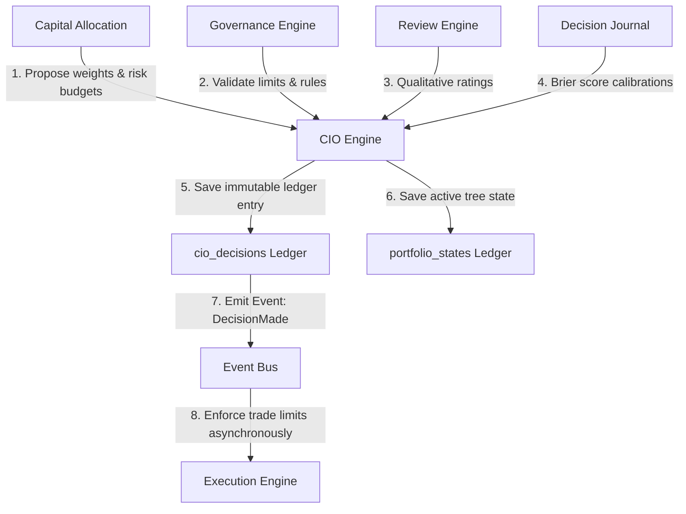
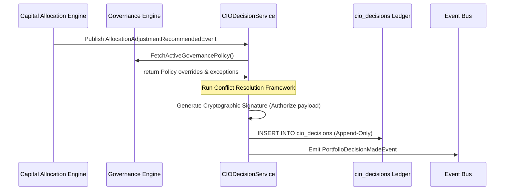
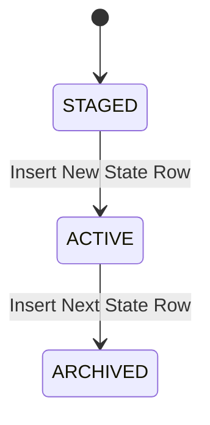

# 22. CIO Engine Foundation Architecture

This document defines the architecture of Karsa's **CIO Engine Foundation**, serving as the authoritative investment committee, portfolio orchestration, and execution authorization subsystem of the Virtual Investment Firm (VIF).

---

## 1. Executive Summary
The CIO Engine is the authoritative portfolio-level decision maker. It orchestrates risk and capital allocation adjustments, promotes/retires theses, and activates/retires workers. 

To eliminate lock contention, ensure database scalability (100M+ events/day ecosystem), and guarantee audit integrity, the platform contains **zero mutable aggregate roots** and enforces an **immutable write-once decision ledger** model. All authorization instructions are cryptographically signed by the CIO Agent, establishing a tamper-proof trail that execution engines consume. Governance remains final and authoritative; the CIO Engine cannot override active compliance limits.

---

## 2. Ownership Boundary Matrix

| Subsystem / Context | Authoritative Ledger | Permitted Mutating Writer | Data Store Location | Read/Write Pattern | Downstream Enforcements |
| :--- | :--- | :--- | :--- | :--- | :--- |
| **CIO Engine** | `cio_decisions`<br>`portfolio_states` | `CIODecisionService` | `db_cio` | Write-Once / Append-Only | Emits cryptographically signed execution authorization. |
| **Governance Engine** | `governance_decisions` | `GovernanceService` | `db_governance` | Read-Only to CIO | Active compliance rules override CIO decisions. |
| **Capital Allocation** | `allocation_records` | `AllocationService` | `db_allocation` | Read-Only to CIO | Provides capital & risk recommendation inputs. |
| **Decision Journal** | `decision_journal_records` | `DecisionJournalService` | `db_journal` | Read-Only to CIO | Logs prediction Brier score calibrations. |
| **Review Engine** | `review_verdicts` | `ReviewService` | `db_review` | Read-Only to CIO | Provides qualitative rating bounds. |
| **Execution Engine** | `execution_records` | `ExecutionService` | `db_execution` | Read-Only to CIO | Enforces active trading limits from signed decisions. |

---

## 3. Architecture Overview



---

## 4. Domain Model

The domain design utilizes strictly write-once ledger records and value objects to prevent aggregate inflation and ensure deterministic replay capability:

- **Aggregate Roots**:
  - The context contains **zero mutable aggregate roots**, ensuring 100% lock-free concurrency.
- **Ledger Entries**:
  - `CIODecision`: An immutable write-once ledger entry capturing approvals, rejections, promotions, and retirements.
  - `PortfolioState`: An immutable write-once ledger entry representing the active configuration tree of the portfolio.
- **Value Objects**:
  - `PortfolioTree`: Structural configuration linking Portfolio $\to$ Strategy $\to$ Thesis $\to$ Decision $\to$ Worker.
  - `AuthorizationSignature`: Cryptographic proof authorizing the downstream execution engine to modify limits.

---

## 5. Aggregate Design
Should the CIO context use mutable aggregates, a portfolio aggregate + decision aggregate, or an immutable append-only decision ledger?

- **Option A (Mutable CIODecision Aggregate)**: Represents decisions as aggregates updated with status (e.g. `PROPOSED` $\to$ `APPROVED`).
  - *Evaluation*: Rejected. Mutable aggregates require OCC validation, causing database locks and write contention when multiple agents execute concurrent adjustments.
- **Option B (Portfolio + Decision Aggregates)**: Represents the portfolio configuration as a mutable aggregate and decisions as immutable ledger entries.
  - *Evaluation*: Rejected. Portfolio state updates still require row locking and concurrency checks, risking write hotspots.
- **Option C (Immutable Append-Only Decision Ledger - Canonical Model)**: The context contains zero mutable aggregates. Every decision and active portfolio configuration is appended to the ledger as a write-once record. The current state is projected on the read-side by querying the latest ledger entry prior to the target timestamp.
  - *Justification*: Guarantees 100% replay determinism, eliminates database lock contention, and provides a complete audit trail.

---

## 6. Value Objects

* **`DecisionId`**: Globally unique 128-bit identifier for a CIO decision.
* **`PortfolioId`**: Identifies a specific VIF portfolio node.
* **`StrategyId`**: Identifies an active VIF strategy node.
* **`ThesisId`**: Identifies a specific VIF thesis version.
* **`WorkerId`**: Identifies an active VIF execution agent.
* **`CryptographicSignature`**: The cryptographically signed payload hash authorizing limit changes.

---

## 7. Event Contracts

### `PortfolioDecisionMadeEvent`
- **Event Version**: 1
- **Payload**:
```json
{
  "event_id": "evt_cio_dec_001",
  "event_type": "PortfolioDecisionMadeEvent",
  "correlation_id": "corr_cio_301",
  "causation_id": "evt_ca_rec_002",
  "decision_id": "dec_CIO_9011",
  "portfolio_id": "port_vif_main",
  "signature": "sig_ed25519_abc123xyz...",
  "timestamp": "2026-06-14T09:20:00Z",
  "event_version": 1
}
```

### `AllocationProposalApprovedEvent`
- **Event Version**: 1
- **Payload**:
```json
{
  "event_id": "evt_cio_app_001",
  "event_type": "AllocationProposalApprovedEvent",
  "correlation_id": "corr_cio_301",
  "causation_id": "evt_ca_rec_002",
  "decision_id": "dec_CIO_9011",
  "calculation_id": "calc_CA_4001",
  "approved_adjustments": [
    {
      "target_type": "WORKER",
      "target_id": "worker_risk_02",
      "approved_capital_ratio": "0.12",
      "approved_risk_budget": {
        "max_volatility": "0.15",
        "drawdown_budget": "0.05",
        "exposure_limit": "1.50"
      }
    }
  ],
  "timestamp": "2026-06-14T09:20:01Z",
  "event_version": 1
}
```

### `AllocationProposalRejectedEvent`
- **Event Version**: 1
- **Payload**:
```json
{
  "event_id": "evt_cio_rej_001",
  "event_type": "AllocationProposalRejectedEvent",
  "correlation_id": "corr_cio_301",
  "causation_id": "evt_ca_rec_002",
  "decision_id": "dec_CIO_9012",
  "calculation_id": "calc_CA_4001",
  "reason": "Risk budget exceeded at strategy level.",
  "timestamp": "2026-06-14T09:20:02Z",
  "event_version": 1
}
```

### `ThesisPromotionApprovedEvent`
- **Event Version**: 1
- **Payload**:
```json
{
  "event_id": "evt_cio_th_promo_001",
  "event_type": "ThesisPromotionApprovedEvent",
  "correlation_id": "corr_cio_302",
  "causation_id": "cmd_promo_th_03",
  "decision_id": "dec_CIO_9013",
  "thesis_id": "th_ver_v2_05",
  "target_strategy_id": "strat_alpha_long",
  "timestamp": "2026-06-14T09:20:03Z",
  "event_version": 1
}
```

### `ThesisRetirementApprovedEvent`
- **Event Version**: 1
- **Payload**:
```json
{
  "event_id": "evt_cio_th_ret_001",
  "event_type": "ThesisRetirementApprovedEvent",
  "correlation_id": "corr_cio_303",
  "causation_id": "cmd_retire_th_01",
  "decision_id": "dec_CIO_9014",
  "thesis_id": "th_ver_v1_08",
  "timestamp": "2026-06-14T09:20:04Z",
  "event_version": 1
}
```

### `WorkerActivationApprovedEvent`
- **Event Version**: 1
- **Payload**:
```json
{
  "event_id": "evt_cio_wrk_act_001",
  "event_type": "WorkerActivationApprovedEvent",
  "correlation_id": "corr_cio_304",
  "causation_id": "cmd_activate_wrk_02",
  "decision_id": "dec_CIO_9015",
  "worker_id": "worker_risk_02",
  "parent_thesis_id": "th_ver_v2_05",
  "timestamp": "2026-06-14T09:20:05Z",
  "event_version": 1
}
```

### `WorkerRetirementApprovedEvent`
- **Event Version**: 1
- **Payload**:
```json
{
  "event_id": "evt_cio_wrk_ret_001",
  "event_type": "WorkerRetirementApprovedEvent",
  "correlation_id": "corr_cio_305",
  "causation_id": "cmd_retire_wrk_05",
  "decision_id": "dec_CIO_9016",
  "worker_id": "worker_risk_01",
  "timestamp": "2026-06-14T09:20:06Z",
  "event_version": 1
}
```

### `GovernanceExceptionRequestedEvent`
- **Event Version**: 1
- **Payload**:
```json
{
  "event_id": "evt_cio_gov_exc_001",
  "event_type": "GovernanceExceptionRequestedEvent",
  "correlation_id": "corr_cio_306",
  "causation_id": "cmd_req_exc_01",
  "decision_id": "dec_CIO_9017",
  "exception_details": {
    "target_worker": "worker_risk_02",
    "requested_leverage_limit": "2.00",
    "justification": "Mitigate market crash delta exposure during execution phase."
  },
  "timestamp": "2026-06-14T09:20:07Z",
  "event_version": 1
}
```

---

## 8. Application Services
- **`CIODecisionService`**: Handles incoming proposals (allocation, promotions, retirements), applies the conflict resolution framework, records decisions in the write-once ledger, and signs payloads.
- **`PortfolioOrchestrationService`**: Computes read-side projections of the active portfolio hierarchy from the ledger.

---

## 9. Persistence Design

```sql
CREATE TABLE cio_decisions (
    decision_id VARCHAR(64) PRIMARY KEY,
    calculation_id VARCHAR(64),                 -- Capital Allocation ID (optional)
    governance_exception_id VARCHAR(64),        -- Exception reference (optional)
    action_type VARCHAR(64) NOT NULL,          -- APPROVE_ALLOCation, PROMOTE_THESIS, RETIRE_WORKER, etc.
    target_node_type VARCHAR(64) NOT NULL,       -- PORTFOLIO, STRATEGY, THESIS, WORKER
    target_node_id VARCHAR(64) NOT NULL,
    decision_payload JSONB NOT NULL DEFAULT '{}',
    cryptographic_signature VARCHAR(256) NOT NULL,
    created_at TIMESTAMP NOT NULL DEFAULT CURRENT_TIMESTAMP
);

CREATE TABLE portfolio_states (
    state_id VARCHAR(64) PRIMARY KEY,
    decision_id VARCHAR(64) REFERENCES cio_decisions(decision_id),
    portfolio_tree JSONB NOT NULL,              -- Polymorphous tree state
    created_at TIMESTAMP NOT NULL DEFAULT CURRENT_TIMESTAMP
);
```

- **OCC Strategy**: Concurrency controls are **eliminated**. All records are write-once and append-only.

---

## 10. Integration Design

- **Governance Engine**: Emits validation bounds and active overrides. Consumes Exception Requests.
- **Capital Allocation Engine**: Emits recommendations. Consumes signed allocations.
- **Decision Journal**: Consumes decision payloads to log prediction quality calibrations.
- **Observability Platform**: Consumes TraceIds to map lineage paths.

---

## 11. Sequence Diagrams

### A. Conflict Resolution & Decision Authorization Flow


---

## 12. State Diagrams

### `PortfolioState` Transition Model

*Note: Portfolio state transitions are captured by appending a new version row to `portfolio_states`.*

---

## 13. Failure Handling
- **Signature Outages**: If cryptographic keys are rotated or validation libraries fail, the Execution Engine rejects limit changes, failing closed.
- **Split-Brain Resolutions**: If multiple agents trigger concurrent adjustments, the append-only ledger resolves conflicts by picking the latest record based on block number/timestamp, resolving race conditions.

---

## 14. OCC Strategy
Optimistic Concurrency Control (OCC) is **completely eliminated** since all tables are append-only.

---

## 15. Scalability Analysis
- **Throughput**: Flat ledger tables support fast asynchronous writes.
- **Projection Rebuilds**: Read-side cache (Redis) stores the projected tree state, compiled out-of-band by CDC pipelines, keeping query costs minimal.

---

## 16. Security Analysis
- **Decision Tampering**: Database triggers prevent all updates/deletes.
- **Signature Verification**: Every execution adjustment is cryptographically verified by the Execution Engine before limits are modified, blocking unauthorized requests.

---

## 17. Migration Strategy
1. Deploy SQL tables.
2. Bootstrap the root `PortfolioState` linked to a system initialization decision.
3. Conduct shadow runs where agent proposals are signed but execute on mock limits.

---

## 18. Risks
- **Signature Key Compromise**: If the CIO Agent's keys are leaked, malicious limits could be authorized. *Remediation*: Multi-agent multi-signature verification requirement for high-value adjustments.

---

## 19. ADR Decisions
Refer to ADR-047 and ADR-048.

---

## 20. Architecture Challenges

### 1. What does the CIO Engine own?
The authoritative decision records, thesis promotion/retirement status, worker activation/retirement status, allocation proposal approvals, and cryptographic execution signatures.

### 2. What does the CIO Engine explicitly NOT own?
Live execution, compliance exception approvals, quantitative allocation calculations, or alpha factor calculations.

### 3. Can CIO override Governance?
**No**. Governance is the absolute final authority. Compliance breaches override any CIO adjustments, defunding target nodes immediately. The CIO must request an exception from Governance.

### 4. Can CIO modify Allocation records?
**No**. Allocation records are immutable write-once ledger entries owned by the Capital Allocation Engine. The CIO reviews allocations and signs off on approvals/rejections, which are written to the CIO's own ledger.

### 5. Is CIO a decision maker or an execution engine?
The CIO Engine is a **decision maker**. It orchestrates limits and weights, publishing authorized decisions. The Execution Engine is the actor that consumes these signed decisions and performs trades.

### 6. Is CIO portfolio-centric or worker-centric?
Strictly **portfolio-centric**, managing the target allocation hierarchy (`Portfolio -> Strategy -> Thesis -> Decision -> Worker`) to enforce asset-class limits and aggregate risk.

### 7. How are conflicting recommendations resolved?
We implement a **Precedence Order & Conflict Resolution Framework**:
1. Governance `HARD_STOP` (Compliance block - Weight = 0.0).
2. Active CIO Override (Strategic manual decision).
3. Governance `SOFT_LIMIT` / Exception (Capped limits).
4. Capital Allocation recommendations (Model weights).
5. Review Engine qualitative rating multipliers.
6. Decision Journal Brier scores.

### 8. How do we explain a portfolio decision 5 years later?
Reconstruct the trace path through immutable logs and frozen contexts linked by `TraceId`:
`Research -> Thesis -> Decision Journal -> Attribution -> Governance -> Allocation -> CIO Decision`.

---

## 21. Architecture Delta Analysis

| VIF Phase | Pre-Sprint-32 Baseline | Post-Sprint-32 CIO Design | Gaps Closed |
| :--- | :--- | :--- | :--- |
| **Portfolio Orchestration** | Disconnected signal evaluations and quantitative calculations. | Authorized, unified decision orchestration using append-only ledgers and signatures. | Established authoritative decision authority and conflict resolution frameworks. |

---

## 22. Acceptance Criteria
1. **Compliance Invariant**: A decision payload containing a worker with a Governance `HARD_STOP` block must be set to `0.0` weight.
2. **Signature Invariant**: Every `cio_decisions` entry must contain a valid cryptographic signature.
3. **Immutability Invariant**: Writing an `UPDATE` or `DELETE` statement against `cio_decisions` or `portfolio_states` must raise a database exception.

---

## 23. VIF Success Questions Answers

1. **Why does the CIO Engine exist as its own bounded context?**
   It separates strategic decision authorization from model optimizations and trade execution.
2. **Who validates execution limits?**
   The Execution Engine, using the CIO Agent's cryptographic signature.
3. **What is the source of truth for portfolio states?**
   The append-only `portfolio_states` relational table.

---

## 24. Final Verdict

**ARCHITECTURE_APPROVED**
