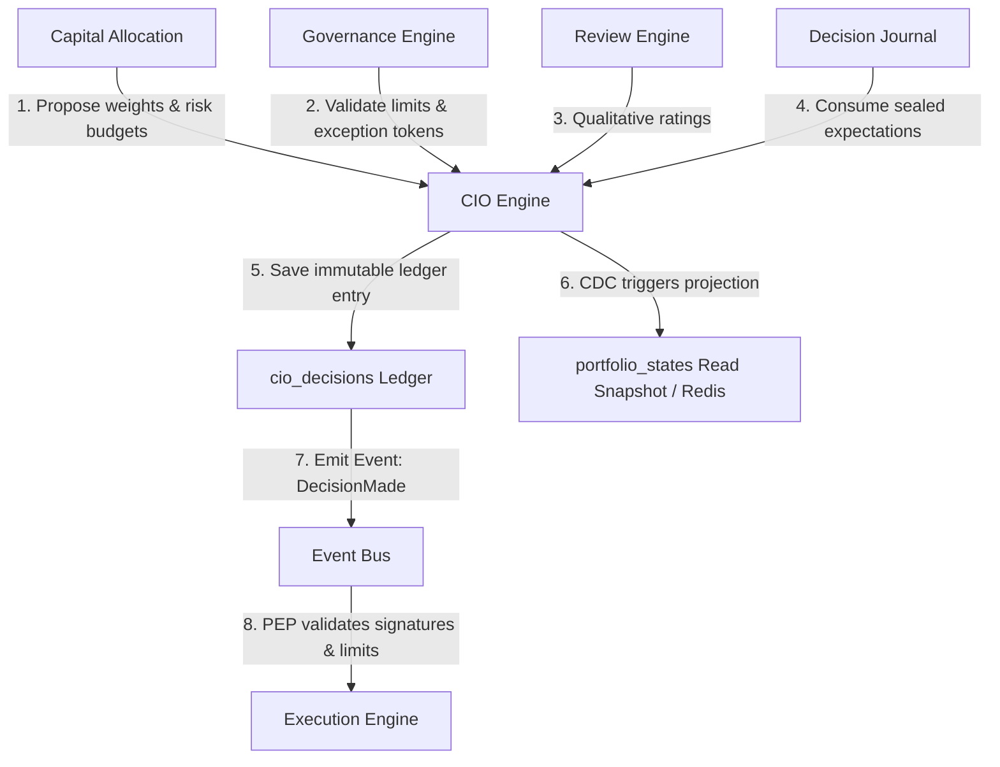
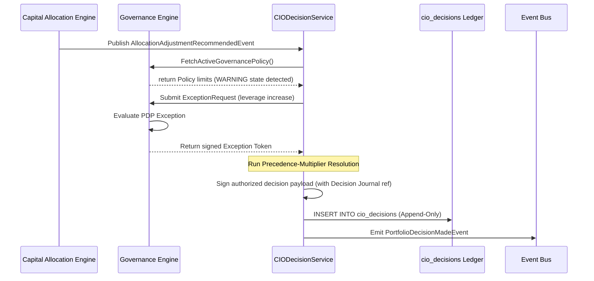
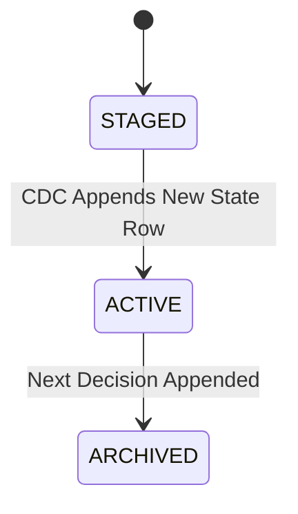

# 22. CIO Engine Foundation Architecture

This document defines the authoritative control-plane architecture of Karsa's **CIO Engine Foundation**, serving as the canonical decision-making, portfolio orchestration, and execution authorization subsystem of the Virtual Investment Firm (VIF).

---

## 1. Executive Summary

The CIO Engine is the authoritative portfolio-level decision maker. It orchestrates risk and capital allocation adjustments, promotes/retires active theses, and activates/retires execution workers. 

To eliminate lock contention, ensure database scalability (100M+ events/day ecosystem), and guarantee audit integrity, the platform contains **zero mutable aggregate roots** and shifts the Portfolio domain entity to a **read-side projection** model. All strategic updates are written to an **immutable write-once decision ledger**. Decisions are authorized using cryptographically signed payloads.

This design establishes the bridge between the Decision Journal and the Execution Engine, replacing all mock authorization paths with authoritative cryptographic signature verification.

---

## 2. Ownership Boundary Matrix

The table below defines the explicit bounded-context responsibility matrix across the VIF engines:

| Capability / Action | Capital Allocation | CIO Engine | Governance Engine | Execution Engine | Decision Journal |
| :--- | :--- | :--- | :--- | :--- | :--- |
| **Calculate Optimal Allocations** | **Authoritative (Calculates)** | Prohibited | Prohibited | Prohibited | Prohibited |
| **Generate Allocation Recommendation** | **Authoritative (Generates)** | Prohibited | Prohibited | Prohibited | Prohibited |
| **Approve Allocation Decision** | Prohibited | **Authoritative (Approves)** | Read-Only (PDP Check) | Consumer (Receives Signed) | Read-Only (Audits) |
| **Reject Allocation Recommendation** | Prohibited | **Authoritative (Rejects)** | Prohibited | Prohibited | Prohibited |
| **Request Allocation Recalculation** | Consumer (Triggers solver) | **Authoritative (Requests)** | Prohibited | Prohibited | Prohibited |
| **Validate Compliance & Exceptions** | Read-Only (Pre-check) | Read-Only (Consumer) | **Authoritative (Evaluates)** | Consumer (Final Check) | Prohibited |
| **Issue Exception Tokens** | Prohibited | Requester | **Authoritative (Signs)** | Consumer (Validates) | Prohibited |
| **Enforce Live Limits at Trade Execution** | Prohibited | Prohibited | Prohibited | **Authoritative (Execution)** | Prohibited |
| **Seal Pre-Outcome Expectations** | Prohibited | Prohibited | Prohibited | Prohibited | **Authoritative (Seals)** |

---

## 3. Architecture Overview



---

## 4. Domain Model

The domain design utilizes strictly write-once ledger records and value objects to prevent aggregate inflation and ensure deterministic replay capability:

* **Aggregate Roots**:
  - The context contains **zero mutable aggregate roots**, ensuring 100% lock-free concurrency. The primary aggregate is the immutable `CIODecisionAggregate`.
* **Ledger Entries**:
  - `CIODecision`: An immutable write-once ledger entry capturing approvals, rejections, promotions, and retirements.
* **Projections**:
  - `PortfolioState`: An immutable read-side snapshot representing the projected active configuration tree of the portfolio.
* **Value Objects**:
  - `PortfolioTree`: Structural configuration linking Portfolio $\to$ Strategy $\to$ Thesis $\to$ Decision $\to$ Worker.
  - `CommitteeVotes`: Holds the votes and consensus quorum details approving the decision.
  - `AuthorizationSignature`: Cryptographic Ed25519 signature authorizing trade execution.

---

## 5. Aggregate Design

### Single vs. Multiple Aggregates
The CIO Engine context implements a single aggregate root: `CIODecisionAggregate` (persisted in the `cio_decisions` database table). Because all strategic changes are written as immutable, write-once ledger records, there are no mutable sub-aggregates. The configuration tree (`PortfolioTree`) and projected positions are read-side projections, not mutable aggregates.

### Committee Votes Ownership
Committee votes belong inside the `CIODecisionAggregate` boundary as value objects. They are part of the input validation required to satisfy the quorum before a decision is sealed and signed. They do not reside in a separate context.

### Signature Generation Timing
Cryptographic signatures are generated at **approval time** (when the ledger record is written) rather than publication time. This ensures that the signed payload matches the exact state approved by the committee, preventing tampering.

### Target Allocations Ownership
Target allocations are computed and owned by the **Capital Allocation Engine**. The CIO Engine only owns the *approval/rejection state* of these proposals. On rejection, the CIO requests recalculation, passing constraints (Option C).

### Overrides Ownership
Allocation overrides are manual decisions owned and signed by the CIO Engine, subject to limit checks by the Governance Engine.

---

## 6. Value Objects

* **`DecisionId`**: Globally unique 128-bit identifier for a CIO decision.
* **`PortfolioId`**: Identifies a specific VIF portfolio node.
* **`ThesisId`**: Identifies a specific VIF thesis version.
* **`WorkerId`**: Identifies an active VIF execution agent.
* **`CommitteeVotes`**: Collection of human/agent approvals and rejection votes.
* **`CryptographicSignature`**: The cryptographically signed payload hash authorizing limit changes.

---

## 7. Event Contracts

Both Human and Agent CIO actors emit identical decision events to ensure unified downstream validation:

```json
{
  "$schema": "http://json-schema.org/draft-07/schema#",
  "title": "PortfolioDecisionMadeEvent",
  "type": "OBJECT",
  "required": [
    "event_id",
    "event_type",
    "correlation_id",
    "causation_id",
    "decision_id",
    "portfolio_id",
    "actor",
    "action_type",
    "payload",
    "rationale",
    "cryptographic_signature",
    "timestamp",
    "event_version"
  ],
  "properties": {
    "event_id": { "type": "STRING" },
    "event_type": { "type": "STRING" },
    "correlation_id": { "type": "STRING" },
    "causation_id": { "type": "STRING" },
    "decision_id": { "type": "STRING" },
    "portfolio_id": { "type": "STRING" },
    "actor": {
      "type": "OBJECT",
      "required": ["actor_id", "actor_type"],
      "properties": {
        "actor_id": { "type": "STRING" },
        "actor_type": { "type": "STRING", "enum": ["HUMAN", "AGENT"] }
      }
    },
    "action_type": { "type": "STRING" },
    "payload": { "type": "OBJECT" },
    "rationale": {
      "type": "OBJECT",
      "required": ["summary", "references"],
      "properties": {
        "summary": { "type": "STRING" },
        "references": {
          "type": "ARRAY",
          "items": { "type": "STRING" }
        }
      }
    },
    "cryptographic_signature": {
      "type": "OBJECT",
      "required": ["key_id", "algorithm", "signature_hex"],
      "properties": {
        "key_id": { "type": "STRING" },
        "algorithm": { "type": "STRING" },
        "signature_hex": { "type": "STRING" }
      }
    },
    "timestamp": { "type": "STRING", "format": "date-time" },
    "event_version": { "type": "INTEGER" }
  }
}
```

---

## 8. Application Services

* **`CIODecisionService`**: Handles incoming proposals, runs the Precedence-Multiplier conflict resolution framework, appends decisions to the ledger, and generates signatures.
* **`PortfolioOrchestrationService`**: Computes read-side projections of the active portfolio hierarchy from the ledger.

---

## 9. Repositories

* **`CIODecisionRepository`**: Read/write interface for the append-only `cio_decisions` table.
* **`PortfolioStateRepository`**: Read-only interface querying projected `portfolio_states` and Redis cache.

---

## 10. Persistence Design

```sql
CREATE TABLE cio_decisions (
    decision_id VARCHAR(64) PRIMARY KEY,
    calculation_id VARCHAR(64),                 -- Capital Allocation ID
    governance_exception_id VARCHAR(64),        -- Exception reference
    decision_journal_ref VARCHAR(64) UNIQUE NOT NULL, -- Decision Journal URN (strictly 1:1)
    portfolio_snapshot_hash VARCHAR(64) NOT NULL, -- Locks signature to pre-state hash
    action_type VARCHAR(64) NOT NULL,           -- APPROVE_ALLOCATION, REJECT_ALLOCATION, OVERRIDE
    target_node_type VARCHAR(64) NOT NULL,      -- PORTFOLIO, STRATEGY, THESIS, WORKER
    target_node_id VARCHAR(64) NOT NULL,
    decision_payload JSONB NOT NULL DEFAULT '{}',
    cryptographic_signature VARCHAR(256) NOT NULL,
    created_at TIMESTAMP NOT NULL DEFAULT CURRENT_TIMESTAMP
);

CREATE TABLE portfolio_states (
    state_id VARCHAR(64) PRIMARY KEY,
    decision_id VARCHAR(64) REFERENCES cio_decisions(decision_id),
    portfolio_tree JSONB NOT NULL,              -- Projected tree state
    created_at TIMESTAMP NOT NULL DEFAULT CURRENT_TIMESTAMP
);
```

Database triggers block all update/delete commands to ensure ledger immutability:

```sql
CREATE OR REPLACE FUNCTION block_immutable_modifications()
RETURNS TRIGGER AS $$
BEGIN
    RAISE EXCEPTION 'Modifications to write-once ledgers are prohibited.';
END;
$$ LANGUAGE plpgsql;

CREATE TRIGGER enforce_cio_decisions_immutability
BEFORE UPDATE OR DELETE ON cio_decisions
FOR EACH ROW EXECUTE FUNCTION block_immutable_modifications();
```

---

## 11. Integration Design

### Execution PEP Integration
The Execution Engine replaces the `MockDecisionAuthorizationAdapter` in [test_execution.py](file:///Users/dwiki.nugraha/dwikicode/karsa/tests/karsa/execution/test_execution.py#L45) with the `PostgresDecisionAuthorizationAdapter`. The PEP verifier executes a signature check over the payload using the CIO public key and verifies that the `decision_journal_ref` exists in the `decision_journals` table.

### Capital Allocation Recalculate Loop
The CIO Engine reviews allocation proposals. On rejection, it requests recalculation, passing new constraint parameters to the Capital Allocation Engine (Option C).

---

## 12. Sequence Diagrams



---

## 13. State Diagrams



---

## 14. Failure Handling

* **Signature Verification Failure**: The Execution PEP immediately rejects the staged request and logs a critical security alert.
* **Quorum Failures**: If the committee votes do not meet the consensus threshold, the decision is rejected, and a recalculation request is dispatched to the Capital Allocation Engine.
* **Network Partition**: Offline verification is supported because the Execution PEP validates cryptographic signatures locally using public keys.

---

## 15. OCC Strategy

### Lock-Free Concurrency
Because the `cio_decisions` table is write-once and append-only, database row-locking is eliminated. Concurrency is resolved via unique constraints on `decision_id` and sequence checks on read-side projections (`active_leaf_projection` style).

---

## 16. Scalability Analysis

* **Lock-Free Operation**: Flat append-only ledger tables support fast asynchronous writes.
* **Daily Partitioning**: Partitions on `created_at` prevent B-Tree index bloat.
* **Projection Caching**: Read-side cache (Redis) stores the projected tree state, compiled out-of-band by CDC pipelines, keeping query costs minimal.

---

## 17. Security Analysis

* **Dual-Signature Enforcement**: The Execution PEP mandates valid signatures from both the CIO Engine and the Governance Engine (for policy warnings/exceptions) to authorize trades:
  $$\text{Authorized} \iff \text{ValidSignature}(\text{CIO}) \land \text{ValidSignature}(\text{GovernanceException}) \land \neg \text{ActiveGovernanceBreach}()$$

---

## 18. Migration Strategy

1. Deploy the `cio_decisions` and `portfolio_states` tables, triggers, and migrations.
2. Replace `MockDecisionAuthorizationAdapter` in [test_execution.py](file:///Users/dwiki.nugraha/dwikicode/karsa/tests/karsa/execution/test_execution.py#L45) with the database-backed `PostgresDecisionAuthorizationAdapter`.
3. Update [services.py](file:///Users/dwiki.nugraha/dwikicode/karsa/src/karsa/execution/application/services.py#L82-L89) to execute real public key lookups and Decision Journal validation checks.

---

## 19. Risks

* **Consensus Deadlock**: Automated quorum requirements might stall allocation updates during volatile markets. *Mitigation*: Fallback to Cash mode if quorum is not met within the validity horizon.

---

## 20. ADR Decisions

* **[ADR-047](file:///Users/dwiki.nugraha/dwikicode/karsa/docs/adr/ADR-047-cio-engine-ownership.md)**: CIO Engine Context Boundaries and Ownership.
* **[ADR-048](file:///Users/dwiki.nugraha/dwikicode/karsa/docs/adr/ADR-048-cio-decision-and-orchestration-model.md)**: CIO Decision and Orchestration Model.
* **[ADR-052](file:///Users/dwiki.nugraha/dwikicode/karsa/docs/adr/ADR-052-cio-engine-authority-and-ledger-design.md)**: CIO Engine Authority and Ledger Design.

---

## 21. Architecture Challenges

### Challenge #1: Can CIO exist without consuming Decision Journal?
**No**. Under the VIF core loop, the Decision Journal is the authoritative repository of pre-outcome expectations, stating the rationale, hypothesis (thesis_urn, validity horizon, expected return), and confidence metrics of a trading decision.
Without consuming the Decision Journal, the CIO Engine cannot trace the decision’s ex-ante logical lineage, making it impossible to perform qualitative audit verification, hindsight prevention, or post-mortem calibration.

### Challenge #2: Can Execution accept CIO authority without a Decision Journal reference?
**No**. The Execution PEP enforces pre-trade validation. If the Execution Engine accepts a CIO decision that lacks a valid, verified Decision Journal reference (`decision_id` or URN), the authority chain is broken. The Execution PEP MUST validate that the CIO decision references a sealed `decision_id` in the Decision Journal ledger, verifying the complete path: `Decision Journal -> CIO -> Execution`.

### Challenge #3: What is the canonical authority source?
**Option B: CIO Decision**.
* The **Decision Journal** is the registry of *pre-outcome reasoning, hypotheses, and expectations* (the logical intent/thesis of a decision).
* The **CIO Engine** is the *authoritative control-plane decision-maker* that approves or rejects the allocation target, configures the active portfolio tree, and generates the cryptographic signature authorizing trade execution.
* The Decision Journal records *why* we think a trade is good. The CIO Decision records *what* the firm decides to do and grants the *cryptographic authority* to do it.

### Challenge #4: How are signatures generated?
**Signing both (Selected)**: The CIO Engine signs a combined payload: `decision_id (from Decision Journal) | target_node_id | allocated_weights | portfolio_snapshot_hash | governance_exception_id`.
* **Replayability Implications**: By signing a combined payload containing both the Decision Journal URN, the target allocation instructions, the base portfolio state hash, and the governance exception ID, we lock the thesis, execution parameters, governance permissions, and starting state together cryptographically. Five years later, an auditor can verify the signature and prove that the trade was authorized *specifically* under that reasoning state, applied to that specific portfolio baseline, preventing any post-hoc justification or state-hijacking replays.

### Challenge #5: Can a CIO decision exist without a thesis?
**No**. A CIO decision cannot exist without referencing an active Thesis. The lifecycle state must be: `Thesis drafted -> Decision Journal entry sealed -> CIO Decision created (referencing Decision Journal entry) -> Execution staged`. If a CIO decision could exist without a thesis, it would represent an arbitrary trade suggestion with no research basis, violating the core VIF rule.

### Challenge #6: Can multiple CIO decisions reference the same Decision Journal entry?
**No**. There must be a strict **1:1 relationship** between a CIO Decision ledger record and a Decision Journal entry. Multiple decisions referencing the same journal entry introduce double-authorization risk and break portfolio replayability.

### Challenge #7: How should authority delegation work?
**Final Model**: A hybrid model combining deterministic rules, multi-signature committee votes, and Governance exceptions:
1. **Default Path**: Capital Allocation proposes $\to$ Committee votes $\to$ CIO Service generates Ed25519 signature if quorum is met.
2. **Override Path**: CIO overrides can manually adjust worker status or strategy weights, generating an override log entry in `cio_decisions` signed by the CIO key.
3. **Governance Exceptions**: If the decision breaches a soft policy limit, the CIO Engine requests an exception from the Governance PDP. If approved, the Governance Engine issues an Exception Token (signed by the Governance key).
4. **Execution Validation**: The Execution PEP checks for dual signatures:
   $$\text{Signature}_{CIO} \land \text{Signature}_{Gov\_Exception} \text{ (if limits breached)}$$

### Challenge #8: Historical Replay Challenge
**Lineage Reconstruction (5 years later)**:
1. Parse the **Execution Fill** record from the ledger.
2. Extract `causation_id`, which points to the **Execution Request** staged in the ledger.
3. Extract `cio_signature` and `correlation_id` (the CIO Decision URN) from the Execution Request.
4. Query the `cio_decisions` table by `decision_id` (using the URN). Verify the Ed25519 signature against the registered CIO public key active at that block timestamp.
5. Extract the `decision_journal_ref` from the CIO Decision payload.
6. Query the `decision_journals` table to retrieve the **Decision Journal** entry. Extract the `thesis_urn` and `context_hash`.
7. Retrieve the context snapshot (prompt templates, Git commit hash, model weights hash, market regime state).
8. Reconstruct the **Portfolio Snapshot** at that timestamp using the event log.
9. Verify the ex-post **Performance Record** and **Review Verdict** generated for that decision, comparing actual return against the expected return documented in the original Decision Journal record.

### Challenge #9: Control Plane Ownership Challenge
* **Decision Authority**: Owned by **CIO Engine** (publishes signed directives).
* **Authorization Signatures**: Owned by **CIO Engine** (generates cryptographic proofs).
* **Committee Votes**: Owned by **CIO Engine** (verifies consensus quorum).
* **Portfolio Directives**: Owned by **CIO Engine** (target node configurations).
* **Overrides**: Owned by **CIO Engine** (explicit manual allocations).
* **Target Allocations**: Owned by **Capital Allocation Engine** (CIO only approves/rejects them).
* **Governance Limits & Exceptions**: Owned by **Governance Engine** (CIO cannot modify policies or self-sign exceptions).

### Challenge #10: Future Compatibility Challenge
* **Post-Mortem Engine**: Relies on the CIO Decision ledger to extract attribution weights, decision-maker identity (human vs agent), and committee vote details.
* **Risk Engine**: Relies on the projected `portfolio_states` to calculate ex-ante VaR.
* **Research Engine**: Links to the `thesis_urn` references in CIO decisions.
* **Regime Engine**: Provides macro market regime URNs stored in the Decision Journal context.
* **Knowledge Graph**: Traces the semantic relationship maps from Research -> Thesis -> Decision -> Execution.

---

## 22. Architecture Delta Analysis

| VIF Phase | Pre-Sprint-38 Baseline | Post-Sprint-38 CIO Design | Gaps Closed |
| :--- | :--- | :--- | :--- |
| **State Management** | Implicit states. | Explicit portfolio projection snapshots from append-only ledger. | Eliminates OCC write contention, ensuring complete replayability. |
| **Compliance** | Ambiguous overrides. | Strict Governance supremacy with exception tokens. | Guarantees compliance boundaries remain uncompromised. |
| **Integration** | Ad-hoc calculations. | Strict request-recalculate loop with Capital Allocation (Option C). | Preserves single-responsibility boundaries. |
| **Execution Authorization**| Mocked signatures in tests. | Cryptographically signed payloads verified at PEP with DB lookups. | Resolves security stubs. |

---

## 23. Acceptance Criteria

1. **Compliance Invariant**: A decision payload containing a worker with a Governance `HARD_STOP` block must be set to `0.0` weight.
2. **Signature Invariant**: Every `cio_decisions` entry must contain a valid cryptographic signature.
3. **Immutability Invariant**: Writing an `UPDATE` or `DELETE` statement against `cio_decisions` or `portfolio_states` must raise a database exception.
4. **1:1 Correlation**: Every CIO Decision must map to exactly one Decision Journal URN.

---

## 24. Final Verdict

### **ARCHITECTURE_APPROVED**
