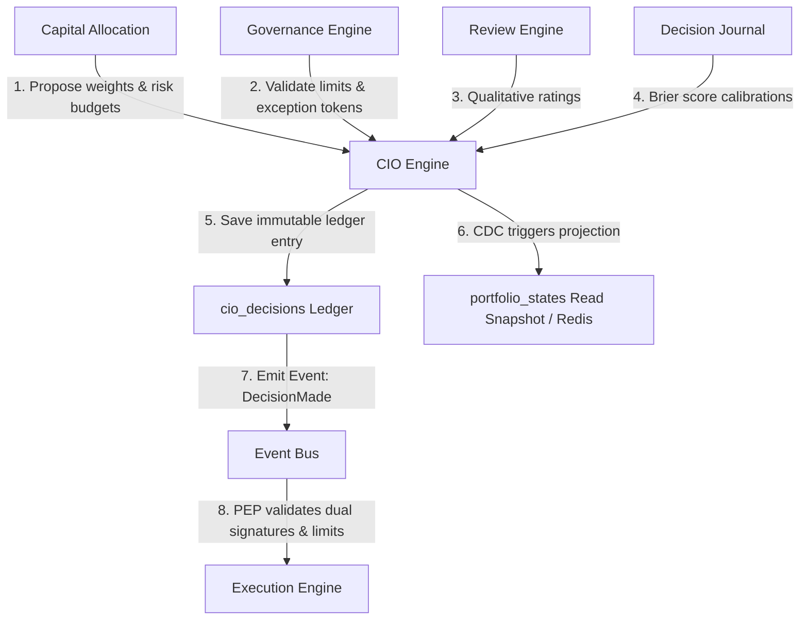
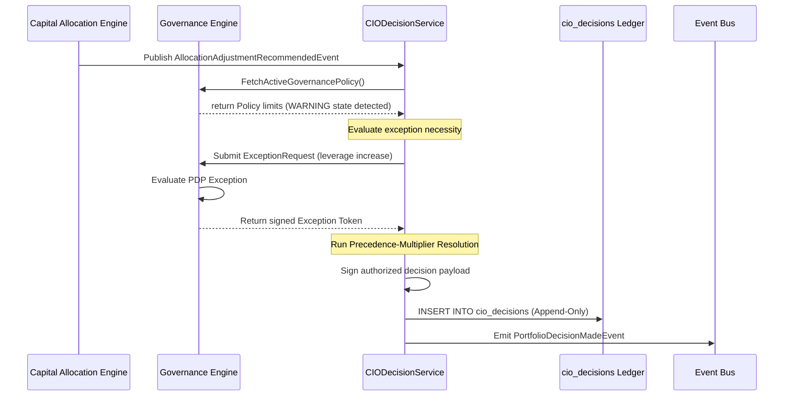
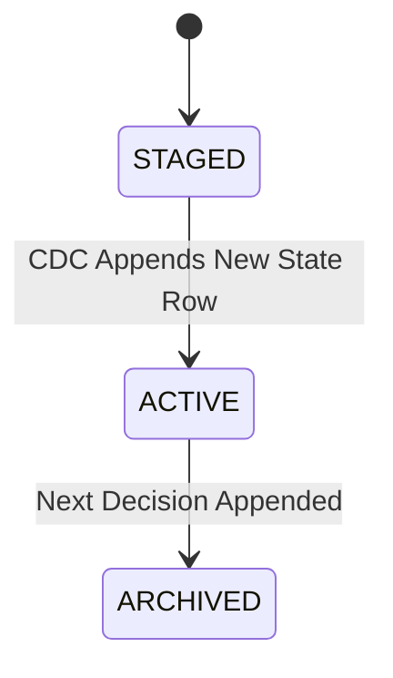

# 22. CIO Engine Foundation Architecture

This document defines the architecture of Karsa's **CIO Engine Foundation**, serving as the authoritative investment committee, portfolio orchestration, and execution authorization subsystem of the Virtual Investment Firm (VIF).

---

## 1. Executive Summary

The CIO Engine is the authoritative portfolio-level decision maker. It orchestrates risk and capital allocation adjustments, promotes/retires theses, and activates/retires workers.

To eliminate lock contention, ensure database scalability (100M+ events/day ecosystem), and guarantee audit integrity, the platform contains **zero mutable aggregate roots** and shifts the Portfolio domain entity to a **read-side projection** model. All strategic updates are written to an **immutable write-once decision ledger**. Decisions are authorized using cryptographically signed payloads. 

Governance remains the supreme authority; the CIO Engine cannot override active compliance limits. To bypass standard bounds, the CIO must request a signed Exception Token from the Governance PDP. Relationships with the Capital Allocation Engine are defined by a strict request-recalculate loop (Option C). Conflicting recommendations are resolved deterministically using a precedence-multiplier formula. Both human and agent actors emit identical decision events under a unified decision contract.

---

## 2. Ownership Boundary Matrix

| Capability / Action | Capital Allocation | CIO Engine | Governance Engine | Execution Engine |
| :--- | :--- | :--- | :--- | :--- |
| **Calculate Optimal Allocations** | **Authoritative (Calculates)** | Prohibited | Prohibited | Prohibited |
| **Generate Allocation Recommendation** | **Authoritative (Generates)** | Prohibited | Prohibited | Prohibited |
| **Approve Allocation Decision** | Prohibited | **Authoritative (Approves)** | Read-Only (PDP Check) | Consumer (Receives Signed) |
| **Reject Allocation Recommendation** | Prohibited | **Authoritative (Rejects)** | Prohibited | Prohibited |
| **Request Allocation Recalculation** | Consumer (Triggers solver) | **Authoritative (Requests)** | Prohibited | Prohibited |
| **Validate Compliance & Exceptions** | Read-Only (Pre-check) | Read-Only (Consumer) | **Authoritative (Evaluates)** | Consumer (Final Check) |
| **Issue Exception Tokens** | Prohibited | Requester | **Authoritative (Signs)** | Consumer (Validates) |
| **Enforce Live Limits at Trade Execution** | Prohibited | Prohibited | Prohibited | **Authoritative (Execution)** |

---

## 3. Architecture Overview



---

## 4. Domain Model

The domain design utilizes strictly write-once ledger records and value objects to prevent aggregate inflation and ensure deterministic replay capability:

- **Aggregate Roots**:
  - The context contains **zero mutable aggregate roots**, ensuring 100% lock-free concurrency.
- **Ledger Entries**:
  - `CIODecision`: An immutable write-once ledger entry capturing approvals, rejections, promotions, and retirements.
- **Projections**:
  - `PortfolioState`: An immutable read-side snapshot representing the projected active configuration tree of the portfolio.
- **Value Objects**:
  - `PortfolioTree`: Structural configuration linking Portfolio $\to$ Strategy $\to$ Thesis $\to$ Decision $\to$ Worker.
  - `AuthorizationSignature`: Cryptographic proof authorizing the downstream execution engine to modify limits.

---

## 5. Aggregate Design & CIODecision Classification

Should the CIO context use mutable aggregates, a portfolio aggregate + decision aggregate, or an immutable append-only decision ledger?

### A. Portfolio Representation
- **Option A (Portfolio Aggregate Root)**: Represents portfolio configuration as a mutable aggregate.
  - *Evaluation*: Rejected. Forces row-locking and write contention, bottlenecking the VIF loop.
- **Option B (Portfolio Immutable Ledger)**: Stores the state as raw events replayed on every read.
  - *Evaluation*: Rejected due to poor read latency on high-throughput queries.
- **Option C (Portfolio Projection - Selected)**: The Portfolio is a read-side projection compiled asynchronously from the append-only decision ledger (`cio_decisions`) into `portfolio_states` and Redis.

### B. CIODecision Representation
- **Option A (Mutable Aggregate with State Machine & OCC)**:
  - *Evaluation*: Rejected. Requires row locks and concurrency validation on state changes, risking transaction timeouts under high agent volume.
- **Option B (Immutable Decision Ledger - Selected)**:
  - *Evaluation*: Selected. The context contains zero mutable state machines. Every decision is an append-only, write-once ledger record. 
  - *Metrics*:
    - **Replayability**: 100% deterministic (replays chronological append logs).
    - **Scalability**: High throughput (lock-free INSERTs, no write hotspots).
    - **Auditability**: Complete chronological record of every state transition.
    - **Multi-Agent Compatibility**: Multiple agents write concurrently without blocking.

---

## 6. Value Objects

* **`DecisionId`**: Globally unique 128-bit identifier for a CIO decision.
* **`PortfolioId`**: Identifies a specific VIF portfolio node.
* **`StrategyId`**: Identifies an active VIF strategy node.
* **`ThesisId`**: Identifies a specific VIF thesis version.
* **`WorkerId`**: Identifies an active VIF execution agent.
* **`CryptographicSignature`**: The cryptographically signed payload hash authorizing limit changes.

---

## 7. Event Contracts & Unified Decision Contract

Both Human and Agent CIO actors emit identical decision events to ensure unified downstream validation:

```json
{
  "$schema": "http://json-schema.org/draft-07/schema#",
  "title": "PortfolioDecisionMadeEvent",
  "type": "OBJECT",
  "required": [
    "event_id",
    "event_type",
    "correlation_id",
    "causation_id",
    "decision_id",
    "portfolio_id",
    "actor",
    "action_type",
    "payload",
    "rationale",
    "cryptographic_signature",
    "timestamp",
    "event_version"
  ],
  "properties": {
    "event_id": { "type": "STRING" },
    "event_type": { "type": "STRING" },
    "correlation_id": { "type": "STRING" },
    "causation_id": { "type": "STRING" },
    "decision_id": { "type": "STRING" },
    "portfolio_id": { "type": "STRING" },
    "actor": {
      "type": "OBJECT",
      "required": ["actor_id", "actor_type"],
      "properties": {
        "actor_id": { "type": "STRING" },
        "actor_type": { "type": "STRING", "enum": ["HUMAN", "AGENT"] }
      }
    },
    "action_type": { "type": "STRING" },
    "payload": { "type": "OBJECT" },
    "rationale": {
      "type": "OBJECT",
      "required": ["summary", "references"],
      "properties": {
        "summary": { "type": "STRING" },
        "references": {
          "type": "ARRAY",
          "items": { "type": "STRING" }
        }
      }
    },
    "cryptographic_signature": {
      "type": "OBJECT",
      "required": ["key_id", "algorithm", "signature_hex"],
      "properties": {
        "key_id": { "type": "STRING" },
        "algorithm": { "type": "STRING" },
        "signature_hex": { "type": "STRING" }
      }
    },
    "timestamp": { "type": "STRING", "format": "date-time" },
    "event_version": { "type": "INTEGER" }
  }
}
```

---

## 8. Application Services

- **`CIODecisionService`**: Handles incoming proposals, runs the Precedence-Multiplier conflict resolution framework, appends decisions to the ledger, and generates signatures.
- **`PortfolioOrchestrationService`**: Computes read-side projections of the active portfolio hierarchy from the ledger.

---

## 9. Persistence Design

```sql
CREATE TABLE cio_decisions (
    decision_id VARCHAR(64) PRIMARY KEY,
    calculation_id VARCHAR(64),                 -- Capital Allocation ID
    governance_exception_id VARCHAR(64),        -- Exception reference
    action_type VARCHAR(64) NOT NULL,           -- APPROVE_ALLOCATION, REJECT_ALLOCATION, etc.
    target_node_type VARCHAR(64) NOT NULL,      -- PORTFOLIO, STRATEGY, THESIS, WORKER
    target_node_id VARCHAR(64) NOT NULL,
    decision_payload JSONB NOT NULL DEFAULT '{}',
    cryptographic_signature VARCHAR(256) NOT NULL,
    created_at TIMESTAMP NOT NULL DEFAULT CURRENT_TIMESTAMP
);

CREATE TABLE portfolio_states (
    state_id VARCHAR(64) PRIMARY KEY,
    decision_id VARCHAR(64) REFERENCES cio_decisions(decision_id),
    portfolio_tree JSONB NOT NULL,              -- Projected tree state
    created_at TIMESTAMP NOT NULL DEFAULT CURRENT_TIMESTAMP
);
```

Database triggers prevent all updates/deletes to ensure ledger immutability. Concurrency controls are eliminated because all operations are append-only.

---

## 10. Integration Design

- **Governance Engine**: Emits validation bounds. Consumes Exception Requests and signs Exception tokens.
- **Capital Allocation Engine**: Emits recommendations. Consumes signed allocation results and recalculation requests.
- **Decision Journal**: Consumes decision payloads to log prediction quality calibrations.
- **Observability Platform**: Consumes TraceIds to map lineage paths.

---

## 11. Sequence Diagrams

### Conflict Resolution & Exception Request Flow



---

## 12. State Diagrams

### `PortfolioState` Projection Transition Model



---

## 13. Conflict Resolution Framework

### Precedence Model
1. **Governance Hard Stop**: Multiplier = 0.0 (Immediate defunding).
2. **CIO Override Decision**: Replaces models with explicit target values.
3. **Governance Soft Limit / Warning**: Caps upper limit ($Cap_{gov}$).
4. **Post-Mortem Failure Weight**: Multiplier penalty ($W_{pm}$).
5. **Capital Allocation Model**: Base proposed weight ($A_{base}$).
6. **Review Engine Score**: Multiplier penalty ($W_{rev}$).
7. **Analyst Signals**: Weighted direction scaled by Decision Journal Brier scores.

### Weighting Formula
$$A_{raw} = A_{base} \times W_{pm} \times W_{rev} \times \left(1.0 + \sum_{i} (Signal_{i} \times (1.0 - Brier_{i})) \times 0.1\right)$$
$$A_{final} = \min(A_{raw}, Cap_{gov})$$

- **Tie-Breaking**: Broken by consensus trend, followed by risk-contribution minimization, and defaulting to passive cash.
- **Escalation**: Defunds and creates a Governance review ticket if $A_{final}$ falls below the economic threshold.

---

## 14. Replay Lineage Chain

To verify why a specific portfolio change occurred, the audit traces:
$$\text{Research} \to \text{Thesis} \to \text{Decision Journal} \to \text{Attribution} \to \text{Governance} \to \text{Allocation} \to \text{CIO Decision}$$

- **Authoritative Trace Link**: Every table records the parent transaction hash and unique causation IDs, maintaining a correlation chain across all hop transitions.

---

## 15. Scalability Analysis

- **Lock-Free Operation**: Flat append-only ledger tables support fast asynchronous writes.
- **Projection Caching**: Read-side cache (Redis) stores the projected tree state, compiled out-of-band by CDC pipelines, keeping query costs minimal.

---

## 16. Security Analysis

- **Decision Tampering**: Database triggers prevent all updates/deletes.
- **PEP Enforcement**: Every execution adjustment is cryptographically verified at the PEP. Dual signature verification is required for exceptions:
  $$\text{Authorized} \iff \text{ValidSignature}(\text{CIO}) \land \text{ValidSignature}(\text{GovernanceException}) \land \neg \text{ActiveGovernanceBreach}()$$

---

## 17. Risks

- **God Context Risk**: CIO could expand to absorb risk modeling, policy validation, and execution.
  - *Mitigation*: Bounded Context limits enforce that the CIO can only write decisions to `cio_decisions` and cannot perform execution, policy validation, or risk optimization directly.

---

## 18. ADR Decisions

Refer to ADR-047 and ADR-048.

---

## 19. Architecture Challenges Answers

1. **What does the CIO Engine own?**
   Authoritative decision records, thesis promotion/retirement status, worker activation/retirement status, allocation proposal approvals, and cryptographic execution signatures.
2. **What does the CIO Engine explicitly NOT own?**
   Live execution, compliance exception approvals, quantitative allocation calculations, or alpha factor calculations.
3. **Can CIO override Governance?**
   **No**. Governance is the absolute final authority. Compliance breaches override any CIO adjustments, defunding target nodes immediately. The CIO must request an exception from Governance.
4. **Can CIO modify Allocation records?**
   **No**. Allocation records are owned by the Capital Allocation Engine. The CIO reviews allocations and signs off on approvals/rejections or requests a recalculation with new inputs/constraints (Option C).
5. **Is CIO a decision maker or an execution engine?**
   The CIO Engine is a **decision maker**. It orchestrates limits and weights, publishing authorized decisions. The Execution Engine is the actor that consumes these signed decisions and performs trades.
6. **Is CIO portfolio-centric or worker-centric?**
   Strictly **portfolio-centric**, managing the target allocation hierarchy (`Portfolio -> Strategy -> Thesis -> Decision -> Worker`).
7. **How are conflicting recommendations resolved?**
   We implement a **Precedence-Multiplier Conflict Resolution Framework** combining Governance stops, CIO overrides, warnings, post-mortem safety penalty factors, and analyst sentiment weighted by Brier scores.
8. **How do we explain a portfolio decision 5 years later?**
   Reconstruct the trace path through immutable logs and frozen contexts linked by `TraceId` and `causation_id` across the complete research-to-execution lineage chain.

---

## 20. Bounded Context Responsibility Matrix

| Context | Owner | Readers | Forbidden Actions |
| :--- | :--- | :--- | :--- |
| **CIO Engine** | Portfolio-level decisions, active tree configurations. | Governance, Execution, Capital Allocation | Cannot modify governance rules; cannot calculate optimal risk weights; cannot run worker code. |
| **Capital Allocation** | Risk/return solvers, allocation proposals. | CIO, Governance | Cannot sign limit changes; cannot write trade records. |
| **Governance Engine** | Compliance verification, exception signing. | CIO, Execution | Cannot submit exception requests for itself. |
| **Thesis Engine** | Research tracking, thesis metadata drafts. | CIO, Research | Cannot approve thesis promotions without CIO signature. |
| **Review Engine** | Performance scoring, worker ratings. | CIO, Governance | Cannot adjust allocation limits or override exception tokens. |
| **Execution Engine** | Live limit enforcement, trade book writing. | Observability | Cannot bypass dual-signature verification checks. |

---

## 21. Architecture Delta Analysis

| VIF Phase | Pre-Sprint-32 Baseline | Post-Sprint-32 CIO Design | Gaps Closed |
| :--- | :--- | :--- | :--- |
| **State Management** | Implicit states. | Explicit portfolio projection snapshots from append-only ledger. | Eliminates OCC write contention, ensuring complete replayability. |
| **Compliance** | Ambiguous overrides. | Strict Governance supremacy with exception tokens. | Guarantees compliance boundaries remain uncompromised. |
| **Integration** | Ad-hoc calculations. | Strict request-recalculate loop with Capital Allocation (Option C). | Preserves single-responsibility boundaries. |

---

## 22. Acceptance Criteria

1. **Compliance Invariant**: A decision payload containing a worker with a Governance `HARD_STOP` block must be set to `0.0` weight.
2. **Signature Invariant**: Every `cio_decisions` entry must contain a valid cryptographic signature.
3. **Immutability Invariant**: Writing an `UPDATE` or `DELETE` statement against `cio_decisions` or `portfolio_states` must raise a database exception.

---

## 23. Final Verdict

### **ARCHITECTURE_FROZEN**
