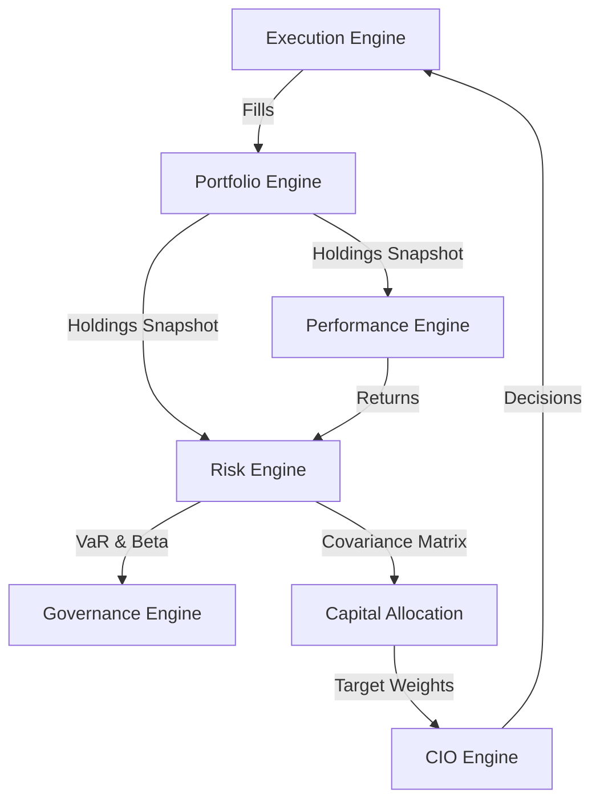

# 23. Virtual Investment Firm Master Architecture Delta Analysis

This document provides a comprehensive architecture-level gap analysis between Karsa's **Current Frozen Architecture** (Sprints 25 to 32) and the target **Virtual Investment Firm (VIF) Bounded Contexts**, updated to resolve the Risk Engine roadmap inconsistency (FIND-33.7).

---

## 1. Executive Summary

This validation challenges the architectural boundaries and roadmap integration of portfolio risk calculations. By analyzing dependencies across Capital Allocation, Governance, Portfolio, Performance, and Regime engines from first principles, we demonstrate that **Risk is a first-class bounded context**. 

Rather than overloading transactional position books (Portfolio) or ex-post analytics (Performance), we establish the **Risk Engine** as a dedicated bounded context. To maintain structural alignment, the roadmap is expanded, placing **Sprint-36: Risk Engine Foundation** immediately after the Performance Engine.

---

## 2. Risk Context Challenge Analysis

The mathematical modeling of forward-looking, predictive risk metrics is highly complex and distinct from transactional ledgers. The Risk Engine owns:
- Value at Risk (VaR)
- Expected Shortfall
- Stress Testing & Scenario Analysis
- Concentration Risk
- Factor Risk
- Exposure Risk Modeling
- Risk Forecasts & Covariance Matrices

Because these metrics generate predictive statistical distributions rather than absolute transactional ledger sums, they justify a standalone, first-class bounded context.

---

## 3. Ownership Boundary Matrix

| Context | Core Data Owned | Primary Calculations | Write Ledger | Read-Only Inputs |
| :--- | :--- | :--- | :--- | :--- |
| **Portfolio Engine** | Positions, Cash balances, Exposures | Valuations, NAV, Exposures | `portfolio_holdings` | Execution Fills |
| **Performance Engine** | Return series, Sharpe, Sortino | Ex-post returns, Sharpe, Drawdowns | `performance_records` | Valuation Snapshots |
| **Risk Engine** | Covariance forecast, VaR, Stress stats | Ex-ante VaR, Beta simulations | `risk_records` | Holdings Snapshots |
| **Governance Engine** | Compliance policies, Exception tokens | PDP limit validations, exceptions | `governance_policies` | Risk records, Performance records |

---

## 4. Capital Allocation Dependency Analysis

Capital Allocation optimization solvers (e.g. mean-variance optimization, Black-Litterman, risk parity) require **covariance models**, **risk forecasts**, and **exposure risk** as core inputs. Without these predictive forecasts, solvers cannot generate optimal risk budgets or target weights. 
Under our architecture, the **Risk Engine** owns these calculations and their respective write ledgers (`risk_records`), ensuring that Capital Allocation consumes risk metrics rather than calculating them.

---

## 5. Governance Dependency Analysis

Governance enforces limits but does not calculate exposures. We enforce a strict separation between:
- **Risk Measurement (Risk Engine)**: Calculates ex-ante portfolio risk exposures (VaR, scenarios).
- **Risk Enforcement (Governance PDP/PEP)**: Compares calculated risk metrics against policy caps (e.g., "Max VaR <= 5%") at the Execution PEP, triggering stops or exception request workflows.

---

## 6. Portfolio vs Risk Evaluation

Evaluating **Option A** (Portfolio owns risk calculations) against **Option B** (Dedicated Risk Engine):
- *Ownership boundaries*: Portfolio owns holdings and exposures; Risk owns predictive simulations.
- *Replayability*: Replaying risk stats requires re-running risk models on historical position snapshots. Having a dedicated Risk ledger preserves a clean, auditable history of calculated risk states.
- *Scalability*: Ex-ante risk calculation is CPU-heavy. Separating Risk from Portfolio prevents risk computations from blocking transactional holdings updates in the RTBOR.
- *VIF Alignment*: Promotes clean separation of data (Portfolio) and analytics (Risk).

**Verdict**: Select Option B (Dedicated Risk Engine).

---

## 7. Performance vs Risk Evaluation

Evaluating **Option B** (Performance owns returns + Sharpe + VaR + scenario analysis):
- *Ex-post vs. Ex-ante*: Performance Engine owns ex-post historical outcome analytics (Sharpe, drawdowns). Risk Engine owns ex-ante forward-looking predictive analytics (VaR, scenarios). 
- *VIF Alignment*: Mixing ex-post historical facts with ex-ante predictive simulations violates clean conceptual boundaries.

**Verdict**: Performance does not own Risk.

---

## 8. Regime vs Risk Evaluation

Evaluating **Option C** (Regime owns macro state + volatility state + risk calculations):
- *Classification vs. Portfolio Analysis*: Regime Engine owns macro classification (e.g. identifying high volatility states), whereas Risk Engine owns portfolio-specific exposure simulations.
- *VIF Alignment*: Regime Engine provides macro inputs to the Risk Engine, but does not calculate portfolio VaR.

**Verdict**: Regime does not own Risk.

---

## 9. Updated Missing Context Matrix

| Bounded Context | Scope | Priority | Target Sprint | Gaps Closed |
| :--- | :--- | :--- | :--- | :--- |
| **Execution Engine** | Order routing, Fills, PEP checks | 1 | Sprint-33 | Establishes transactional edge. |
| **Portfolio Engine** | Positions, Cash ledgers, RTBOR | 2 | Sprint-35 (Implementation) | Establishes holdings database. |
| **Performance Engine**| Returns, Sharpe, Sortino, Drawdowns | 3 | Sprint-36 (Evolution) | Partially implemented; evolves ex-post calculations to Postgres/live feed. |
| **Decision Journal** | Pre-outcome reasoning, audits, confidence | 4 | Sprint-37 | Establishes hindsight prevention. |
| **CIO Engine** | Portfolio configuration tree, decisions | 5 | Sprint-38 | Establishes committee orchestration. |
| **Post-Mortem Engine**| Failure analysis, taxonomies, lessons | 6 | Sprint-39 | Establishes learning feedback loop. |
| **Risk Engine** | VaR, Covariance forecast, Scenarios | 7 | Sprint-40 | Establishes ex-ante risk modeling. |
| **Thesis Engine** | Hypotheses, versions, parameter hashes| 8 | Sprint-41 (Evolution) | Partially implemented; cleans legacy repositories and integrates bindings. |
| **Research Engine** | Signals, provenance data | 9 | Sprint-42 | Establishes signal registry. |
| **Regime Engine** | Macro classification, volatility states| 10 | Sprint-43 | Establishes macro awareness. |
| **Knowledge Graph** | Semantic relationships, lineage maps | 11 | Sprint-44 | Establishes business memory. |

---

## 10. Updated Dependency Graph

---

## 11. Updated Learning Loop

The corrected, dependency-ordered VIF learning loop consists of 13 stages:
$$\text{Research} \to \text{Thesis} \to \text{Decision} \to \text{Execution} \to \text{Portfolio} \to \text{Performance} \to \text{Risk} \to \text{Attribution} \to \text{Review} \to \text{Post-Mortem} \to \text{Governance} \to \text{Capital Allocation} \to \text{CIO}$$

This loop maps the sequential flow from raw signal ingestion, trade routing, position tracking, historical return evaluation, ex-ante risk simulation, and policy feedback.

---

## 12. Updated Architecture Delta Analysis

- **Control Plane**: Frozen (CIO + Governance + Allocation).
- **Data Plane**: Expanded. Target VIF architecture introduces the **Risk Engine** (Sprint-36) to compute ex-ante covariance matrices for the frozen Capital Allocation solvers.
- **Gaps Closed**: Resolves risk calculation ambiguity, establishing a dedicated analytics plane.

---

## 13. Updated Roadmap

- **Sprint-33**: Execution Engine Foundation
- **Sprint-34**: Portfolio Engine Foundation (Design Frozen)
- **Sprint-35**: Portfolio Engine Foundation (Implementation Complete)
- **Sprint-36**: Performance Engine Evolution
- **Sprint-37**: Decision Journal Foundation
- **Sprint-38**: CIO Engine Foundation
- **Sprint-39**: Post-Mortem Engine Foundation
- **Sprint-40**: Risk Engine Foundation
- **Sprint-41**: Thesis Engine Evolution
- **Sprint-42**: Research Engine Foundation
- **Sprint-43**: Regime Engine Foundation
- **Sprint-44**: Knowledge Graph Foundation

---

## 14. ADR-049 Revision Summary

ADR-049 is updated and frozen to establish the dedicated **Risk Engine** context, outlining why Option B is selected, detailing the boundaries with Portfolio and Governance, and setting Sprint-36 as the target foundation.

---

## 15. Risks

- **Execution Pre-Trade Dependency**: Pre-trade VaR checks at the PEP require a running Risk Engine. *Mitigation*: During Sprints 33-35, the Execution PEP uses mock risk verification values, which are replaced by the real Risk Engine PDP queries in Sprint-36.
- **Compute Latency**: Monte Carlo simulations are slow. *Mitigation*: Run risk computations out-of-band and cache VaR metrics in Redis for high-speed PEP validation.

---

## 16. Acceptance Criteria

1. **Calculations Invariant**: Portfolio holdings writes must not trigger risk calculations on the same transactional thread.
2. **Read-Only Invariant**: Capital Allocation optimization solvers must read covariance records from the Risk Engine, not calculate them.
3. **Audit Invariant**: Replaying risk statistics must yield the exact historical VaR given the matching holdings snapshot and historical model version.

---

## 17. Final Verdict

### **ROADMAP_REMEDIATION_FULLY_APPROVED**
