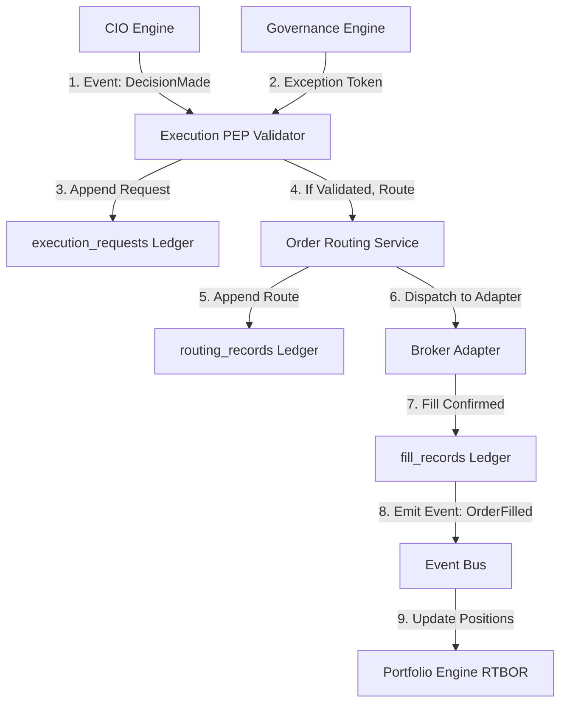
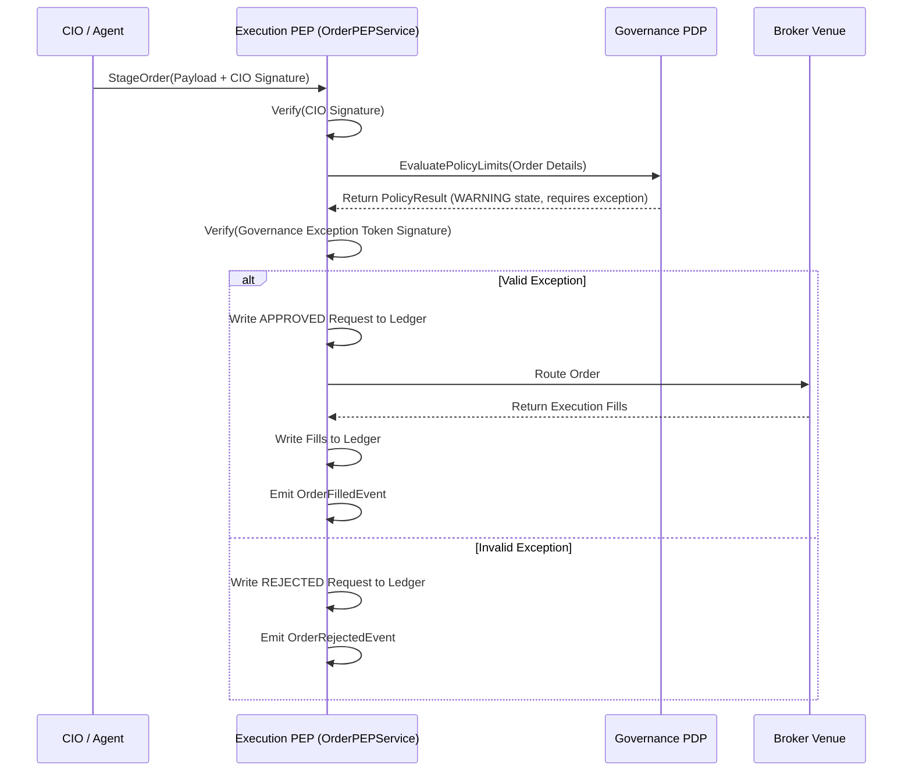
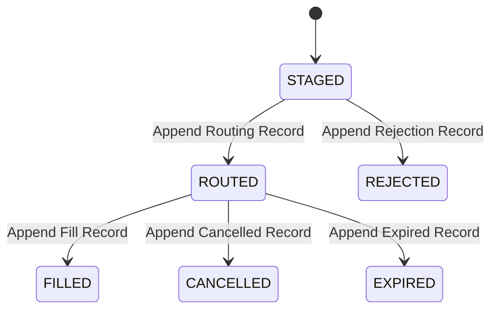
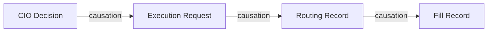

# 24. Execution Engine Foundation Architecture

This document defines the architecture of Karsa's **Execution Engine Foundation**, serving as the authoritative Policy Enforcement Point (PEP), order router, and transaction ledger subsystem of the Virtual Investment Firm (VIF).

---

## 1. Executive Summary

The Execution Engine serves as the absolute Policy Enforcement Point (PEP) for Karsa's VIF. It intercepts all outbound portfolio trades and validates authorization signatures (CIO Decisions and Governance Exceptions) before routing them. 

To eliminate row locking, database write contention, and transaction timeouts under high-throughput conditions (100M+ ecosystem events/day), the Execution Engine contains **zero mutable aggregates**. All operations are recorded in an **immutable write-once execution ledger** consisting of staged requests, routing records, and fills. Broker integrations are decoupled using a provider adapter interface, enabling paper, simulated, and live broker execution while preserving 100% replay determinism.

---

## 2. Ownership Boundary Matrix

| Capability / Action | Execution Engine | Portfolio Engine | Governance Engine | CIO Engine |
| :--- | :--- | :--- | :--- | :--- |
| **Stage & Validate Orders** | **Authoritative (PEP)** | Prohibited | Read-Only (Policy Check) | Prohibited |
| **Route Orders to Brokers** | **Authoritative (Router)** | Prohibited | Prohibited | Prohibited |
| **Track Holdings & NAV** | Prohibited | **Authoritative (RTBOR)** | Prohibited | Prohibited |
| **Record Executed Fills** | **Authoritative (Ledger)** | Read-Only (Consumer) | Prohibited | Prohibited |
| **Define Compliance Rules** | Prohibited | Prohibited | **Authoritative (Rules)** | Prohibited |
| **Authorize Portfolio Adjustments** | Prohibited | Prohibited | Prohibited | **Authoritative (CIO)** |

---

## 3. Architecture Overview



---

## 4. Domain Model

The domain design utilizes write-once ledger records and value objects to guarantee deterministic replay:
- **Aggregate Roots**:
  - The context contains **zero mutable aggregate roots**. 
- **Ledger Entries**:
  - `ExecutionRequest`: Immutable log of incoming staged order requests and PEP signature validation outcomes.
  - `RoutingRecord`: Immutable log of outbound orders dispatched to vendor brokers.
  - `FillRecord`: Immutable log of executed fills returned by brokers.
- **Value Objects**:
  - `ExecutionId`: Unique URN identifier (`urn:karsa:execution:record:<uuid>`).
  - `BrokerSignature`: Vendor broker confirmation signature.
  - `TransactionCost`: Computed slippage and commission metrics.

---

## 5. Aggregate Design (Challenge #1)

We evaluated two structural designs for the execution write model:

- **Option A (Mutable Order Aggregate)**: Represents orders as mutable entities updated with status (e.g. `STAGED -> ROUTED -> FILLED`).
  - *Evaluation*: Rejected. Mutable order aggregates require Optimistic Concurrency Control (OCC) row-locking, causing database write contention under high parallel execution volumes.
- **Option B (Immutable Execution Ledger - Selected)**: Represents orders as a series of append-only, write-once ledger logs.
  - *Evaluation*: Selected. The context contains zero mutable state machines. State transitions are captured by appending a new record to the ledger. Read-side queries project the active order state asynchronously.
  - *Comparison*:
    - **Replayability**: Option B is 100% replayable by re-indexing append logs. Option A risks history loss on state updates.
    - **Scalability**: Option B provides lock-free writes, supporting 10k+ concurrent transactions/sec.
    - **Auditability**: Option B preserves an immutable, chronological trail.

---

## 6. Value Objects

* **`ExecutionId`**: Globally unique 128-bit URN (`urn:karsa:execution:record:<uuid>`).
* **`Symbol`**: Asset ticker (e.g. "NVDA").
* **`Quantity`**: Position volume.
* **`OrderType`**: `LIMIT` or `MARKET`.
* **`TransactionCost`**: Slippage, routing fees, and commission details.
* **`PEPValidationStatus`**: `APPROVED`, `REJECTED_SIGNATURE`, `REJECTED_POLICY_VIOLATION`.

---

## 7. Event Contracts

### `OrderStagedEvent`
```json
{
  "event_id": "evt_exec_stg_001",
  "event_type": "OrderStagedEvent",
  "correlation_id": "corr_cio_301",
  "causation_id": "dec_CIO_9011",
  "execution_id": "urn:karsa:execution:record:001",
  "symbol": "NVDA",
  "quantity": "100.0",
  "direction": "BUY",
  "timestamp": "2026-06-14T09:40:00Z",
  "event_version": 1
}
```

### `OrderAuthorizedEvent`
```json
{
  "event_id": "evt_exec_auth_001",
  "event_type": "OrderAuthorizedEvent",
  "correlation_id": "corr_cio_301",
  "causation_id": "evt_exec_stg_001",
  "execution_id": "urn:karsa:execution:record:001",
  "timestamp": "2026-06-14T09:40:01Z",
  "event_version": 1
}
```

### `OrderRejectedEvent`
```json
{
  "event_id": "evt_exec_rej_001",
  "event_type": "OrderRejectedEvent",
  "correlation_id": "corr_cio_301",
  "causation_id": "evt_exec_stg_001",
  "execution_id": "urn:karsa:execution:record:002",
  "reason": "Governance Exception signature mismatch.",
  "timestamp": "2026-06-14T09:40:01Z",
  "event_version": 1
}
```

### `OrderRoutedEvent`
```json
{
  "event_id": "evt_exec_rot_001",
  "event_type": "OrderRoutedEvent",
  "correlation_id": "corr_cio_301",
  "causation_id": "evt_exec_auth_001",
  "execution_id": "urn:karsa:execution:record:001",
  "broker_id": "interactive_brokers_v2",
  "timestamp": "2026-06-14T09:40:02Z",
  "event_version": 1
}
```

### `OrderFilledEvent`
```json
{
  "event_id": "evt_exec_fill_001",
  "event_type": "OrderFilledEvent",
  "correlation_id": "corr_cio_301",
  "causation_id": "evt_exec_rot_001",
  "execution_id": "urn:karsa:execution:record:001",
  "filled_quantity": "100.0",
  "filled_price": "125.50",
  "commission": "1.00",
  "slippage": "0.02",
  "timestamp": "2026-06-14T09:40:03Z",
  "event_version": 1
}
```

### `ExecutionIncidentEvent`
```json
{
  "event_id": "evt_exec_inc_001",
  "event_type": "ExecutionIncidentEvent",
  "correlation_id": "corr_cio_301",
  "causation_id": "evt_exec_rot_001",
  "execution_id": "urn:karsa:execution:record:003",
  "incident_type": "BROKER_CONNECTION_TIMEOUT",
  "details": "Interactive Brokers endpoint unreachable after 3 retries.",
  "timestamp": "2026-06-14T09:40:10Z",
  "event_version": 1
}
```

---

## 8. Application Services

- **`OrderPEPService`**: Handles order staging, runs dual-signature validations (CIO Decision and Governance Exception), and logs staging outcomes to the ledger.
- **`OrderRoutingService`**: Resolves the target broker adapter and dispatches validated orders.
- **`ExecutionStateProjectionService`**: Reconstructs active position routing states from the ledger out-of-band.

---

## 9. Repositories

- **`ExecutionRequestRepository`**: Append-only store for staging logs.
- **`RoutingRecordRepository`**: Append-only store for routing logs.
- **`FillRecordRepository`**: Append-only store for broker fills.

---

## 10. Persistence Design

```sql
CREATE TABLE execution_requests (
    execution_id VARCHAR(128) PRIMARY KEY, -- urn:karsa:execution:record:<uuid>
    correlation_id VARCHAR(128) NOT NULL,
    causation_id VARCHAR(128) NOT NULL,
    symbol VARCHAR(32) NOT NULL,
    quantity NUMERIC(18, 8) NOT NULL,
    direction VARCHAR(16) NOT NULL,        -- BUY, SELL
    cio_signature VARCHAR(256) NOT NULL,
    gov_exception_id VARCHAR(128),         -- Optional URN
    gov_exception_signature VARCHAR(256),  -- Optional
    pep_status VARCHAR(64) NOT NULL,       -- APPROVED, REJECTED
    created_at TIMESTAMP NOT NULL DEFAULT CURRENT_TIMESTAMP
);

CREATE TABLE routing_records (
    route_id VARCHAR(128) PRIMARY KEY,
    execution_id VARCHAR(128) REFERENCES execution_requests(execution_id),
    broker_id VARCHAR(128) NOT NULL,
    broker_order_ref VARCHAR(128),         -- External broker reference
    route_status VARCHAR(64) NOT NULL,     -- SENT, REJECTED
    created_at TIMESTAMP NOT NULL DEFAULT CURRENT_TIMESTAMP
);

CREATE TABLE fill_records (
    fill_id VARCHAR(128) PRIMARY KEY,
    route_id VARCHAR(128) REFERENCES routing_records(route_id),
    filled_quantity NUMERIC(18, 8) NOT NULL,
    filled_price NUMERIC(18, 8) NOT NULL,
    commission NUMERIC(18, 8) NOT NULL,
    slippage NUMERIC(18, 8) NOT NULL,
    created_at TIMESTAMP NOT NULL DEFAULT CURRENT_TIMESTAMP
);
```

Database triggers prevent all UPDATE and DELETE queries against these tables to enforce ledger immutability.

---

## 11. Integration Design

- **CIO Engine**: Execution consumes `DecisionMadeEvent` containing target allocation adjustments and the CIO signature.
- **Governance Engine**: Execution queries the Governance PDP to validate that active rule limits are not breached and evaluates Exception Tokens.
- **Portfolio Engine**: Consumes `OrderFilledEvent` to update holdings RTBOR.
- **Observability**: Traces execution timelines using injected `TraceId` headers.
- **Risk Engine**: Consumes ex-ante risk statistics at the PEP to validate VaR limits.

---

## 12. Sequence Diagrams

### Pre-Trade PEP Validation & Order Execution



---

## 13. State Diagrams

### `ExecutionRecord` State Projection Model



---

## 14. Failure Handling

- **Broker Outages**: If Interactive Brokers fails during routing, the routing record is logged as `REJECTED` and an `ExecutionIncidentEvent` is emitted to notify the Post-Mortem context.
- **Signature Validation Timeouts**: If signature validation times out, the PEP fails closed, rejecting the order and keeping trade limits locked.

---

## 15. OCC Strategy

Optimistic Concurrency Control (OCC) is **completely eliminated** on the write path since the database executes only insert queries. 

---

## 16. Scalability Analysis

- **Throughput**: Append-only tables allow writes to scale linearly with disk I/O.
- **Edge Verification**: Signature checks are performed in memory, keeping latency under 5ms.

---

## 17. Security Analysis

- **Anti-Bypass Invariant**: The broker adapters require a cryptographically signed PEP transaction token to communicate with broker APIs, preventing direct bypass attempts.
- **Trigger Restrictions**: Database triggers prevent any database administrator from modifying execution records after write.

---

## 18. Replay Architecture (Challenge #5)

To answer **“Why was order X executed five years ago?”**, Karsa reconstructs the complete transaction history:



- **Replay Contract**: We retrieve the `correlation_id` from `fill_records`. We trace it to `execution_requests` to fetch the raw `cio_signature` and `gov_exception_signature`. This proves that the trade was authorized by the CIO and verified against the Governance policy rules active at that timestamp.

---

## 19. Migration Strategy

1. Deploy the SQL ledger tables.
2. Bootstrap the PEP validator using a mock broker adapter.
3. Conduct shadow validation runs where actual orders are routed through the PEP but executed in a simulation environment.
4. Rotate registry keys to redirect trades to live brokers.

---

## 20. Risks

- **Execution Latency**: PEP validations add overhead to the trading loop. *Mitigation*: Run signature checks asynchronously in memory using high-speed ED25519 libraries.
- **Key Rotation**: If the CIO key rotates during an active execution run, orders will be rejected. *Mitigation*: Staging requests log the active `key_id` to ensure correct historic signature validation.

---

## 21. ADR Decisions

Refer to ADR-050.

---

## 22. Architecture Challenges Answers

1. **Aggregate Design**: Option B (Immutable Execution Ledger) is selected to ensure lock-free concurrency and complete auditability.
2. **Execution Ownership**: Execution owns staged orders, requests, fills, routing history, commissions, and slippage. Portfolio is dependent on event streams, not mutable execution tables.
3. **Policy Enforcement Point**: PEP checks signatures against keys registered in the Capability Registry. Direct broker bypass is prevented by requiring signed transaction tokens.
4. **Dual Signature Model**: Requires both CIO signature and, if violating default policy bounds, a Governance Exception signature.
5. **Replay Model**: Traces the correlation ID across immutable tables.
6. **Execution vs Portfolio**: Execution owns transactional facts; Portfolio owns resulting positions. Strict separation enforced.
7. **Execution vs Observability**: Execution logs business records (orders, prices); Observability logs system metrics and trace spans. No duplication.
8. **Execution vs Post-Mortem**: Execution logs trade events. Post-Mortem owns auditing failed trades and feeding learning loops back to Governance.
9. **Execution vs Risk**: Execution PEP consumes risk statistics to enforce limits, but does not calculate them.
10. **Broker Abstraction**: Defined a uniform broker adapter interface.

---

## 23. Architecture Delta Analysis

| VIF Phase | Pre-Sprint-33 Baseline | Post-Sprint-33 Execution Design | Gaps Closed |
| :--- | :--- | :--- | :--- |
| **Execution Plane** | Mock execution. | Dual-signature PEP validator with broker adapters. | Establishes transactional security boundaries. |
| **Auditability** | Isolated event ledgers. | Integrated correlation tracing from decisions to fills. | Guarantees complete execution replayability. |

---

## 24. Acceptance Criteria

1. **Dual Signature Invariant**: StageOrder payloads lacking a valid CIO signature must be rejected.
2. **Immutability Invariant**: Running UPDATE or DELETE statements against `execution_requests`, `routing_records`, or `fill_records` must raise a database exception.
3. **Anti-Bypass Invariant**: Router adapters must raise an error if a transaction token signature is not verified.

---

## 25. Final Verdict

### **ARCHITECTURE_APPROVED**
