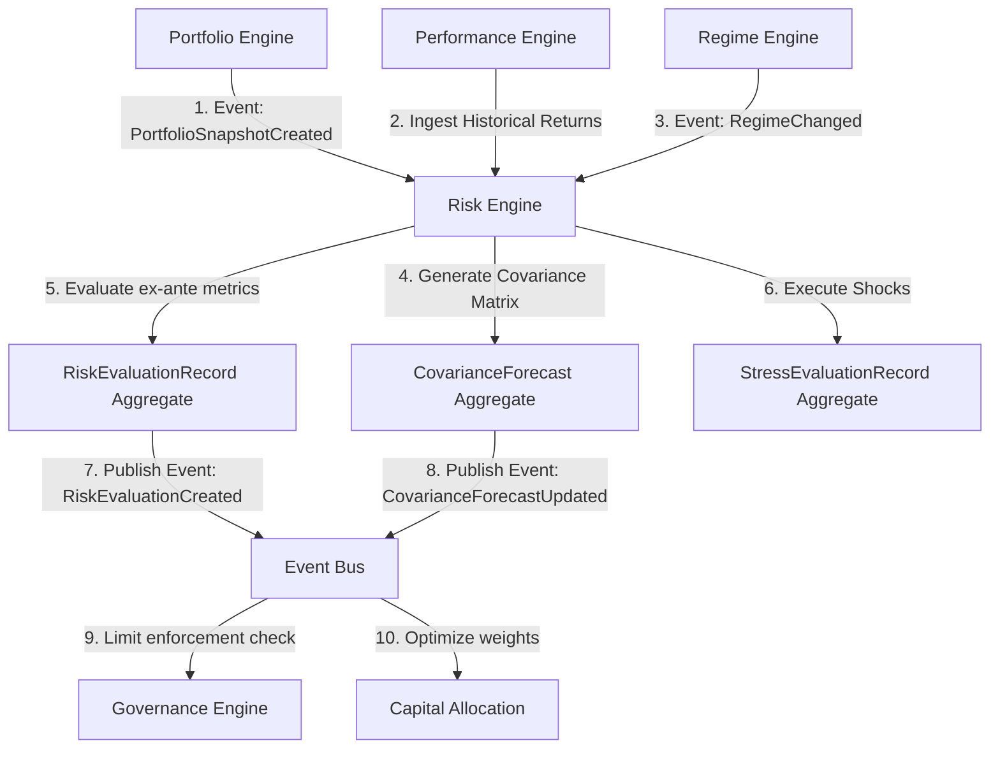
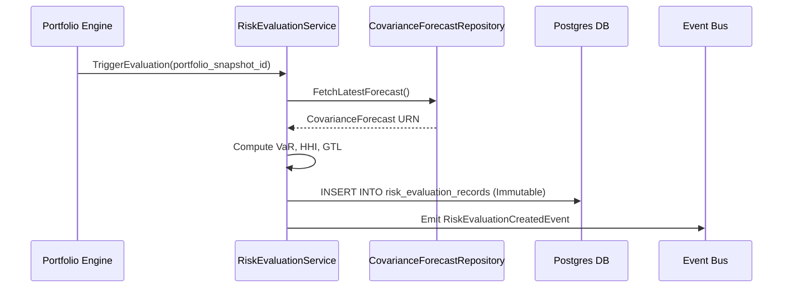
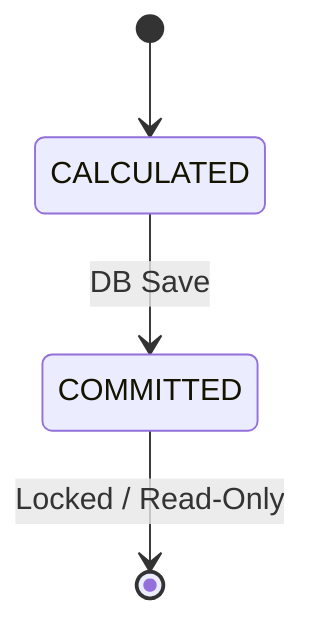

# 26. Risk Engine Foundation Architecture

This document defines the canonical architecture of Karsa's **Risk Engine Foundation** bounded context, serving as the authoritative ex-ante risk modeling, stress-testing, and exposure analysis plane of the Virtual Investment Firm (VIF).

---

## 1. Executive Summary
The Risk Engine serves as the ex-ante analytical subsystem of the VIF, calculating forward-looking risk parameters before allocation or execution occurs. It establishes:
1. **`RiskEvaluationRecord`** (Aggregate Root): An append-only, write-once ledger record capturing Value at Risk (VaR), Expected Shortfall (CVaR), liquidity metrics, and concentration statistics for a given portfolio holdings state.
2. **`CovarianceForecast`** (Aggregate Root): An append-only parameter ledger capturing ex-ante volatility forecasts and asset-level correlation matrices.
3. **`StressEvaluationRecord`** (Aggregate Root): An append-only ledger record capturing scenario-based stress test results.

The engine does not own or modify realized returns, portfolio transactions, execution flows, limit policies, or budget sizes. It exposes its ex-ante metrics via the Event Bus for consumption by downstream compliance (Governance) and optimization (Capital Allocation) engines.

---

## 2. Ownership Boundary Matrix

The table below defines the bounded-context responsibility matrix across VIF analytical engines:

| Capability / Action | Performance Engine | Attribution Engine | Portfolio Engine | Governance Engine | Capital Allocation | Risk Engine |
| :--- | :--- | :--- | :--- | :--- | :--- | :--- |
| **Calculate Realized Returns** | **Authoritative** | Read-Only | Read-Only | Read-Only | Read-Only | Read-Only |
| **Ex-Post Performance Appraisal** | **Authoritative** | Read-Only | Read-Only | Read-Only | Read-Only | Read-Only |
| **Calculate Causal Attribution** | Read-Only | **Authoritative** | Read-Only | Read-Only | Read-Only | Read-Only |
| **Track Active Holdings/NAV** | Read-Only | Read-Only | **Authoritative** | Read-Only | Read-Only | Read-Only |
| **Enforce Limit Policies** | Read-Only | Read-Only | Read-Only | **Authoritative** | Read-Only | Read-Only |
| **Allocate Budget Weights** | Read-Only | Read-Only | Read-Only | Read-Only | **Authoritative** | Read-Only |
| **Calculate Ex-Ante VaR/CVaR** | Read-Only | Read-Only | Read-Only | Read-Only | Read-Only | **Authoritative** |
| **Forecast Asset Covariance** | Read-Only | Read-Only | Read-Only | Read-Only | Read-Only | **Authoritative** |
| **Execute Stress Testing Scenarios** | Read-Only | Read-Only | Read-Only | Read-Only | Read-Only | **Authoritative** |

---

## 3. Architecture Overview

The diagram below shows the transactional boundaries and event-driven data flow of the Risk Engine:



---

## 4. Domain Model

The domain contains three append-only aggregate roots:
* **`RiskEvaluationRecord`** (Aggregate Root):
  - Captures ex-ante statistical risk metrics for a portfolio snapshot. Strictly immutable.
* **`CovarianceForecast`** (Aggregate Root):
  - Captures asset-level volatility forecasts and correlation matrices. Strictly immutable.
* **`StressEvaluationRecord`** (Aggregate Root):
  - Captures ex-ante portfolio evaluations under specific stress scenarios. Strictly immutable.

* **Value Objects**:
  - `AssetExposure`: Value object representing exposure sizes and sector classifications.
  - `RiskMetric`: Value object containing VaR and Expected Shortfall parameters.
  - `ConcentrationStat`: Value object holding HHI and Gini coefficients.
  - `LiquidityMetric`: Value object modeling ADV and Days-to-Liquidate.
  - `ScenarioShock`: Value object containing stress scenario factors.

---

## 5. Aggregate Design

### `RiskEvaluationRecord` (Aggregate Root)
* **Transaction Boundary**: Atomic write to `risk_evaluation_records` table.
* **Invariants**: Must reference a valid `portfolio_snapshot_id`. VaR and CVaR must be positive. HHI must be in $[0.0, 1.0]$.
* **Lifecycle**: Strictly append-only. No updates allowed.

### `CovarianceForecast` (Aggregate Root)
* **Transaction Boundary**: Atomic write to `covariance_forecasts` table, with large matrix arrays offloaded to object storage.
* **Invariants**: The covariance matrix must be positive semi-definite. Matrix size must match historical asset universe.
* **Lifecycle**: Append-only parameter ledger.

### `StressEvaluationRecord` (Aggregate Root)
* **Transaction Boundary**: Atomic write to `stress_evaluation_records` table.
* **Invariants**: Must reference a valid scenario URN and portfolio snapshot URN.

---

## 6. Value Objects

* **`AssetExposure`**:
  - `asset_urn`: String.
  - `weight`: Float ($-1.0 \le w \le 1.0$).
  - `exposure_value`: Float.
  - `sector`: String.
* **`RiskMetric`**:
  - `var_95`: Float ($\ge 0.0$).
  - `var_99`: Float ($\ge 0.0$).
  - `cvar_95`: Float ($\ge 0.0$).
  - `cvar_99`: Float ($\ge 0.0$).
  - `time_horizon_days`: Integer.
* **`ConcentrationStat`**:
  - `hhi`: Float ($0.0 \le \text{hhi} \le 1.0$).
  - `gini`: Float ($0.0 \le \text{gini} \le 1.0$).
  - `top_5_weight`: Float.
* **`LiquidityMetric`**:
  - `asset_urn`: String.
  - `days_to_liquidate`: Float ($\ge 0.0$).
  - `liquidation_scenario_percent`: Float.
* **`ScenarioShock`**:
  - `scenario_urn`: String.
  - `underlying_factor`: String.
  - `shock_magnitude`: Float.

---

## 7. Event Contracts

### `RiskEvaluationCreatedEvent`
* **Event Version**: 1
* **Payload**:
```json
{
  "event_id": "evt_risk_eval_001",
  "event_type": "RiskEvaluationCreatedEvent",
  "correlation_id": "corr_risk_eval_998",
  "causation_id": "evt_port_snapshot_404",
  "evaluation_id": "risk_val_4001",
  "portfolio_snapshot_id": "port_snap_35002",
  "risk_metrics": {
    "var_95": 0.035,
    "var_99": 0.052,
    "cvar_95": 0.041,
    "cvar_99": 0.063,
    "time_horizon_days": 1
  },
  "concentration": {
    "hhi": 0.125,
    "gini": 0.452
  },
  "timestamp": "2026-06-14T17:00:00Z",
  "event_version": 1
}
```

### `CovarianceForecastUpdatedEvent`
* **Event Version**: 1
* **Payload**:
```json
{
  "event_id": "evt_cov_forecast_001",
  "event_type": "CovarianceForecastUpdatedEvent",
  "correlation_id": "corr_cov_forecast_999",
  "causation_id": "evt_daily_close_202",
  "forecast_id": "cov_fc_4001",
  "matrix_urn": "urn:karsa:risk:covariance:2026-06-14-v1",
  "universe_size": 25,
  "timestamp": "2026-06-14T17:01:00Z",
  "event_version": 1
}
```

---

## 8. Application Services

* **`RiskEvaluationService`**: Ingests portfolio snapshots, fetches active covariance forecasts, computes VaR/CVaR, concentration, and liquidity parameters, and appends `RiskEvaluationRecord` ledger entries.
* **`CovarianceForecastService`**: Runs parameter estimation models (EWMA/GARCH) against historical Performance returns, generates matrices, persists matrix payloads to object storage, and saves reference aggregates to PostgreSQL.
* **`StressTestingService`**: Runs scenario stress tests against portfolios on-demand.

---

## 9. Repositories

Planned repository interfaces:
```python
class RiskEvaluationRepository(ABC):
    @abstractmethod
    def save_evaluation(self, record: RiskEvaluationRecord) -> None: pass
    @abstractmethod
    def get_evaluation_by_id(self, evaluation_id: str) -> Optional[RiskEvaluationRecord]: pass

class CovarianceForecastRepository(ABC):
    @abstractmethod
    def save_forecast(self, record: CovarianceForecast) -> None: pass
    @abstractmethod
    def get_latest_forecast(self) -> Optional[CovarianceForecast]: pass
```

---

## 10. Persistence Design

```sql
CREATE TABLE risk_evaluation_records (
    evaluation_id VARCHAR(128) NOT NULL,
    portfolio_snapshot_id VARCHAR(128) NOT NULL,
    risk_metrics JSONB NOT NULL,
    concentration_stats JSONB NOT NULL,
    liquidity_metrics JSONB NOT NULL,
    created_at TIMESTAMP NOT NULL,
    PRIMARY KEY (evaluation_id, created_at)
) PARTITION BY RANGE (created_at);

CREATE TABLE risk_evaluation_records_default PARTITION OF risk_evaluation_records DEFAULT;

CREATE TABLE covariance_forecasts (
    forecast_id VARCHAR(128) PRIMARY KEY,
    matrix_urn VARCHAR(256) NOT NULL UNIQUE,
    universe_size INTEGER NOT NULL,
    created_at TIMESTAMP NOT NULL
);

CREATE TABLE stress_evaluation_records (
    stress_evaluation_id VARCHAR(128) PRIMARY KEY,
    portfolio_snapshot_id VARCHAR(128) NOT NULL,
    scenario_urn VARCHAR(256) NOT NULL,
    shock_results JSONB NOT NULL,
    created_at TIMESTAMP NOT NULL
);
```

---

## 11. Integration Design

* **Portfolio Port**: Listens to portfolio snapshot creation events to trigger risk evaluations.
* **Performance Port**: Reads historical realized returns to construct GARCH/EWMA models.
* **Regime Port**: Fetches macro regime classifications to dynamically scale volatility multipliers.

---

## 12. Sequence Diagrams

Ex-ante Risk Evaluation Sequence:



---

## 13. State Diagrams

Because all aggregates in this context are strictly append-only write-once ledger records, they do not undergo post-creation state transitions:



---

## 14. Failure Handling

* **Non-Positive Semi-Definite Matrix**: Rejects covariance matrix saving if eigenvalues are negative.
* **Invalid Portfolio Snapshot URN**: Raises validation exception if snapshot URN format is incorrect.
* **Database Mutation Attempt**: Relational database triggers throw PostgreSQL exceptions if any `UPDATE` or `DELETE` queries are executed.

---

## 15. OCC Strategy

| Component | OCC Required | Reason |
| :--- | :--- | :--- |
| **`risk_evaluation_records`** | **No** | Strictly append-only write-once ledger. |
| **`covariance_forecasts`** | **No** | Parameter forecasts are append-only. |
| **`stress_evaluation_records`**| **No** | Append-only scenario stress records. |

---

## 16. Scalability Analysis

* **Blob Storage Offloading**: Storing large covariance arrays in S3/MinIO prevents PostgreSQL database page bloating, keeping metadata index searches fast.
* **Yearly Partitioning**: Range partitions on `risk_evaluation_records` by `created_at` prevents large index sizes.

---

## 17. Security Analysis

* **Read-Only Enclosure**: Risk calculations operate strictly in a read-only manner against Portfolio holdings, ensuring Risk cannot execute trades or modify holdings.
* **Hindsight Prevention**: Ex-ante forecasts reference exact portfolio snapshots, blocking retroactive edits to historical risk data.

---

## 18. Migration Strategy

1. Deploy schema, partitions, triggers, and indices under Alembic.
2. Initialize default baseline regime multiplier ($1.0$).

---

## 19. Risks

> [!WARNING]
> **Data Latency Risk**: Delays in performance returns calculation will lead to stale covariance parameter forecasts. *Mitigation*: Fallback to static historic parameter profiles if latency thresholds are exceeded.

---

## 20. ADR Decisions

* **[ADR-053](file:///Users/dwiki.nugraha/dwikicode/karsa/docs/adr/ADR-053-risk-engine-ownership.md)**: Establishes context boundaries.
* **[ADR-054](file:///Users/dwiki.nugraha/dwikicode/karsa/docs/adr/ADR-054-ex-ante-risk-modeling.md)**: Defines ex-ante modeling and write-once persistence.

---

## 21. Architecture Challenges

Detailed review of the 15 design challenges is documented in [plan.md](file:///Users/dwiki.nugraha/dwikicode/karsa/docs/implementation/sprint-40/plan.md). Summaries:
* *Challenge 1*: Risk consumes Portfolio snapshots (read-only).
* *Challenge 2*: Risk evaluations are immutable write-once ledger entries.
* *Challenge 3*: Deterministic replay is achieved by URN-referencing inputs.
* *Challenge 4*: Governance cannot modify Risk outputs.
* *Challenge 5*: Allocation cannot modify Risk outputs.
* *Challenge 6*: Regime state URNs are captured in the risk calculation payload.
* *Challenge 7*: Stress tests are generated on-demand and stored as ledger records.
* *Challenge 8*: Covariance matrices are stored in object storage, referencing URNs in Postgres.
* *Challenge 9*: Authoritative assumptions are owned by the Regime Engine and historical Performance data.
* *Challenge 10*: Append-only ledger style, no versioning.
* *Challenge 11*: Concentration modeled via Gini and HHI indices.
* *Challenge 12*: Liquidity risk modeled via Average Daily Volume (ADV) and Days-to-Liquidate (DTL).
* *Challenge 13*: Baseline constant regime scale factor provides decoupling.
* *Challenge 14*: Post-Mortem cannot write risk records.
* *Challenge 15*: Performance compares historical VaR to actual drawdowns.

---

## 22. Architecture Delta Analysis

| Virtual Investment Firm Stage | Pre-Sprint-40 Baseline | Post-Sprint-40 Risk Design | Gaps Closed |
| :--- | :--- | :--- | :--- |
| **Ex-Ante Risk Modeling** | None (Post-hoc realized drawdowns only). | Ex-ante VaR, Expected Shortfall, stress tests, covariance forecasts. | Closes the compliance loop by checking risk limits *before* execution. |

---

## 23. Acceptance Criteria

1. Large covariance matrices ($N \ge 10$ assets) must be stored in object storage and indexed via PostgreSQL URN metadata.
2. Every risk evaluation must be append-only and strictly immutable.
3. Volatility forecasts must scale based on active macro regime inputs.

---

## 24. Final Verdict

### **ARCHITECTURE_APPROVED**

---

## 25. Risk Taxonomy

* **Market Risk**: Volatility of underlying asset returns.
* **Concentration Risk**: Excess exposure to a single asset, sector, or strategy.
* **Liquidity Risk**: Days required to exit positions without moving market price.
* **Leverage Risk**: Potential magnifying effect of borrowed capital on portfolio VaR.
* **Macro Regime Risk**: Structural shifts in volatility parameters.
* **Operational/Provider Risk**: Telemetry drop or data signal latency.

---

## 26. Risk Calculation Ownership Matrix

The matrix below maps active risk calculation responsibilities:

| Calculation Type | Authoritative Owner | Read-Only Consumer | Prohibited Write |
| :--- | :--- | :--- | :--- |
| **Ex-Ante VaR / CVaR** | Risk Engine | Governance, Allocation | Governance, Portfolio, Allocation |
| **Asset Covariance Matrix**| Risk Engine | Allocation | Governance, Portfolio |
| **Days-to-Liquidate (DTL)**| Risk Engine | Portfolio, Allocation | Portfolio, Governance |
| **HHI / Gini Indices** | Risk Engine | Portfolio, Governance | Portfolio, Governance |
| **Scenario Stress Shock** | Risk Engine | Governance, CIO | Governance, Portfolio |

---

## 27. Ex-Ante vs Ex-Post Boundary Analysis

* **Ex-Ante Boundary (Risk Engine)**: Calculates *forward-looking* risk estimates (Expected Shortfall, stress shocks, exposure bounds) based on probability distributions and current holdings. It represents the *expectation* plane.
* **Ex-Post Boundary (Performance / Attribution)**: Calculates *historical, realized* statistics (actual drawdown, Sharpe, Sortino, realized beta) based on transaction execution logs and NAV histories. It represents the *realization* plane.
* **Interaction rule**: Ex-Ante forecasts are stored as immutable records. Ex-Post evaluation engines compare these historical expectations to realized outcomes to perform backtesting validation, but never alter ex-ante databases.

---

## 28. Regime Dependency Analysis

* **Dependency Direction**: Risk Engine $\rightarrow$ Regime Engine (read-only).
* **Execution**: When computing ex-ante VaR, Risk queries the active `RegimeState` URN (e.g. `urn:karsa:regime:high-vol-regime-4`). 
* **Regime Factor Injection**:
  $$\text{Scaled Covariance Matrix} = \Sigma \times \gamma_{\text{Regime}}$$
  Where $\gamma_{\text{Regime}}$ is a multiplier owned and published by the Regime Engine.
* **Decoupling**: If the Regime Engine is down or not yet implemented, a fallback multiplier of $\gamma = 1.0$ is applied.

---

## 29. Capital Allocation Dependency Analysis

* **Dependency Direction**: Capital Allocation $\rightarrow$ Risk Engine (read-only).
* **Data Transmitted**: Capital Allocation Engine reads the ex-ante covariance forecast matrix and asset exposure limits.
* **Optimization Loop**: Allocation optimizes budget sizing weights using Mean-Variance or Risk Parity algorithms based on the Risk Engine's covariance parameters. Risk is prohibited from deciding allocation weights.

---

## 30. Replayability Proof

To prove that any ex-ante risk estimate calculated years ago can be replayed deterministically:
* A `RiskEvaluationRecord` is queryable by URN.
* The record contains:
  1. `portfolio_snapshot_id`: Resolves to the exact, immutable asset holding sizes.
  2. `matrix_urn`: Resolves to the exact, immutable asset returns covariance matrix.
  3. `regime_state_urn`: Resolves to the exact, immutable macro multiplier applied.
  4. `engine_version_tag`: Resolves to the specific Git commit hash of the math algorithms.
* Re-executing the mathematical algorithms at Git commit `engine_version_tag` against the snapshot, matrix, and regime variables guarantees an identical, bit-perfect VaR calculation.
