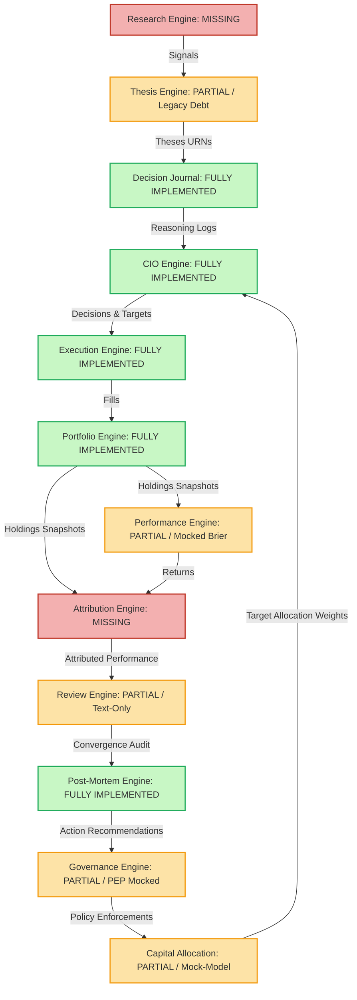
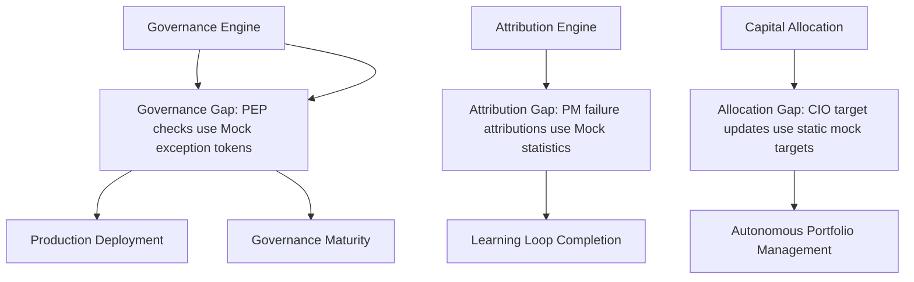

# 28. Virtual Investment Firm Critical Path Revalidation Audit

This report presents a repository-wide critical path revalidation audit, challenging the default roadmap priorities for Sprint-41 and re-evaluating dependencies across the Virtual Investment Firm (VIF) platform.

---

## 1. Learning Loop Dependency Graph

The Virtual Investment Firm reference learning loop consists of 12 sequential stages. The implementation status of the nodes within the current repository (post-Sprint-40 closed) is mapped below:

### Analysis of Implemented, Partial, and Missing Nodes:
* **Fully Implemented**:
  - `Decision Journal`: Secure pre-outcome reasoning ledger.
  - `CIO Engine`: Strategic target-tree configurations and Ed25519 signature checks.
  - `Execution Engine`: Order staging, fill indexing, and transactional PEP validation.
  - `Portfolio Engine`: Real-Time Book of Record (RTBOR) tracking positions and cash.
  - `Post-Mortem Engine`: Quantitative failure attribution and ex-post action recommendation.
  - `Risk Engine` (Sprint-40 closed): Ex-ante VaR, concentration statistics, and covariance forecasts.
* **Partially Implemented (Legacy / Siloed)**:
  - `Thesis Engine`: Functionally complete but contains legacy code structure, lacks standard immutability trigger decorators, and is siloed from active Research signals.
  - `Performance Engine`: Calculates returns, but uses hardcoded stated confidence stubs (`0.8`) instead of reading Decision Journal records.
  - `Governance Engine`: Contains rule evaluations and draft lifecycles, but Execution PEP exception tokens and policy updates are mocked.
  - `Capital Allocation`: Exists only as a basic Python model class with no relational database persistence, optimization solver, or API.
* **Missing (Wholly Absent from Codebase)**:
  - `Research Engine`: Signal sandboxes and template validation.
  - `Attribution Engine`: Lineage-based return breakdown.

---

## 2. Production Readiness Dependency Graph

The VIF platform currently cannot be deployed to production because of several blocked dependencies:

* **Production Deployment / Governance Maturity** is blocked by: `Governance Engine Gap` (specifically the PEP verifications using mocked limit exceptions rather than querying a database-backed Policy Decision Point).
* **Learning Loop Completion** is blocked by: `Attribution Engine Gap` (specifically the Post-Mortem Engine depending on mocked failure attribution coefficients rather than actual performance metrics).
* **Autonomous Portfolio Management** is blocked by: `Capital Allocation Engine Gap` (specifically target weights generated manually or statically instead of being dynamically optimized by covariance-parity solvers).

---

## 3. Missing Bounded Context Classification

We classify the five missing/partial contexts based on critical-path urgency and repository evidence:

1. **Governance Engine** $\rightarrow$ **CRITICAL PATH**
   - *Evidence*: The Execution PEP limit checks currently bypass database validation. Risk Engine outputs (VaR/Stress tests) are generated but never enforced. Closing this gap is the primary blocker for real-world transaction safety.
2. **Attribution Engine** $\rightarrow$ **CRITICAL PATH**
   - *Evidence*: Post-Mortem failure attributions are fully mocked. We cannot perform real feedback loops until ex-post returns are separated into thesis selections, execution slippage, and allocation weighting.
3. **Capital Allocation Engine** $\rightarrow$ **CRITICAL PATH**
   - *Evidence*: CIO target trees are updated manually. The platform possesses ex-ante covariance forecasts (Risk Engine) but has no optimized optimizer to transform them into allocations.
4. **Regime Engine** $\rightarrow$ **HIGH PRIORITY**
   - *Evidence*: Risk Engine currently relies on a default neutral fallback multiplier ($1.0$). Establishing Regime Engine provides dynamic volatility scaling, but does not block transaction execution.
5. **Research Engine** $\rightarrow$ **MEDIUM PRIORITY**
   - *Evidence*: Thesis records can currently be linked manually. The absence of Research signal sandboxing is an automation gap, not a transactional blocker.

---

## 4. Capital Allocation: Bounded Context vs Platform Service

We determine that **Capital Allocation is a Bounded Context**, not a Platform Service:
* **Ownership Boundaries**: It owns the lifecycle and state transitions of risk allocations (`PENDING`, `ACTIVE`, `SUSPENDED`, `TERMINATED`).
* **Aggregate Roots**: Owns the `RiskAllocation` aggregate root, which encapsulates `RiskBudget` and `LiquidityConstraint` child entities.
* **Events**: Dispatches lifecycle events (such as `AllocationActivated`, `AllocationBreached`, or `AllocationScaled`).
* **Persistence**: Requires a write-once relational database ledger to persist allocation records and history logs (enforcing that target-weight adjustments are auditable and immutable).
* **Transaction Boundaries**: Processes allocation scale-downs independently of real-time trading fills or position adjustments.

---

## 5. Sprint Sequence Revalidation

We evaluate the three proposed sprint options for Sprint-41:

### Option A (Thesis Evolution $\rightarrow$ Research $\rightarrow$ Regime)
* *Pros*: Resolves legacy Thesis debt and starts Research signals.
* *Cons*: Leaves the critical transactional plane blocked. Governance, Attribution, and Capital Allocation remain simulated. Ex-ante Risk outputs are computed but never enforced or utilized.

### Option B (Attribution $\rightarrow$ Governance $\rightarrow$ Regime)
* *Pros*: Resolves learning-loop gaps and volatility stubs.
* *Cons*: Postpones the Capital Allocation solver, keeping CIO targets manual.

### Option C (Governance $\rightarrow$ Attribution $\rightarrow$ Capital Allocation)
* *Pros*:
  1. Immediately closes the PEP enforcement gap (Governance).
  2. Resolves simulated Post-Mortem recommendations (Attribution).
  3. Integrates covariance forecasts with CIO target updates (Allocation).
* *Cons*: Defers Regime and Research Engine signal automations.

### Comparison Verdict:
**Option C** is the only logical critical-path sequence. The Thesis Engine is legacy but functionally complete (Postgres-backed and linked to decisions). Continuing to clean it up while Core Governance enforcement, Performance Attribution, and Capital Allocation are mocked represents a serious misallocation of development priority.

---

## 6. Critical Path Recommendation

We recommend reordering the roadmap sequence for Sprints 41 through 45:

### Sprint-41: Governance Engine Foundation
* **Business Value**: Enforces automated compliance limits, replacing mocks.
* **Dependency Impact**: Consumes Risk ex-ante VaR; secures Execution PEP checks.
* **Architectural Leverage**: Provides the Policy Decision Point (PDP) registry.
* **Risk Reduction**: Prevents unauthorized capital exposure.

### Sprint-42: Attribution Engine Foundation
* **Business Value**: Enables quantitative performance attribution.
* **Dependency Impact**: Feeds real coefficients to Post-Mortem recommendations.
* **Architectural Leverage**: Separates selection, execution, and weighting alpha.
* **Risk Reduction**: Eliminates inaccurate root-cause failure classifications.

### Sprint-43: Capital Allocation Engine Foundation
* **Business Value**: Automates risk budgeting and portfolio optimization.
* **Dependency Impact**: Consumes Risk covariance matrix; outputs CIO target weights.
* **Architectural Leverage**: Implements mean-variance/risk-parity solvers.
* **Risk Reduction**: Reduces manual target-selection errors.

### Sprint-44: Regime Engine Foundation
* **Business Value**: Scales ex-ante risk volatility dynamically.
* **Dependency Impact**: Replaces Risk Engine fallback multipliers.
* **Architectural Leverage**: Publishes macro-regime state transitions.
* **Risk Reduction**: Mitigates risk underestimation during sudden market shifts.

### Sprint-45: Thesis Engine Evolution & Research Foundation
* **Business Value**: Modernizes Thesis and ingests raw signals.
* **Dependency Impact**: Feeds modernized parameter structures to downstream Decision Journals.
* **Architectural Leverage**: Integrates signal template sandboxes.
* **Risk Reduction**: Standardizes legacy codebase boundaries.

---

## 7. Final Verdict

### **ROADMAP_REORDER_REQUIRED**
*The roadmap must be reordered to prioritize the critical-path transactional loop (Governance -> Attribution -> Capital Allocation) before evolutions or research signals.*
