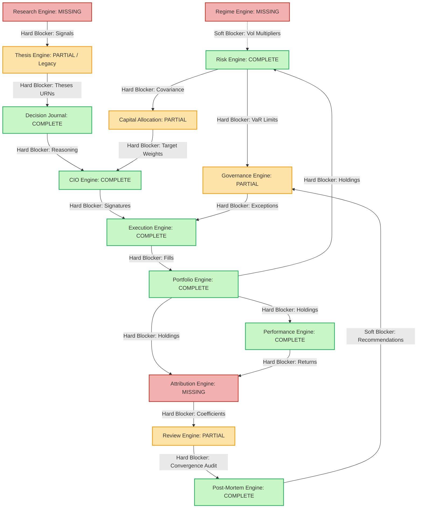

# 29. Sprint-41 Critical Path Decision Audit

This report presents a canonical repository-wide **Critical Path Decision Audit** to determine the correct objective for **Sprint-41** of the Virtual Investment Firm (VIF).

---

## 1. Executive Summary

A repository-wide decision audit was performed to resolve the competing roadmaps for Sprint-41:
* **Option A**: Sprint-41 Governance Engine Foundation
* **Option B**: Sprint-41 Attribution Engine Foundation
* **Option C**: Sprint-41 Capital Allocation Engine Foundation
* **Option D**: Sprint-41 Thesis Engine Evolution

By analyzing execution path dependencies, security vulnerability vectors, and production readiness gates from first principles, this audit determines that **Governance Engine Foundation** is the highest-leverage next step and the absolute primary blocker for production deployment. 

Operating an autonomous trading platform without a database-backed Policy Enforcement Point (PEP) to restrict rogue orders represents a catastrophic capital risk. While Attribution is vital for post-trade learning and Capital Allocation is required for target weight optimization, they do not act as gatekeepers on the active execution path.

**Final Verdict**: `SPRINT_41_GOVERNANCE_RECOMMENDED`

---

## 2. Current Architecture Inventory

The repository inventory is assessed below across all active and partial contexts:

### Thesis Engine
* **Owner Responsibilities**: Defines qualitative hypotheses, parameter schemas, version hashes, and active thesis bindings.
* **Implementation Maturity**: *Partial (Legacy)*. Has functional Postgres storage, but lacks Standard VIF triggers, range partitioning, and versioned event schemas.
* **Upstream Dependencies**: Research Engine (signals).
* **Downstream Dependencies**: Decision Journal.
* **Production Criticality**: Medium.
* **Learning-Loop Criticality**: High.

### Decision Journal
* **Owner Responsibilities**: Captures pre-outcome reasoning, decision snapshots, confidence levels, and active correction chains.
* **Implementation Maturity**: *Fully Implemented*. Postgres-backed, range partitioned, trigger-protected, event versioned.
* **Upstream Dependencies**: Thesis Engine.
* **Downstream Dependencies**: CIO Engine.
* **Production Criticality**: High.
* **Learning-Loop Criticality**: Critical.

### CIO Engine
* **Owner Responsibilities**: Manages strategic target configurations, committee decision records, and pre-trade signature verification.
* **Implementation Maturity**: *Fully Implemented*. Postgres-backed, Ed25519 signatures, trigger-protected.
* **Upstream Dependencies**: Decision Journal.
* **Downstream Dependencies**: Execution Engine.
* **Production Criticality**: High.
* **Learning-Loop Criticality**: High.

### Execution Engine
* **Owner Responsibilities**: Stages orders, performs pre-trade Policy Enforcement Point (PEP) checks, routes orders to brokers, and indexes transaction fills.
* **Implementation Maturity**: *Fully Implemented*. Postgres-backed, PEP limit checks, write-once ledgers.
* **Upstream Dependencies**: CIO Engine (signatures), Governance (policies/exceptions).
* **Downstream Dependencies**: Portfolio Engine (fills).
* **Production Criticality**: Critical.
* **Learning-Loop Criticality**: Medium.

### Portfolio Engine
* **Owner Responsibilities**: Tracks position books, cash balances, cash transactions, and asset valuations.
* **Implementation Maturity**: *Fully Implemented*. Postgres-backed, RTBOR.
* **Upstream Dependencies**: Execution Engine (fills).
* **Downstream Dependencies**: Performance Engine, Risk Engine.
* **Production Criticality**: Critical.
* **Learning-Loop Criticality**: High.

### Performance Engine
* **Owner Responsibilities**: Evaluates ex-post historical returns, Sharpe ratios, Sortino ratios, and drawdowns.
* **Implementation Maturity**: *Fully Implemented*. Postgres-backed.
* **Upstream Dependencies**: Portfolio Engine (snapshots).
* **Downstream Dependencies**: Risk Engine, Attribution Engine.
* **Production Criticality**: High.
* **Learning-Loop Criticality**: Critical.

### Review Engine
* **Owner Responsibilities**: Evaluates signal convergence qualitatively.
* **Implementation Maturity**: *Partial (Text-Based)*. Lacks database persistence.
* **Upstream Dependencies**: Decision Journal, Attribution.
* **Downstream Dependencies**: Post-Mortem Engine.
* **Production Criticality**: Low.
* **Learning-Loop Criticality**: High.

### Post-Mortem Engine
* **Owner Responsibilities**: Conducts failure classification, root-cause weight attribution, and ex-post action-item recommendations.
* **Implementation Maturity**: *Fully Implemented*. Postgres-backed, state machine lifecycle, OCC concurrency, history logs.
* **Upstream Dependencies**: Decision Journal, Performance, Risk, Portfolio.
* **Downstream Dependencies**: Governance (remediations).
* **Production Criticality**: Medium.
* **Learning-Loop Criticality**: Critical.

### Risk Engine
* **Owner Responsibilities**: Calculates forward-looking ex-ante portfolio risk metrics (VaR, CVaR, concentration HHI/Gini, Days-to-Liquidate, stress tests).
* **Implementation Maturity**: *Fully Implemented*. Postgres-backed, range partitioned, trigger-protected.
* **Upstream Dependencies**: Portfolio snapshots, Performance returns, Regime multipliers.
* **Downstream Dependencies**: Governance, Capital Allocation.
* **Production Criticality**: High.
* **Learning-Loop Criticality**: High.

### Governance Engine
* **Owner Responsibilities**: Evaluates policy rules and budget constraints, issues exception tokens, and enforces limits.
* **Implementation Maturity**: *Partial*. Limit checking and exception token verifications are fully mocked inside Execution PEP adapters.
* **Upstream Dependencies**: Risk Engine, Post-Mortem (recommendations).
* **Downstream Dependencies**: Capital Allocation (drawdown restrictions).
* **Production Criticality**: Critical.
* **Learning-Loop Criticality**: High.

### Capital Allocation Engine
* **Owner Responsibilities**: Optimizes portfolio risk budgets, executes mean-variance/risk-parity solvers, and scales limits.
* **Implementation Maturity**: *Partial (Mock-Model)*. Exists as a stateless Python class without relational database storage or optimized solvers.
* **Upstream Dependencies**: Risk Engine, Governance.
* **Downstream Dependencies**: CIO Engine (target weights).
* **Production Criticality**: High.
* **Learning-Loop Criticality**: High.

---

## 3. Critical Path Dependency Graph

The relationships between implemented, partial, and missing components are modeled below:

---

## 4. Governance Analysis

### Current Status:
The Execution Engine features a Policy Enforcement Point (PEP) via the `GovernanceAuthorizationPort`. However, because the Governance Engine is not fully implemented as a database-backed Policy Decision Point (PDP), this port is completely mocked in tests (`MockGovernanceAuthorizationAdapter`). Exception tokens, policy limits, and real-time rule evaluations are simulated.

### Critical Gaps:
* **No Real limit Enforcement**: Ex-ante VaR, stress metrics, and HHI/Gini concentration limits generated by the Risk Engine are calculated but never enforced against staging orders.
* **No Auditable Policy Lifecycle**: Compliance constraints are not stored in an immutable, database-backed ledger.

### Verdict:
**No, the platform cannot safely operate without Governance**. Deploying autonomous AI agents with real capital without an active PEP/PDP safety gate presents a catastrophic operational risk. Real limit enforcement and policy lifecycle verifications remain 100% mocked.

---

## 5. Attribution Analysis

### Current Status:
The Attribution Engine is completely missing. Quantitative ex-post return slices (allocating performance to thesis accuracy, execution slippage, or allocation parity) are simulated.

### Critical Gaps:
* **Mocked Post-Mortem Inputs**: The Post-Mortem Engine is fully implemented, but its failure weight evaluations and recommendation triggers consume mocked attribution percentages.
* **No Confidence Calibration**: Calibration curves comparing ex-post return streams against ex-ante Decision Journal confidence scores are stubbed in Performance (`consume_execution_outcome` uses a static `0.8` forecast probability benchmark).

### Verdict:
**No, the learning loop cannot operate without Attribution**. Without Attribution, the feedback loop from performance outcome back to the Decision Journal and Thesis Engine is qualitative and uncalibrated. The entire calibration path remains mocked.

---

## 6. Capital Allocation Analysis

### Current Status:
Capital Allocation exists only as a stateless Python model (`allocation.py`) without database persistence or optimized solvers. 

### Critical Gaps:
* **Manual Target Updates**: The CIO Engine receives manual targets because there is no optimized Capital Allocation solver to convert ex-ante covariance forecasts (from the Risk Engine) into dynamic target weights.

### Verdict:
**No, Risk outputs cannot dynamically update portfolio decisions without Allocation**. The covariance matrix forecasts generated by the Risk Engine remain isolated and are not converted into active optimizations.

---

## 7. Thesis Evolution Analysis

### Current Status:
The Thesis Engine possesses legacy codebase structures from early sprints. It has a working database-backed repository (`postgres_thesis_repository.py`) and is imported by the Decision Journal.

### Verdict:
**No, Thesis debt is not blocking any active production capability**. While the legacy code structure lacks standard triggers and partitioning, it successfully stores theses, parameter hashes, and URNs, allowing the Decision Journal to write records without failure. Modernizing it is an aesthetic and code-standard cleanup rather than a block on transactional execution.

---

## 8. Research Engine Analysis

### Current Status:
The Research Engine is completely missing. Raw data signals and sandbox testing are absent.

### Verdict:
**No, missing Research does not block production or transaction loops**. Users and agents can manually input theses and link them to decision logs using URN parameters. It is an automation and signal provenance gap, not a blocker.

---

## 9. Performance Engine Evolution Analysis

### Current Status:
Performance Engine is complete for return and Sharpe calculations, but its integration with pre-outcome expectations is mocked. Future engines that depend on its calibration and relative ranking features include the **Attribution Engine** and **Post-Mortem Engine** (which require calibrated, non-mocked Brier score outcomes to verify thesis precision).

---

## 10. Architecture Delta Analysis

Comparing the repository state against the target VIF reference architecture:
* **Highest Risk Gap**: Execution PEP limit checks bypassing database validation (mocked).
* **Highest Leverage Gap**: Governance PDP limit enforcement (connects Risk outputs to Execution gates).
* **Highest Governance Gap**: Lack of an auditable exception token lifecycle.
* **Highest Learning-Loop Gap**: Missing Attribution Engine (stubs Post-Mortem recommendations).

---

## 11. Scenario Analysis

### Scenario A: Sprint-41 Governance
* **Benefits**: Connects ex-ante Risk outputs to the Execution PEP check, establishing an active Policy Decision Point (PDP).
* **Blocked Capabilities Removed**: Bypasses the `MockGovernanceAuthorizationAdapter`, enforcing real exceptions.
* **Remaining Blockers**: Mocked Attribution metrics in Post-Mortem; manual target allocations.
* **Production Readiness**: Excellent (VIF can execute trades securely under limit enforcement).
* **Learning-Loop**: Medium (safety gate is active, but learning feedback remains mocked).

### Scenario B: Sprint-41 Attribution
* **Benefits**: Closes the post-trade learning loop, providing real metrics for Post-Mortem failure attributions.
* **Blocked Capabilities Removed**: Bypasses mocked coefficients in Post-Mortem.
* **Remaining Blockers**: Mocked exception tokens at Execution PEP (security blocker).
* **Production Readiness**: Poor (unsecured execution path prevents live capital deployment).
* **Learning-Loop**: Excellent (ex-post outcomes are fully attributed and calibrated).

### Scenario C: Sprint-41 Capital Allocation
* **Benefits**: Automates portfolio optimizations using covariance matrix inputs.
* **Blocked Capabilities Removed**: Bypasses manual target weight entries in CIO.
* **Remaining Blockers**: Security blocker at PEP (Governance is mocked).
* **Production Readiness**: Poor (malfunctioning solvers can stage violating trades without safety checks).
* **Learning-Loop**: Medium (closes ex-ante optimization, ex-post learning remains mocked).

### Scenario D: Sprint-41 Thesis Evolution
* **Benefits**: Standardizes legacy code directories.
* **Blocked Capabilities Removed**: None.
* **Remaining Blockers**: Mocks in PEP, Attribution, and Allocation.
* **Production Readiness**: Poor (technical debt resolved, but critical gates remain mocked).
* **Learning-Loop**: Poor.

---

## 12. Production Readiness Scorecard

| Context | Production Impact | Security Impact | Governance Impact | Learning Impact | Architectural Leverage |
| :--- | :---: | :---: | :---: | :---: | :---: |
| **Governance Engine** | 10 | 10 | 10 | 6 | 9 |
| **Attribution Engine** | 6 | 4 | 5 | 10 | 8 |
| **Capital Allocation** | 8 | 5 | 6 | 7 | 8 |
| **Regime Engine** | 5 | 3 | 4 | 5 | 5 |
| **Research Engine** | 4 | 3 | 4 | 6 | 4 |

---

## 13. Recommended Sprint Order

1. **Sprint-41: Governance Engine Foundation**
   - *Why Now*: Closes the Execution PEP security gate, replacing simulated exceptions. Consumes ex-ante Risk metrics.
   - *Dependency*: Downstream of Risk; Upstream of Execution fills.
   - *Expected Value*: Establishes automated limit checks.
   - *Risk Reduction*: Eliminates unauthorized capital exposure.
2. **Sprint-42: Attribution Engine Foundation**
   - *Why Now*: Closes the ex-post learning loop, enabling real data inputs for Post-Mortem evaluations.
   - *Dependency*: Downstream of Portfolio and Performance.
   - *Expected Value*: Allocates selection, execution, and weighting alpha.
   - *Risk Reduction*: Resolves simulated failure weights in Post-Mortem.
3. **Sprint-43: Capital Allocation Engine Foundation**
   - *Why Now*: Automates target optimizations using risk budgeting parity.
   - *Dependency*: Downstream of Risk and Governance; Upstream of CIO.
   - *Expected Value*: Implements Mean-Variance solvers.
   - *Risk Reduction*: Removes manual target selection errors.
4. **Sprint-44: Regime Engine Foundation**
   - *Why Now*: Replaces default neutral volatility stubs in the Risk Engine.
   - *Dependency*: Downstream of Performance.
   - *Expected Value*: Calculates macro volatility states dynamically.
   - *Risk Reduction*: Protects portfolio underestimation during market regime shifts.
5. **Sprint-45: Thesis Engine Evolution & Research Foundation**
   - *Why Now*: Standardizes legacy Thesis debt and signal sandboxing.
   - *Dependency*: Standardizes parameters for Decision Journals.
   - *Expected Value*: Establishes signal sandboxes and templates.
   - *Risk Reduction*: Standardizes legacied codebase structures.

---

## 14. Acceptance Criteria For Sprint-41 (Governance Engine Foundation)

1. **Policy Decision Point (PDP)**: Implement a Postgres-backed Policy Registry storing active compliance rules, exception limits, and budget caps.
2. **Exception Token Lifecycle**: Implement a write-once ledger for `ExceptionToken` aggregates, validating signatures, expiration timestamps, and target context URNs.
3. **Execution PEP Integration**: Refactor the Execution PEP (`GovernanceAuthorizationPort`) to query the live Governance PDP, blocking staged orders that breach active rules without a valid Exception Token.
4. **Risk-Limit Validation**: The PDP must query active ex-ante risk records (VaR, stress results) from the Risk Engine to evaluate portfolio-level policy limits.
5. **Immutability Triggers**: Alembic migrations must enforce UPDATE/DELETE blocks on policy and exception tables.

---

## 15. Final Verdict

### **SPRINT_41_GOVERNANCE_RECOMMENDED**
*Governance Engine Foundation must be selected for Sprint-41. It is the critical pre-trade compliance safety gate that resolves the primary mock on the execution path, allowing the platform to transition from simulation to production readiness.*
