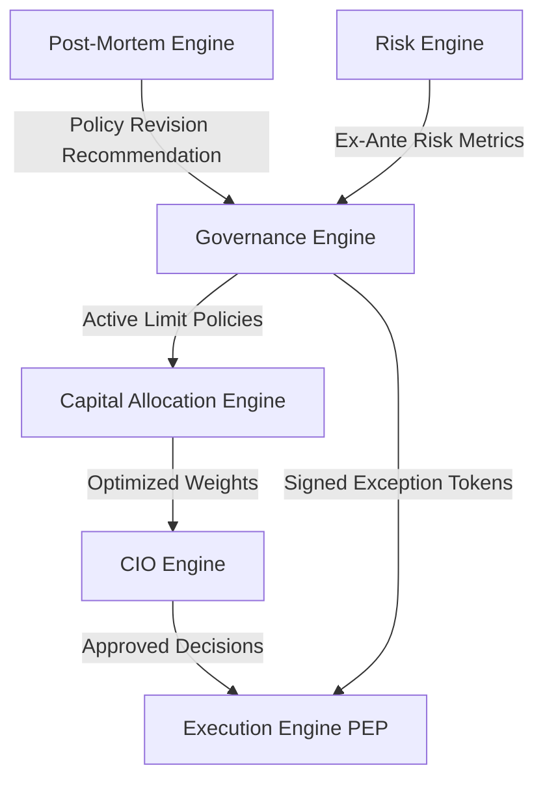

# 30. Governance Engine Foundation Architecture Design

This document defines the complete architecture design for the **Governance Engine Foundation** bounded context in Sprint-41.

---

## 1. Executive Summary

The **Governance Engine** is established as the authoritative control plane of the Virtual Investment Firm (VIF). It goes beyond a stateless Policy Decision Point (PDP) / Policy Enforcement Point (PEP) helper; it owns the life-cycles of VIF compliance policies, exception permissions, target constraints, and multi-signature authorization credentials.

All transactional execution points (Execution Engine PEP checks), optimization modules (Capital Allocation risk budgets), and executive bodies (CIO committee decisions) are subordinated to Governance constraints. 

---

## 2. Ownership Boundary Matrix

The table below defines the authoritative write capabilities and read allocations for the VIF control plane:

| Context | Authoritative Ownership (Write Ledgers) | Consumer Access (Read-Only Ports) | Prohibited Overlaps |
| :--- | :--- | :--- | :--- |
| **Governance Engine** | `policies`, `exception_tokens`, `approval_rules` | Execution PEP, Capital Allocation solvers, CIO | Can NOT edit portfolio positions or execute trades. |
| **Risk Engine** | `risk_evaluation_records`, `covariance_forecasts` | Governance PDP, Capital Allocation | Can NOT define compliance limits or grant exception overrides. |
| **Capital Allocation** | `risk_allocations`, `optimized_weights` | CIO Engine target-tree updates | Can NOT exceed Governance-defined HHI/VaR caps. |
| **CIO Engine** | `cio_decisions`, `portfolio_targets` | Execution Engine staging | Can NOT authorize trades breaching limits without Governance Exception Tokens. |
| **Execution Engine**| `order_records`, `fill_records` | Portfolio Engine, Performance | Can NOT bypass PEP signature check or Governance validation. |
| **Post-Mortem Engine**| `post_mortem_records`, `recommendations` | Governance Engine policy revisions | Can NOT update active policies or exceptions directly. |

---

## 3. Architecture Overview

The integration of Governance across the pre-trade enforcement and post-trade learning feedback loops is modeled below:



* **Pre-Trade Compliance Loop**: Risk Engine provides ex-ante metrics (VaR, concentration stats) $\rightarrow$ Governance PDP evaluates metrics against policies $\rightarrow$ Capital Allocation optimizes targets under policy caps $\rightarrow$ CIO approves targets $\rightarrow$ Execution PEP enforces limits and exception overrides.
* **Post-Trade Learning Feedback Loop**: Performance/Attribution results $\rightarrow$ Post-Mortem identifies breaches and alpha decay $\rightarrow$ Post-Mortem recommends updates $\rightarrow$ Governance registers new policy revisions, deprecating legacy policies.

---

## 4. Domain Model

The Governance bounded context is defined by the following domain aggregates:

### Aggregate Roots:
1. **Policy**: Represents a compliance rule book containing a collection of target constraints and approval rules.
2. **ExceptionToken**: Represents a cryptographically signed override allowing temporary policy breaches.

### Entities:
* `ConstraintDefinition`: Child entity of `Policy` defining parameter boundaries (e.g., VaR cap, Gini cap).
* `ApprovalRule`: Child entity of `Policy` mapping required multi-signature credentials for specific action scopes.

### Value Objects:
* `PolicyCondition`: Evaluates contextual inputs (e.g. sector, asset class) against constraints.
* `ExceptionScope`: Limits the range of the override to specific assets, sectors, or contexts.
* `ExceptionDuration`: Enforces chronological boundaries (start timestamp, expiration timestamp).
* `ExceptionReason`: Documents audit justification.

---

## 5. Aggregate Design

We evaluate the structural design options:
* **Option A (Single GovernanceAggregate)**: Poor separation of concerns. Policies and Exception Tokens operate on independent lifecycles, causing massive transaction page locks.
* **Option B (PolicyAggregate + ExceptionAggregate)**: **SELECTED**.
  - *PolicyAggregate*: Policies encapsulate constraints and approval rules. Constraints and approval rules have no independent lifecycle outside their parent policy; modifying a rule requires versioning the policy aggregate.
  - *ExceptionAggregate*: Exception tokens are created independently of active policies (often by compliance officers reacting to emergency liquidation scenarios) and possess unique cryptographic signature blocks.
* **Option C (Separate Policy, Constraint, Exception, and ApprovalRule Aggregates)**: Leads to fragmented transaction boundaries. Modifying constraints independently of policies risks orphaned rules and inconsistent evaluations.

---

## 6. Value Objects

```python
@dataclass(frozen=True)
class PolicyCondition:
    attribute: str      # e.g., "portfolio_var_95"
    operator: str       # e.g., "LESS_THAN_OR_EQUAL"
    target_value: str   # e.g., "0.05"

@dataclass(frozen=True)
class ConstraintDefinition:
    constraint_id: str
    condition: PolicyCondition
    severity: str        # e.g., "DENY", "WARN"

@dataclass(frozen=True)
class ApprovalRequirement:
    role: str            # e.g., "CIO", "COMPLIANCE_OFFICER"
    min_signatures: int  # e.g., 2

@dataclass(frozen=True)
class ExceptionScope:
    target_type: str     # e.g., "PORTFOLIO", "ASSET"
    target_urn: str      # e.g., "urn:karsa:asset:BTC"

@dataclass(frozen=True)
class ExceptionDuration:
    start_time: datetime
    expire_time: datetime

@dataclass(frozen=True)
class ExceptionReason:
    justification: str
    incident_ref: Optional[str] # links to Post-Mortem or PM recommendation URN
```

---

## 7. Event Contracts

The context publishes the following versioned, immutable events (all containing `event_id`, `correlation_id`, `causation_id`, and `event_version`):
* `PolicyCreatedEvent`: Fired when a new policy is draft-registered.
* `PolicyActivatedEvent`: Fired when a policy state transitions to `ACTIVE`, triggering PDP updates.
* `PolicyRetiredEvent`: Fired when a policy is replaced or deprecated.
* `ExceptionGrantedEvent`: Fired when an `ExceptionToken` is successfully issued and signed.
* `ExceptionExpiredEvent`: Fired when an exception reaches its expiration timestamp.
* `ExceptionRevokedEvent`: Fired when an exception is manually cancelled prior to expiry.

---

## 8. Application Services

* **PolicyLifecycleService**: Coordinates drafting, review, approval, activation, and deprecation of policies.
* **ExceptionService**: Processes exception requests, verifies approver cryptographic signatures, and persists issued `ExceptionToken` records.
* **ApprovalService**: Validates multi-signature CIO target adjustments against policy approval rules.
* **GovernanceService**: Exposes PDP evaluations to the Execution PEP and Capital Allocation optimizer.

---

## 9. Repositories

* **PolicyRepository**: Handles persistence of the `Policy` aggregate root (and its child constraints/rules).
* **ExceptionTokenRepository**: Handles persistence and lookup of active/expired `ExceptionToken` records.

---

## 10. Persistence Design

To maintain auditing integrity:
* **Append-Only Ledgers**: Tables `policies` and `exception_tokens` are strictly write-once. Updates are prohibited.
* **Policy Versioning**: Rather than updating a policy row, policy updates insert a new row with the same `policy_urn` but an incremented `version` column (e.g. `2.0.0`), marking the prior version as `RETIRED`.
* **Database Triggers**: Alembic database migrations create triggers blocking `UPDATE` and `DELETE` queries.
* **Partitioning**: The `exception_tokens` table is range-partitioned by `expire_time` to simplify archival purging.

---

## 11. Integration Design

* **Risk Engine**: Governance PDP queries the Risk Engine to fetch current VaR and concentration metrics during pre-trade evaluations.
* **Execution Engine**: The Execution PEP checks for an active `ExceptionToken` in the database whenever a limit check is breached.
* **Capital Allocation**: Solvers read active `ConstraintDefinition` boundaries to run optimizations.
* **Post-Mortem**: Generates policy amendment recommendations that are ingested by the `PolicyLifecycleService`.

---

## 12. Sequence Diagrams

### Execution Authorization Sequence:
```
StagedOrder -> PEP (Execution) -> PDP (Governance): Evaluate Staged Order
PDP -> Risk Engine: Fetch Current ex-ante VaR Metrics
PDP -> Policy Registry: Retrieve Active Limit Policies
PDP -> PDP: Evaluate Limits (BREACH DETECTED)
PDP -> Exception Registry: Look up Active Exception Token
Exception Registry -> PDP: Return Valid Exception Token
PDP -> PEP: return ALLOW (Authorized via Exception)
PEP -> Broker Adapter: Route Trade
```

---

## 13. State Diagrams

### Policy Lifecycle:
```
Draft -> Review -> Approved -> Active -> Deprecated -> Retired
```

### Exception Lifecycle:
```
Requested -> Approved -> Active -> Expired/Revoked
```

---

## 14. Failure Handling

* **Expired Exceptions**: Evaluators compare database timestamps against current UTC clock. Expired exception records immediately evaluate to `DENY`.
* **Constraint Conflicts**: The PDP evaluates rules in order of `priority` (highest integer wins). If a conflict occurs, the most restrictive cap dominates.
* **Orphaned Rules**: Handled by encapsulating Rules inside the `Policy` aggregate root.

---

## 15. OCC Strategy

* **Policy Aggregate**: **No OCC required**. Policies are strictly immutable, append-only, and versioned. Concurrent updates are resolved by inserting new rows.
* **ExceptionToken Aggregate**: **No OCC required**. Exception tokens are issued once and expire chronologically. State change to `REVOKED` uses database trigger blocks to prevent double-revocations.

---

## 16. Scalability Analysis

Pre-trade PEP checks must execute within milliseconds. The PDP maintains an in-memory cache of `Active` policies and `Active` exception tokens. Database queries are limited to cache misses, using indexed lookups on `policy_urn` and `token_hash`.

---

## 17. Security Analysis

* **Cryptographic Signatures**: Exception tokens contain an Ed25519 double-signature block (CIO Approval Key + Compliance Officer Key). PEP verifiers compute signature checks before permitting staging order overrides.
* **Tamper Prevention**: Database triggers block SQL-level adjustments to active policies.

---

## 18. Migration Strategy

1. Deploy database migrations (`41_governance_init.py`) to create registries and triggers.
2. Refactor `GovernanceAuthorizationPort` to replace mock adapters with `PostgresGovernanceRepository` queries.
3. Seed default compliance policies into the database.

---

## 19. Risks

* **Network Latency**: PDP queries during PEP validations could introduce order routing delay. Resolved via in-memory caching.
* **Clock Drift**: Exception token expiration checks are sensitive to time synchronization. Managed using NTP sync configurations.

---

## 20. ADR Decisions

### ADR-055-governance-authority
* *Status*: Proposed.
* *Context*: Resolves PEP stubs.
* *Decision*: Governance Engine is the authoritative owner of exceptions and limits, controlling PEP routing validations.

---

## 21. Architecture Challenges

* **Challenge #1: Is Governance PDP/PEP or Control Plane?**: Control Plane. It defines constraints that bind all VIF transactional components.
* **Challenge #2: Can Capital Allocation operate without Governance?**: No. Allocation solvers require Governance constraints to optimize assets safely.
* **Challenge #3: Does ExceptionToken apply only to Execution?**: No, it overrides limits across Risk, Allocation, and emergency pacings.
* **Challenge #4: Should Registries be separate aggregates?**: No. Rules/Constraints are child entities of `PolicyAggregate` to prevent boundary fragmentation.
* **Challenge #5: How does Post-Mortem modify Governance?**: Via recommendation events that spawn new draft policies.
* **Challenge #6: How does Governance constrain Capital Allocation?**: By supplying active limit caps to the solver.
* **Challenge #7: How does Governance constrain CIO?**: By rejecting targets that breach limits without a signed exception token.
* **Challenge #8: How is state replayed 5 years later?**: Append-only log registries track timestamps and version references, preserving lineage.
* **Challenge #9: How are policy revisions represented without mutating history?**: Via append-only insertion of incremented version rows.
* **Challenge #10: How are exceptions audited?**: Cryptographic double-signatures and decision correlation URNs are persisted in the transaction log.

---

## 22. Architecture Delta Analysis

* **Current State**: Execution PEP is fully mocked; no exception tokens or limit policies exist in PostgreSQL.
* **Target VIF**: Real PEP limit checking against active Governance tables.
* **Delta Resolution**: Sprint-41 implements the PDP registry, Exception ledger, and verifications.

---

## 23. Acceptance Criteria

1. Verification that `policies` and `exception_tokens` tables prevent UPDATE/DELETE queries.
2. Verification that Execution PEP rejects staged orders breaching caps unless a valid exception is registered.
3. Verification that expired exception tokens fail validation tests.

---

## 24. Final Verdict

### **ARCHITECTURE_APPROVED**
