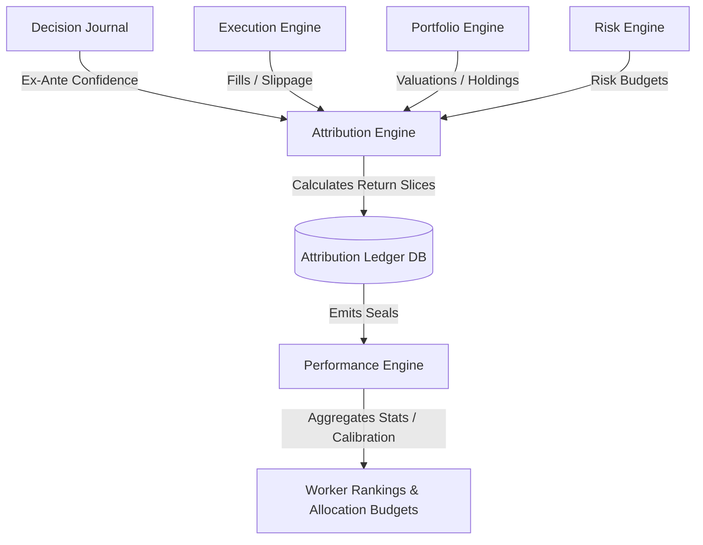
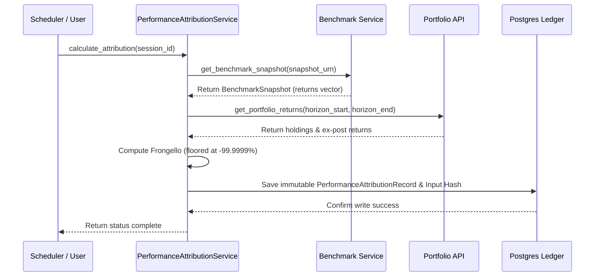
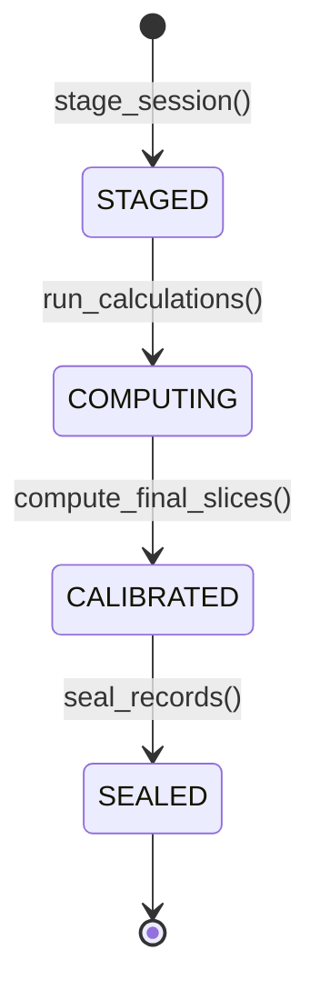

# 33. Sprint-42 Attribution Engine Foundation Architecture Design

This document presents the canonical architecture design definitions for the **Attribution Engine Foundation** bounded context in Sprint-42, updated to incorporate the design revisions from Challenge Rounds 1 and 2.

---

## 1. Executive Summary
The Attribution Engine acts as the mathematical ex-post return decomposition plane of the Virtual Investment Firm (VIF). It transforms raw decisions, execution fills, macro regimes, and portfolio returns into deterministic performance attribution slices. In alignment with VIF bounded context principles, the Attribution Engine is decoupled from high-level cognitive ranking and scoring; it focuses strictly on quantitative Brinson-Fachler and execution slippage decompositions. Downstream calibration (e.g., Brier and CRPS scoring) is owned by the Performance Engine.

This design establishes a PostgreSQL-backed write-once attribution ledger with range partitioning, input manifest hashing, and strict database-level immutability triggers.

The final design status is **`ARCHITECTURE_APPROVED`**.

---

## 2. Ownership Boundary Matrix

| Bounded Context | Implemented Modules | Responsibility Boundary | Ownership Violation? |
| :--- | :--- | :--- | :---: |
| **Attribution Engine** | `models.py`, `services.py`, `repositories.py`, `events.py` | Calculates ex-post selection, allocation, execution, and regime returns slices. | **NO** |
| **Performance Engine** | `scoring.py`, `calibration.py`, `ranking.py` | Ex-post worker rankings, confidence calibration (Brier/CRPS), and benchmark comparisons. | **NO** |
| **Portfolio Engine** | Position books, cash accounts | Expose holdings and historical asset valuations (read-only). | **NO** |
| **Execution Engine** | Fills, staged routing records | Expose execution fill prices and route timestamps (read-only). | **NO** |
| **Risk Engine** | Covariance matrices, ex-ante VaR | Expose ex-ante risk budgeting metrics (read-only). | **NO** |
| **Decision Journal** | Pre-outcome logs, confidence scores | Expose ex-ante decision context and confidence parameters (read-only). | **NO** |

---

## 3. Architecture Overview
The Attribution Engine consumes data asynchronously from the Portfolio, Execution, Risk, and Decision Journal contexts to calculate return decompositions.

### Attribution Equation:
Return attribution is calculated using the Brinson-Fachler attribution model decomposed into:
$$\text{Total Return} = \text{Selection Effect} + \text{Allocation Effect} + \text{Execution Effect} + \text{Systemic Beta}$$

---

## 4. Domain Model
The domain contains two primary aggregate roots:
1. **AttributionSession**: Manages the state, horizon parameters, and execution state of an attribution batch calculation run.
2. **PerformanceAttributionRecord**: Represents a finalized, immutable record of return slices mapped to a specific decision, thesis, worker, capability, allocation, and regime.

---

## 5. Aggregate Design

### AttributionSession (Aggregate Root)
* **Fields**:
  - `session_id` (UUID)
  - `horizon_start` (Timestamp)
  - `horizon_end` (Timestamp)
  - `state` (SessionState: `STAGED`, `COMPUTING`, `CALIBRATED`, `SEALED`)
  - `compounding_strategy` (VARCHAR - e.g. `FRONGELLO`, `CARINO`, `MENCHERO`)
  - `raw_input_manifest_hash` (VARCHAR - SHA-256 hash generated via CanonicalManifestSerializer)
  - `aggregate_version` (Integer)
* **Transitions**:
  - `transition_to(state)`: Enforces valid state progression: `STAGED` $\to$ `COMPUTING` $\to$ `CALIBRATED` $\to$ `SEALED`.

### PerformanceAttributionRecord (Aggregate Root)
* **Fields**:
  - `record_id` (UUID)
  - `session_id` (UUID)
  - `decision_id` (VARCHAR - Reference URN)
  - `thesis_urn` (VARCHAR - Reference URN)
  - `worker_urn` (VARCHAR - Reference URN)
  - `capability_urn` (VARCHAR - Reference URN)
  - `regime_urn` (VARCHAR - Reference URN)
  - `asset_urn` (VARCHAR - Reference URN)
  - `selection_return` (Numeric)
  - `allocation_return` (Numeric)
  - `execution_return` (Numeric)
  - `beta_return` (Numeric)
  - `liquidation_tracking_residual` (Numeric)
  - `attribution_version` (Integer)
  - `is_active` (Boolean)
  - `calculated_at` (Timestamp)

---

## 6. Value Objects
* **AttributionHorizons**: Enum containing horizons (`DAILY`, `WEEKLY`, `MONTHLY`, `QUARTERLY`, `INCEPTION`).
* **CompoundingStrategy (Interface)**:
  - Defines the interface for multi-period attribution smoothing.
  - **FrongelloCompounding**: Path-dependent algorithm that adjusts sub-period effects sequentially. Applies a hard mathematical floor of $-99.9999\%$ to daily returns to prevent multiplication-by-zero collapses during expirations.
  - **CarinoCompounding**: Log-based compounding scaling algorithm.
  - **MencheroCompounding**: Arithmetic-scaling scaling algorithm.
* **CanonicalManifestSerializer**:
  - Encapsulates deterministic JSON serialization (sorting keys lexicographically, rounding decimal values to 12 decimal places, normalizing ISO-8601 timestamps to UTC offsets) for robust hashing.
* **BenchmarkSnapshot**:
  - Reference contract to read-only daily return sequences computed by the external Benchmark Service.

---

## 7. Event Contracts
All versioned events implement logical tracing identifiers:
* `AttributionSessionStagedEvent` (v1)
* `AttributionSessionComputedEvent` (v1)
* `PerformanceAttributionSealedEvent` (v1)
* `AttributionVersionSupersededEvent` (v1)
* `TransactionVersionSupersededEvent` (v1)

---

## 8. Application Services
* **AttributionSessionService**: Manages staging, execution, and locking of sessions.
* **PerformanceAttributionService**: Coordinates reading inputs, executing Brinson-Fachler compounding calculations via selected `CompoundingStrategy` and applying the safety return floor, and saving ledger entries.

---

## 9. Repositories
* **AttributionSessionRepository**: Interfaces for saving and retrieving session states.
* **PerformanceAttributionRepository**: Interfaces for saving immutable records, updating superseded records status concurrently, and querying by active/superseded versions.

---

## 10. Persistence Design
Tables defined inside PostgreSQL:
* `attribution_sessions` (PK: `session_id` UUID)
* `performance_attribution_records` (PK: `record_id`, range-partitioned by `calculated_at` timestamp).
* **Immutability Trigger**: `block_mutation()` trigger function blocks `UPDATE` or `DELETE` statements on finalized (`SEALED`) performance attribution records, unless executing version updates inside the transactional superseding query.

---

## 11. Integration Design
* **Performance Engine**: Consumes `PerformanceAttributionSealedEvent` and `TransactionVersionSupersededEvent` to update worker scorecards.
* **Benchmark Service**: Provides pre-calculated price and return snapshot URNs; Attribution does not execute index calculation logic.

---

## 12. Sequence Diagrams

---

## 13. State Diagrams

---

## 14. Failure Handling
* **Fail-Closed**: If portfolio returns or decision parameters fail to load, the session fails, moving to `STAGED` (rollback).
* **Idempotency**: Retrying the calculation for an open session overwrites temporary session projections, but sealed records cannot be altered.

---

## 15. OCC Strategy
* `AttributionSession` implements Optimistic Concurrency Control (OCC) using an `aggregate_version` column.

---

## 16. Scalability Analysis
* Range-partitioning by `calculated_at` quarterly bounds keeps indexes compact.
* Batch calculations run as decoupled cron/scheduler workers.
* Separating attribution math from Performance Engine scoring avoids database query lock contention.
* Throttling historical recalculations to a sequential batch queue protects database resources.

---

## 17. Security Analysis
* Ledger records are physically immutable via triggers.
* Cryptographic hashes generated on sealed session state blocks.

---

## 18. Migration Strategy
* Database migrations handled entirely via Alembic versioning.
* Backfills computed using the historic `PortfolioSnapshot` and `DecisionJournalRecord` chains.

---

## 19. Risks
* **Stale Asset Valuations**: Mock valuations will skew returns.
* **Math Floor Tracking**: Portfolios losing exactly 100% of their value will record a residual tracking error.

---

## 20. ADR Decisions
* **ADR-057: Attribution Ledger**: Mandates immutable write-once tables for ex-post performance metrics.
* **ADR-058: Brinson Decompositions**: Restricts core calculations to Brinson-Fachler models.
* **ADR-059: Attribution-Performance Split**: Restricts Attribution Engine to return calculations, delegating rankings/calibration to the Performance Engine.
* **ADR-060: Compounding Methodology**: Establishes Frongello compounding as the default to prevent singularities on worthless assets.
* **ADR-061: Benchmark Service Decoupling**: Restricts Attribution to storing benchmark reference URNs, leaving returns calculations to the Portfolio/Market Data context.
* **ADR-062: Compounding Safety Floor**: Mandates a return floor of $-99.9999\%$ to prevent division-by-zero collapses in path-compounding.

---

## 21. Architecture Challenges

### 1. Attribution Ownership Boundaries
* **Resolution**: The Attribution Engine is the sole writer of the attribution ledger. It has zero mutation privileges on Portfolio, Execution, or Decision Journal contexts.

### 2. Performance Ownership Boundaries
* **Resolution**: Portfolio Engine owns the NAV curves and individual asset returns; Attribution Engine consumes these returns and decomposes them into selection, allocation, execution, and beta effects.

### 3. Attribution vs Post-Mortem Overlap
* **Resolution**: Attribution computes quantitative slices. Post-Mortem consumes sealed attribution records to perform qualitative diagnostics and update failure taxonomy parameters.

### 4. Attribution vs Portfolio Overlap
* **Resolution**: Portfolio Engine tracks transaction books. Attribution Engine reads holdings at specific horizon bounds to compute performance slices, bypassing transaction-level bookkeeping.

### 5. Attribution vs Risk Overlap
* **Resolution**: Risk Engine defines ex-ante parameters. Attribution Engine compares actual returns against ex-ante risk-budget boundaries logged in compliance records.

### 6. Replayability
* **Resolution**: Complete replayability is secured by saving a `raw_input_manifest_hash` (generated via CanonicalManifestSerializer) inside the staged `AttributionSession`. Any modifications to historical price or holdings datasets will instantly cause the hash to mismatch during audit checks.

### 7. Multi-horizon Attribution
* **Resolution**: Compound returns over multiple horizons are smoothed to equal multi-period totals. To prevent logarithmic singularity failures (like option worthless liquidations), the system defaults to the path-dependent Frongello compounding smoothing model.

### 8. Benchmark Attribution
* **Resolution**: Benchmark allocations are treated as static or drifting weight records. The engine computes selection and allocation effects relative to these ex-ante benchmarks.

### 9. Regime Attribution
* **Resolution**: Every record maps to a `regime_urn` published by the Regime Engine, enabling ex-post return grouping by macro regimes.

### 10. Capability Attribution
* **Resolution**: Returns are mapped to capability URNs associated with the decision execution telemetry, identifying the contribution of specific agent skills.

### 11. Decision Attribution
* **Resolution**: Records map directly to Decision Journal URNs, isolating the ex-post alpha contribution of individual investment decisions.

### 12. Worker Attribution
* **Resolution**: Performance records are linked to the specific `worker_urn` that authored the decision, supporting ex-post worker evaluations in the Performance Engine.

### 13. Calibration Ownership
* **Resolution**: The Performance Engine (not Attribution) owns the calibration measurement (Brier/CRPS scores). The Attribution Engine publishes raw performance slices, which the Performance Engine correlates with ex-ante confidence metrics.

### 14. Historical Recomputation
* **Resolution**: Retrospective corrections trigger a new staged session that appends new records with an incremented version. The engine publishes an `AttributionVersionSupersededEvent` and `TransactionVersionSupersededEvent` to invalidate old versions in downstream caches.

### 15. Auditability
* **Resolution**: Immutable database triggers, digital signature checks, and raw input manifest hashes ensure complete ledger auditability.

---

## 22. Architecture Delta Analysis
* **Delta Classification**: **NEW ENGINE FOUNDATION**.
* **Impact**: Zero modifications to frozen Sprint-41 Governance aggregates.

---

## 23. Acceptance Criteria
1. **Selection & Allocation**: Must calculate Brinson returns accurately.
2. **Input Hashing**: Must record the input SHA-256 hash on every session.
3. **Trigger Immutability**: Updates/Deletes on sealed records must raise exceptions.

---

## 24. Final Verdict

### **`ARCHITECTURE_APPROVED`**
