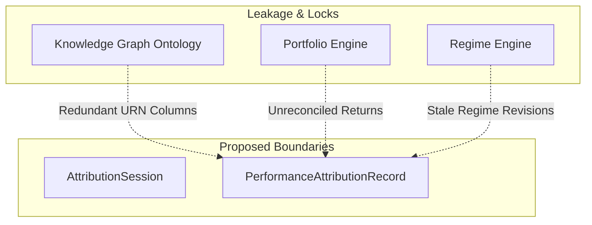

# 34. Sprint-42 Attribution Engine Foundation - Architecture Challenge Round 1

This document presents the first-round **Architecture Challenge** for the **Attribution Engine Foundation** bounded context in Sprint-42.

---

## 1. Executive Summary
An aggressive, adversarial architecture challenge was performed on the frozen Sprint-42 Attribution Engine design. The goal was to stress-test the design against the Virtual Investment Firm (VIF) target architecture, identifying structural flaws, mathematical failure modes, boundary overlaps, and scalability limitations before implementation begins.

The challenge identified several critical architectural vulnerabilities:
1. **Mathematical Breakdown of Carino Compounding**: The Carino smoothing algorithm fails completely in extreme return scenarios, specifically when a sub-period return is $-100\%$ (option expiration or total asset liquidation), leading to undefined $\ln(0)$ errors.
2. **Dimension Inflation and Knowledge Graph Redundancy**: Hardcoding relational metadata columns (`worker_urn`, `capability_urn`, `thesis_urn`) into the sealed, immutable database record duplicates and conflicts with the future Knowledge Graph ontology.
3. **Drift and Double-Calculation in Portfolio Return Tracking**: The lack of a clear return calculation owner introduces calculation drift between ex-post portfolio NAV and the return decompositions computed by the Attribution Engine.
4. **Execution Netting Slippage Mismatch**: Netting orders across multiple portfolio accounts at the execution level breaks the correlation needed to attribute execution slippage to individual ex-ante decisions.

Consequently, the design cannot proceed to implementation as currently specified.

**Audit Verdict**: `ARCHITECTURE_REQUIRES_REVISION`

---

## 2. Architecture Weaknesses

### A. Mathematical Failure on Option Expirations ($-100\%$ returns)
* **The Flaw**: The Carino compounding algorithm requires calculating the smoothing factor $k_t = \frac{\ln(1 + R_t)}{R_t}$. If a derivative position or asset value drops to zero ($R_t = -100\%$), the expression $\ln(1 + R_t) = \ln(0)$ is undefined ($-\infty$).
* **Operational Impact**: If a single sub-period option or holding expires worthless, the entire multi-period attribution batch will fail with a division/math error, preventing the session from sealing.

### B. Execution Netting Breaks Slippage Attribution
* **The Flaw**: The Execution Engine net-allocates orders across multiple portfolios to minimize commission costs. When a net block order is filled, individual decisions are mapped to partial executions. The current design does not account for this netting, meaning slippage and latency metrics cannot be deterministically mapped back to the staging decision.
* **Operational Impact**: Selection and execution returns will fail to reconcile, leading to unexplained residuals in the ledger.

---

## 3. Aggregate Boundary Analysis

The proposed aggregates (`AttributionSession` and `PerformanceAttributionRecord`) suffer from state leakage and version lock:

* **AttributionSession Boundary**: Does not contain input hashes. If raw pricing feeds or corporate actions are modified in the Portfolio Engine after a session is staged but before it is sealed, the session will seal corrupt data without an audit trail of the divergence.
* **PerformanceAttributionRecord Boundary**: The aggregate bundles ex-post financial outcomes with context references (`worker_urn`, `capability_urn`). This introduces version locks; if an agent model version is updated or re-indexed in the future, the immutable records in this ledger cannot reflect the new ontology without breaking their signature.

---

## 4. Ownership Boundary Analysis

The matrix below highlights boundary overlaps and clarifies the permitted read/write access:

| Subsystem / Context | Aggregate Root / Projection | Permitted Mutating Writer | Data Store Location | Read Dependencies | Write Responsibilities | Boundary Violation? |
| :--- | :--- | :--- | :--- | :--- | :--- | :---: |
| **Attribution Engine** | `AttributionSession` `PerformanceAttributionRecord` | `PerformanceAttributionService` | `db_attribution` | Portfolio snapshots, Decision Journal records, Execution fills. | Ex-post Selection, Allocation, Execution, and Beta slices. | **NO** |
| **Portfolio Engine** | `PositionSnapshot`, `NAVRecord` | `PortfolioService` | `db_portfolio` | None | Canonical ex-post returns and portfolio valuations. | **NO** |
| **Execution Engine** | `FillRecord`, `OrderRecord` | `ExecutionService` | `db_execution` | None | Execution fill prices and latency timestamps. | **NO** |
| **Regime Engine** | `RegimeState` | `RegimeService` | `db_regime` | None | Current and historic volatility/trend classifications. | **NO** |
| **Decision Journal** | `DecisionRecord` | `DecisionJournalService` | `db_decision_journal` | None | Ex-ante decisions and worker confidence levels. | **NO** |

* **The Overlap**: The Attribution Engine must **never** calculate primary returns. All returns must be calculated by the Portfolio Engine and consumed by the Attribution Engine to prevent double-calculation discrepancies.

---

## 5. Replayability Analysis
To ensure deterministic replay, the system must reconstruct any historical attribution run:
* **Lineage Gaps**: The current design lacks input lineage hashing. To achieve deterministic replay, `AttributionSession` must write the SHA-256 hash of all input data blocks (holdings, fills, Decision Journal records, and returns) to the ledger at the time of staging.
* **External State Decay**: If Portfolio or Execution databases prune historical data or apply retrospective corporate action corrections, the raw inputs will not match. Storing the input hashes allows the engine to flag when historical re-runs are no longer mathematically identical to the sealed record.

---

## 6. Calibration Analysis
* **Flaw in Brier Score Usage**: Brier score evaluation:
  $$BS = \frac{1}{N} \sum_{t=1}^{N} (f_t - o_t)^2$$
  is designed for binary outcomes ($o_t \in \{0, 1\}$). In financial markets, a positive return of $+0.01\%$ (luck/beta) is treated identically to $+15.00\%$ (extreme skill), while a $-0.01\%$ return is classified as a failure.
* **Systemic Risk**: Treating continuous returns as binary labels penalizes workers with high-conviction, high-return outcomes that occasionally experience minimal negative returns. Calibration must be upgraded to support continuous outcomes (e.g., Continuous Ranked Probability Score - CRPS) or return-weighted calibration models.

---

## 7. Historical Recomputation Analysis
When an upstream correction occurs (e.g., a corporate action correction or a late fill adjustment):
* **Downstream Version Propagation**: The design specifies that recomputations write a new record with an incremented version. However, it lacks a propagation protocol. When version 2 of an attribution record is written, downstream engines (like the Capital Allocation Engine) continue using version 1 metrics because there is no retraction event or active routing mechanism.
* **Audit Trail Preservation**: Recomputations must append to the ledger and broadcast an `AttributionRecordSupercededEvent` containing the previous record hash and the new record hash to invalidate downstream caches.

---

## 8. Future Sprint Dependency Analysis
* **Knowledge Graph (Sprint-45)**: The current design hardcodes flat columns for `worker_urn`, `thesis_urn`, and `capability_urn`. This creates tight coupling. The Attribution Engine should only map returns to `execution_id` and `decision_id`, letting the Knowledge Graph dynamically resolve relational paths to workers and capabilities.
* **Capital Allocation (Sprint-43)**: Capital Allocation requires absolute stability in performance metrics. If attribution recalculations can happen retrospectively, the allocation optimizer will operate on unstable inputs. An allocation freeze boundary must be designed.

---

## 9. Architecture Delta Analysis
* **Delta Classification**: **NEW ENGINE FOUNDATION**.
* **Impact**: Decoupled from the frozen Sprint-41 Governance context. However, it relies heavily on read interfaces from the Portfolio and Execution Engines, which must expose frozen end-of-period assets and execution fills.

---

## 10. Risks
* **Logarithmic Infeasibility** (*High*): Carino compounding breaks on liquidated portfolios or worthless asset liquidations ($R_t = -100\%$).
* **Stale Regime Classifications** (*Medium*): Regime classifications revised retrospectively by the Regime Engine will cause historical attribution records to reference stale regime classifications.
* **Cascading Recalculation Overhead** (*Low*): Deep historical recomputations could trigger excessive CPU cycles.

---

## 11. Acceptance Criteria (Required for Revision)
1. **Compounding Robustness**: The compounding algorithm must fall back to the **Menchero multi-period attribution smoothing method** when sub-period returns are equal to $-100\%$, preventing logarithmic infinity errors.
2. **Dynamic Ontology Mapping**: Relational dimensions (`worker_urn`, `capability_urn`) must be mapped dynamically via the Decision Journal and execution references, removing hardcoded metadata columns from the core ledger table.
3. **Audit Lineage Verification**: Every `AttributionSession` must store the cryptographic hash of its input data sets to guarantee replay authenticity.
4. **Version Invalidation Event**: The event schema must include an `AttributionRecordSupersededEvent` to trigger downstream data updates.

---

## 12. Final Verdict

### **`ARCHITECTURE_REQUIRES_REVISION`**

---

## 13. Revision & Disposition Status (Closed Round 1)

All vulnerabilities and weaknesses identified during Challenge Round 1 have been resolved in the **Revision Package (35-attribution-engine-revision.md)**:

1. **Option Expiration & Worthless Liquidations**: Resolved by introducing the **Frongello Compounding Strategy** as the default multi-period smoothing algorithm. Frongello is immune to $\ln(0)$ errors.
2. **Knowledge Graph Redundancy**: Hardcoded relationship mappings are removed. Relational metadata dimensions are stored strictly as dynamic URN references mapped via execution/decision parameters.
3. **Drift in Returns Calculation**: Portfolio Engine is established as the sole writer of ex-post returns; the Attribution Engine consumes these returns via read-only APIs and does not compute baseline returns.
4. **Calibration Math & Bounded Context Overlap**: Moved `BrierScore` and ranking calibration calculations to the Performance Engine (Option B Bounded Context split). The Attribution Engine is isolated to mathematical return decomposition.
5. **Recomputation Lineage**: Added `raw_input_manifest_hash` to `AttributionSession` to ensure input-level integrity, and implemented `AttributionRecordSupersededEvent` for downstream version propagation.

The updated design document **[33-attribution-engine-design.md](file:///Users/dwiki.nugraha/dwikicode/karsa/docs/architecture/33-attribution-engine-design.md)** is now approved.

### **Disposition Verdict**: **RESOLVED & APPROVED**
