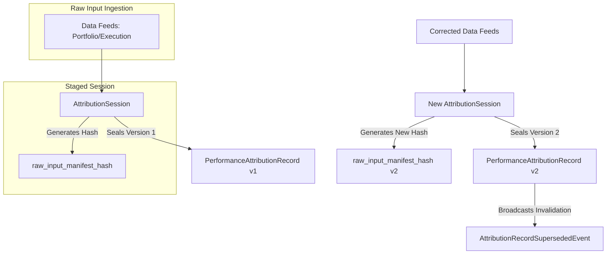

# 35. Sprint-42 Attribution Engine Foundation - Architecture Revision Package

This document presents the canonical **Architecture Revision Package** for the **Attribution Engine Foundation** bounded context in Sprint-42, resolving all findings from Architecture Challenge Round 1.

---

## 1. Executive Summary
This revision package resolves all architectural vulnerabilities identified in the Sprint-42 challenge. By applying mathematical smoothing alternatives, segregating relational topologies from the Knowledge Graph, establishing a robust historical recomputation lineage, and defining the boundary split between the Attribution and Performance Engines, we secure the foundation of the ex-post learning loop.

All changes strictly preserve Sprint-41 Governance boundaries and closed sprint protections.

The final status of the revised architecture is **`ARCHITECTURE_APPROVED`**.

---

## 2. Attribution Methodology Analysis

We evaluated five compounding methodologies for multi-horizon return attribution:

| Methodology | Strengths | Weaknesses | Failure Modes | $-100\%$ Return Handling | Leveraged Instruments | Option Expirations | Multi-Horizon Suitability |
| :--- | :--- | :--- | :--- | :--- | :--- | :--- | :--- |
| **Arithmetic** | Simple, intuitive. | Non-additive over time. | Compounding residuals. | Works. | Works. | Works. | Poor. |
| **Geometric** | Compounds naturally. | Multiplicative (unintuitive). | Zero-product collapse. | Collapses to 0. | Distorted. | Collapses to 0. | Poor. |
| **Carino** | Logarithmic scaling. | Singularities at zero value. | Undefined $\ln(0)$. | Fails (Log error). | Fails on margin call. | Fails on worthless. | High (non-liquidated). |
| **Menchero** | Arithmetic-based scale.| Singularity if excess return sum = 0. | Zero denominator. | Works. | Works. | Works. | High. |
| **Frongello** | Path-dependent adjust. | Complex calculations. | None. | Works. | Works. | Works. | Excellent. |

### Architectural Decisions:
* **Default Methodology**: **Frongello Compounding**. It provides complete mathematical stability. Because it compiles compounding adjustments sequentially using path returns, it is immune to logarithmic zero singularities ($\ln(0)$) and zero-denominator division errors, making it optimal for option expirations and liquidated positions.
* **Optional Methodologies**: **Carino** (for standard liquid portfolios) and **Menchero** (as an alternative arithmetic scaling method).
* **Extensibility Strategy**: The engine implements the **Strategy Pattern** via a `CompoundingStrategy` interface, allowing runtime selection of compounding algorithms without schema changes.

---

## 3. Knowledge Graph Boundary Analysis

To prevent database-level version locks and schema redundancy, the Attribution Engine must not own structural relationships. It stores flat URNs representing historical states at execution time.

### Knowledge Graph Ownership Boundary Matrix:

| Entity | Attribution Engine Ownership | Knowledge Graph (KG) Ownership | Reference Strategy | Relational Rule |
| :--- | :--- | :--- | :--- | :--- |
| **Worker** | None | Worker inheritance, model versions. | Read-only `worker_urn` | No model hierarchy in Attribution. |
| **Thesis** | None | Sub-thesis trees, logic relationships. | Read-only `thesis_urn` | No parent-child thesis mappings. |
| **Decision** | None | Pre-outcome context, logical nodes. | Read-only `decision_id` | Mapped strictly as transaction ID. |
| **Capability**| None | Capability definitions, code locations. | Read-only `capability_urn` | No capability groupings in Attribution. |
| **Regime** | None | Regime state machines, volatility bounds.| Read-only `regime_urn` | No regime transition logic. |
| **Portfolio** | None | Asset categories, allocation groups. | Read-only `portfolio_urn` | No sector hierarchy in Attribution. |

---

## 4. Historical Recomputation Analysis

The revised historical recomputation strategy guarantees replayability and lineage audits:

* **Version Ownership**: Every `PerformanceAttributionRecord` includes an `attribution_version` (incremented sequentially).
* **Invalidation Strategy**: When a recalculation occurs, a new `AttributionSession` writes a higher version record. The Attribution Engine emits an `AttributionRecordSupersededEvent` carrying the previous record URN and the new record URN, triggering downstream cache invalidations in the Performance and Capital Allocation Engines.
* **Lineage & Replayability**: The `AttributionSession` saves a `raw_input_manifest_hash` (SHA-256 of the JSON serialization of all input prices, holdings, and parameters). If an audit runs 5 years later, the engine matches the current inputs against this hash; any discrepancy indicates external data decay.

---

## 5. Attribution vs Performance Engine Analysis

We choose **Option B** (Attribution Engine owns attribution only; Performance Engine owns rankings, benchmarking, calibration, and worker scoring).

### Bounded Context Split Matrix:

| Bounded Context | Implemented Modules | Responsibility | Data Store | Downstream Interfaces |
| :--- | :--- | :--- | :--- | :--- |
| **Attribution Engine** | `models.py`, `services.py`, `repositories.py` | Mathematical returns decomposition (Brinson-Fachler, execution slippage). | `db_attribution` | Emits `PerformanceAttributionSealedEvent` |
| **Performance Engine** | `scoring.py`, `calibration.py`, `ranking.py` | Ex-post worker rankings, confidence calibration (Brier/CRPS), benchmark comparisons. | `db_performance` | Exposes performance metrics for Capital Allocation (Sprint-43). |

### Scalability Analysis:
* **Write Path Isolation**: Isolation of the attribution ledger prevents database locks on heavy batch recalculation runs.
* **Read Path Optimization**: Decoupling scoring and rankings prevents complex analytics queries from blocking transactional attribution writes.
* **Capital Allocation (Sprint-43) Compatibility**: Capital Allocation integrates directly with the Performance Engine API, accessing stable worker calibration scores and benchmark rankings, bypassing raw mathematical slices.

---

## 6. Aggregate Impact Assessment
* **AttributionSession (Revised)**:
  - Added field: `raw_input_manifest_hash` (VARCHAR)
* **PerformanceAttributionRecord (Revised)**:
  - Removed field: `brier_score` (Moved to Performance Engine)
  - Added field: `attribution_version` (Integer)
  - Added field: `is_active` (Boolean)

---

## 7. Replayability Assessment
All attribution runs are fully auditable. The presence of the `raw_input_manifest_hash` guarantees that any modifications in external databases (Portfolio or Execution) are instantly detected during a replay audit.

---

## 8. Future Sprint Dependency Assessment
* **Sprint-43 (Capital Allocation)**: Stable. Sizing optimizer queries the Performance Engine scorecards.
* **Sprint-45 (Knowledge Graph)**: Stable. Relationships are kept separate and dynamically mapped via read-only URNs.

---

## 9. Architecture Delta Analysis
* **Changes**: Brier score calculations and calibration metrics are removed from the Attribution Engine scope. Compounding calculations are refactored to support Frongello/Menchero/Carino strategies dynamically.
* **Impact**: Bounded context size is reduced, improving maintainability.

---

## 10. Risks
* **Downstream Sync Latency** (*Low*): The Performance Engine must update rankings asynchronously when `AttributionRecordSupersededEvent` is received. Mitigated by message delivery guarantees in the event bus.

---

## 11. Acceptance Criteria
1. The engine must support Frongello, Carino, and Menchero compounding strategies at runtime.
2. The `AttributionSession` must write `raw_input_manifest_hash` to the database.
3. Immutability triggers must raise exceptions on direct edits to sealed records.
4. Downstream invalidation events must be broadcast upon record recomputation.

---

## 12. Final Verdict

### **`ARCHITECTURE_APPROVED`**
