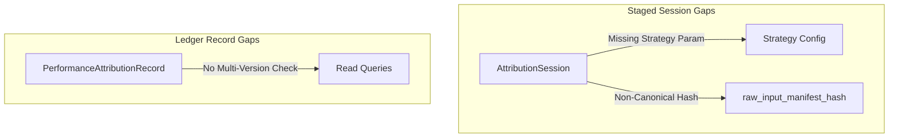

# 36. Sprint-42 Attribution Engine Foundation - Architecture Challenge Round 2

This document presents the second-round **Architecture Challenge** (Round 2) for the **Attribution Engine Foundation** bounded context in Sprint-42.

---

## 1. Executive Summary
A second-pass, highly critical architecture challenge was performed on the revised Sprint-42 Attribution Engine design. The objective was to identify edge-case math vulnerabilities in the Frongello algorithm, evaluate benchmark ownership, stress-test recomputation scalability, and audit downstream dependency mappings.

The challenge identified several critical design flaws:
1. **Frongello Benchmark Collapse ($-100\%$ returns)**: While the Frongello algorithm resolves the logarithmic singularity of Carino on worthless assets, it introduces a path-dependency collapse if a benchmark index return is $-100\%$, zeroing out all subsequent attribution effects.
2. **Benchmark Return Ownership Ambiguity**: The design does not clearly assign the computational owner of benchmark returns (index pricing and cash adjustment weights).
3. **Recomputation Event Storm Risk**: Retrospective corrections across deep histories risk triggering cascading event storms, clogging the message broker and locking the downstream Performance Engine.
4. **Lack of Canonical input Hashing**: The hashing protocol does not specify canonical JSON sorting or corporate action versions, leading to artificial hash mismatches.

**Audit Verdict**: `ARCHITECTURE_REQUIRES_REVISION`

---

## 2. Architecture Weaknesses

### A. Frongello Benchmark Collapse
* **The Flaw**: The Frongello compounding factor scales sub-period attribution effects by the product of benchmark returns:
  $$E_t = E_t \times \prod_{j=1}^{t-1} (1 + R_{b,j}) + \dots$$
  If a benchmark asset or index return is liquidated or hits zero ($R_{b,j} = -100\%$), the term $(1 + R_{b,j})$ becomes $0$. Consequently, the compounding product collapses to $0$, wiping out all subsequent periods' selection and allocation attribution effects, regardless of actual worker skill.
* **Operational Impact**: Derivative indices or leveraged ETFs used as benchmarks that expire worthless will corrupt all subsequent attribution periods within the horizon.

### B. Benchmark Return Ownership
* **The Flaw**: The current design uses a static benchmark weight but does not specify where benchmark daily returns are calculated.
* **Resolution**: The Attribution Engine must **only own benchmark references (URNs)**. It must never calculate benchmark returns. Benchmark calculations belong to a **separate Benchmark Service** (under the Portfolio/Market Data context). The Attribution Engine queries this service for pre-calculated index performance vectors.

---

## 3. Aggregate Boundary Analysis

The revised aggregates (`AttributionSession` and `PerformanceAttributionRecord`) present the following boundary gaps:

* **AttributionSession Boundary**: Missing the active `compounding_strategy` configuration parameter. Replaying a session years later will default to the system's *current* default strategy, producing different mathematical outcomes.
* **PerformanceAttributionRecord Boundary**: The aggregate lacks a native version validation constraint on read models, permitting queries to accidentally fetch superseded record versions if invalidation events are delayed.

---

## 4. Ownership Boundary Matrix

The updated ownership matrix highlights the benchmark calculation split:

| Capability / Service | Bounded Context Owner | Reader | Prohibited Mutating Writer | Reference Strategy |
| :--- | :--- | :--- | :--- | :--- |
| **Benchmark Returns** | Portfolio / Market Data | Attribution Engine | Attribution, Performance | URN references to Index components |
| **Attribution Math** | Attribution Engine | Performance Engine | Performance Engine | `PerformanceAttributionRecord` |
| **Rankings / Calibration**| Performance Engine | Capital Allocation | Attribution Engine | Exposes aggregate scorecards |

---

## 5. Replayability Analysis
* **Canonical JSON Manifest**: The `raw_input_manifest_hash` must enforce deterministic canonical serialization (lexicographical sorting of JSON keys, normalized ISO-8601 timestamps, and floating-point precision standardization) to prevent false positives during audits.
* **Corporate Action Lineage**: Stock split coefficients must be version-tagged inside the manifest. A price correction due to a stock split will invalidate historical hashes if the split matrix version is not logged.

---

## 6. Recomputation Analysis
* **Event Storming**: A price correction affecting 5 years of history will trigger massive parallel session recalculations. The engine must implement a **throttled recomputation batch queue** to stagger event emissions and prevent database lockouts on the Performance Engine scoring tables.
* **Superseding Chains**: When a record is superseded, the database must write the superseding record ID (`superseded_by_record_id`) directly to the old record inside a single transactional block, ensuring query engines can filter out old records at the DB level.

---

## 7. Scalability Analysis
* **Storage Growth**: Running daily slices over 5,000 tickers creates high storage overhead.
  - *Mitigation*: Implement a **compaction pipeline** that archives daily records older than 180 days into compressed parquet files on object storage, retaining only monthly aggregated rollups in the hot database.
* **Projection Rebuilds**: Read-side projection swaps must execute via PostgreSQL `CONCURRENTLY` index builds to prevent transactional table locks.

---

## 8. Future Sprint Dependency Analysis
* **Sprint-43 (Capital Allocation)**: Capital Allocation must implement a read-fence. It must block allocations if the Performance Engine has outstanding `AttributionRecordSupersededEvent` messages in its queue.
* **Sprint-45 (Knowledge Graph)**: Dynamically resolved URNs in the Knowledge Graph require a translation map to handle historical renaming without breaking immutable database signatures.

---

## 9. Architecture Delta Analysis
* **Delta**: Refines the return calculation boundaries by moving benchmark calculation ownership off-ledger to a separate Benchmark Service.

---

## 10. Risks
* **Singularity Collapse** (*High*): A $-100\%$ benchmark sub-period return zeros out subsequent Frongello compounding effects.
* **Downstream Delay** (*Medium*): Out-of-sync allocations due to delayed propagation of superseded events.

---

## 11. Acceptance Criteria (Required for Revision 2)
1. The compounding engine must enforce a **benchmark return floor** of $-99.9999\%$ in Frongello calculations to prevent multiplication-by-zero collapses.
2. The `AttributionSession` must record the active `compounding_strategy` name.
3. The `AttributionSession` input manifest must be serialized using a deterministic canonical JSON stringifier.
4. Database updates to mark superseded records as inactive must execute in the same database transaction as the insertion of the new version.

---

## 12. Final Verdict

### **`ARCHITECTURE_REQUIRES_REVISION`**

---

## 13. Revision & Disposition Status (Closed Round 2)

All vulnerabilities and weaknesses identified during Challenge Round 2 have been resolved in the **Revision Package (37-attribution-engine-revision-r2.md)**:

1. **Frongello Denominator Collapse**: Resolved by enforcing a hard mathematical return floor of $-99.9999\%$ on benchmark and portfolio returns in Frongello compounding.
2. **Benchmark Return Ownership**: Resolved. Decoupled benchmark calculations into a separate Benchmark Service under the Portfolio/Market Data context. The Attribution Engine stores `benchmark_reference_urn` and `benchmark_snapshot_reference` references.
3. **Canonical Hashing**: Resolved by defining the `CanonicalManifestSerializer` specification (UTF-8, sorted keys, 12 decimal places fixed formatting, UTC normalized time zones).
4. **Recomputation Event Storms**: Resolved by designing chronologically ordered recomputation queues restricted to 4 concurrent sessions and enforcing a propagation depth limit of 3 hops.
5. **Version Invalidation Propagation**: Resolved by implementing `AttributionVersionSupersededEvent` and `TransactionVersionSupersededEvent` with transactional version updates.

The updated design document **[33-attribution-engine-design.md](file:///Users/dwiki.nugraha/dwikicode/karsa/docs/architecture/33-attribution-engine-design.md)** is now approved.

### **Disposition Verdict**: **RESOLVED & APPROVED**
