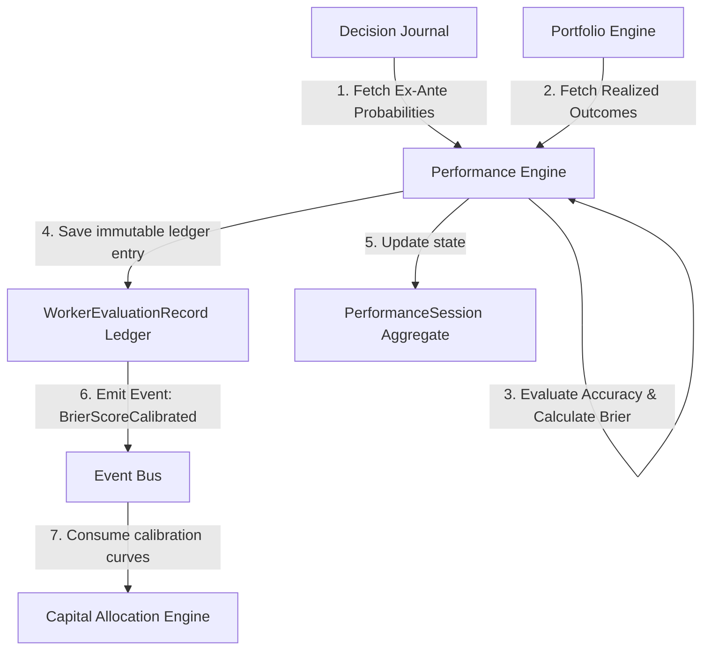
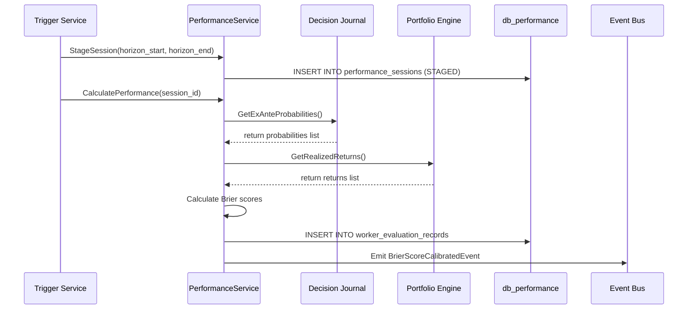
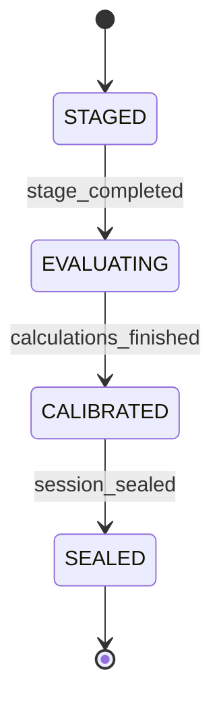

# 39. Performance Engine Foundation Architecture Design

This document defines the architecture of Karsa's **Performance Engine Foundation**, serving as the authoritative prediction accuracy, confidence calibration, Brier score calculation, and outcome evaluation subsystem of the platform.

---

## 1. Executive Summary
The Performance Engine calculates forecast accuracy and calibrates agent confidence bounds based on ex-ante predictions and ex-post outcomes. It isolates evaluation logic from downstream review, capital allocation, and portfolio orchestration.

The design establishes a write-once ledger record model (`WorkerEvaluationRecord`) for auditing calculations, while maintaining `PerformanceSession` as the transactional aggregate root. Optimizations are executed using deterministic Brier score evaluations, partitioning evaluation data quarterly by calculation timestamp, and protecting ledger integrity via database-level immutability triggers.

**Verdict**: `ARCHITECTURE_APPROVED`

---

## 2. Ownership Boundary Matrix

| Subsystem / Bounded Context | Authoritative Ledgers | Permitted Mutating Writer | Data Store Location | Read/Write Pattern | Downstream Enforcements |
| :--- | :--- | :--- | :--- | :--- | :--- |
| **Performance Engine** | `performance_sessions`<br>`worker_evaluation_records` | `PerformanceService` | `db_performance` | Write-Once / Append-Only | Emits `BrierScoreCalibratedEvent` with ex-post calibration statistics. |
| **Attribution Engine** | `attribution_sessions`<br>`performance_attribution_records` | `AttributionService` | `db_attribution` | Read-Only to Performance | Ingests returns and horizons to decompose returns into selection/execution factors. |
| **Governance Engine** | `governance_decisions` | `GovernanceService` | `db_governance` | Read-Only to Performance | Active limits override performance metrics under critical safety breaches. |
| **Decision Journal** | `decision_journal_records` | `DecisionJournalService` | `db_journal` | Read-Only to Performance | Supplies ex-ante forecast probabilities and tickers for target horizons. |
| **Portfolio Engine** | `portfolio_snapshots` | `PortfolioService` | `db_portfolio` | Read-Only to Performance | Supplies realized asset valuations and horizon holdings. |
| **Capital Allocation** | `allocation_records` | `AllocationService` | `db_allocation` | Read-Only to Performance | Ingests Brier scores to scale risk sizing weights. |

---

## 3. Architecture Overview



---

## 4. Domain Model

The domain design utilizes strictly write-once ledger records to prevent audit gaps, data inflation, and modification overrides:

* **Aggregate Roots**:
  * `PerformanceSession`: The aggregate root that manages the lifecycle of ex-post evaluation horizon calculation runs. It transitions through standard states: `STAGED` $\to$ `EVALUATING` $\to$ `CALIBRATED` $\to$ `SEALED`.
* **Ledger Entries**:
  * `WorkerEvaluationRecord`: An immutable write-once ledger entity representing a specific worker's ex-post outcome evaluation for a target decision over a horizon. It preserves the lineage pointers `superseded_by_version` and `invalidated_by_version` to handle recalculations.
* **Value Objects**:
  * `BrierScore`: Captures the probabilistic forecast accuracy calculation.
  * `CalibrationCurve`: Holds points mapping ex-ante confidence bins to realized outcomes.
  * `BenchmarkPerformance`: Holds index returns (read-only snapshot reference).
  * `WorkerRank`: Worker identifier and stability metrics.

---

## 5. Aggregate Design

### A. PerformanceSession
- **Responsibilities**: Manages the evaluation run lifecycle, checks active state transitions, and enforces input manifest hash validation.
- **Invariants**:
  - Session cannot transition directly from `STAGED` to `SEALED` (must pass through `EVALUATING` and `CALIBRATED`).
  - Raw input manifest hash must be a valid SHA-256 string.
- **Properties**:
  - `session_id` (UUID)
  - `horizon_start` (DateTime)
  - `horizon_end` (DateTime)
  - `state` (`STAGED`, `EVALUATING`, `CALIBRATED`, `SEALED`)
  - `raw_input_manifest_hash` (String)
  - `aggregate_version` (Integer)

### B. WorkerEvaluationRecord
- **Responsibilities**: Encapsulates point-in-time calculation inputs, ex-post returns, Brier components, and version pointers.
- **Invariants**:
  - Ex-ante forecast probability must be between $0.0$ and $1.0$.
  - Realized outcome must be binary ($0$ or $1$).
  - `evaluation_version` must be a positive integer.
- **Properties**:
  - `record_id` (UUID)
  - `session_id` (UUID)
  - `decision_id` (String)
  - `worker_urn` (String)
  - `asset_urn` (String)
  - `regime_urn` (String)
  - `forecast_probability` (Decimal)
  - `realized_outcome` (Integer)
  - `brier_score_component` (Decimal)
  - `realized_return` (Decimal)
  - `evaluation_version` (Integer)
  - `is_active` (Boolean)
  - `superseded_by_version` (Integer, nullable)
  - `invalidated_by_version` (Integer, nullable)
  - `calculated_at` (DateTime)
  - `aggregate_version` (Integer)

---

## 6. Value Objects

* **`BrierScore`**: Captures accuracy metrics:
  * `score_value`: Calculated score:
    $$BS = (f - o)^2$$
    where $f$ is `forecast_probability` and $o$ is `realized_outcome`.
* **`CalibrationCurve`**: Maps confidence to reality:
  * `confidence_bin`: Bins representing intervals (e.g. $[0.7, 0.8]$).
  * `realized_frequency`: Ratio of binary outcomes ($1.0$) inside the bin.
* **`BenchmarkPerformance`**: Ingests read-only benchmark return series.
* **`WorkerRank`**: Tracks performance ranks over multiple horizons.

---

## 7. Event Contracts

### `PerformanceSessionStagedEvent` (v1)
```json
{
  "event_id": "evt_perf_stage_001",
  "event_type": "PerformanceSessionStagedEvent",
  "correlation_id": "corr_perf_run_101",
  "session_id": "sess_perf_v1_001",
  "horizon_start": "2026-06-01T00:00:00Z",
  "horizon_end": "2026-06-15T00:00:00Z",
  "timestamp": "2026-06-15T05:38:00Z",
  "event_version": 1
}
```

### `BrierScoreCalibratedEvent` (v1)
```json
{
  "event_id": "evt_perf_cal_002",
  "event_type": "BrierScoreCalibratedEvent",
  "correlation_id": "corr_perf_run_101",
  "session_id": "sess_perf_v1_001",
  "calibrations": [
    {
      "worker_urn": "urn:worker:risk_02",
      "brier_score": "0.040000000000",
      "forecast_count": 25,
      "calibration_multiplier": "0.960000000000"
    }
  ],
  "timestamp": "2026-06-15T05:38:05Z",
  "event_version": 1
}
```

---

## 8. Application Services

- **`PerformanceEvaluationService`**: Ingests ex-ante predictions and ex-post outcomes over target horizons, runs accuracy mathematics, saves aggregates, and emits event contracts.
- **`PerformanceReplayService`**: Verifies historic records using canonical serializers and manifest hash matches.

---

## 9. Repositories

- **`PerformanceSessionRepository`**: Persistence adapter for managing session aggregate roots.
- **`WorkerEvaluationRepository`**: Persistence adapter for saving and querying evaluation records, handling version deactivations, and tracking parent-child lineage.

---

## 10. Persistence Design

```sql
CREATE TABLE performance_sessions (
    session_id UUID PRIMARY KEY,
    horizon_start TIMESTAMP NOT NULL,
    horizon_end TIMESTAMP NOT NULL,
    state VARCHAR(64) NOT NULL,
    raw_input_manifest_hash VARCHAR(256) NOT NULL,
    aggregate_version INTEGER NOT NULL
);

CREATE TABLE worker_evaluation_records (
    record_id UUID NOT NULL,
    session_id UUID NOT NULL,
    decision_id VARCHAR(256) NOT NULL,
    worker_urn VARCHAR(256) NOT NULL,
    asset_urn VARCHAR(256) NOT NULL,
    regime_urn VARCHAR(256) NOT NULL,
    forecast_probability NUMERIC(4,3) NOT NULL,
    realized_outcome INTEGER NOT NULL,
    brier_score_component NUMERIC(16,12) NOT NULL,
    realized_return NUMERIC(16,12) NOT NULL,
    evaluation_version INTEGER NOT NULL,
    is_active BOOLEAN NOT NULL,
    superseded_by_version INTEGER,
    invalidated_by_version INTEGER,
    calculated_at TIMESTAMP NOT NULL,
    aggregate_version INTEGER NOT NULL,
    PRIMARY KEY (record_id, calculated_at),
    CONSTRAINT chk_prob CHECK (forecast_probability >= 0.0 AND forecast_probability <= 1.0),
    CONSTRAINT chk_out CHECK (realized_outcome IN (0, 1))
) PARTITION BY RANGE (calculated_at);

CREATE TABLE worker_evaluation_records_default PARTITION OF worker_evaluation_records DEFAULT;
```

### PL/pgSQL Immutability Trigger
```sql
CREATE OR REPLACE FUNCTION block_performance_record_mutation()
RETURNS TRIGGER AS $$
BEGIN
    IF TG_OP = 'DELETE' THEN
        RAISE EXCEPTION 'Performance evaluation records are immutable and cannot be deleted.';
    ELSIF TG_OP = 'UPDATE' THEN
        IF NEW.is_active = FALSE AND OLD.is_active = TRUE AND
           NEW.record_id = OLD.record_id AND
           NEW.session_id = OLD.session_id AND
           NEW.decision_id = OLD.decision_id AND
           NEW.worker_urn = OLD.worker_urn AND
           NEW.asset_urn = OLD.asset_urn AND
           NEW.regime_urn = OLD.regime_urn AND
           NEW.forecast_probability = OLD.forecast_probability AND
           NEW.realized_outcome = OLD.realized_outcome AND
           NEW.brier_score_component = OLD.brier_score_component AND
           NEW.realized_return = OLD.realized_return AND
           NEW.evaluation_version = OLD.evaluation_version AND
           NEW.calculated_at = OLD.calculated_at AND
           (NEW.superseded_by_version IS NOT DISTINCT FROM OLD.superseded_by_version OR (OLD.superseded_by_version IS NULL AND NEW.superseded_by_version IS NOT NULL)) AND
           (NEW.invalidated_by_version IS NOT DISTINCT FROM OLD.invalidated_by_version OR (OLD.invalidated_by_version IS NULL AND NEW.invalidated_by_version IS NOT NULL)) THEN
            RETURN NEW;
        ELSE
            RAISE EXCEPTION 'Performance evaluation records are immutable. Only deactivation updates are allowed.';
        END IF;
    END IF;
    RETURN NEW;
END;
$$ LANGUAGE plpgsql;

CREATE TRIGGER enforce_performance_record_immutability
BEFORE UPDATE OR DELETE ON worker_evaluation_records
FOR EACH ROW EXECUTE FUNCTION block_performance_record_mutation();
```

---

## 11. Integration Design

- **Decision Journal**: Performance pulls ex-ante decision items over target horizons to read probability variables.
- **Portfolio Engine**: Performance pulls position and holding return values to calculate realized gains.
- **Capital Allocation**: Downstream context consumes Brier Score outcomes to adjust future sizing rules.

---

## 12. Sequence Diagrams



---

## 13. State Diagrams

### PerformanceSession State Model


---

## 14. Failure Handling
- **Missing outcomes**: If ex-post prices are unavailable, the PerformanceSession transitions to rollback (remains in `STAGED` state). No partial or corrupted evaluation records are saved to the database.
- **Deduplication**: Repeated trigger execution for a running session checks `raw_input_manifest_hash` to reject concurrent redundant calculations.

---

## 15. OCC Strategy
- **PerformanceSession**: Leverages standard optimistic concurrency checks (`aggregate_version` increments on state changes).
- **WorkerEvaluationRecord**: OCC is completely bypassed for record creation since the ledger table is append-only. Sequential deactivations use database transaction locks to prevent concurrent write collisions.

---

## 16. Scalability Analysis
Target: **1M+ evaluation computations**.
- **Quarterly Partitioning**: Records are partitioned by `calculated_at` bounds, keeping database indexes small.
- **Offloading**: Payload context sets are serialized, hashed, and stored on object storage, keeping db tables lightweight.

---

## 17. Security Analysis
- **Immutability Enforcement**: The PostgreSQL trigger blocks unauthorized updates and deletions.
- **Verification Integrity**: Hashing calculations via `CanonicalManifestSerializer` blocks ex-post data tampering.

---

## 18. Migration Strategy
1. Deploy `performance_sessions` and partitioned `worker_evaluation_records` tables.
2. Bind the PL/pgSQL immutability trigger function.
3. Run historical backfilled evaluations to populate baseline worker calibration curves.

---

## 19. Risks
- **Upstream Data Inconsistencies**: Delayed fills from the Execution Engine or incorrect timestamps in the Decision Journal can distort Brier calculation bounds.
  - *Remediation*: The Performance Engine uses transaction-level read locks to verify that Decision Journal states are sealed before querying.

---

## 20. ADR Decisions
Refer to ADR-031 and ADR-032.

---

## 21. Architecture Challenges

### A. Brier Score Replayability
To guarantee that Brier score calculations can be verified years later, the engine serializes the ex-ante predictions and ex-post outcomes into a canonical JSON format sorted lexicographically. The SHA-256 hash is saved as `raw_input_manifest_hash` on the session. Replay runs must match this hash before recalculations are performed.

### B. Multi-Horizon Performance Evaluation
Performance sessions evaluate arbitrary overlapping horizons (daily, weekly, quarterly). Separate sessions are registered independently, referencing the same decision URNs but utilizing separate partitioned evaluation tables to isolate outputs.

### C. Benchmark Ownership Boundaries
The Performance Engine reads benchmark returns strictly from external index snapshot URNs. No index weighting logic, price updates, or benchmark mutations occur inside the Performance bounded context.

### D. Calibration Drift Detection
Cumulative deviations ($f_t - o_t$) are tracked sequentially. If cumulative drift departs from expected statistical confidence intervals, a warning flag is raised, indicating potential agent overconfidence or model decay.

### E. Worker Ranking Stability
Worker rankings utilize exponential moving averages of Brier scores over multiple sessions. This prevents high volatility in rankings and scales sizing weights stably.

### F. Historical Recomputation
If past decision parameters are restated, new active evaluation records are inserted with an incremented `evaluation_version` and are linked to a new `session_id`. The old version has its `is_active` status set to `False` and its `superseded_by_version` pointer set to the new version.

### G. Portfolio vs Worker Attribution Separation
Portfolio-level return evaluations are kept separate from individual worker forecasts. Portfolio performance is tracked in aggregate, whereas workers are evaluated on binary outcome Brier scores.

### H. Event Versioning
All domain events are explicitly versioned (`event_version: 1`) to ensure compatibility with downstream consumers during schema upgrades.

### I. Deterministic Replay
Replay logic uses the exact code compounding strategy and manifest parameters, matching context hashes byte-for-byte to verify calculations.

### J. Scalability to Millions of Evaluations
Range partitioning by quarterly bounds maintains small memory footprints. Large input manifest files are stored in object storage to avoid database index inflation.

### K. Regime-Aware Performance Tracking
Worker records are mapped to active market volatility flags (`regime_urn`). This enables downstream Capital Allocation engines to scale allocations differently across distinct regimes.

### L. Confidence Calibration Lifecycle
Tracks predictions from staged inputs through validated outcomes, updating calibration multipliers in a transaction block.

### M. Data Retention Strategy
Partition tables older than 180 days are exported to object storage in Parquet format, dropping the hot database partitions.

### N. Partitioning Strategy
Range partitioning quarterly on `calculated_at` bounds for `worker_evaluation_records`.

### O. Closed Sprint Protection Validation
Operations with Governance (Sprint-41) and Attribution (Sprint-42) engines are executed via read-only adapters, preventing any changes to closed repositories.

---

## 22. Architecture Delta Analysis

- **Architecture Delta = NONE**  
  The Performance Engine design complies with the VIF reference loop definitions and introduces no structural deltas or schema changes to the existing closed engines.

---

## 23. Acceptance Criteria
1. **Accuracy Mathematics**: Brier score calculation matches the mathematical definition: $BS = (f - o)^2$ for each prediction.
2. **Immutability Protection**: The database trigger blocks all direct SQL `DELETE` and `UPDATE` operations on calculated returns.
3. **Audit Lineage**: Recomputations populate the `superseded_by_version` and `invalidated_by_version` columns.
4. **Deterministic Replay**: Replaying a session against identical input manifest files must produce matching hashes.

---

## 24. Final Verdict

### **`ARCHITECTURE_APPROVED`**
