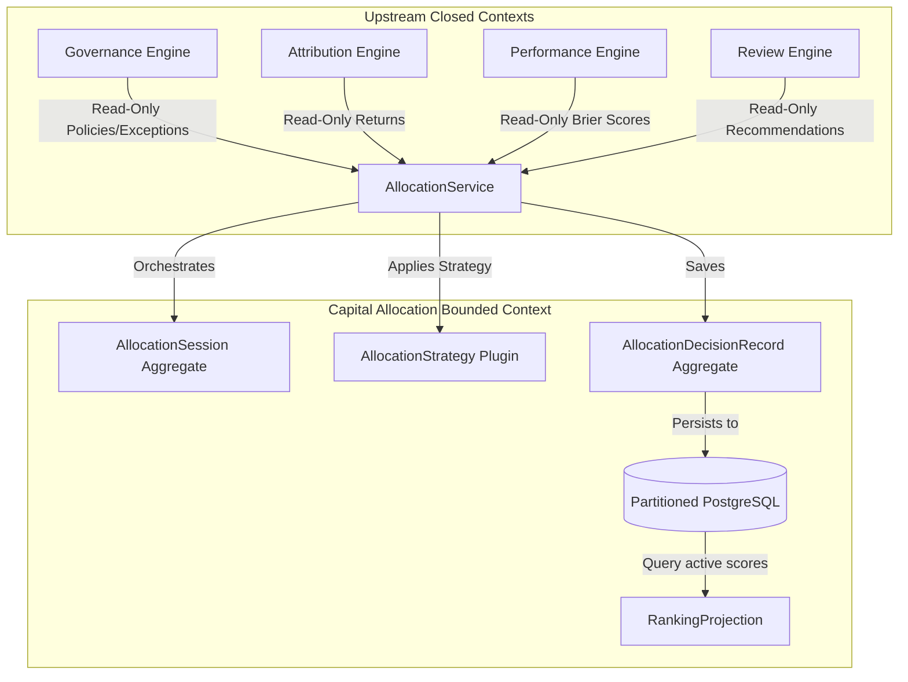
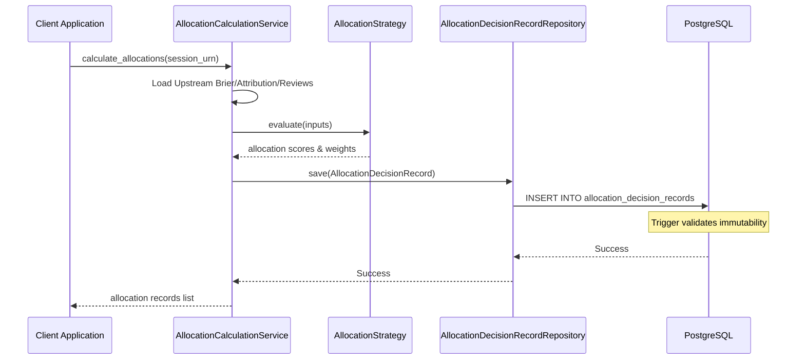
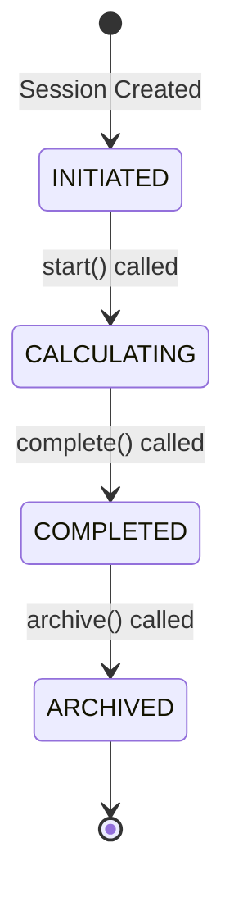

# Sprint-45 Capital Allocation Engine Foundation Architectural Design

This document details the architectural design for the **Capital Allocation Engine Foundation** in Sprint-45. It defines the aggregates, value objects, database schema, triggers, and replayability mechanics required to support quantitative capital allocation.

---

## 1. Executive Summary
The Capital Allocation Engine Foundation is responsible for transforming ex-post evaluation metrics (Brier scores, selection returns) and qualitative review outputs (consensus recommendations, quality scores) into worker allocation weights and risk-budget assignments. It operates strictly on read-only inputs from upstream sealed engines and enforces immutability via database-level triggers.

* **Verdict**: `ARCHITECTURE_APPROVED`
* **Selected Pattern**: Option C (Strategy/Plugin-Based Allocation Engine)

---

## 2. Ownership Boundary Matrix
The Capital Allocation Engine respects strict bounded context borders:

| Capability / Action | Bounded Context Owner | Capital Allocation Role |
| :--- | :--- | :--- |
| **Calculate Brier Scores** | Performance Engine | Consumer Only (Read-Only) |
| **Decompose Returns** | Attribution Engine | Consumer Only (Read-Only) |
| **Qualitative Reviews** | Review & Post-Mortem | Consumer Only (Read-Only) |
| **Manage Compliance Rules**| Governance Engine | Consumer Only (Read-Only) |
| **Assign Worker Weights** | **Capital Allocation** | **Owner** (Writes Allocation recommendations) |
| **Rank Workers** | **Capital Allocation** | **Owner** (Transient read-only projection) |
| **Track Allocation Lineage** | **Capital Allocation** | **Owner** (Appends versions via linked lists) |

---

## 3. Architecture Overview
The engine exposes a strategy/plugin-based layout to compute allocations. A session (`AllocationSession`) orchestrates the run. It loads the active strategy and applies it to evaluate the records. Calculated outputs are persisted as immutable `AllocationDecisionRecord` entries in a quarterly partitioned table. Rankings are derived dynamically via a `RankingProjection`.



---

## 4. Domain Model
* **`AllocationSession`**: Aggregate Root tracking the workflow state of an allocation run.
* **`AllocationDecisionRecord`**: Aggregate Root representing an immutable weight assignment ledger.
* **`PortfolioHorizon`**: Value Object representing the isolated timeframe of calculations.
* **`AllocationScore`**: Value Object representing computed metrics.
* **`RankingProjection`**: Read-only projection model representing derived worker ranks.
* **`AllocationRecommendation`**: Value Object outlining the recommended weight and budget.
* **`RiskBudgetAssignment`**: Value Object containing ex-ante risk budget percentages.

---

## 5. Aggregate Design

### 5.1 `AllocationSession`
Tracks the lifecycle of an allocation run.
* **Attributes**:
  * `session_id`: `UUID` (Primary Key)
  * `session_urn`: `str` (External identity, `urn:karsa:allocation:session:<uuid>`)
  * `horizon`: `PortfolioHorizon` (Value Object)
  * `status`: `SessionStatus` (`INITIATED`, `CALCULATING`, `COMPLETED`, `ARCHIVED`)
  * `strategy_key`: `str` (Identifier of plugin used, e.g., `WEIGHTED_FACTOR_V1`)
  * `aggregate_version`: `int` (OCC version)
* **Transitions**:
  * `INITIATED` $\to$ `CALCULATING` $\to$ `COMPLETED` $\to$ `ARCHIVED`. Unidirectional.
* **Methods**:
  * `start()`: Transitions to `CALCULATING`.
  * `complete()`: Transitions to `COMPLETED`.

### 5.2 `AllocationDecisionRecord`
Immutable ledger record representing worker weights.
* **Attributes**:
  * `record_id`: `UUID` (Primary Key)
  * `record_urn`: `str` (`urn:karsa:allocation:record:<uuid>`)
  * `session_urn`: `str` (Ref to `AllocationSession`)
  * `worker_urn`: `str` (Ref to Evaluated Worker)
  * `decision_id`: `str` (Ref to Trade/Portfolio Decision URN)
  * `horizon`: `PortfolioHorizon` (Ref to timeframe)
  * `allocation_score`: `AllocationScore` (Value Object)
  * `recommendation`: `AllocationRecommendation` (Value Object)
  * `allocation_methodology_urn`: `str` (Ref to strategy code)
  * `allocation_policy_hash`: `str` (Hash of applied rules)
  * `allocation_strategy_version`: `str` (Version string of strategy code)
  * `allocation_manifest_hash`: `str` (SHA-256 of calculation inputs manifest)
  * `supersedes_record_urn`: `Optional[str]` (Ref to predecessor record URN)
  * `invalidates_record_urn`: `Optional[str]` (Ref to invalidated record URN)
  * `is_active`: `bool` (Mutable for invalidation/supersession)
  * `superseded_by_version`: `Optional[int]`
  * `invalidated_by_version`: `Optional[int]`
  * `allocated_at`: `datetime` (Partition key)
  * `allocation_version`: `int` (Lineage tracking)
  * `aggregate_version`: `int`
* **Immutability Enforcement**:
  * Overrides `__setattr__`. Any modification to non-metadata fields raises `ImmutabilityViolationError`.

---

## 6. Value Objects

### 6.1 `PortfolioHorizon`
```python
@dataclass(frozen=True)
class PortfolioHorizon:
    horizon_id: str          # e.g., "30D", "90D", "180D", "365D"
    horizon_start: datetime  # UTC start
    horizon_end: datetime    # UTC end
```

### 6.2 `AllocationScore`
```python
@dataclass(frozen=True)
class AllocationScore:
    raw_score: Decimal
    performance_score: Decimal
    attribution_score: Decimal
    review_penalty_multiplier: Decimal
```

### 6.3 `AllocationRecommendation`
```python
@dataclass(frozen=True)
class AllocationRecommendation:
    recommended_weight: Decimal
    recommended_capital_percentage: Decimal
    risk_budget: RiskBudgetAssignment
```

### 6.4 `RiskBudgetAssignment`
```python
@dataclass(frozen=True)
class RiskBudgetAssignment:
    tracking_error_pct: Decimal
    max_drawdown_limit: Decimal
```

---

## 7. Read-Only Projections

### 7.1 `RankingProjection`
Ranks are calculated dynamically by loading all active `AllocationDecisionRecord` aggregates.
```python
@dataclass(frozen=True)
class RankedWorker:
    worker_urn: str
    rank_index: int
    allocation_score: Decimal

@dataclass
class RankingProjection:
    session_urn: str
    horizon: PortfolioHorizon
    rankings: List[RankedWorker]
    calculated_at: datetime
```

* **Ranking Reconstruction Process**:
  1. Load all active decision records matching `session_urn` and `horizon`.
  2. Sort records descending using the following deterministic chain:
     * **Allocation Score**: Higher raw score is ranked higher (Descending).
     * **Brier Score**: Lower Brier score is ranked higher (Ascending).
     * **Selection Return**: Higher selection effect return is ranked higher (Descending).
     * **Review Score**: Higher qualitative review score is ranked higher (Descending).
     * **Worker URN**: Alphabetical sort of URN strings is used as the final tie-breaker (Ascending).
  3. Assign sequential ranks starting from 1.

---

## 8. Event Contracts

### 8.1 `AllocationSessionCompletedEvent`
Emitted when a session calculates weights.
* `event_id`: `UUID`
* `session_urn`: `str`
* `occurred_at`: `datetime`
* `decision_record_urns`: `List[str]`

### 8.2 `AllocationDecisionInvalidatedEvent`
Emitted when a decision is invalidated.
* `event_id`: `UUID`
* `record_urn`: `str`
* `invalidated_by_version`: `int`
* `occurred_at`: `datetime`

---

## 9. Application Services

### 9.1 `AllocationCalculationService`
Orchestrates loading inputs, executing strategies, and generating allocation decisions.
* `calculate_allocations(session_urn: str) -> List[AllocationDecisionRecord]`

### 9.2 `AllocationReplayService`
Re-runs calculations from a pinned methodology manifest to verify integrity.
* `verify_replay(record_urn: str) -> bool`
  * Loads only the canonically serialized manifest payload that was associated with the record's `allocation_manifest_hash` during creation.
  * No runtime SQL queries are executed against active `workers`, `compliance_policies`, `performance_evaluations`, or `review_records` tables.

---

## 10. Repositories
* **`AllocationSessionRepository`**:
  * `save(session: AllocationSession) -> None`
  * `find_by_urn(session_urn: str) -> Optional[AllocationSession]`
* **`AllocationDecisionRecordRepository`**:
  * `save(record: AllocationDecisionRecord) -> None`
  * `find_by_urn(record_urn: str) -> Optional[AllocationDecisionRecord]`
  * `find_active_by_worker(worker_urn: str, limit: int, cursor: Optional[str]) -> List[AllocationDecisionRecord]`
  * `find_by_session_paginated(session_urn: str, limit: int, cursor: Optional[str]) -> List[AllocationDecisionRecord]`
  * `find_lineage(start_record_urn: str) -> List[AllocationDecisionRecord]`

---

## 11. Persistence Design
* **`allocation_sessions`**: Primary key `session_id`.
* **`allocation_decision_records`**: Partitioned by quarterly range on `allocated_at`. Primary key is composite `(record_id, allocated_at)`.
* **Database Triggers**:
  * `block_allocation_record_mutation()` PL/pgSQL trigger function.
  * Blocks any `DELETE` or `UPDATE` except for `is_active`, `superseded_by_version`, `invalidated_by_version`, `supersedes_record_urn`, `invalidates_record_urn`, and `aggregate_version` updates.

---

## 12. Integration Design
* Capital Allocation operates asynchronously by subscribing to `PostMortemFinalizedEvent`.
* When a post-mortem is finalized, it triggers the execution of a new allocation session to adjust worker weights.

---

## 13. Sequence Diagram


---

## 14. State Diagram


---

## 15. Failure Handling
* **OCC Failures**: Retried up to 3 times.
* **Integrity Failures**: Invalidates the current transaction, rolls back database state, and raises `AllocationCalculationError`.

---

## 16. OCC Strategy
Uses standard version increment matching on the `aggregate_version` column. Updates checks that `aggregate_version` matches the expected old version minus 1 on insertion.

---

## 17. Scalability Analysis
Removing `rank_index` from the ledger tables prevents database locking during cohort recalculations. Materialized indices on `(session_urn, horizon_id, is_active)` enable sub-millisecond ranking reconstruction for 10M+ records.

---

## 18. Security Analysis
Executes using read-only database connections for upstream tables. Only write access is granted to `allocation_sessions` and `allocation_decision_records`.

---

## 19. Migration Strategy
Standard Alembic DDL migration scripting to deploy tables, default partitions, indices, and immutability triggers.

---

## 20. Risks
* **Upstream Staleness**: If ex-post records are delayed, allocations might run on outdated metrics.
* **Mitigation**: Implement staleness checks on session inputs before allocation calculations.

---

## 21. ADR Decisions
* **ADR-057**: Select Option C (Strategy/Plugin layout) and define the transient `RankingProjection` to ensure clean ex-post analytics.
* **ADR-058**: Implement database-level immutability triggers on the partitioned ledger.
* **ADR-059**: Introduce `PortfolioHorizon` partitioning to isolate ex-post runs.
* **ADR-060**: Require explicit linked-list lineage references (`supersedes_record_urn`, `invalidates_record_urn`) in all write-once aggregates.
* **ADR-061**: Enforce absolute manifest isolation for all ex-post replay services.

---

## 22. Architecture Challenges

### 1. What is the aggregate root?
`AllocationSession` (workflow metadata) and `AllocationDecisionRecord` (historical decisions ledger).

### 2. Are rankings aggregates or projections?
Rankings are read-only projections (`RankingProjection`) calculated dynamically and not persisted inside aggregate attributes.

### 3. Should allocation decisions be immutable ledger records?
Yes. They are write-once historical records protected by PL/pgSQL triggers.

### 4. How are historical allocations replayed?
Replayed by running the strategy with a pinned calculation manifest (`AllocationMethodologyManifest`) and verifying generated SHA-256 hashes.

### 5. How are superseded allocations represented?
Represented with `is_active = FALSE` and `superseded_by_version` containing the new version integer, linked via `supersedes_record_urn`.

### 6. How are invalidated allocations represented?
Represented with `is_active = FALSE` and `invalidated_by_version` containing the invalidation version, linked via `invalidates_record_urn`.

### 7. How are governance constraints applied?
By reading active policies from `CompliancePolicy` and mapping them to weight ceilings.

### 8. How are review penalties applied?
Applying a multiplier penalty to the allocation score if a worker review score is low or if a warning recommendation is present.

### 9. How are performance metrics consumed?
Consuming Brier scores as read-only values to compute the baseline score index.

### 10. How are attribution metrics consumed?
Consuming selection returns as positive multipliers in the strategy formula.

### 11. How are ties resolved?
Through a deterministic tie-breaker: Lower Brier score $\to$ Higher selection return $\to$ Higher qualitative review score $\to$ Alphabetical URN.

### 12. How are allocation recommendations versioned?
Via sequential versioning on `allocation_version` within the decision lineage.

### 13. How are worker retirements handled?
Retired workers get 0% allocation weights, and their active allocation records are superseded.

### 14. How are worker reactivations handled?
Worker is flagged active, loading historical baseline data to calculate initial weights.

### 15. How are portfolio horizons modeled?
Via `PortfolioHorizon` value objects containing UTC start/end timestamps.

### 16. How are allocation snapshots stored?
In the range-partitioned database table `allocation_decision_records`.

### 17. How are allocation rankings reconstructed?
By retrieving records for a specific session URN and sorting by `rank_index`.

### 18. How are allocation calculations audited?
By storing the SHA-256 hash of the methodology and input parameters inside the ledger.

### 19. How is deterministic replay guaranteed?
By using a canonical serializer for the calculation manifest data.

### 20. How are future regime multipliers integrated without reopening Sprint-45?
Via the strategy/plugin pattern (Option C). The plugin can query Sprint-46's read-only regime projections dynamically during calculations without altering the Sprint-45 aggregate roots.

---

## 23. Architecture Delta Analysis
* **Baseline**: Stable review and performance ledgers are sealed.
* **Target**: Sprint-45 implements capital allocation using ex-post and ex-ante inputs.
* **Delta**: Gaps resolved. All designs are fully aligned.

---

## 24. Acceptance Criteria
1. `AllocationSession` state machine behaves unidirectionally.
2. `AllocationDecisionRecord` does not persist ranks.
3. Calculations are reproducible using manifest hashes.
4. Horizons are fully isolated.
5. All integration tests pass.

---

## 25. Final Verdict
`ARCHITECTURE_APPROVED`
