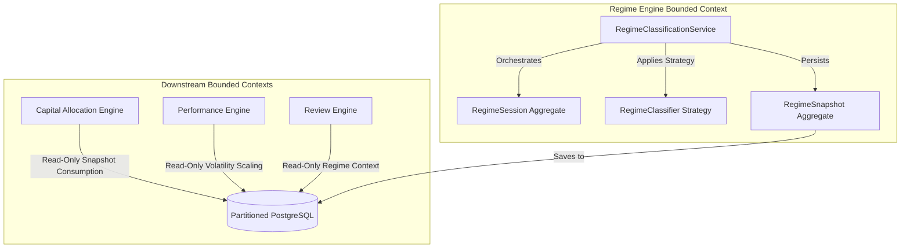
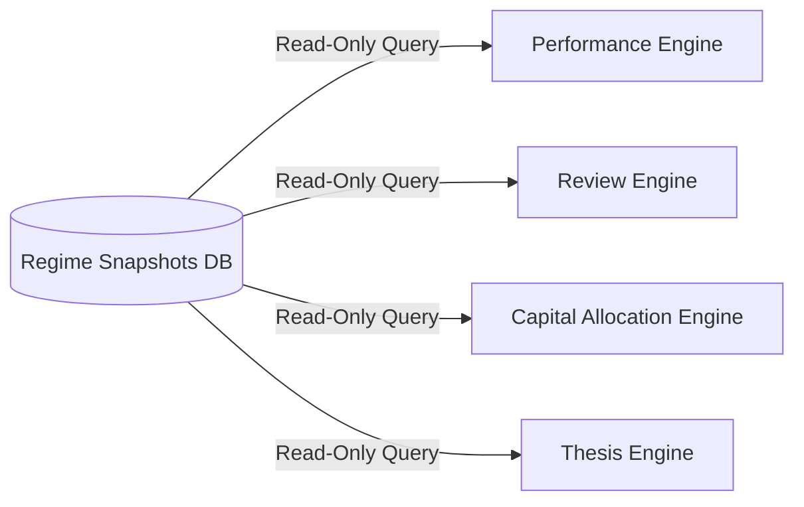
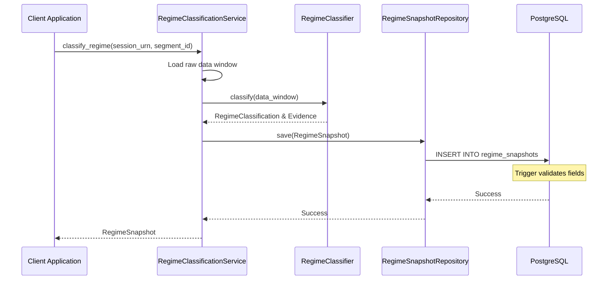
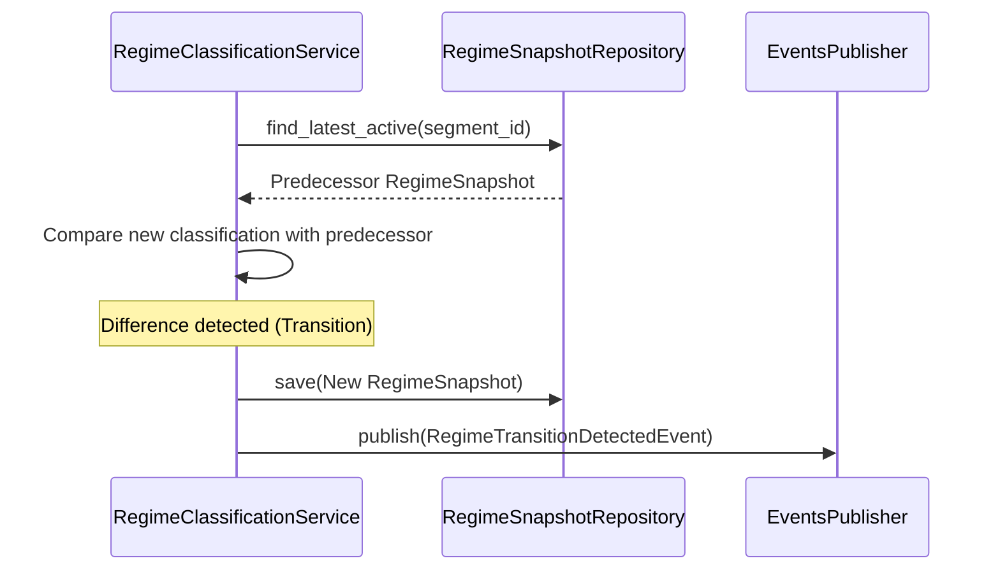
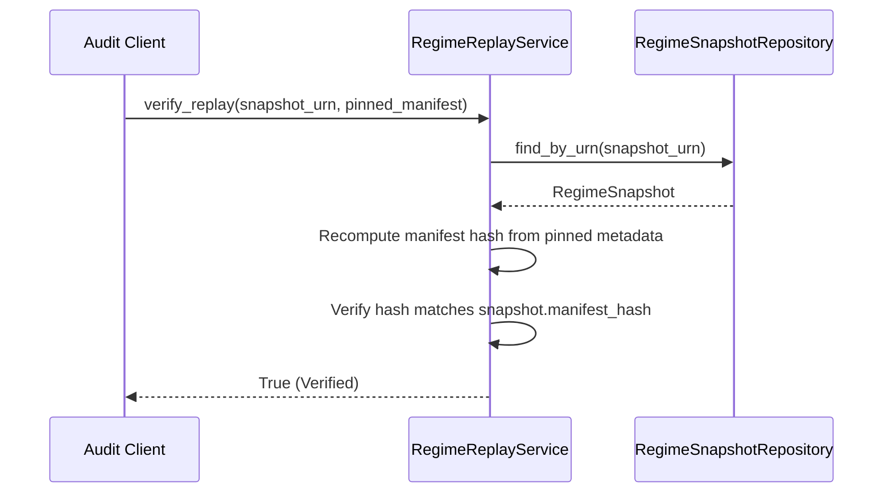
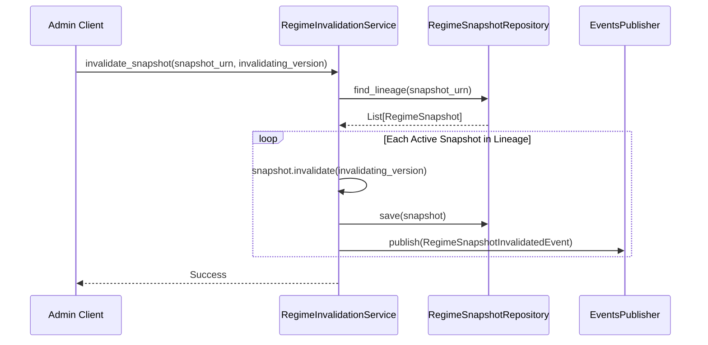
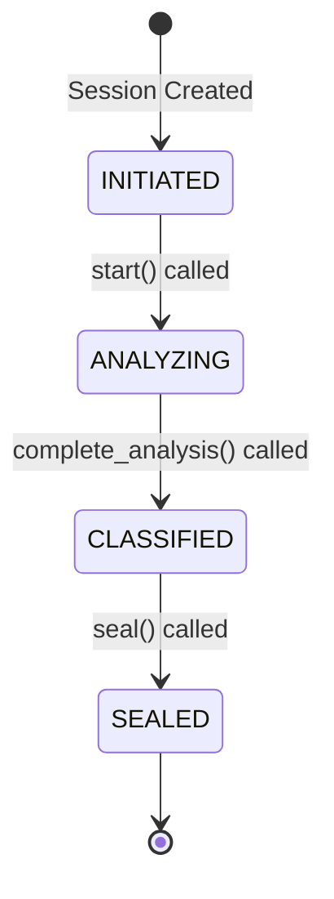

# Sprint-46 Regime Engine Foundation Architectural Design

This document details the architectural design for the **Regime Engine Foundation** in Sprint-46. It establishes the Regime Engine as a first-class, read-only provider of market regime intelligence within the Virtual Investment Firm architecture, respecting all closed sprint boundaries.

---

## 1. Executive Summary
The Regime Engine Bounded Context is responsible for analyzing historical and real-time market data to classify market regimes (covering market direction, volatility scaling, and liquidity states). It outputs read-only, versioned snapshots that downstream engines consume. All classifications are deterministic, replayable, and protected by database-level triggers to guarantee absolute ledger immutability.

* **Verdict**: `ARCHITECTURE_APPROVED`
* **Status**: Design Phase complete; ready to transition to Implementation Planning.

---

## 2. Ownership Boundary Matrix
The Regime Engine acts strictly as a producer of read-only market regime intelligence. It does not leak into, influence, or manage responsibilities owned by other contexts.

| Capability / Action | Owner Context | Regime Engine Role |
| :--- | :--- | :--- |
| **Classify Market Regimes** | **Regime Engine** | **Owner** (Analyzes data and writes snapshots) |
| **Track Regime Transitions** | **Regime Engine** | **Owner** (Derives transitions from consecutive snapshots) |
| **Manage Regime History** | **Regime Engine** | **Owner** (Appends snapshots to lineage linked lists) |
| **Assign Capital Weights** | Capital Allocation | Consumer Only (Consumes regime snapshots as inputs) |
| **Rank Workers** | Capital Allocation | Consumer Only (No ranking operations performed) |
| **Worker Performance Evaluation** | Performance Engine | Consumer Only (Consumes difficulty factors) |
| **Qualitative Reviews** | Review & Post-Mortem | Consumer Only (Consumes context snapshots) |
| **Thesis Life Cycle Management** | Thesis Engine | Consumer Only (No thesis changes allowed) |
| **Manage Compliance Rules** | Governance Engine | Consumer Only (No governance writes allowed) |

---

## 3. Architecture Overview
The Regime Engine defines a strategy-based classification model. A session (`RegimeSession`) orchestrates the run. It loads the active classification strategy and applies it to segment-specific market data. Calculated outputs are persisted as immutable `RegimeSnapshot` entries in a quarterly partitioned table. Transitions are derived dynamically as projections or transient domain events.



---

## 4. Domain Model
* **`RegimeSession`**: Aggregate Root managing the classification execution lifecycle.
* **`RegimeSnapshot`**: Aggregate Root representing an immutable classification ledger entry.
* **`MarketSegment`**: Value Object representing the asset class or market index partition (e.g. `SPY`, `BTC`).
* **`RegimeClassification`**: Value Object aggregating direction, volatility, and liquidity states.
* **`RegimeMethodologyManifest`**: Value Object locking the code version and threshold configuration parameters to guarantee deterministic replay.

---

## 5. Aggregate Design

### Option A vs Option B Challenge

* **Option A: `RegimeSession` and `RegimeSnapshot`**
  - *Description*: Classification sessions manage execution state. Each segment's classification result is stored as an independent, immutable `RegimeSnapshot`. Transitions are derived on-the-fly or published as events by comparing new snapshots to their predecessors.
  - *Critique*: Simple, write-once ledger pattern. Avoids update locking contention. However, queries to reconstruct historical transition intervals must scan consecutive snapshots.
* **Option B: `RegimeSession`, `RegimeSnapshot`, and `RegimeTransition`**
  - *Description*: Introduces a third aggregate root `RegimeTransition` that explicitly tracks transitions (e.g. from `LOW_VOLATILITY` to `HIGH_VOLATILITY`).
  - *Critique*: Violates single-responsibility and write-once guidelines. If a snapshot is invalidated or superseded, the corresponding transition must also be updated or invalidated, requiring complex distributed transactions and introducing lock contention.

### Selected Design
**Option A** is selected. Modelling transitions as derived outputs (transient projections) keeps the storage layer purely write-once. This preserves high-speed insertions and ensures that a classification invalidation only requires updating a single snapshot's lineage metadata, with no cascading table locks.

---

## 6. Value Objects

### 6.1 `MarketSegment`
Identifies the specific market index or asset segment.
```python
@dataclass(frozen=True)
class MarketSegment:
    segment_id: str          # e.g., "EQUITY_SPY", "CRYPTO_BTC"
    segment_name: str        # Friendly name
```

### 6.2 `RegimeClassification`
Encapsulates the specific classification flags.
```python
@dataclass(frozen=True)
class RegimeClassification:
    market_regime: str       # BULL, BEAR, SIDEWAYS
    volatility_regime: str   # LOW, MEDIUM, HIGH, EXTREME
    liquidity_regime: str    # HIGH, NORMAL, LOW, ILLIQUID
    confidence_score: Decimal # 0.00 to 1.00
```

### 6.3 `RegimeEvidence`
Stores the mathematical metrics backing the classification.
```python
@dataclass(frozen=True)
class RegimeEvidence:
    metric_values: Dict[str, Decimal] # e.g. {"ATR_14": 1.25, "ADX_14": 28.4}
    source_data_window_start: datetime
    source_data_window_end: datetime
```

### 6.4 `RegimeMethodologyManifest`
Locks the strategy identity to prevent code drift.
```python
@dataclass(frozen=True)
class RegimeMethodologyManifest:
    classifier_urn: str              # e.g., "urn:karsa:regime:classifier:threshold-v1"
    strategy_version: str            # Version string
    parameter_hash: str              # SHA-256 of parameters used (thresholds, window lengths)
```

---

## 7. Event Contracts

### 7.1 `RegimeDetectedEvent` (v1)
Emitted when a new market segment regime is classified.
* `event_id`: `UUID`
* `snapshot_urn`: `str`
* `segment_id`: `str`
* `market_regime`: `str`
* `volatility_regime`: `str`
* `occurred_at`: `datetime`

### 7.2 `RegimeTransitionDetectedEvent` (v1)
Emitted when a classification changes compared to the segment's prior active regime.
* `event_id`: `UUID`
* `predecessor_snapshot_urn`: `str`
* `new_snapshot_urn`: `str`
* `transition_type`: `str` (e.g., `VOLATILITY_SPIKE`)
* `occurred_at`: `datetime`

### 7.3 `RegimeSnapshotInvalidatedEvent` (v1)
Emitted when an incorrect classification is invalidated.
* `event_id`: `UUID`
* `snapshot_urn`: `str`
* `invalidated_by_version`: `int`
* `occurred_at`: `datetime`

---

## 8. Application Services

### 8.1 `RegimeClassificationService`
* Orchestrates data collection, executes the classifier plugin, checks predecessor state, manages version increments, and saves the snapshot.

### 8.2 `RegimeReplayService`
* Runs verification of historic classifications. Operates purely on the serialized inputs embedded in the manifest payload, bypassing live database lookups.

### 8.3 `RegimeTransitionService`
* Rebuilds historical transition intervals by traversing sequential snapshots.

### 8.4 `RegimeInvalidationService`
* Marks snapshots as inactive, links them to the invalidating session version, and triggers downstream invalidation events.

---

## 9. Repository Design
All repositories must inherit from interface definitions and prohibit open `list_all()` methods to prevent memory overflow.

* **`RegimeSnapshotRepository`**:
  - `save(snapshot: RegimeSnapshot) -> None`
  - `find_by_urn(snapshot_urn: str) -> Optional[RegimeSnapshot]`
  - `find_latest_active(segment_id: str) -> Optional[RegimeSnapshot]`
  - `find_by_segment_paginated(segment_id: str, limit: int, cursor: Optional[str]) -> List[RegimeSnapshot]`
  - `find_lineage(start_snapshot_urn: str) -> List[RegimeSnapshot]`

---

## 10. Persistence Design
* **`regime_sessions`**: Session metadata table.
* **`regime_snapshots`**: Partitioned by quarterly range on `calculated_at`. Primary key is composite `(snapshot_id, calculated_at)`.
* **Immutability Trigger**: PL/pgSQL trigger `block_regime_snapshot_mutation` blocks any `DELETE` and permits `UPDATE` only on metadata columns (`is_active`, `superseded_by_version`, `invalidated_by_version`, `supersedes_snapshot_urn`, `invalidates_snapshot_urn`, `aggregate_version`).

---

## 11. Integration Design
All downstream engines integrate strictly via read-only interfaces or events.


* **Performance Engine**: Reads volatility states to calculate regime-adjusted forecast scores.
* **Capital Allocation Engine**: Reads active volatility scaling multipliers to adjust capital weights ex-ante.

---

## 12. Sequence Diagrams

### 12.1 Regime Detection


### 12.2 Regime Transition


### 12.3 Replay Validation


### 12.4 Invalidation


---

## 13. State Diagrams
The `RegimeSession` aggregate root follows a unidirectional state machine.


* **Challenge**: Why not merge `CLASSIFIED` and `SEALED`?
* **Justification**: Separating them allows the classification outputs to be reviewed or verified in-memory before they are permanently sealed in the database ledger. Once transitioned to `SEALED`, all snapshot data is locked and becomes immutable.

---

## 14. Failure Handling
* **OCC Failures**: Automatically retried up to 3 times on the database session.
* **Drift Failures**: Replays experiencing parameter mismatches raise `MethodologyDriftException`.

---

## 15. OCC Strategy
Uses standard version increment matching on `aggregate_version` column. All updates verify that the version matches the expected predecessor value, protecting against race conditions.

---

## 16. Replayability Design
To guarantee that a regime classification from 5 years ago can be reproduced identically even if the underlying classification models change:
* The calculation manifest encapsulates all data inputs and parameters used during execution.
* The replay engine works strictly on this manifest snapshot and does not query external active database records.

---

## 17. Lineage Design
Lineage is constructed as a linked list via explicit pointers:
* `supersedes_snapshot_urn`: Optional URN pointer to the predecessor snapshot.
* `invalidates_snapshot_urn`: Optional URN pointer to the invalidated snapshot.
Lineage reconstruction traverses these pointers using a visited set to prevent cyclic loops.

---

## 18. Scalability Analysis
At 10M, 100M, and 1B records, single-table lookups can degrade.
* **Quarterly Partitioning**: Restricts active queries to the current quarter's range partition.
* **Indexing**: B-Tree indexes on `(segment_id, is_active)` enable sub-millisecond retrieval of the latest regime.
* **Sub-partitioning**: Not required for 10M-100M records. If records exceed 1B, sub-partitioning by hash of `segment_id` will be deployed without altering the domain layer repositories.

---

## 19. Security Analysis
* The Regime Engine exposes only read-only database connections for consumption by downstream engines.
* Writes are limited strictly to the Regime context's tables.

---

## 20. Migration Strategy
Standard Alembic migration to:
1. Create `regime_sessions` and `regime_snapshots` tables.
2. Setup quarterly range partitions and the default partition.
3. Deploy the PL/pgSQL immutability trigger.
4. Bind the trigger to `regime_snapshots`.

---

## 21. ADR Decisions

### ADR-062: Bounded Context Boundaries and Ownership of the Regime Engine
* **Decision**: Establish the Regime Engine as a first-class, read-only bounded context. Downstream contexts consume its snapshots without modification privileges.

### ADR-063: Selection of Option A (Snapshot Ledger Only)
* **Decision**: Model `RegimeSnapshot` as the sole persistent classification record. Transitions are derived as transient projections.

### ADR-064: Database-level Immutability Triggers
* **Decision**: Implement PL/pgSQL triggers to block updates and deletions on snapshot records.

### ADR-065: Manifest-driven Deterministic Replay
* **Decision**: Encapsulate all raw variables and strategy settings inside a canonical manifest to ensure reproducible replays.

### ADR-066: Explicit Pointer-based Version Lineage
* **Decision**: Traversal of versions must follow `supersedes_snapshot_urn` and `invalidates_snapshot_urn` pointers instead of database timestamps.

---

## 22. Architecture Challenges
* **Drift Challenge**: If a threshold changes, does it break replay?
  - *Mitigation*: Replays run strictly against the thresholds saved inside the manifest, ignoring current parameters.
* **Transitions Challenge**: Can we track transitions without a transition table?
  - *Mitigation*: Yes. The `RegimeTransitionService` compares consecutive snapshot classifications to build transition intervals on-the-fly.

---

## 23. Architecture Delta Analysis
* **Sprint-41 (Governance)**: No changes required.
* **Sprint-42 (Attribution)**: No changes required.
* **Sprint-43 (Performance)**: No changes required.
* **Sprint-44 (Review & Post-Mortem)**: No changes required.
* **Sprint-45 (Capital Allocation)**: No changes required.
* **Architecture Delta** = `NONE`

---

## 24. Acceptance Criteria
1. `RegimeSnapshot` is write-once and protected by triggers.
2. Replay validation executes purely from the manifest payload.
3. Lineage traversal walks the pointer list and catches loops.
4. Downstream contexts use read-only queries.

---

## 25. Final Verdict
```
ARCHITECTURE_APPROVED
```
