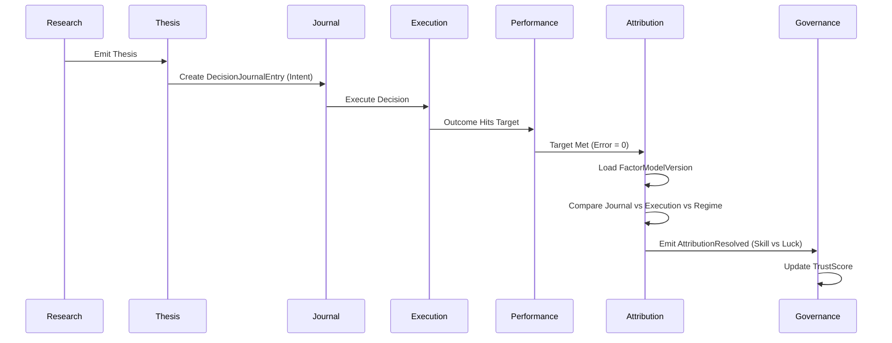

# Sprint-48 Unified Post-Outcome Evaluation Architecture (Remediated)

## 1. Executive Summary
The remediated Sprint-48 Unified Architecture establishes a perfectly deterministic, replayable, and causally-complete Post-Outcome Evaluation Platform. By integrating the **Decision Journal** as a first-class boundary and enforcing absolute cryptographic **Factor Model Versioning**, the architecture guarantees that 2036 replays of 2026 events yield identical causal attribution. Furthermore, Governance has been expanded across a multidimensional Subject Hierarchy (Worker, Strategy, Thesis, Capability, Portfolio), and explicit cybernetic feedback loops have been exposed to support future autonomous self-learning capabilities without violating bounded context ownership. 

## 2. Ownership Boundary Matrix
| Concept | Owner | Write Authority | Read Access | Leakage |
|---------|-------|-----------------|-------------|---------|
| `DecisionJournalEntry`| Decision Journal | Decision Journal | Global | None |
| `Outcome` | Performance Engine| Performance Engine| Global | None |
| `PerformanceEvaluation`| Performance Engine| Performance Engine| Global | None |
| `FactorModelVersion` | Attribution Engine| Attribution Engine| Global | None |
| `AttributionDecomposition`| Attribution Engine| Attribution Engine| Global | None |
| `GovernanceSubject` | Governance Engine | Governance Engine | Global | None |
| `TrustScoreLedgerEntry`| Governance Engine | Governance Engine | Global | None |
| `GovernanceAction` | Governance Engine | Governance Engine | Global | None |

## 3. Updated Architecture Overview
**Knowledge Flow**:
Research → Thesis → Decision Journal → Decision → Execution → Outcome → Performance → Attribution → Governance

The architecture cleanly isolates execution intent (`DecisionJournalEntry`) from raw execution (`Decision`). `Performance` strictly scores arithmetic target divergence. `Attribution` synthesizes the entire upstream chain (Journal + Decision + Execution + Regime + Factor Version) to classify causal variance. `Governance` maps causal variance to `GovernanceSubject` trust limits. Future learning engines consume Attribution outputs via decoupled feedback events.

## 4. Updated Domain Model
**Decision Journal**:
* `DecisionJournalEntry`: Captures ex-ante intent (`thesis_urn`, `confidence`, `rationale`, `invalidation_criteria`).

**Attribution Engine**:
* `FactorModelVersion`: Immutable cryptographic representation of the mathematical definitions used to split Alpha vs Beta (e.g. `factor_model_urn`, `factor_model_hash`).
* `AttributionDecomposition`: The root aggregate assigning causality across Thesis, Decision, Execution, Regime, and Residual (Luck).

**Governance Engine**:
* `GovernanceSubject`: Polymorphic abstraction evaluating `WORKER`, `STRATEGY`, `THESIS`, `CAPABILITY`, or `PORTFOLIO`.
* `TrustScoreLedgerEntry`: Append-only DAG linking a subject's historical trust state.

## 5. Aggregate Design
* All roots (`DecisionJournalEntry`, `PerformanceEvaluation`, `AttributionDecomposition`, `TrustScoreLedgerEntry`) utilize **Append-Only DAG** structures with cryptographic manifest chaining.
* `AttributionDecomposition` explicitly binds to `factor_model_version_urn`.
* Transactions are strictly limited to single-aggregate append operations locked via OCC.

## 6. Value Objects
* `ForecastError`: Absolute decimal divergence.
* `FactorModelHash`: Unforgeable checksum of causal algorithms.
* `CausalFraction`: Vector struct (`{"thesis": 0.1, "decision": 0.4, "execution": -0.2, "regime": 0.5, "luck": 0.2}`).
* `GovernanceTarget`: Enum defining Subject type.
* `FeedbackCandidate`: Lightweight pointer (`urn`) exposed for future learning engines.

## 7. Event Contracts
* `DecisionJournalAppended`: Emits `journal_urn`, `thesis_urn`.
* `PerformanceEvaluated`: Emits `eval_urn`, `outcome_urn`.
* `AttributionResolved`: Emits `attrib_urn`, `factor_model_hash`.
* `ResearchFeedbackCandidateCreated`: Emits `attrib_urn`, `thesis_urn` for future Research learning.
* `CapabilityFeedbackCandidateCreated`: Emits `attrib_urn`, `execution_urn` for future Capability Registry restriction mapping.
* `GovernanceActionExecuted`: Emits `subject_urn`, `action_type`.

## 8. Application Services
Application services act exclusively as asynchronous CQRS dual-write orchestrators:
1. `EvaluatePerformanceService`: Subscribes to `OutcomeRecorded`.
2. `DecomposeAttributionService`: Subscribes to `PerformanceEvaluated`. Fetches full upstream graph (Thesis, Journal, Decision, Execution).
3. `ApplyGovernanceService`: Subscribes to `AttributionResolved`.

## 9. Persistence Design
Tables:
* `decision_journal_entries` (Partitioned RANGE created_at)
* `factor_model_versions` (Static config lookup)
* `attribution_decompositions` (Contains explicit `factor_model_version_urn` FK)
* `governance_trust_ledgers` (Indexes on `subject_type`, `subject_urn`)

## 10. Integration Design
* Performance, Attribution, and Governance operate as fully independent runtime binaries communicating over Kafka/RabbitMQ.
* Attribution utilizes read-only caching for historical `FactorModelVersion` lookups to prevent massive DB cross-joins during high-throughput ingestion.

## 11. Sequence Diagrams

## 12. State Diagrams
DAGs possess no mutable state. All states are `RECORDED`.

## 13. Replayability Analysis
**Proof of 2036 Replayability**:
Because `AttributionDecomposition` physically embeds the `factor_model_version_urn`, a historical point-in-time replay triggered in 2036 will natively load the 2026 Factor Model mathematical constraints. The causal logic applied will be mathematically identical to the original evaluation, guaranteeing zero historical drift.

## 14. Failure Handling
Network disconnects between independent engine runtimes trigger Dead Letter Queues (DLQs) with exponential backoff. Because events are idempotent, eventual consistency guarantees exactly-once processing safely.

## 15. OCC Strategy
All DAG appends specify `previous_urn`. If two concurrent evaluations attempt to mutate the same `GovernanceSubject` concurrently, the database unique constraint on `(subject_urn, previous_urn)` physically rejects the race condition, enforcing serializability.

## 16. Scalability Analysis
`GovernanceSubject` sharding partitions trust ledgers gracefully. Heavy attribution regressions are offloaded onto dedicated Attribution workers independent of Governance policy execution.

## 17. Security Analysis
Immutable DAG constraints block hindsight bias. A manager cannot alter a `DecisionJournalEntry` post-execution because the temporal cryptographic hash of the entry is locked via the subsequent Execution graph.

## 18. Self-Learning Compatibility Analysis
The architecture future-proofs self-learning via explicit feedback streams (`ResearchFeedbackCandidateCreated`, `CapabilityFeedbackCandidateCreated`). A future `Learning Engine` simply subscribes to these streams, consuming the unforgeable causal datasets (Skill vs Luck mappings) to autonomously re-weight internal Research LLM prompts or penalize specific Capability tools.

## 19. Governance Compatibility Analysis
Expanded dimensions:
* **Worker**: Promotion / Demotion.
* **Strategy**: Scaling capital / Retiring logic.
* **Thesis**: Trust decay / Mandating fresh validation.
* **Capability**: Sandboxing / Deprecation of external tools.
* **Portfolio**: Risk restriction.
Zero ownership leakage occurs because Governance strictly owns the `TrustScore`, not the underlying asset representation.

## 20. Architecture Delta Analysis
* **Sprint-48 V1 vs Remediated V2**: `Decision Journal` incorporated, `FactorModelVersion` hardcoded into the aggregate schema guaranteeing replayability, Governance polymorphism introduced across 5 subject types, Cybernetic feedback streams defined.

## 21. ADR Updates
* **ADR-059-factor-model-versioning**: Mandates immutable factor definitions.
* **ADR-060-governance-subject-polymorphism**: Expands governance logic across multidimensional non-worker entities.
* **ADR-061-decision-journal-integration**: Re-establishes the Journal as the ex-ante boundary.

## 22. Governance Compliance Review
* Rule 1 Adherence: Drafts located exclusively in canonical `docs/architecture/`.
* Rule 2 Adherence: No standalone blueprints.
* Traceability Matrix intact.
* Roadmap strictly updated.

## 23. Acceptance Criteria
1. Architecture demonstrates distinguishing Case A, B, C, D causal variance natively.
2. `DecisionJournalEntry` defined.
3. `FactorModelVersion` constraints proved for replayability.
4. Self-learning contracts defined without redesigning Research Engine.
5. Governance multidimensional capability proved.

### Scenario Analysis Matrix (Attribution Input Completeness)
* **Case A** (Correct thesis, Bad execution, Bad outcome): Attribution diffs `DecisionJournal` (Intent) vs `Decision` (Action) -> Flags Execution failure.
* **Case B** (Wrong thesis, Good execution, Good outcome): Attribution diffs `Thesis` vs `Regime` -> Flags Outcome as Beta/Luck driven.
* **Case C** (Correct thesis, Correct execution, Bad regime): Attribution offsets `ForecastError` by `RegimeDistribution` macro drag -> Nullifies Worker penalty.
* **Case D** (Wrong thesis, Lucky outcome): Attribution extracts zero identifiable alpha factors -> Isolates outcome entirely as `ResidualVariance` (Pure Luck).

## 24. Final Verdict
**ARCHITECTURE_APPROVED**
