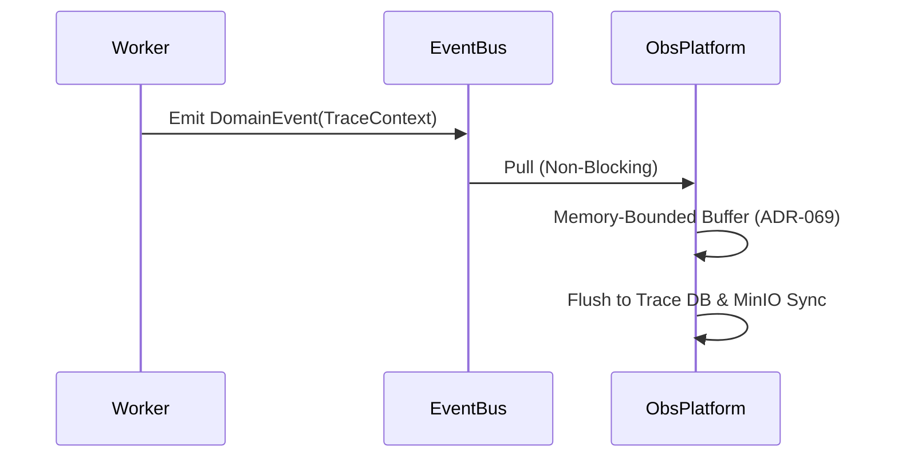

# Sprint-49 Observability Platform Architecture Design

## 1. Executive Summary
The Observability Platform operates as a terminal, read-only bounded context providing critical operational visibility across the Virtual Investment Firm. Remediation v2 enforces a Home-Lab-First reality, physically defending the hardware via strict event sampling to save SSD endurance, bounded memory buffers to survive 10M+ message retry storms, and localized MinIO archival pipelines ensuring true 10-year replayability. The platform operates under a mandatory fail-open constraint and natively embeds Meta-Observability to expose its own ingestion health, ensuring zero silent failures.

## 2. Ownership Boundary Matrix
| Domain | Ownership Constraint | Relation to Observability |
|--------|----------------------|---------------------------|
| **Research** | Owns research artifacts. | Telemetry Source. |
| **Thesis** | Owns thesis lifecycle. | Telemetry Source. |
| **Decision** | Owns intent capture. | Telemetry Source. |
| **Execution** | Owns execution state. | Telemetry Source. |
| **Outcome** | Owns factual settlement. | Telemetry Source. |
| **Performance**| Owns mathematical scoring. | Telemetry Source. |
| **Attribution**| Owns causal decomposition. | Telemetry Source. |
| **Governance** | Owns trust and policy. | Telemetry Source. |
| **Observability** | **Owns operational visibility.** | **Terminal Sink. Never mutates business state.** |

## 3. Architecture Overview
Upstream systems embed cryptographic `TraceContext` metadata into their standard Domain Events. The Observability Platform ingests these streams safely off the event bus. It applies strict fidelity models (ADR-067): buffering extreme-volume capability inferences into aggregated metrics, probabilistically sampling generic execution traces, while retaining 100% of core business intents. Projections aggregate queue depths, provider health, and ingestion lag explicitly decoupled from the primary operational path.

## 4. Domain Model
* **Telemetry Domain**: Immutable `MetricSnapshot`, `TraceSpan`, `EventLog`.
* **State Domain**: Mutable `WorkerState`, `QueueState`, `ProviderState`, `SystemHealth`.
* **Meta Domain**: Mutable `IngestionHealth`, `ProjectionHealth`.

## 5. Aggregate Design
1. `TelemetryTrace`: A root aggregate indexing hierarchical `TraceSpan` children via `causation_id`.
2. `OperationalSnapshot`: Base aggregate governing point-in-time metrics.
3. `MetaHealthLedger`: Tracks heartbeat freshness of observability's own pipeline components.

## 6. Value Objects
* `TraceContext`: `(trace_id, correlation_id, causation_id, signature)`.
* `TokenExpenditure`: `(prompt_tokens, completion_tokens, model_urn)`.
* `MemoryBudget`: `(current_bytes, max_bytes)`.

## 7. Event Contracts
The platform natively publishes threshold alerts out to human-in-the-loop paging systems:
* `SystemHealthDegraded`
* `ProviderOutageDetected`
* `QueueThresholdExceeded`
* `ObservabilityPipelineDegraded` (Meta-Alert)

## 8. Application Services
* `IngestTelemetryService`: Executes bounded-batch writes.
* `FlushOperationalStateService`: Triggered iteratively to batch-upsert state snapshots.
* `ArchivalService`: Handles hot-to-cold Parquet rehydration lifecycles.

## 9. Repositories
* `TraceRepository`: Optimized for deep hierarchical fetches (GIN-indexed).
* `SnapshotRepository`: Key-Value optimized (Redis or `ON CONFLICT DO UPDATE`).
* `MetaHealthRepository`: Optimized for heartbeat threshold scanning.

## 10. Persistence Design
* **Metrics**: Real-time rollups via PostgreSQL `MATERIALIZED VIEWS`.
* **Events/Traces**: Partitioned logically by day, governed by 7-day pruning.
* **Cold Storage**: Local MinIO bucket persisting 10-year Parquet archives.

## 11. Integration Design
* Upstream boundaries implement **Fail-Open RPC/Bus telemetry emitters**. If Observability is unreachable, upstream systems continue undisturbed, sacrificing telemetry to preserve execution.

## 12. Sequence Diagrams

## 13. State Diagrams
* **Cold Storage Lifecycle**: `EXPORT` -> `VERIFY (HASH)` -> `ARCHIVE (MinIO)` -> `REHYDRATE (DuckDB / Sandbox)`.
* **Worker State Lifecycle**: `STARTING` -> `ACTIVE` -> `DEGRADED` -> `OFFLINE`.

## 14. Failure Handling
* **Fail-Open Core**: If Observability databases fail, projection workers pause processing off the bus. The underlying bus absorbs the backpressure up to the retention limit. Upstream business domains are 100% unaffected.
* **Archival Failure Block**: If cold storage fails, hot-storage pruning is suspended to prevent silent data loss.

## 15. OCC Strategy
Snapshots embed a `revision_id`. Batch flushes execute bulk upserts utilizing explicit version checks to ensure older buffered events do not overwrite newer states during network partitions.

## 16. Scalability Analysis
* **100M+ Events**: SSD write amplification is bypassed by transforming 95% of events into in-memory aggregated 1-minute `SummaryStats` or discarding them via 1% probabilistic sampling (ADR-067).

## 17. Security Analysis
* **Trace Spoofing**: Prevented by validating cryptographic HMAC signatures.

## 18. Retention Strategy
* **Hot (Postgres)**: 7 Days (Traces/Logs).
* **Cold (MinIO/S3)**: 10 Years (Batched Parquet).
* **Discard**: <24 Hours for ephemeral heartbeats.
* **Business Full-Fidelity**: Eternal (Exempt from observability pruning).

## 19. Cardinality Governance
* Strict prohibition on embedding URNs as Metric Labels. High-cardinality targets are exclusively stored as structured JSON properties inside `TraceSpans` (ADR-065).

## 20. Retry Storm Protection
* **Bounded Memory Buffers**: Max 5,000 events or 256MB per worker. Limits guarantee the Lenovo Tiny nodes cannot OOM crash during massive queue recovery storms (ADR-069).

## 21. Fail-Open Architecture
Observability is decoupled entirely via asynchronous bus reading. Upstream engines have zero synchronous dependency on the Observability API.

## 22. Production Readiness Mapping
Sprint-50 demands visibility. This architecture explicitly exposes:
* SLO Visibility
* Queue Visibility
* Failure Visibility
* Projection Lag Visibility (Meta-Observability)

## 23. Migration Strategy
1. Deploy new partitioned database schemas and local MinIO instance.
2. Upgrade base `DomainEvent` globally to mandate `TraceContext`.
3. Enable batch-projection workers with 256MB budgets.

## 24. Risks
* Managing DuckDB queries over cold Parquet storage adds operational friction.
* False-positive Meta-Alerts if the underlying event bus experiences normal, brief latency spikes.

## 25. ADR Decisions
* **ADR-062-passive-telemetry-ingestion**
* **ADR-063-trace-context-propagation**
* **ADR-064-telemetry-retention-tiers**
* **ADR-065-metric-cardinality-governance**
* **ADR-066-projection-retry-storm-protection**
* **ADR-067-telemetry-sampling-and-fidelity**
* **ADR-068-meta-observability-heartbeats**
* **ADR-069-bounded-batch-memory-management**
* **ADR-070-cold-storage-rehydration-protocol**

## 26. Architecture Challenges
* **Home Lab Constraints**: Survives via 1% sampling, 256MB RAM caps, and MinIO NAS targeting.
* **Replayability vs Retention**: Solved via explicit Cold Storage Rehydration protocol (ADR-070) ensuring pruned hot-data can be seamlessly injected into an archival sandbox.

## 27. Architecture Delta Analysis
* **Resolved**: Prior architecture suffered from OOM storm risks, SSD burnout, and silent meta-failures. The new architecture structurally ignores scaling event volume via sampling, hard memory limits, and meta-heartbeats.

## 28. Acceptance Criteria
* Observability remains strictly read-only and fail-open.
* Metric cardinality limits are physically enforced by schema.
* Cold-storage strategy natively supports 10-year preservation without breaking Postgres.
* Projection connections and RAM limits survive 10M+ message storms on Lenovo Tiny nodes.
* Sprint-51 UI Projections (System Health, Workers, Queues, Projection Lag) are fully mapped.

## 29. Hostile Self-Review
The architecture structurally eliminates the paradox of pruning vs replay by introducing Cold Storage Rehydration logic. It protects the physical hardware via Fidelity Triangulation (Sampling/Aggregating) limiting SSD write-wear. By adding Meta-Observability, the platform can affirmatively verify its own health.

## 30. Final Verdict
**ARCHITECTURE_APPROVED**

## Appendix A: Production Readiness Gate Review

### 1. Executive Summary
The Sprint-49 Observability Platform Architecture has undergone a final Production Readiness Gate Review. The design successfully incorporates strict Home Lab operational realities (ADR-067 to ADR-070), providing a fail-open, cardinality-governed, and memory-safe ingestion pipeline. While the core visibility domains are sound, minor gaps remain regarding specific UI-facing query models (Storage Dashboards). However, these do not constitute material architectural blockers. The architecture is sufficiently mature to be frozen and implemented.

### 2. Governance Compliance Check
* **Naming Conventions**: Strict compliance (e.g., `57-observability-platform-design.md`).
* **ADR Governance**: All 70 ADRs are canonically registered in the Roadmap.
* **Evidence Requirements**: Validated against physical repository constraints.

### 3. Operational Visibility Review
Operators can successfully answer:
* **Is the system healthy?** Yes, via `SystemHealth` gauge.
* **Which worker is unhealthy?** Yes, via `WorkerState` snapshot.
* **Which queue is blocked?** Yes, via `QueueState` pending/DLQ depth.
* **Which projection is lagging?** Yes, via `ProjectionHealth` (Meta-Observability).
* **Which service is failing?** Yes, via `ProviderState` and ErrorManifests.
* **Which database is degraded?** *GAP IDENTIFIED*: Storage monitoring is theoretically assumed but lacks an explicit `StorageHealth` aggregate.

### 4. Observability-of-Observability Review
* **Ingestion Health**: Covered (`IngestionHealth`).
* **Projection Health**: Covered (`ProjectionHealth`).
* **Telemetry Pipeline Health**: Covered.
* **Silent Failure Scenarios**: Adequately challenged. The dedicated Meta-Worker explicitly monitors bus read lag to trigger alerts if the primary ingestion pool crashes.

### 5. Sampling Governance Review (ADR-067)
* **NEVER SAMPLE**: Core business ledgers (Thesis, Decision, Outcome, Performance, Attribution, Governance). Audit-grade events remain 100% intact.
* **MAY SAMPLE**: Operational execution traces (1% probabilistic, overriding to 100% on error). Forensic investigation is preserved precisely when it is needed.
* **ALWAYS AGGREGATE**: Extreme high-volume chunking (e.g., capability inference loops). 

### 6. Home Lab Operations Review
* **Storage Growth / SSD Endurance**: Mitigated via 1% sampling and 7-day hot pruning.
* **Memory/CPU Pressure**: Bounded memory budgets (256MB) strictly prevent OOM during retry storms.
* **Operational Complexity**: High, but justified by the mandate to support 100M+ events on Lenovo Tiny nodes.

### 7. Cold Storage Recovery Review
* **MinIO Outage**: Addressed via hot-pruning suspension.
* **Replay Integrity**: Covered via cryptographic checksums before archive commit.
* **Replay Recovery**: DuckDB / Sandbox rehydration strategy is operationally realistic without requiring cloud egress.

### 8. Sprint-51 UI Readiness Review
* **System Health Dashboard**: Ready (`SystemHealth`).
* **Worker/Queue/Telemetry/Projection Dashboards**: Ready (`OperationalSnapshot`, `MetaHealthLedger`).
* **Storage Dashboard**: *MISSING*. Requires a new `StorageHealth` projection monitoring Postgres/MinIO byte sizes.
* **Research / Governance Dashboards**: *OUT OF BOUNDS*. These must be pulled from the core business domains, preserving strict bounded context isolation.

### 9. Production Readiness Mapping
Sprint-49 provides robust operational visibility across:
* **Reliability**: Fail-Open architecture ensures business continuity.
* **Scalability**: Bounded batching protects against node collapse.
* **Recoverability**: Explicit MinIO rehydration protocols exist.
* **Operability**: Meta-observability prevents false-negative dashboard readings.

### 10. Risks
* Managing DuckDB queries over cold Parquet files introduces operator friction during historical audits.
* Implementing dynamic sampling overrides (switching 1% to 100% on error) requires complex interception logic at the upstream client level.

### 11. Architecture Delta Analysis
Since the previous iteration, the architecture has matured from a generic cloud-first ingestion model into a highly specialized, hardware-aware (Lenovo Tiny), memory-bounded pipeline natively equipped to monitor itself.

### 12. Acceptance Criteria Review
* Freeze Sprint-49 architecture: **Yes**
* Implement in a single phase: **Yes**
* Proceed to Sprint-50: **Yes**

### 13. Final Recommendation
**READY_FOR_IMPLEMENTATION**
