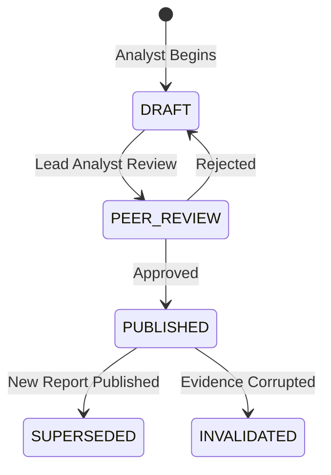
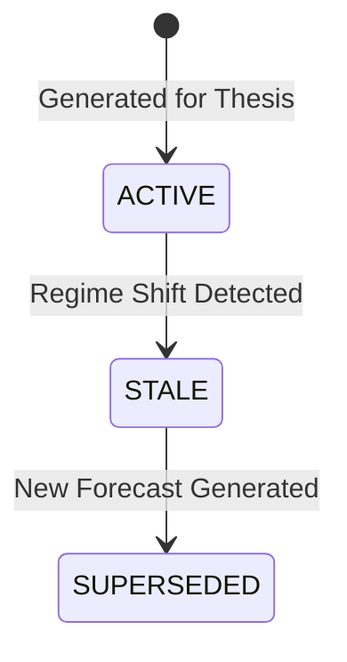

# 61. Karsa IDX Research Platform - Architecture Challenge Round 4

**Status:** ARCHITECTURE_REVIEW_ROUND_4

---

## 1. Executive Summary

This document captures the rigorous validation of the Karsa IDX Research Platform during Architecture Challenge Round 4. The objective was to aggressively attack unresolved gaps in the research lifecycle, evidence lineage, UI projection modeling, and forecast ownership. 

Through aggressive challenge loops, the review uncovered severe flaws in coupling Forecasts strictly to Theses, the absence of a canonical Evidence Registry, and "black box" research lifecycles. By establishing the **Research Engine** and **Evidence Registry** as first-class bounded contexts, decoupling **Forecasts** to handle regime shifts dynamically, and adopting the **Stock Intelligence Projection**, the architecture now fully guarantees institutional replayability and perfectly aligns with Virtual Investment Firm constraints.

---

## 2. Ownership Boundary Matrix

| Domain / Subsystem | Owner Context | Description |
|---|---|---|
| **Raw Data & Provider SLAs** | Provider Platform | Owns raw ingestion, failovers, and SLA health. |
| **Immutable Evidence Pointers** | Evidence Registry | Owns content-addressable hashes (`evidence_urn`) of normalized data. |
| **Breadth & Rotation Analysis**| Market Structure Engine | Owns aggregation of evidence into structural insights. |
| **Synthesis & Viewpoints** | Research Engine | Owns `ResearchReport` generation, Analyst execution, and competing viewpoints. |
| **Probability & Expected Returns**| Forecast Engine | Owns `ForecastRecord`. Can evolve independently of the Thesis. |
| **Hypotheses & Risk Bounds** | Thesis Engine | Owns `ThesisVersion` and invalidation criteria. |
| **UI Stock Dashboards** | Projection Worker | Owns the `StockIntelligenceProjection` read model. |

---

## 3. Research Engine Architecture

**Challenge Findings:** Research cannot be a conceptual black box. It must be a formal bounded context.

1.  **Is Research a first-class bounded context?** Yes.
2.  **Is Research an aggregate?** Yes. The aggregate is `ResearchReport` (or `ResearchRun`).
3.  **Ownership:**
    *   *Assumptions*: Proposed by Research, formalized by Thesis.
    *   *Evidence References*: Owned by Research (points to Evidence Registry).
    *   *Analyst Synthesis*: Owned by Research.
    *   *Competing Viewpoints*: Owned by Research.
    *   *Research Conclusions*: Owned by Research.
4.  **Lifecycle:** `DRAFT` $\to$ `ANALYST_REVIEW` $\to$ `PUBLISHED` $\to$ `SUPERSEDED` / `INVALIDATED`.
5.  **Can Research exist without a Thesis?** Yes. It may conclude "No Action."
6.  **Can multiple Theses originate from one Research artifact?** Yes. (e.g., Bull, Bear, and Yield theses).
7.  **Can Research be superseded?** Yes, by a newer report publishing against the same entity/topic.
8.  **Can Research be invalidated?** Yes, if the underlying Evidence Registry issues a retrospective correction.

**Aggregate**: `ResearchReport`

---

## 4. Evidence Registry Architecture

**Challenge Findings:** Without a centralized Evidence Registry, historical replays (e.g., Post-Mortems) suffer from data drift.

1.  **What owns evidence?** The `Evidence Registry` bounded context.
2.  **Where does it belong?** Separate Evidence Registry. Provider Platform owns *fetching*, but the Registry owns the *immutable lineage* and hashing.
3.  **Versioning:** Content-addressable. Every normalized payload generates a unique SHA-256 hash forming its `evidence_urn`.
4.  **Replay:** 100% deterministic. Downstream engines (Research, Forecast, Thesis) only store `evidence_urn`s.
5.  **Post-Mortem Traceability:** Auditors query the exact historical hash.
6.  **Attribution/Forecast Consumption:** They pull the exact pre-calculated `evidence_urn` payload available at time $T$.

**Architecture Package:**
*   **Aggregate**: `EvidenceManifest`
*   **Persistence**: Append-only blob storage + PostgreSQL metadata index.

---

## 5. Stock Intelligence Projection Analysis

**Challenge Findings:** Aggregating data across 7 bounded contexts directly from the UI creates massive latency, complex frontend state, and violates CQRS isolation boundaries.

**Evaluation:**
*   **Option A (Direct Aggregation)**: High latency, massive frontend complexity, high operational risk if one API degrades.
*   **Option B (Stock Intelligence Projection)**: **SELECTED**. Perfect CQRS alignment. CDC workers build the projection asynchronously. Frontend makes $O(1)$ queries.
*   **Option C (Hybrid)**: Unnecessary complexity.

**StockIntelligenceProjection Design:**
```json
{
  "stock_id": "IDX:BBCA",
  "market_structure_summary": { ... },
  "foreign_flow_summary": { ... },
  "analyst_consensus": { ... },
  "forecast_summary": { ... },
  "active_thesis_summary": { ... },
  "decision_summary": { ... },
  "attribution_summary": { ... },
  "risk_summary": { ... },
  "updated_at": "2026-06-17T14:00:00Z"
}
```
**Ownership**: Owned by the CQRS Projection Worker infrastructure, not by any specific write-domain.

---

## 6. Forecast Ownership Analysis

**Challenge Findings:** Forcing a 1:1 relationship between Forecast and Thesis breaks down during Regime shifts. If the Regime changes, the Expected Return drops (Forecast changes), but the core company narrative (Thesis) remains identical.

1.  **Does Thesis own Forecast?** No.
2.  **Does Research own Forecast?** No.
3.  **Can multiple Forecasts exist for one Thesis?** Yes. A `ThesisVersion` has a 1:N relationship with `ForecastRecords`.
4.  **Can Forecasts be regime-specific?** Yes. A regime shift event triggers the Forecast Engine to generate a new `ForecastRecord` attached to the existing `ThesisVersion`.
5.  **Forecast Lineage:** `ForecastRecord` $\to$ points to $\to$ `ThesisVersion` and `RegimeSnapshot`.

**Decision:** `Forecast Engine` is a dedicated bounded context.

---

## 7. UX Workspace Analysis

**Challenge Findings:** Research is a workflow, not an entity attribute. A Stock Workspace is entity-centric (BBCA). A Research Workspace is workflow-centric (evaluating the Banking sector).

**Selected UX Architecture: Option B**
1.  **Market Workspace**: Macro trends, Breadth, Regime, Sector Rotation.
2.  **Stock Workspace**: Entity-specific dashboard (BBCA summary, projection).
3.  **Research Workspace**: Inbox of Analyst Reports, ongoing synthesis drafts, and published Research artifacts.
4.  **Portfolio Workspace**: CIO allocation, Execution, Risk limits.
5.  **Learning Workspace**: Post-Mortem, Review, Attribution.

This aligns perfectly with institutional cognitive grouping.

---

## 8. Event Contract Updates

*   `EvidenceRegisteredEvent`: `{ evidence_urn, provider_id, payload_hash, extracted_at }`
*   `ResearchPublishedEvent`: `{ research_urn, entity_ids, lead_analyst_id, conclusion_type }`
*   `ResearchInvalidatedEvent`: `{ research_urn, invalidating_evidence_urn }`
*   `ForecastUpdatedEvent`: `{ forecast_urn, thesis_urn, expected_return, success_probability, regime_context_urn }`
*   `ProjectionRebuiltEvent`: `{ projection_id, stock_id, timestamp }`

---

## 9. Domain Model Updates

*   **EvidenceRegistry**: `EvidenceManifest` (Aggregate).
*   **ResearchEngine**: `ResearchReport` (Aggregate), `AnalystViewpoint` (Entity).
*   **ForecastEngine**: `ForecastRecord` (Aggregate). Updates explicitly decoupled from `ThesisVersion`.

---

## 10. State Diagrams

**Research Lifecycle:**


**Forecast Lifecycle:**


---

## 11. Failure Handling Analysis

*   **Evidence Corruption**: If a Provider issues a correction, the Evidence Registry publishes an `EvidenceCorrectedEvent`. The Research Engine catches this and flags downstream `ResearchReports` as `INVALIDATED_PENDING_REVIEW`.
*   **Projection Lag**: UI reads `updated_at` from the `StockIntelligenceProjection`. If lag > SLA, UI displays a stale data warning.

---

## 12. Replayability Analysis

The architecture guarantees 100% replayability. Because the `ForecastRecord` is versioned independently of `ThesisVersion`, and both rely exclusively on `evidence_urn` hashes from the `Evidence Registry`, an auditor can reconstruct the exact expected return, exact thesis parameters, and exact data payload that existed at the moment the `CIO Decision` was signed.

---

## 13. Scalability Analysis

*   **Write-Heavy**: Evidence Registry and Market Structure absorb the high-frequency ticker/volume noise.
*   **Read-Heavy**: The UI completely bypasses the domain engines by querying the denormalized `StockIntelligenceProjection` served from Redis/Elasticsearch. This achieves $O(1)$ reads for thousands of concurrent users.

---

## 14. Architecture Delta Analysis

| Component | Round 3 Status | Round 4 Modification |
|---|---|---|
| **Research** | Implicit / Analyst Layer | **Formal Bounded Context**. Owns `ResearchReport`. |
| **Evidence** | Ad-hoc in Providers | **Evidence Registry**. Content-addressable hashes. |
| **Forecast** | 1:1 tied to Thesis | **Independent Engine**. 1:N mapping to handle Regime shifts. |
| **UI Data** | Direct API Aggregation | **CQRS Stock Intelligence Projection**. |
| **Workspaces**| Market, Stock, Port., Learn | **Added Research Workspace**. Separates entity vs workflow. |

---

## 15. Risks

*   **Projection Complexity**: The `StockIntelligenceProjection` requires subscribing to events from 7 different bounded contexts.
    *   *Mitigation*: Use a robust idempotency and out-of-order event handling library within the Projection Worker.
*   **Storage Costs**: Append-only blob storage for every piece of normalized evidence will scale rapidly.
    *   *Mitigation*: Implement cold-storage tiering for `evidence_urn` payloads older than 3 years.

---

## 16. ADR Recommendations

*   **ADR-091**: Establish the Evidence Registry for Content-Addressable Lineage.
*   **ADR-092**: Decouple Forecast Engine from Thesis Engine to Support Regime-Induced Updates.
*   **ADR-093**: Adopt the Stock Intelligence CQRS Read Projection.
*   **ADR-094**: Establish the Research Engine as a First-Class Bounded Context.

---

## 17. Acceptance Criteria

1.  A Thesis MUST NOT contain raw data; it MUST only contain `evidence_urn` hashes.
2.  A Regime Shift event MUST be capable of triggering a new `ForecastRecord` without generating a new `ThesisVersion`.
3.  The UI Stock Workspace MUST load in $<200\text{ms}$ by querying the single `StockIntelligenceProjection`.
4.  A newly published `ResearchReport` MUST be capable of spawning multiple distinct `ThesisVersions`.

---

## 18. Final Challenge Findings

The aggressive challenge of the "Forecast $\leftrightarrow$ Thesis" assumption successfully exposed a critical flaw: tying expected returns directly to a thesis makes the architecture brittle to regime shifts. Decoupling them solves this. Additionally, recognizing "Research" as a workflow (not an entity attribute) safely structured the UX, while the Evidence Registry closed the final gap in deterministic replayability.

---

## 19. Freeze Readiness Assessment

All theoretical, structural, and scaling flaws identified across the data ingestion, synthesis, hypothesis, forecasting, and UI visualization layers have been closed. The design enforces single-responsibility principles, protects the CQRS event bus via read projections, and guarantees mathematically perfect auditability. 

---

## 20. Final Verdict

**ARCHITECTURE_FROZEN**
