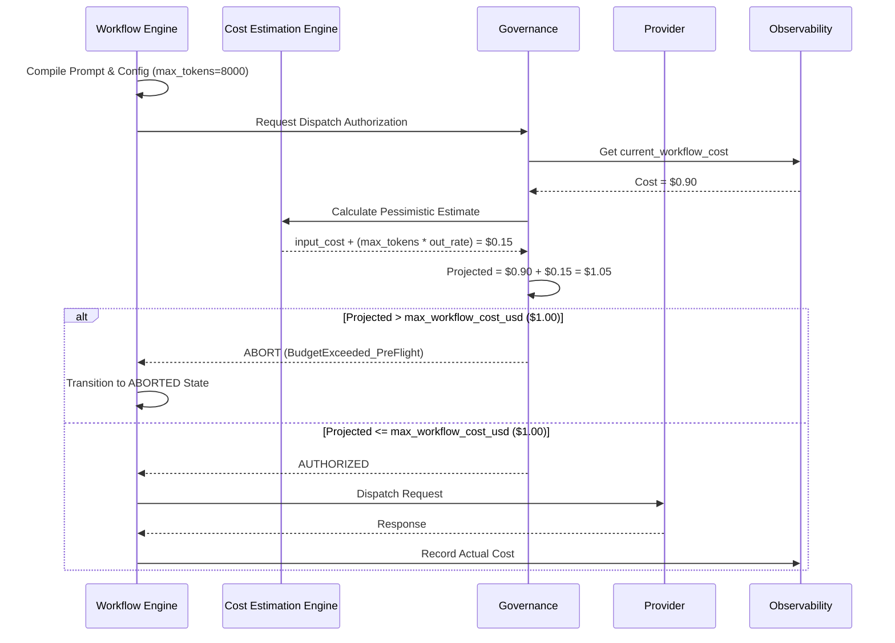

# Cost Estimation & Pre-Execution Governance

## 1. Problem Statement

Karsa’s current Governance Engine relies on a reactive, post-execution ledger. When an execution completes, the `ObservabilityManager` tallies the token consumption, calculates the USD cost, and rolls it up to the `WorkflowMetrics`. Governance then checks if the budget has been exceeded to decide whether to permit the *next* execution.

This is fundamentally flawed. If a workflow has $0.05 remaining in its budget, and the Workflow Engine dispatches a massive Architecture review using a premier LLM, that single execution might cost $0.50. Governance will only catch the breach after the money is already spent, resulting in a final workflow cost of $1.50 against a $1.00 budget. 

To enforce mathematically strict budget ceilings (hard limits), Governance must proactively evaluate the *estimated maximum possible cost* of an execution before network dispatch.

---

## 2. Cost Estimation Architecture

### 2.1. The Cost Estimation Engine
- **Purpose**: To calculate the financial risk of an impending execution payload before it leaves the local environment.
- **Inputs**: 
  - The compiled raw prompt text (system + user + history).
  - The target Model ID.
  - Model configuration bounds (specifically, `max_output_tokens` allowed by the request).
- **Outputs**: A `PreExecutionCostEstimate` object detailing expected input cost, worst-case output cost, and total pessimistic USD exposure.
- **Ownership**: Co-owned by the `Tokenizer` (for counting) and the `PricingRegistry` (for financial translation). It operates as a stateless utility invoked by the Governance Engine.
- **Lifecycle**: Invoked immediately prior to LLM Client dispatch. Exists only for the duration of the pre-flight check.

---

## 3. Estimation Model

Estimating LLM output is non-deterministic. Therefore, the engine must model boundaries rather than exact figures.

- **Token Estimation**:
  - `known_input_tokens`: Calculated deterministically by running the prompt through the specific model's local `Tokenizer`.
  - `max_possible_output_tokens`: Derived from the `max_tokens` parameter passed in the LLM API request configuration (or the model's hard ceiling if not explicitly bounded).
- **Optimistic Estimation**: `(known_input_tokens * input_rate) + (average_historical_output_tokens * output_rate)`. Useful for internal analytics, but unsafe for strict governance.
- **Pessimistic Estimation**: `(known_input_tokens * input_rate) + (max_possible_output_tokens * output_rate)`. The worst-case financial scenario if the model maxes out its generation limit.
- **Confidence Levels**:
  - `HIGH`: Local tokenizer exactly matches provider API, and pricing registry is confirmed up to date.
  - `LOW`: Fallback heuristic character-to-token counting is used, or provider pricing is volatile.

---

## 4. Governance Integration

Before the `LLMClient` dispatches a request, the Governance Engine acts as an interceptor. 

**The Pre-Dispatch Formula**:
```text
Projected_Total_Cost = current_workflow_cost + Pessimistic_Estimation.total_usd
```

**Evaluation Logic**:
- If `Projected_Total_Cost` <= `max_workflow_cost_usd`: The execution is **AUTHORIZED**.
- If `Projected_Total_Cost` > `max_workflow_cost_usd`: The execution is **BLOCKED**. A `BudgetExceeded` exception is thrown immediately, aborting the workflow *before* the API call is made.

---

## 5. Budget Enforcement Model

- **Hard Limits**: The absolute ceiling (`max_workflow_cost_usd`). The Governance Engine will aggressively throw `BudgetExceeded` if the pessimistic estimate breaches this.
- **Soft Limits**: A user-defined threshold (e.g., 80% of budget). Does not abort execution, but flags the workflow state for human review.
- **Warning Thresholds**: Log alerts emitted when an individual execution's pessimistic estimate exceeds a specific anomaly threshold (e.g., "Warning: Upcoming execution projected to cost $0.80").

---

## 6. Sequence Diagrams

### Pre-Dispatch Governance Check (Normal & Exceeded Paths)



---

## 7. Failure Modes

- **Estimation Error (Tokenizer Mismatch)**: If Karsa uses a `tiktoken` heuristic but sends the request to Anthropic, the input token count will be incorrect. *Mitigation*: The `PreExecutionCostEstimate` must flag confidence as `LOW` and add a 15% safety margin to the calculation.
- **Provider Pricing Changes**: If a provider silently updates their API pricing, the `PricingRegistry` will under-estimate the cost. *Mitigation*: The registry must support dynamic fetching or conservative default overrides.
- **Model Migration**: A developer requests a model that the `PricingRegistry` does not recognize. *Mitigation*: The Governance Engine must default to a "Fail Closed" state. Unknown models yield an `Infinite` cost estimate, blocking dispatch until pricing is configured.

---

## 8. Architecture Review

### Challenging the Design
**1. Hidden Assumption: Explicit Output Boundaries**
* *Challenge*: The pessimistic estimate relies on `max_possible_output_tokens`. Many current LLM client integrations do not explicitly set `max_tokens`, relying on the model's default maximum (which can be up to 128k for modern models). If we use 128k for the pessimistic estimate, almost *every* execution will be blocked for blowing the budget.
* *Risk*: High. Legitimate workflows will be paralyzed by overly pessimistic pre-flight checks.
* *Recommendation*: The Workflow Engine MUST explicitly inject a conservative `max_tokens` cap into every single API request (e.g., `max_tokens=2048` for a reviewer, `max_tokens=8192` for a coder). An execution cannot be authorized without a bound context.

**2. Hidden Assumption: Instant Tokenization**
* *Challenge*: Running a 100k token prompt through a heavy Python tokenizer synchronously before every LLM call will introduce severe latency.
* *Risk*: Moderate.
* *Recommendation*: Introduce a fast heuristic character-to-token ratio (e.g., `chars / 4`) as the primary path, applying the exact tokenizer only when the heuristic predicts the execution is within 10% of breaching the budget.

---

## 9. Roadmap Impact

### Does the Sprint Ordering Need to Change?
**Yes.**

*Current Roadmap Sequence:*
- Sprint 1: Cost & Token Observability (Post-execution ledger)
- Sprint 2: Workflow FSM & Failure Taxonomy
- Sprint 3: Cost Governance (Kill-switches)

*Revised Sequence:*
The new requirement forces us to update how we interact with LLMs. We cannot build Governance (Sprint 3) if the LLM clients are not structurally enforcing `max_tokens`.

- **Sprint 1: Cost & Token Observability** -> Must now include the `Tokenizer` and `PricingRegistry` as standalone services that can be queried *independently* of an execution.
- **Sprint 2: Workflow FSM & Bound Execution Contracts** -> The LLM Clients must be refactored to require a `max_output_tokens` parameter on every call.
- **Sprint 3: Cost Governance (Pre-Flight)** -> Governance is built exactly as described here, using the standalone `Tokenizer` to calculate pessimistic limits before dispatch. 
- **Sprints 4+**: Unchanged.

By integrating bounded execution contracts into Sprint 2, we guarantee that Sprint 3's Governance engine has the exact mathematical bounds required to proactively protect the platform budget.
