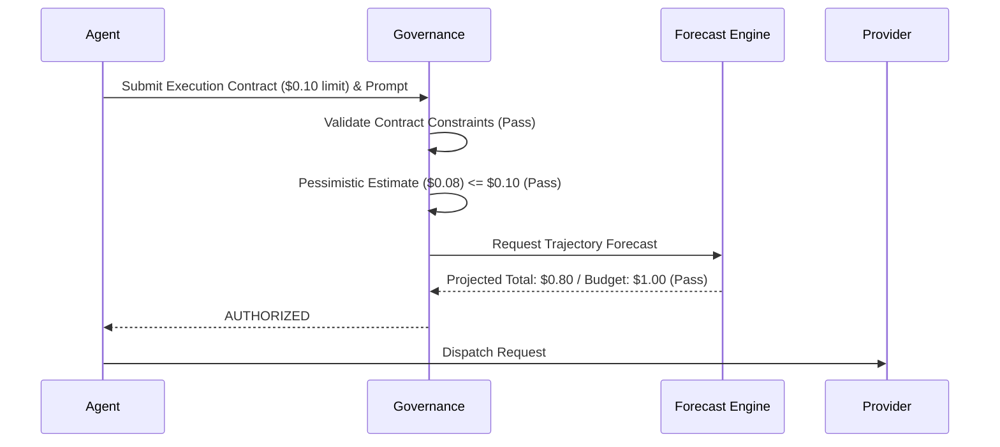
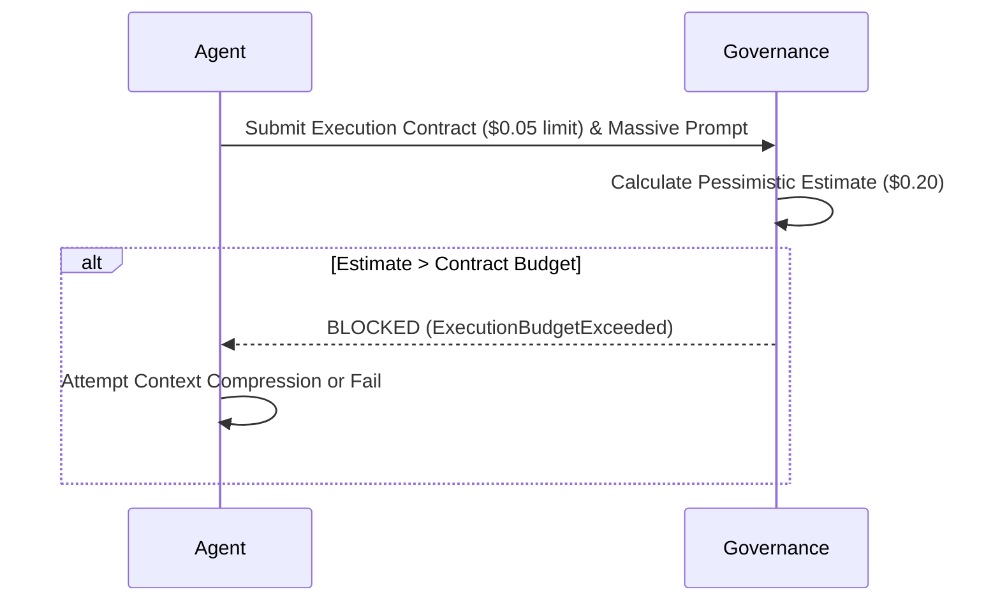
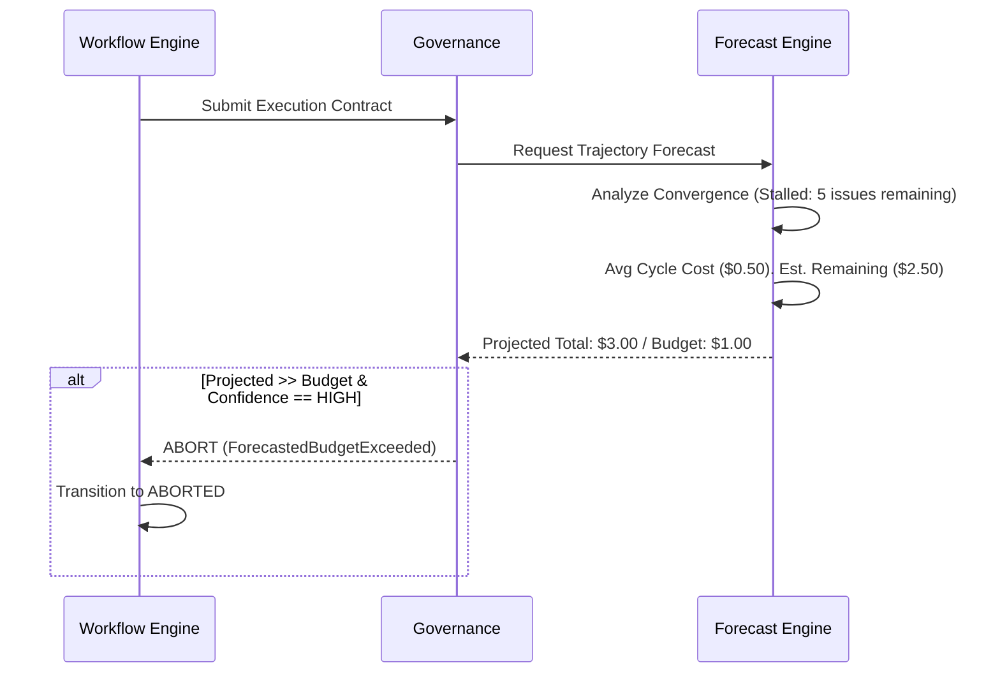

# Execution Contracts & Cost Forecasting

## 1. Problem Statement

Relying solely on a global `max_workflow_cost_usd` is insufficient for true autonomous safety. If a workflow has a $5.00 budget, a rogue Coder agent could dispatch a massive, unoptimized execution that consumes $4.99 in a single shot. The workflow budget technically hasn't breached during the pre-flight check, but the execution is fundamentally anomalous and leaves $0.01 to complete the rest of the workflow—guaranteeing eventual failure.

Furthermore, pre-execution governance only checks if the *immediate next step* will breach the budget. It ignores the probability of success. If a workflow is on cycle 15 of 20, has $0.50 left, but averages $0.20 per cycle, it is mathematically doomed. Waiting for it to run out of money is a waste of API spend. We must introduce **Execution Contracts** to constrain individual steps, and **Cost Forecasting** to proactively kill doomed workflows early.

---

## 2. Execution Contract Architecture

An **Execution Contract** is a strict, immutable SLA binding an Agent to specific operational limits for a single LLM API call.

- **Ownership**: Authored by the `Agent` (defining its needs), strictly enforced by the `Governance Engine`.
- **Lifecycle**: Generated immediately before dispatch. Validated by Governance. Destroyed upon execution completion or failure.
- **Validation Rules**: If the Agent requests a contract that breaches global policies, Governance throws a `ContractViolation` before estimation even begins.

**Contract Schema**:
- `max_input_tokens`: The absolute cap on the prompt size.
- `max_output_tokens`: The ceiling for generation (passed to the LLM API).
- `timeout_seconds`: Hard network timeout.
- `execution_budget_usd`: The maximum permissible cost for this *specific* call.
- `model_constraints`: A list of allowed models (e.g., `["gemini-2.5-flash"]`) to prevent an Agent from self-upgrading to an expensive premier tier.

---

## 3. Governance Integration

The Governance pre-flight check now operates in two distinct phases:

1. **Contract Validation (Execution Level)**:
   - Does the prompt size exceed `max_input_tokens`?
   - Does the Pessimistic Estimate (`input_cost + max_output_cost`) exceed the `execution_budget_usd` defined in the contract?
2. **Budget Validation (Workflow Level)**:
   - Does `current_workflow_cost + Pessimistic_Estimate` exceed `max_workflow_cost_usd`?

If either validation fails, the dispatch is blocked.

---

## 4. Pricing Registry Architecture

To support modern LLM features without tying Karsa to Anthropic, OpenAI, or Google-specific schemas, the `PricingRegistry` must use an extensible, granular model.

**Universal Rate Card Schema**:
- `model_id`: (e.g., `generic-model-v1`)
- `base_input_rate`: Cost per 1M input tokens.
- `cached_input_rate`: Cost per 1M cached/discounted input tokens.
- `base_output_rate`: Cost per 1M generated tokens.
- `reasoning_output_rate`: Cost per 1M internal "thought" tokens (e.g., OpenAI o1/o3 or Gemini Thinking).
- `tool_call_rate`: Flat fee or specific token multiplier for structured tool invocations.

*Extensibility*: Unknown fields are ignored. If a provider does not support `reasoning_output_rate`, it defaults to `base_output_rate`.

---

## 5. Workflow Cost Forecasting

To prevent throwing good money after bad, Karsa implements a **Forecast Engine**.

- **Forecast Engine**: Evaluates the historical cost and convergence trajectory of the active workflow.
- **Projected Remaining Cycles**: Analyzes the `convergence_score` trend. If issues are dropping by 2 per cycle, and 6 remain, it projects 3 cycles left.
- **Projected Remaining Cost**: `(Average_Cost_Per_Cycle * Projected_Remaining_Cycles)`.
- **Forecast Confidence**: Low (cycles 1-2), High (cycles 3+).

**Proactive Abort Rule**:
If `(current_workflow_cost + Projected_Remaining_Cost) > max_workflow_cost_usd` AND `Forecast_Confidence == HIGH`, Governance throws a `ForecastedBudgetExceeded` and aborts the workflow. 

---

## 6. New Failure Types

- **`ForecastedBudgetExceeded`**
  - *Severity*: HIGH. 
  - *Action*: Abort workflow early to save remaining budget. The trajectory is mathematically doomed.
- **`ExecutionBudgetExceeded`**
  - *Severity*: MODERATE. 
  - *Action*: The specific execution is blocked because its pessimistic estimate exceeds the `execution_budget_usd`. The Agent may retry by requesting a smaller chunk of work or a cheaper model.
- **`ContractViolation`**
  - *Severity*: CRITICAL.
  - *Action*: The Agent requested a contract that violates hard global constraints (e.g., requesting a premier model when only flash is allowed). Transition workflow to `ABORTED`.

---

## 7. Sequence Diagrams

### Normal Path (Contract & Forecast Pass)

### Execution Budget Exceeded

### Workflow Forecast Exceeded

---

## 8. Architecture Review

### Challenging the Design

**1. Hidden Assumption: Linear Convergence**
* *Challenge*: The Forecast Engine assumes that if bugs dropped from 10 to 8, the velocity is 2 bugs per cycle. In reality, the final 2 bugs often take 5x longer to solve than the first 8. 
* *Risk*: The Forecast Engine might be too optimistic, failing to kill a doomed workflow until it actually hits the hard budget limit.
* *Recommendation*: The Forecast Engine must use an exponentially decaying velocity curve, penalizing the projection if the exact same issue string appears in consecutive cycles (indicating a hallucination loop).

**2. Hidden Assumption: Accurate Reasoning Tokens Estimation**
* *Challenge*: By definition, "reasoning tokens" (e.g., OpenAI o1/o3) cannot be bounded purely by `max_output_tokens` because the model decides how long to think. Pessimistic estimation is extremely difficult.
* *Risk*: Massive, unexpected API bills from deep-thinking models.
* *Recommendation*: The Execution Contract must support a specific `max_reasoning_tokens` constraint if supported by the provider. If unsupported, premier reasoning models must be completely disallowed for any workflow that has less than 50% of its budget remaining.

---

## 9. Roadmap Revalidation

With Execution Contracts, universal Pricing Registries, and Cost Forecasting, the governance layer is now fully mature. We can confidently finalize the Sprint execution order.

**Final Recommended Sprint Ordering:**

- **Sprint 1: Cost & Token Observability** (Ledger, `PricingRegistry`)
- **Sprint 2: Workflow FSM & Bound Execution Contracts** (State Machine, LLM constraints)
- **Sprint 3: Cost Governance & Forecasting** (Kill-switches, Pre-flight estimation, Forecast Engine)
- **Sprint 4: Benchmark Harness** (Safe to benchmark without infinite loop risk)
- **Sprint 5: Model Routing** (Price arbitrage)
- **Sprint 6: Structured Prompt Builder** (Modular prompts)
- **Sprint 7: Context Cache Strategy** (Input token reduction)
- **Sprint 8: Patch-Based Revision** (Output token reduction)
- **Sprint 9: Review Delta Strategy** (Review loop token reduction)
- **Sprint 10: Prompt Summarization** (History compression)
- **Sprint 11-14: External Workflow Integration** (Analysis, Architecture, Implementation, Verification, Acceptance)
- **Sprint 15+: Optional RAG / Semantic Retrieval**

This ordering guarantees that Karsa will never run unmeasured (Sprint 1), unbounded (Sprint 2), or unguarded (Sprint 3) API calls.
