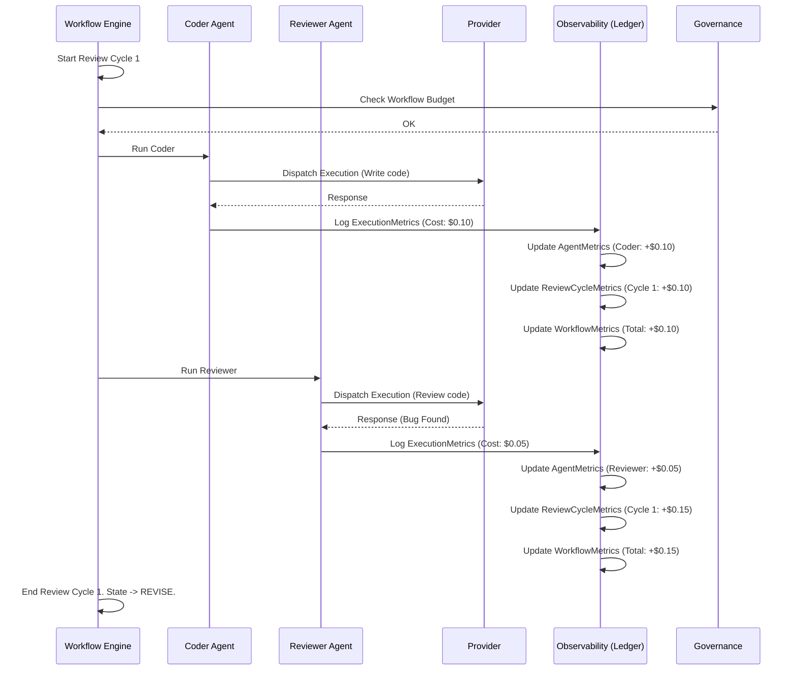
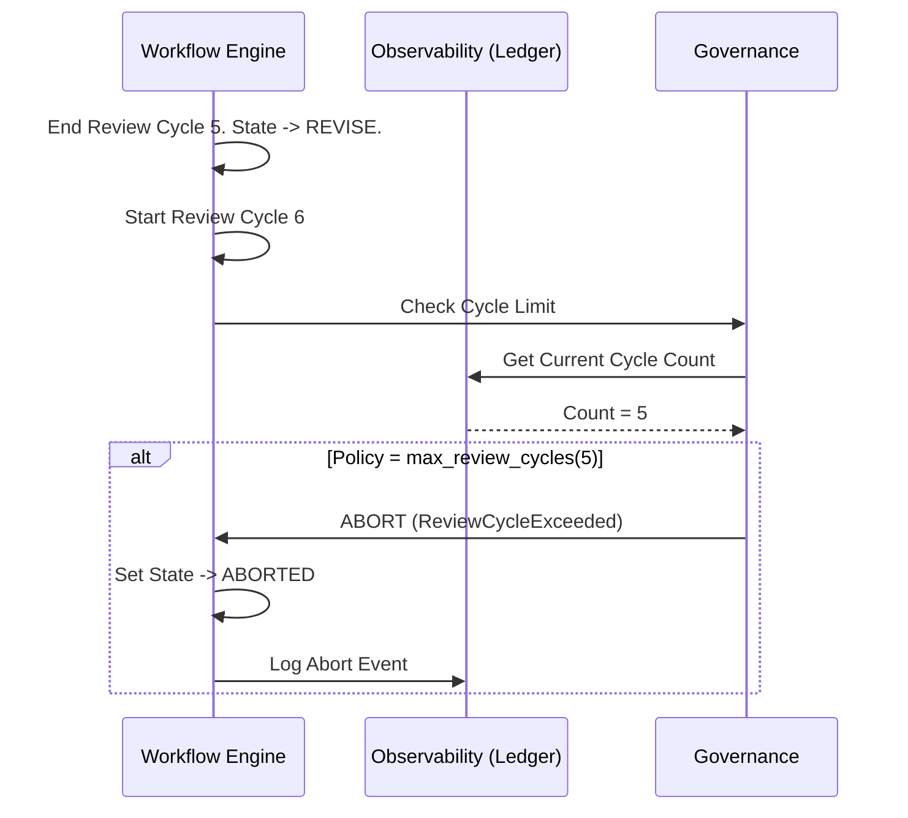

# Execution Hierarchy Architecture

## 1. Hierarchy Definition

Karsa’s autonomous operation relies on a strict execution hierarchy. Every API call to a Large Language Model exists within a clearly defined parent-child structure. 

The structure is: **Workflow → Review Cycle → Agent → Execution**

- **Workflow**
  - *Purpose*: The top-level container representing an end-to-end task from `IDEA` to `APPROVED` or `FAILED`.
  - *Ownership*: Owns the ultimate budget, the final success criteria, and the overall duration.
  - *Lifecycle*: Persists until the external repository change is successfully verified or governance aborts the process.
  - *Relationships*: Contains 1-to-N Review Cycles.

- **Review Cycle**
  - *Purpose*: Represents a single iterative loop of generation and evaluation.
  - *Ownership*: Owns the current state of the artifact/diff and tracks the `convergence_score`.
  - *Lifecycle*: Begins when a DRAFT/REVISE is submitted. Ends when findings are returned (triggering a new cycle) or approved.
  - *Relationships*: Contains 1-to-N Agents (e.g., Coder, Reviewer).

- **Agent**
  - *Purpose*: A specialized persona executing a specific job within the cycle.
  - *Ownership*: Owns the prompt assembly rules, the tool access constraints, and specific quality gates.
  - *Lifecycle*: Exists ephemerally for the duration of its specific task (e.g., writing tests) within the current cycle.
  - *Relationships*: Initiates 1-to-N Executions.

- **Execution**
  - *Purpose*: The lowest-level, atomic request/response interaction with an LLM provider.
  - *Ownership*: Owns the raw prompt, the provider key utilized, the HTTP response, and exact token consumption.
  - *Lifecycle*: Begins at network request dispatch. Ends instantly upon response parsing or timeout.
  - *Relationships*: Child of a specific Agent instance.

---

## 2. Entity Responsibilities

### 2.1. Workflow
- **Owns**: The absolute USD budget (`max_workflow_cost_usd`), total duration clock, and the FSM state.
- **Does Not Own**: Provider selection, code logic.
- **Observability**: Exposes global cost and `time_to_success`.
- **Governance**: Implements hard kill-switches. Aborts immediately if the global budget is exceeded.

### 2.2. Review Cycle
- **Owns**: The iteration counter (`review_cycle_id`) and the delta of open issues.
- **Does Not Own**: Overall budget.
- **Observability**: Exposes `cost_per_review_cycle` and the `convergence_score` (bug count over time).
- **Governance**: Evaluates against `max_review_cycles` policy. If exceeded, flags the Workflow to abort.

### 2.3. Agent
- **Owns**: System prompt logic, tool usage schemas.
- **Does Not Own**: Iteration state (a Coder agent does not know what cycle it is in; it only receives the current prompt).
- **Observability**: Exposes `cost_per_issue_found` (Reviewer) or `cost_per_issue_resolved` (Coder), plus prompt growth analytics.
- **Governance**: Has no direct governance authority.

### 2.4. Execution
- **Owns**: Tokens (Input/Output), duration (ms), model target.
- **Does Not Own**: Application-level state or business logic.
- **Observability**: Writes the immutable `execution_metrics.json` (Tokens -> USD mapping).
- **Governance**: Triggers retry fallbacks for network/quota failures (`ProviderManager` level).

---

## 3. Cost Attribution Model

Cost strictly flows upward. 

1. **Execution**: The `TokenUsageCollector` intercepts the raw API response. It queries the `PricingRegistry` for the specific `model` (e.g., `gemini-2.5-flash`). It calculates exact `input_cost` and `output_cost` in USD.
2. **Agent**: The `AgentMetrics` aggregator listens to execution completion events. It adds the Execution USD to its rolling `total_cost`.
3. **Review Cycle**: The `ReviewCycleMetrics` aggregator listens to the Agent completion event. It sums the cost of the Coder's execution + the Reviewer's execution to calculate the exact USD cost of that single iteration.
4. **Workflow**: The `WorkflowMetrics` aggregator listens to cycle completions. It adds the cycle cost to the running `total_cost`. If `total_cost` > `max_workflow_cost_usd`, a `BudgetExceeded` event is fired.

*Token Attribution and Duration (ms)* follow the exact same upward summation path.

---

## 4. Metrics Aggregation Model

Aggregation occurs via an event-driven flow to ensure O(1) read times for the CLI.

- **`ExecutionMetrics`**: Immutable JSON object written to `.karsa/executions/<id>/execution_metrics.json`. Emits `ExecutionCompletedEvent`.
- **`AgentMetrics`**: Rolling counters stored in `agent_metrics.json`. Listens to `ExecutionCompletedEvent` filtering by `agent_name`. Updates `total_executions`, `total_tokens`, `total_cost`.
- **`ReviewCycleMetrics`**: Rolling counters stored in `review_cycle_metrics.json`. Listens to `ExecutionCompletedEvent` filtering by `review_cycle_id`. Updates cycle cost.
- **`WorkflowMetrics`**: Rolling counters in `workflow_metrics.json`. Listens to `ReviewCycleCompletedEvent`. Updates total workflow cost, duration, and status.

---

## 5. Benchmark Integration

The Benchmark Harness directly consumes this hierarchy to produce mathematical comparisons.

- **Benchmark Scope**: A benchmark scenario executes exactly 1 `Workflow`.
- **Benchmark Granularity**: It measures success at the `Review Cycle` level. (e.g., "Karsa achieved success in 2 cycles, whereas Baseline required 4 simulated cycles").
- **Benchmark Comparison Levels**:
  - *Workflow vs Workflow*: Total Cost to Success, Time to Success.
  - *Cycle vs Cycle*: Analyzes token efficiency per iteration.
  - *Agent vs Agent*: Evaluates if a Karsa `Reviewer` catches bugs faster than a `Baseline` test suite.

---

## 6. Governance Integration

- **Where Governance Acts**: The Governance Engine acts as middleware between the hierarchy levels. It intercepts the transition from one Review Cycle to the next, and intercepts the dispatch of an Execution.
- **What Governance Can Stop**:
  - An `Execution` if `max_tokens_per_execution` is breached.
  - A `Review Cycle` if `max_review_cycles` is breached.
  - A `Workflow` if `max_workflow_cost_usd` is breached.
- **What Governance Cannot Stop**:
  - Governance cannot "un-spend" money. It can only abort the *next* action. 
  - Governance cannot stop a network request mid-flight.

---

## 7. Sequence Diagrams

### 7.1. Workflow Execution & Cost Attribution Sequence

### 7.2. Governance Enforcement Sequence

---

## 8. Architecture Review

### Challenging the Proposed Hierarchy

**1. Hidden Assumption: Linear Iteration**
* *Challenge*: The hierarchy assumes Review Cycles are perfectly linear. If Karsa eventually supports concurrent agents (e.g., Coder A works on Frontend, Coder B works on Backend simultaneously), the `Review Cycle` concept breaks down because cycles will overlap.
* *Risk*: Future Scaling Risk. High.
* *Recommendation*: The `Review Cycle` definition must be tightly scoped to a specific `Artifact` or `Change Request`, not the global workflow. We must introduce an `ArtifactReviewCycle` concept in future scaling phases.

**2. Missing Concept: The "Task" or "Step" Level**
* *Challenge*: A Coder Agent might require multiple Executions to finish its job (e.g., Execution 1: Plan, Execution 2: Write Code, Execution 3: Write Tests). Currently, Executions roll straight up to the Agent. We have no way of knowing *what* the Execution was doing within the Agent's lifecycle.
* *Risk*: Loss of granular optimization telemetry.
* *Recommendation*: Introduce a `Step` metadata tag to `ExecutionMetrics` (e.g., `step: write_tests`). This does not require a new structural hierarchy level, but requires a tagging standard.

**3. Hidden Assumption: Synchronous Governance**
* *Challenge*: The diagrams assume Governance checks occur synchronously between cycles. If a single massive Execution blows the budget mid-flight, Governance only catches it *after* the money is spent.
* *Risk*: Budget limits are soft ceilings, not hard walls.
* *Recommendation*: We must explicitly document that `max_workflow_cost_usd` is evaluated proactively based on current spend + estimated max token capacity of the upcoming execution. If `current_cost + (max_execution_tokens * rate) > max_workflow_cost`, the Governance Engine must abort *before* dispatching.
