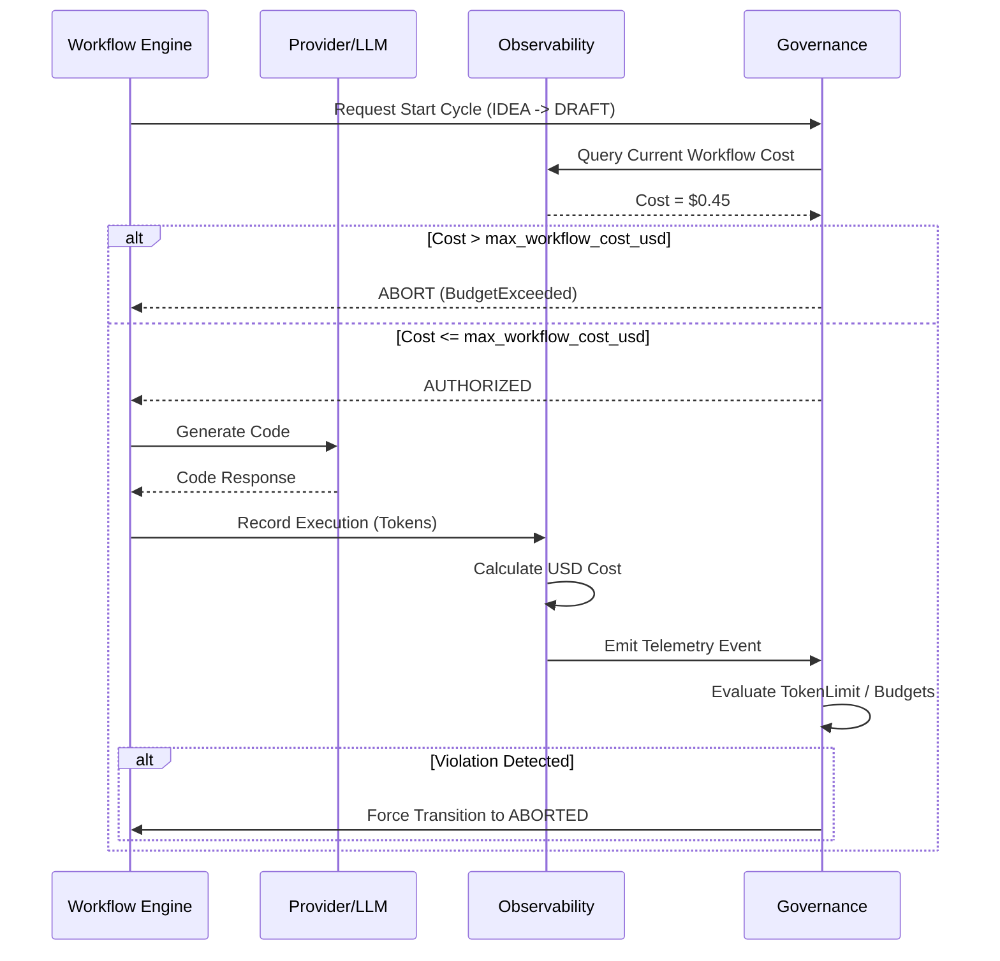

# Governance Interaction Model

## 1. Overview

Karsa's architecture operates on a strict separation of concerns. The **Workflow Engine** executes tasks, **Observability** measures them, the **Governance Engine** polices them, and the **Benchmark Harness** evaluates them.

## 2. Ownership Boundaries

- **Workflow Engine (The Executor)**
  - *Owns*: State transitions, Agent instantiation, Code generation.
  - *Blind Spot*: Has no concept of money or budgets. It will run forever if told to.

- **Observability (The Ledger)**
  - *Owns*: Token counting, USD calculation, Metric aggregation.
  - *Blind Spot*: Cannot stop an execution. It only records what happened.

- **Governance Engine (The Police)**
  - *Owns*: Policy enforcement (`max_workflow_cost_usd`), Failure Taxonomy resolution, State aborts.
  - *Blind Spot*: Does not generate code or evaluate code quality.

- **Benchmark Harness (The Judge)**
  - *Owns*: Comparative scenario orchestration, Baseline isolation.
  - *Blind Spot*: Exists entirely outside the standard execution path.

## 3. Interaction Sequence

## 4. Escalation Paths

When a failure occurs, the Governance Engine follows a strict escalation ladder:

1. **Agent Self-Correction (Level 1)**: `VerificationFailed` or `ProviderUnavailable`. The Governance engine increments retry counters and allows the Workflow Engine to transition to `REVISE` or retry the LLM call.
2. **Key Rotation (Level 2)**: `ProviderQuotaExceeded`. The Governance engine suspends the key and signals the `ProviderPool` to rotate.
3. **Hard Abort (Level 3)**: `BudgetExceeded`, `TokenLimitExceeded`, or `ReviewCycleExceeded`. The Governance engine forcefully kills the Workflow Engine thread, sets the state to `ABORTED`, and escalates to the Human Founder via log alerts.
