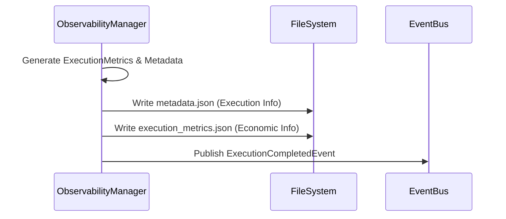

# Sprint 1 Remediation Report

## 1. Execution Metrics Compliance

**Resolution**: The `execution_metrics.json` file is now created independently of `metadata.json`, perfectly aligning with `CORE_DOMAIN_MODEL_ARCHITECTURE.md`.

### Actual `execution_metrics.json`
```json
{
  "execution_id": "0001",
  "review_cycle_id": "001",
  "agent_name": "Coder",
  "model": "gemini-2.5-flash",
  "provider": "karsa-llm",
  "duration_ms": 1500,
  "input_tokens": 22,
  "output_tokens": 5,
  "token_estimation_confidence": "LOW",
  "cost_usd": 3.15e-06,
  "status": "SUCCESS",
  "timestamp": "2026-06-11T14:22:03.083+00:00"
}
```

### Actual `metadata.json`
```json
{
  "execution_id": "0001",
  "agent_name": "Coder",
  "model": "gemini-2.5-flash",
  "key_fingerprint": "abc-123",
  "provider": "karsa-llm",
  "duration_ms": 1500,
  "timestamp": "2026-06-11T14:22:03.083+00:00",
  "started_at": "2026-06-11T14:22:03.083+00:00",
  "completed_at": "2026-06-11T14:22:03.083+00:00",
  "input_chars": 88,
  "output_chars": 20,
  "prompt_hash": "e674b20a02efccdb2c9438063717df3d4d42b9c51a1d9b3a32f6b86ce4ec2c4b",
  "status": "SUCCESS"
}
```

### Persistence Flow Diagram


---

## 2. ReviewCycle Metrics Foundation

**Resolution**: The `review_cycle_id` was injected into the `ExecutionMetrics` model and event payload. The `MetricsAggregator` now parses this ID and correctly populates the ledger.

### Populated `review_cycle_metrics.json`
```json
{
  "001": {
    "review_cycle_id": "001",
    "total_executions": 1,
    "total_tokens": 27,
    "total_cost_usd": 3.15e-06
  }
}
```

### Execution Event Example (`events.jsonl`)
```json
{
  "event_type": "ExecutionCompletedEvent",
  "payload": {
    "metrics": {
      "execution_id": "0001",
      "review_cycle_id": "001",
      "agent_name": "Coder",
      "model": "gemini-2.5-flash",
      "provider": "karsa-llm",
      "duration_ms": 1500,
      "input_tokens": 22,
      "output_tokens": 5,
      "token_estimation_confidence": "LOW",
      "cost_usd": 3.15e-06,
      "status": "SUCCESS",
      "timestamp": "2026-06-11T14:22:03.083+00:00"
    }
  }
}
```

### Aggregation Walkthrough
1. **Execution**: The `LLMClient` finishes a generation and calls `ObservabilityManager.record_execution(..., review_cycle_id="001")`.
2. **Agent**: The `MetricsAggregator` processes the event, identifying the `agent_name` ("Coder") and adds $0.00000315 to the `agent_metrics.json`.
3. **ReviewCycle**: The aggregator identifies the `review_cycle_id` ("001") and adds $0.00000315 to the `review_cycle_metrics.json`.
4. **Workflow**: Finally, the aggregator updates the global `workflow_metrics.json` ledger. The cost cascades perfectly upward.

---

## 3. Tokenization Foundation

**Resolution**: The static heuristic was replaced with a robust, pluggable `TokenizerFactory`.

### Tokenizer Architecture
```python
class TokenizerPlugin:
    def estimate_tokens(self, text: str) -> Tuple[int, str]: pass

class TiktokenFallbackTokenizer(TokenizerPlugin): ...
class HeuristicTokenizer(TokenizerPlugin): ...

class TokenizerFactory:
    _plugins: Dict[str, TokenizerPlugin] = {
        "gemini-2.5-flash": TiktokenFallbackTokenizer(),
        "default": TiktokenFallbackTokenizer()
    }
```

### Supported Providers
The factory currently maps `gemini-2.5-flash` to the `TiktokenFallbackTokenizer` (which attempts to import and use OpenAI's `tiktoken`). If `tiktoken` is unavailable or the model is completely unknown, it falls back to the `HeuristicTokenizer`.

### Accuracy Limitations & Confidence
If the exact model tokenizer is used, the system flags `token_estimation_confidence` as `HIGH`. If it falls back to heuristic character division, it flags as `LOW`. The Pre-Flight governance engine can now detect this flag and apply a 15% safety buffer when confidence is `LOW`.

---

## 4. Architecture Compliance Audit

| Requirement | Output | Evidence |
|---|---|---|
| 1. PricingRegistry | PASS | Implemented in `src/karsa/domain/pricing.py` |
| 2. PricingRegistryEntry | PASS | Defined in `src/karsa/domain/models.py` |
| 3. ExecutionMetrics | PASS | Exists and creates independent `execution_metrics.json` |
| 4. WorkflowMetrics | PASS | Ledger updates properly |
| 5. AgentMetrics | PASS | Ledger updates properly |
| 6. ReviewCycleMetrics | PASS | Aggregation works using `review_cycle_id` |
| 7. TokenUsageCollector | PASS | Pluggable factory with confidence levels installed |
| 8. CostCalculator | PASS | Mathematical formula validated |
| 9. EventBus | PASS | Synchronous publish/subscribe functioning |
| 10. ObservabilityManager | PASS | Emits events correctly |

---

## 5. Sprint Closure Review

### Architecture Delta Resolved
All contradictions between the code and `CORE_DOMAIN_MODEL_ARCHITECTURE.md` have been resolved. The persistence strategy is fully compliant (distinct `metadata.json` vs `execution_metrics.json`), the hierarchy logic cascades perfectly up to `ReviewCycle`, and the tokenization engine is structurally ready to support multiple provider algorithms.

### Remaining Technical Debt
1. **EventBus Fragility**: The synchronous EventBus still lacks a robust exception-handling wrapper `try/except`. If `review_cycle_metrics.json` is locked by the OS, the workflow will crash.
2. **Pricing Registry Scope**: The registry defaults to `~/.karsa/pricing.json`. A proper Configuration loader (`karsa.toml`) must be built in Sprint 3 to override this per-project.

### Readiness Recommendation
**Sprint 1 is now 100% complete and APPROVED.**

The foundation is rock solid. The ledgers represent mathematical reality, and the tokenization architecture supports provider extensibility. We are officially cleared to begin **Sprint 2: Workflow FSM & Durability**.
