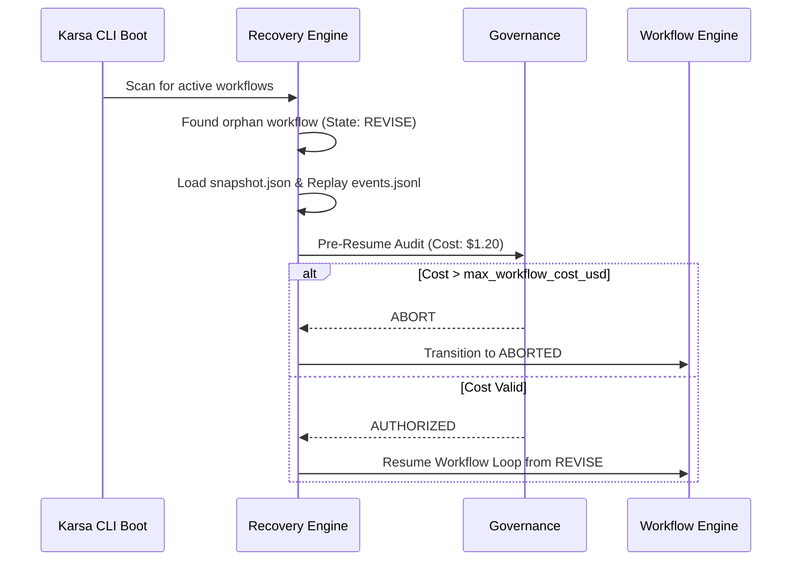
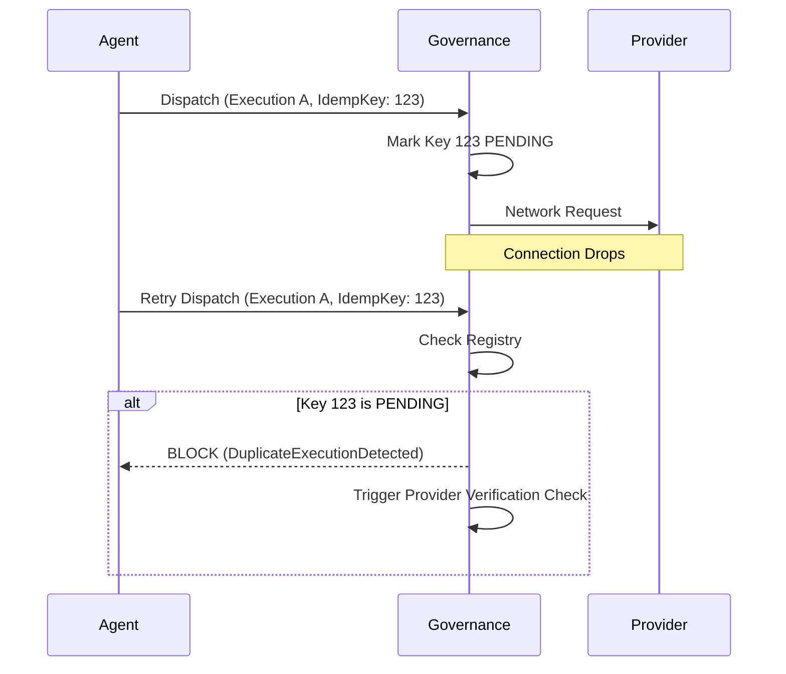

# Workflow Durability & Recovery Architecture

## 1. Problem Statement

Autonomous systems that manage non-trivial workloads often run for extended durations—potentially taking hours to iterate through complex Discovery, Architecture, and Implementation phases. If the Karsa execution process is interrupted (due to an OS restart, out-of-memory kill, or network crash), all in-memory FSM state, intermediate budgets, and active review cycle trackers are lost. 

Without durability and recovery, a crash forces the workflow to restart from `IDEA`. This not only ruins developer experience but also results in massive, unrecoverable API token burns. Furthermore, without execution idempotency, a network timeout during a costly LLM API call might lead to a retry that double-bills the budget. 

To operate safely at scale, Karsa must guarantee **Workflow Durability, Idempotency, and Crash Recovery**.

---

## 2. Workflow Persistence Model

The Workflow Engine must transition from an in-memory loop to a fully persisted state machine.

### Core Concepts
- **Workflow Persistence**: Saving the exact state, metrics, and pointers of the workflow to disk (`.karsa/workflows/<workflow_id>/state.json`) synchronously upon any state transition.
- **Workflow Snapshots**: A complete, self-contained record of the workflow at a specific point in time (e.g., end of Cycle 2).
- **Workflow Events**: Granular actions logged to an append-only journal (e.g., `ExecutionDispatched`, `CostApplied`, `StateChanged`).
- **Recovery Checkpoints**: Explicit, "safe" markers in the workflow (usually at the boundary of a major state like `DRAFT` to `REVIEW`) where the workflow can be confidently resumed.

### Required Persisted Fields
To safely resume, the engine must serialize:
- `workflow_id` and current FSM `state`.
- `current_workflow_cost` and `total_tokens`.
- `review_cycle_id` and open issues count.
- `active_agents` and their current execution contracts.
- Pointers to the current generated artifacts.

---

## 3. Event Sourcing vs Snapshot Model

### Comparison
1. **Pure Snapshots**: Overwriting `state.json` at every step. *Pros*: Trivial to implement, easy to resume. *Cons*: Loses historical context between snapshots. If a crash occurs mid-cycle, the resume point might be too far back.
2. **Pure Event Sourcing**: Storing every action in a ledger and replaying them from genesis to rebuild state. *Pros*: Perfect auditability, time-travel debugging. *Cons*: Computationally expensive to rebuild state for long workflows, overly complex for the MVP.
3. **Hybrid Approach (Event-Driven Snapshots)**: An append-only event log (`events.jsonl`) captures all transitions. However, at every major `Recovery Checkpoint` (e.g., State Transition or Cycle End), a full `snapshot.json` is materialized.

### Recommendation
Karsa will adopt the **Hybrid Approach**. The `events.jsonl` provides forensic debugging for Governance, while the `snapshot.json` provides instantaneous, O(1) recovery during startup.

---

## 4. Recovery Engine

The Recovery Engine evaluates the `.karsa/workflows/` directory upon Karsa initialization.

- **Startup Recovery**: On boot, the engine scans all snapshots. If a workflow is not `APPROVED`, `FAILED`, or `ABORTED`, it is considered active.
- **Orphan Workflow Detection**: If a workflow claims to be `REVIEW` but the process lockfile is missing, it is flagged as an orphaned crash.
- **Workflow Resume**: The engine loads the latest `snapshot.json`, replays any subsequent events from `events.jsonl` to reach the exact point of failure, and re-initializes the active Agent.
- **Workflow Quarantine**: If the `events.jsonl` is corrupted or the FSM state is mathematically invalid (e.g., negative cost), the workflow is marked `QUARANTINED` and requires human intervention.

---

## 5. Execution Idempotency

When Karsa dispatches an LLM request, the network connection might drop *after* the provider generates the response but *before* Karsa receives it. If Karsa blindly retries, it pays for the generation twice.

- **`execution_id`**: A UUID generated *before* dispatch.
- **`idempotency_key`**: A cryptographic hash of `(prompt + model_config + execution_id)`.
- **Duplicate Detection**: The `ObservabilityManager` tracks all active `idempotency_keys`. If an Agent attempts to dispatch a key that is already `PENDING` or `COMPLETED`, it throws a `DuplicateExecutionDetected` error.
- **Provider Timeout Scenarios**: If Karsa times out, it must query the provider's native API logs (if supported, like OpenAI's batch/usage endpoints) using the `execution_id` to verify if the cost was incurred before deciding to blindly retry. If unsupported, the Governance Engine must pessimisticly assume the cost *was* incurred and subtract it from the budget before allowing a retry.

---

## 6. Governance Integration

Governance must handle the messy reality of recovery.
- When a workflow resumes, Governance runs a **Pre-Resume Audit**. It re-evaluates `current_workflow_cost` against `max_workflow_cost_usd` to ensure the snapshot wasn't manually tampered with.
- If a provider timeout occurred before the crash, Governance applies the pessimistic "Assumed Cost" to the ledger. If the Assumed Cost breaches the budget, the workflow resumes directly into an `ABORTED` state.

---

## 7. Failure Taxonomy Extensions

New standardized failures:
- **`WorkflowCorrupted`**: `snapshot.json` or `events.jsonl` is unreadable. *Action*: Transition to `QUARANTINED`.
- **`RecoveryFailed`**: The Workflow Engine successfully parsed the snapshot but failed to instantiate the required Agents. *Action*: Transition to `FAILED`.
- **`DuplicateExecutionDetected`**: Agent attempted to fire an identical request. *Action*: Block dispatch, return the cached result of the previous execution if available.
- **`PersistenceFailure`**: The OS denied file write access during an FSM transition. *Action*: Immediate hard crash to prevent split-brain state.

---

## 8. Sequence Diagrams

### Crash Recovery

### Duplicate Execution Prevention (Network Timeout)

---

## 9. Architecture Review

### Challenging the Design

**1. Hidden Assumption: Instant File I/O**
* *Challenge*: The Hybrid approach requires synchronous file writes before every FSM transition. If Karsa is run on a slow networked drive, workflow iteration speed will plummet due to I/O blocking.
* *Risk*: Moderate.
* *Recommendation*: Event logging can be asynchronous via an in-memory queue, but `snapshot.json` creation at `Recovery Checkpoints` MUST remain synchronous. The CLI should warn if I/O latency is dangerously high.

**2. Hidden Assumption: Verifiable Idempotency**
* *Challenge*: Very few LLM providers support true idempotency keys via HTTP headers for synchronous generation endpoints (unlike Stripe).
* *Risk*: High. The "Provider Verification Check" might be technologically impossible depending on the API.
* *Recommendation*: If the provider lacks an idempotency API, Karsa must treat a timeout as a "Ghost Execution." The `current_workflow_cost` is permanently penalized with the pessimistic estimate of the timed-out request. This guarantees Karsa never accidentally exceeds its budget, even if it punishes the user for their ISP's bad connection.

---

## 10. Roadmap Revalidation

Because Durability prevents catastrophic token loss during crashes, it must be integrated into the foundation before long-running workflows are permitted.

**Finalized Sprint Ordering:**
- **Sprint 1: Cost & Token Observability** (Ledger, `PricingRegistry`)
- **Sprint 2: Workflow FSM, Durability & Bound Contracts** (State Machine, Hybrid Snapshot Persistence, LLM constraints)
- **Sprint 3: Cost Governance & Forecasting** (Kill-switches, Pre-flight estimation, Forecast Engine)
- **Sprint 4: Benchmark Harness** (Safe to benchmark)
- **Sprint 5: Model Routing** (Price arbitrage)
- **Sprint 6: Structured Prompt Builder** (Modular prompts)
- **Sprint 7: Context Cache Strategy** (Input token reduction)
- **Sprint 8: Patch-Based Revision** (Output token reduction)
- **Sprint 9: Review Delta Strategy** (Review loop token reduction)
- **Sprint 10: Prompt Summarization** (History compression)
- **Sprint 11-14: External Workflow Integration**
- **Sprint 15+: Optional RAG / Semantic Retrieval**

Sprint 2 has absorbed Durability and Persistence. We cannot implement the FSM without also implementing how its state survives a restart. This solidifies the execution engine permanently.
